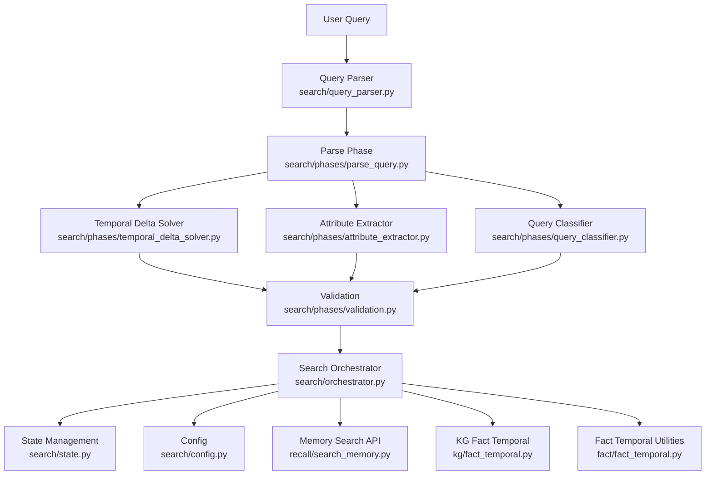
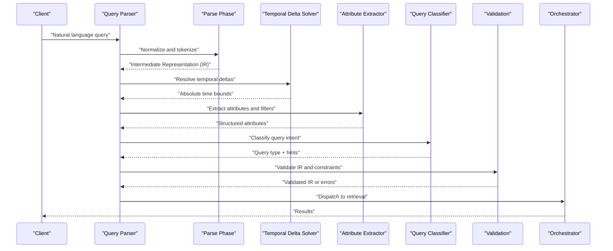
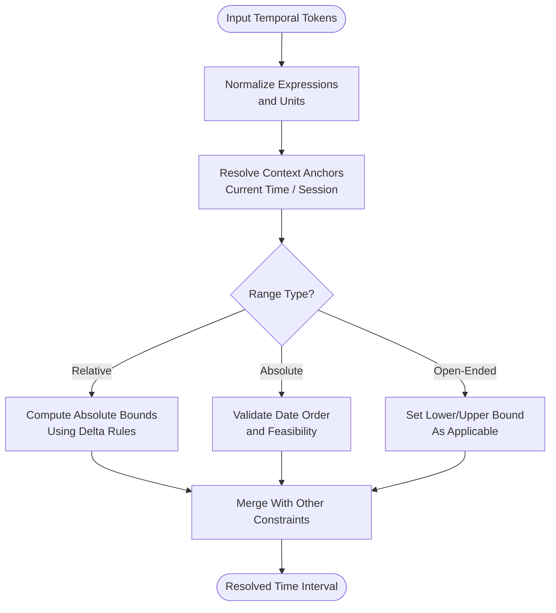
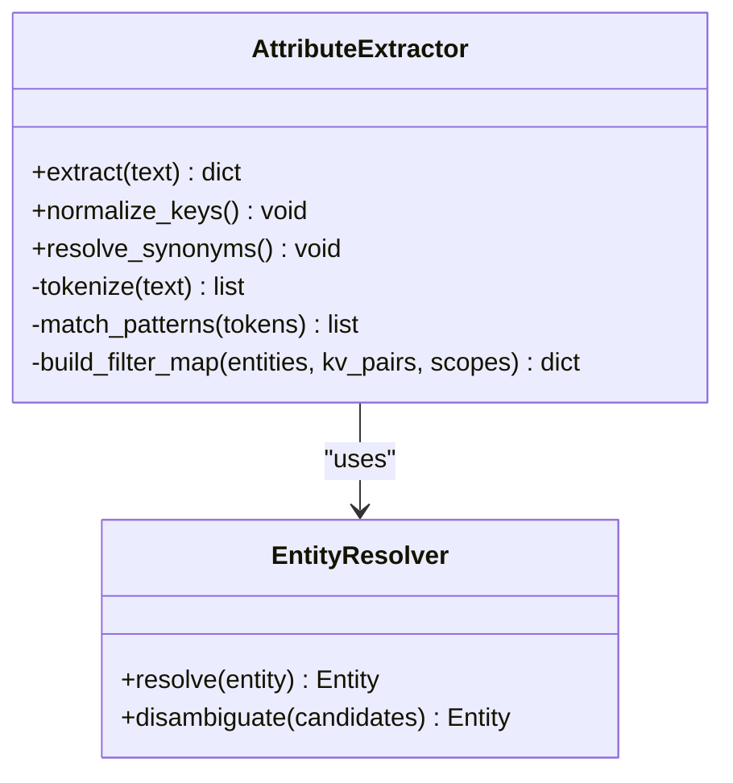
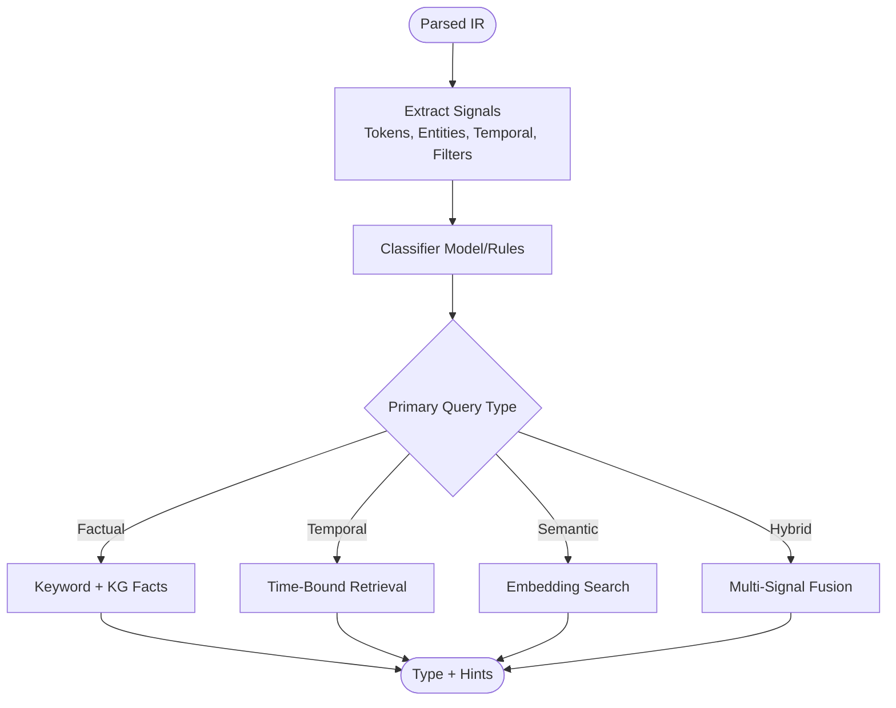
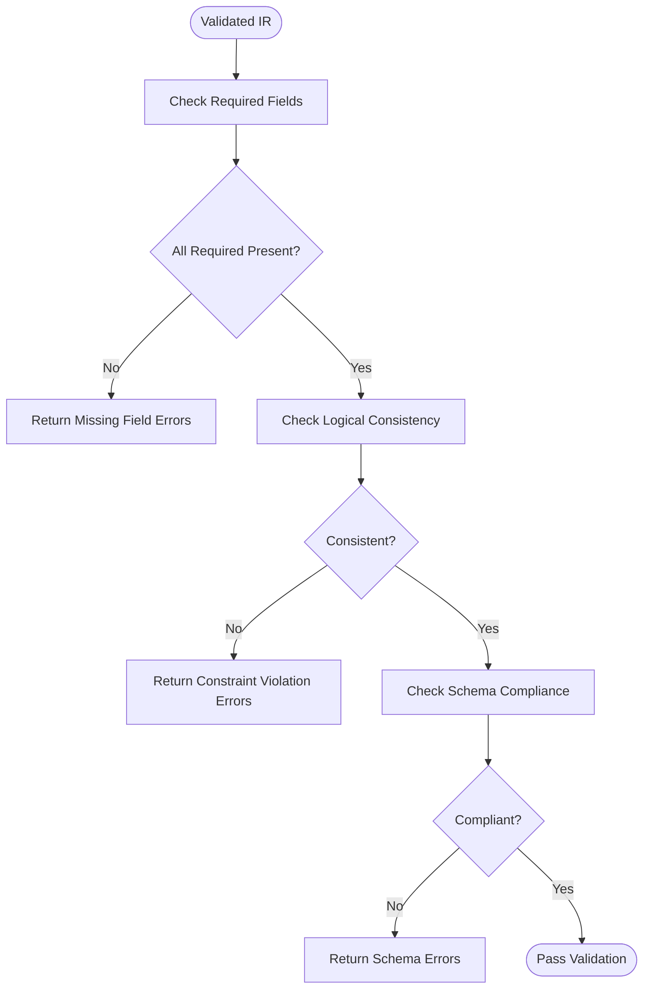
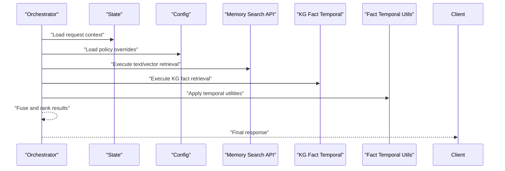
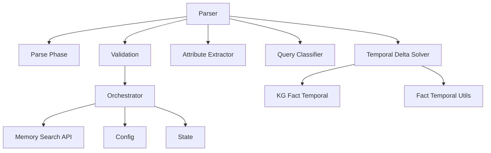

# Query Parsing and Analysis

<cite>
**Referenced Files in This Document**
- [search/query_parser.py](file://search/query_parser.py)
- [search/phases/parse_query.py](file://search/phases/parse_query.py)
- [search/phases/temporal_delta_solver.py](file://search/phases/temporal_delta_solver.py)
- [search/phases/attribute_extractor.py](file://search/phases/attribute_extractor.py)
- [search/phases/query_classifier.py](file://search/phases/query_classifier.py)
- [search/phases/validation.py](file://search/phases/validation.py)
- [search/orchestrator.py](file://search/orchestrator.py)
- [search/state.py](file://search/state.py)
- [search/config.py](file://search/config.py)
- [recall/search_memory.py](file://recall/search_memory.py)
- [kg/fact_temporal.py](file://kg/fact_temporal.py)
- [fact/fact_temporal.py](file://fact/fact_temporal.py)
</cite>

## Table of Contents
1. [Introduction](#introduction)
2. [Project Structure](#project-structure)
3. [Core Components](#core-components)
4. [Architecture Overview](#architecture-overview)
5. [Detailed Component Analysis](#detailed-component-analysis)
6. [Dependency Analysis](#dependency-analysis)
7. [Performance Considerations](#performance-considerations)
8. [Troubleshooting Guide](#troubleshooting-guide)
9. [Conclusion](#conclusion)

## Introduction
This document explains the query parsing and analysis phase of the search pipeline. It focuses on how natural language queries are transformed into structured search operations, including:
- Temporal expression parsing and delta resolution for time-based queries
- Attribute extraction from user input (e.g., entities, filters, scopes)
- Semantic intent classification to guide downstream retrieval strategies
- Validation and error handling to ensure robustness
- Performance optimization techniques for low-latency, high-throughput processing

The goal is to provide a clear understanding of the data flows, processing logic, and integration points that enable accurate and efficient search across text, knowledge graph facts, and temporal records.

## Project Structure
The query parsing and analysis functionality is implemented as a set of focused modules within the search subsystem. The main entry point integrates with the broader search orchestrator and state management.

**Diagram sources**
- [search/query_parser.py](file://search/query_parser.py)
- [search/phases/parse_query.py](file://search/phases/parse_query.py)
- [search/phases/temporal_delta_solver.py](file://search/phases/temporal_delta_solver.py)
- [search/phases/attribute_extractor.py](file://search/phases/attribute_extractor.py)
- [search/phases/query_classifier.py](file://search/phases/query_classifier.py)
- [search/phases/validation.py](file://search/phases/validation.py)
- [search/orchestrator.py](file://search/orchestrator.py)
- [search/state.py](file://search/state.py)
- [search/config.py](file://search/config.py)
- [recall/search_memory.py](file://recall/search_memory.py)
- [kg/fact_temporal.py](file://kg/fact_temporal.py)
- [fact/fact_temporal.py](file://fact/fact_temporal.py)

**Section sources**
- [search/query_parser.py](file://search/query_parser.py)
- [search/phases/parse_query.py](file://search/phases/parse_query.py)
- [search/phases/temporal_delta_solver.py](file://search/phases/temporal_delta_solver.py)
- [search/phases/attribute_extractor.py](file://search/phases/attribute_extractor.py)
- [search/phases/query_classifier.py](file://search/phases/query_classifier.py)
- [search/phases/validation.py](file://search/phases/validation.py)
- [search/orchestrator.py](file://search/orchestrator.py)
- [search/state.py](file://search/state.py)
- [search/config.py](file://search/config.py)
- [recall/search_memory.py](file://recall/search_memory.py)
- [kg/fact_temporal.py](file://kg/fact_temporal.py)
- [fact/fact_temporal.py](file://fact/fact_temporal.py)

## Core Components
- Query Parser: Normalizes raw input, tokenizes, and delegates to specialized phases.
- Parse Phase: Builds an intermediate representation (IR) capturing tokens, spans, and preliminary semantics.
- Temporal Delta Solver: Resolves relative time expressions (e.g., “last week”, “since 2024-01-01”) into absolute ranges using context-aware deltas.
- Attribute Extractor: Identifies named entities, key-value filters, and scope constraints from natural language.
- Query Classifier: Determines query type (e.g., factual recall, temporal range, semantic similarity, hybrid) to select retrieval strategy.
- Validation: Enforces schema constraints, required fields, and logical consistency; returns actionable errors.
- Orchestrator: Coordinates phases, merges results, and applies configuration-driven policies.
- State and Config: Maintain per-request context and system-wide tuning parameters.

Key responsibilities and interactions are detailed in subsequent sections.

**Section sources**
- [search/query_parser.py](file://search/query_parser.py)
- [search/phases/parse_query.py](file://search/phases/parse_query.py)
- [search/phases/temporal_delta_solver.py](file://search/phases/temporal_delta_solver.py)
- [search/phases/attribute_extractor.py](file://search/phases/attribute_extractor.py)
- [search/phases/query_classifier.py](file://search/phases/query_classifier.py)
- [search/phases/validation.py](file://search/phases/validation.py)
- [search/orchestrator.py](file://search/orchestrator.py)
- [search/state.py](file://search/state.py)
- [search/config.py](file://search/config.py)

## Architecture Overview
The parsing and analysis pipeline transforms free-form queries into a validated, typed IR suitable for multi-modal retrieval. The flow emphasizes modularity, allowing independent evolution of temporal resolution, attribute extraction, and classification logic.

**Diagram sources**
- [search/query_parser.py](file://search/query_parser.py)
- [search/phases/parse_query.py](file://search/phases/parse_query.py)
- [search/phases/temporal_delta_solver.py](file://search/phases/temporal_delta_solver.py)
- [search/phases/attribute_extractor.py](file://search/phases/attribute_extractor.py)
- [search/phases/query_classifier.py](file://search/phases/query_classifier.py)
- [search/phases/validation.py](file://search/phases/validation.py)
- [search/orchestrator.py](file://search/orchestrator.py)

## Detailed Component Analysis

### Temporal Expression Parsing and Delta Resolution
Temporal expressions such as “last month”, “from 2023-06 to now”, or “within 7 days” are normalized into absolute time intervals. The solver uses contextual anchors (e.g., current time, session boundaries) and supports:
- Relative deltas (days, weeks, months, years)
- Absolute date ranges
- Open-ended ranges (“since X”, “until Y”)
- Timezone awareness and normalization

**Diagram sources**
- [search/phases/temporal_delta_solver.py](file://search/phases/temporal_delta_solver.py)
- [kg/fact_temporal.py](file://kg/fact_temporal.py)
- [fact/fact_temporal.py](file://fact/fact_temporal.py)

**Section sources**
- [search/phases/temporal_delta_solver.py](file://search/phases/temporal_delta_solver.py)
- [kg/fact_temporal.py](file://kg/fact_temporal.py)
- [fact/fact_temporal.py](file://fact/fact_temporal.py)

### Attribute Extraction from User Input
The extractor identifies:
- Named entities (persons, organizations, locations)
- Key-value filters (e.g., status=active, priority=high)
- Scope constraints (e.g., project, tag, author)
- Negation and exclusion patterns

It produces a structured attribute map compatible with downstream filtering and ranking.

**Diagram sources**
- [search/phases/attribute_extractor.py](file://search/phases/attribute_extractor.py)

**Section sources**
- [search/phases/attribute_extractor.py](file://search/phases/attribute_extractor.py)

### Query Type Classification
The classifier determines the dominant intent to guide retrieval strategy:
- Factual recall (keyword/entity-focused)
- Temporal range (time-bound)
- Semantic similarity (embedding-driven)
- Hybrid (combining multiple signals)

Classification outputs include a primary type and optional hints (e.g., boost entities, emphasize recency).

**Diagram sources**
- [search/phases/query_classifier.py](file://search/phases/query_classifier.py)

**Section sources**
- [search/phases/query_classifier.py](file://search/phases/query_classifier.py)

### Validation and Error Handling
Validation enforces:
- Required fields presence (e.g., time bounds when temporal present)
- Logical consistency (e.g., start <= end)
- Schema compliance (types, allowed values)
- Cross-constraint checks (e.g., entity existence, scope validity)

Errors are returned with actionable messages and codes to aid client-side UX and debugging.

**Diagram sources**
- [search/phases/validation.py](file://search/phases/validation.py)

**Section sources**
- [search/phases/validation.py](file://search/phases/validation.py)

### Integration with Orchestrator and State
The orchestrator coordinates phase execution, merges intermediate results, and applies configuration-driven policies (e.g., max candidates, reranking, caching). State tracks per-request context (e.g., tenant, session, feature flags), while config provides tunables (e.g., thresholds, model selection).

**Diagram sources**
- [search/orchestrator.py](file://search/orchestrator.py)
- [search/state.py](file://search/state.py)
- [search/config.py](file://search/config.py)
- [recall/search_memory.py](file://recall/search_memory.py)
- [kg/fact_temporal.py](file://kg/fact_temporal.py)
- [fact/fact_temporal.py](file://fact/fact_temporal.py)

**Section sources**
- [search/orchestrator.py](file://search/orchestrator.py)
- [search/state.py](file://search/state.py)
- [search/config.py](file://search/config.py)
- [recall/search_memory.py](file://recall/search_memory.py)
- [kg/fact_temporal.py](file://kg/fact_temporal.py)
- [fact/fact_temporal.py](file://fact/fact_temporal.py)

## Dependency Analysis
The parsing and analysis components exhibit low coupling through well-defined interfaces:
- Parser delegates to phases via IR objects
- Temporal solver depends on temporal utilities and context anchors
- Attribute extractor relies on entity resolution and pattern matching
- Classifier consumes extracted features and emits strategy hints
- Validator depends on schema definitions and constraint rules
- Orchestrator composes phases and external retrieval services

**Diagram sources**
- [search/query_parser.py](file://search/query_parser.py)
- [search/phases/parse_query.py](file://search/phases/parse_query.py)
- [search/phases/temporal_delta_solver.py](file://search/phases/temporal_delta_solver.py)
- [search/phases/attribute_extractor.py](file://search/phases/attribute_extractor.py)
- [search/phases/query_classifier.py](file://search/phases/query_classifier.py)
- [search/phases/validation.py](file://search/phases/validation.py)
- [search/orchestrator.py](file://search/orchestrator.py)
- [search/state.py](file://search/state.py)
- [search/config.py](file://search/config.py)
- [recall/search_memory.py](file://recall/search_memory.py)
- [kg/fact_temporal.py](file://kg/fact_temporal.py)
- [fact/fact_temporal.py](file://fact/fact_temporal.py)

**Section sources**
- [search/query_parser.py](file://search/query_parser.py)
- [search/phases/parse_query.py](file://search/phases/parse_query.py)
- [search/phases/temporal_delta_solver.py](file://search/phases/temporal_delta_solver.py)
- [search/phases/attribute_extractor.py](file://search/phases/attribute_extractor.py)
- [search/phases/query_classifier.py](file://search/phases/query_classifier.py)
- [search/phases/validation.py](file://search/phases/validation.py)
- [search/orchestrator.py](file://search/orchestrator.py)
- [search/state.py](file://search/state.py)
- [search/config.py](file://search/config.py)
- [recall/search_memory.py](file://recall/search_memory.py)
- [kg/fact_temporal.py](file://kg/fact_temporal.py)
- [fact/fact_temporal.py](file://fact/fact_temporal.py)

## Performance Considerations
- Incremental parsing: Tokenize once and reuse spans across phases to avoid redundant work.
- Early validation: Fail fast on missing required fields to reduce downstream cost.
- Temporal caching: Cache resolved anchors and common delta computations for repeated queries within sessions.
- Attribute normalization: Use synonym maps and canonical keys to minimize branching and improve filter performance.
- Classifier shortcuts: Apply rule-based heuristics before invoking heavier models when possible.
- Orchestrator batching: Combine retrieval calls where feasible and leverage result fusion to reduce latency.
- Configuration-driven limits: Tune candidate caps and rerank budgets based on workload characteristics.

[No sources needed since this section provides general guidance]

## Troubleshooting Guide
Common issues and resolutions:
- Invalid temporal ranges: Ensure start <= end and timezone alignment; check anchor resolution logs.
- Missing attributes: Verify entity resolution and synonym mapping; confirm scope constraints exist.
- Classification misrouting: Inspect feature extraction and classifier thresholds; consider fallback strategies.
- Validation failures: Review error codes and messages; adjust schema or constraint rules accordingly.
- Orchestration timeouts: Monitor retrieval latencies; tune candidate caps and rerank budgets.

Operational tips:
- Enable detailed parse-phase logging for diagnostics.
- Use state context to isolate tenant/session-specific anomalies.
- Leverage config overrides for temporary hotfixes without code changes.

**Section sources**
- [search/phases/validation.py](file://search/phases/validation.py)
- [search/orchestrator.py](file://search/orchestrator.py)
- [search/state.py](file://search/state.py)
- [search/config.py](file://search/config.py)

## Conclusion
The query parsing and analysis phase converts natural language inputs into a robust, validated IR by combining temporal delta resolution, attribute extraction, and intent classification. Modular design and clear interfaces enable independent optimization and extension. With careful validation, thoughtful performance tuning, and comprehensive error handling, the pipeline delivers accurate and efficient search across diverse query patterns.

[No sources needed since this section summarizes without analyzing specific files]