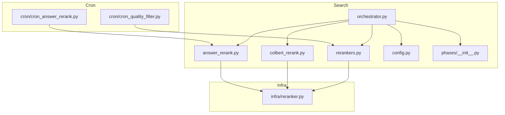
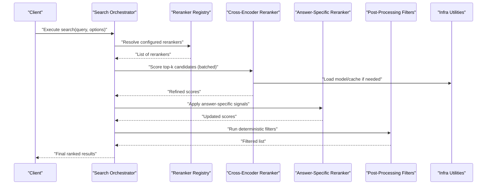
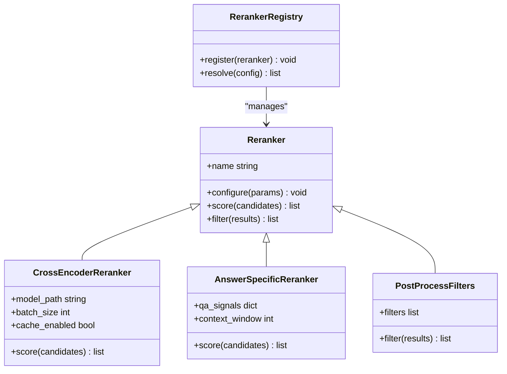
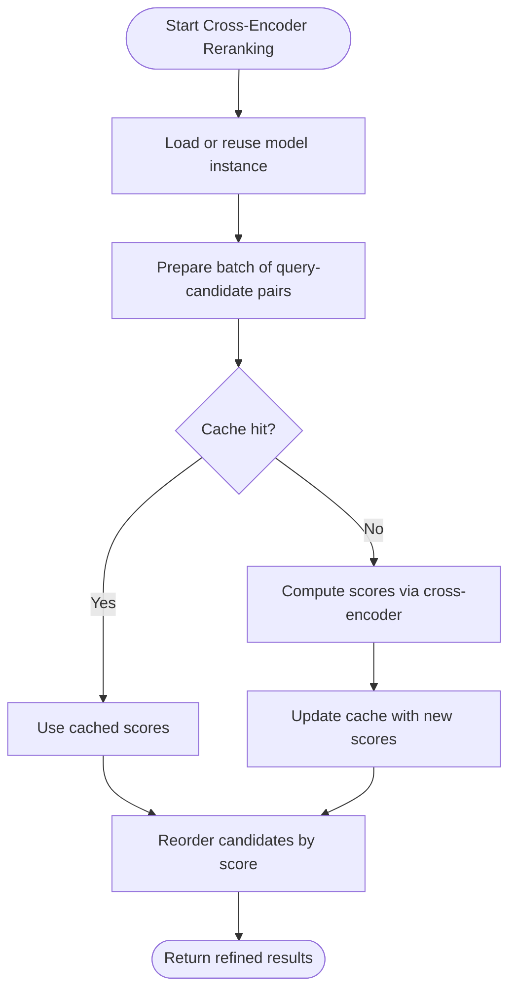
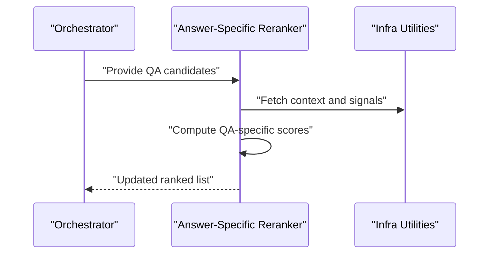
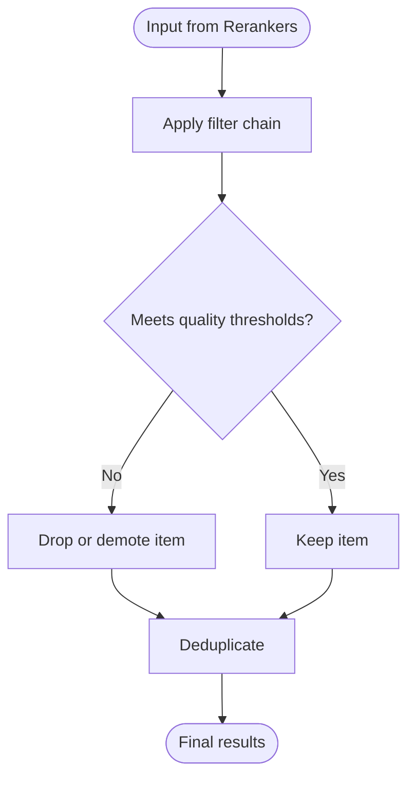
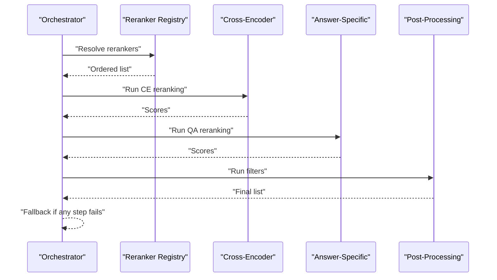
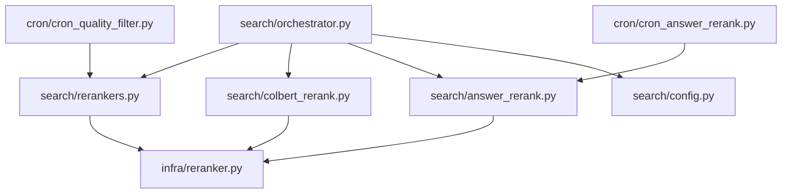

# Reranking System

<cite>
**Referenced Files in This Document**
- [search/rerankers.py](file://search/rerankers.py)
- [search/colbert_rerank.py](file://search/colbert_rerank.py)
- [search/answer_rerank.py](file://search/answer_rerank.py)
- [infra/reranker.py](file://infra/reranker.py)
- [cron/cron_answer_rerank.py](file://cron/cron_answer_rerank.py)
- [cron/cron_quality_filter.py](file://cron/cron_quality_filter.py)
- [search/phases/__init__.py](file://search/phases/__init__.py)
- [search/orchestrator.py](file://search/orchestrator.py)
- [search/config.py](file://search/config.py)
- [test/test_reranker.py](file://test/test_reranker.py)
- [test/test_reranker_unit.py](file://test/test_reranker_unit.py)
- [test/test_reranker_strategy_unit.py](file://test/test_reranker_strategy_unit.py)
- [test/test_search_ce_cache.py](file://test/test_search_ce_cache.py)
- [test/test_search_single_ce.py](file://test/test_search_single_ce.py)
</cite>

## Table of Contents
1. [Introduction](#introduction)
2. [Project Structure](#project-structure)
3. [Core Components](#core-components)
4. [Architecture Overview](#architecture-overview)
5. [Detailed Component Analysis](#detailed-component-analysis)
6. [Dependency Analysis](#dependency-analysis)
7. [Performance Considerations](#performance-considerations)
8. [Troubleshooting Guide](#troubleshooting-guide)
9. [Conclusion](#conclusion)
10. [Appendices](#appendices)

## Introduction
This document explains the reranking system that refines initial search results using more sophisticated models and heuristics. It covers built-in rerankers (cross-encoders, answer-specific rerankers, and post-processing filters), how they apply additional relevance signals and quality assessment, and how to implement custom rerankers. It also provides guidance on configuring reranker pipelines, balancing accuracy gains against latency costs, caching strategies, batch processing, and fallback mechanisms.

## Project Structure
The reranking system is implemented primarily under the search package with supporting infrastructure and scheduled jobs:
- Core reranker abstractions and implementations live in the search module.
- Cross-encoder reranking logic is provided by a dedicated module.
- Answer-specific reranking is implemented separately for QA-style queries.
- Infrastructure-level utilities and configuration are exposed via an infra module.
- Scheduled tasks trigger periodic reranking and quality filtering.

**Diagram sources**
- [search/rerankers.py](file://search/rerankers.py)
- [search/colbert_rerank.py](file://search/colbert_rerank.py)
- [search/answer_rerank.py](file://search/answer_rerank.py)
- [search/orchestrator.py](file://search/orchestrator.py)
- [search/config.py](file://search/config.py)
- [search/phases/__init__.py](file://search/phases/__init__.py)
- [infra/reranker.py](file://infra/reranker.py)
- [cron/cron_answer_rerank.py](file://cron/cron_answer_rerank.py)
- [cron/cron_quality_filter.py](file://cron/cron_quality_filter.py)

**Section sources**
- [search/rerankers.py](file://search/rerankers.py)
- [search/colbert_rerank.py](file://search/colbert_rerank.py)
- [search/answer_rerank.py](file://search/answer_rerank.py)
- [infra/reranker.py](file://infra/reranker.py)
- [cron/cron_answer_rerank.py](file://cron/cron_answer_rerank.py)
- [cron/cron_quality_filter.py](file://cron/cron_quality_filter.py)
- [search/orchestrator.py](file://search/orchestrator.py)
- [search/config.py](file://search/config.py)
- [search/phases/__init__.py](file://search/phases/__init__.py)

## Core Components
- Reranker abstraction and registry: Defines the interface for rerankers and a registry mechanism to select and compose them at runtime.
- Cross-encoder reranker: Applies dense cross-encoding scoring between query and candidate documents to refine rankings.
- Answer-specific reranker: Optimizes ranking for question-answer scenarios using specialized signals and context understanding.
- Post-processing filters: Apply deterministic or heuristic-based filters after model-based reranking to enforce constraints such as recency, source type, or quality thresholds.
- Orchestrator integration: The search orchestrator invokes rerankers as part of the retrieval pipeline, respecting configuration and budget constraints.
- Configuration: Centralized settings control which rerankers are enabled, their parameters, batching, and caching behavior.

Key responsibilities:
- Compute refined scores using richer models than initial retrieval.
- Incorporate additional relevance signals (e.g., semantic alignment, answerability).
- Enforce quality gates and policy-driven filters.
- Provide fallbacks when expensive rerankers fail or exceed budgets.

**Section sources**
- [search/rerankers.py](file://search/rerankers.py)
- [search/colbert_rerank.py](file://search/colbert_rerank.py)
- [search/answer_rerank.py](file://search/answer_rerank.py)
- [search/orchestrator.py](file://search/orchestrator.py)
- [search/config.py](file://search/config.py)

## Architecture Overview
The reranking system integrates into the search pipeline after initial recall. The orchestrator selects configured rerankers, batches candidates where supported, applies model-based scoring, then runs post-processing filters. Results are returned in final ranked order.

**Diagram sources**
- [search/orchestrator.py](file://search/orchestrator.py)
- [search/rerankers.py](file://search/rerankers.py)
- [search/colbert_rerank.py](file://search/colbert_rerank.py)
- [search/answer_rerank.py](file://search/answer_rerank.py)
- [infra/reranker.py](file://infra/reranker.py)

## Detailed Component Analysis

### Reranker Abstraction and Registry
- Purpose: Define a uniform interface for all rerankers and provide a registry to discover and instantiate them based on configuration.
- Responsibilities:
  - Expose a consistent method signature for scoring and filtering.
  - Support composition of multiple rerankers in sequence.
  - Allow pluggable implementations without changing orchestration code.
- Design patterns:
  - Strategy pattern for interchangeable reranking algorithms.
  - Registry pattern for dynamic selection and ordering.

**Diagram sources**
- [search/rerankers.py](file://search/rerankers.py)

**Section sources**
- [search/rerankers.py](file://search/rerankers.py)

### Cross-Encoder Reranker
- Purpose: Improve ranking precision by computing fine-grained query-document relevance using a cross-encoder model.
- Inputs: Query and a set of candidate documents (often top-k from initial retrieval).
- Outputs: Refined relevance scores used to reorder candidates.
- Key features:
  - Batch processing to reduce latency overhead.
  - Optional caching of query-candidate pairs to avoid recomputation.
  - Configurable model path and batch size.
- Integration points:
  - Called by the orchestrator after initial recall.
  - Uses infra utilities for model loading and cache management.

**Diagram sources**
- [search/colbert_rerank.py](file://search/colbert_rerank.py)
- [infra/reranker.py](file://infra/reranker.py)

**Section sources**
- [search/colbert_rerank.py](file://search/colbert_rerank.py)
- [infra/reranker.py](file://infra/reranker.py)

### Answer-Specific Reranker
- Purpose: Optimize ranking for question-answer scenarios by applying QA-oriented signals and context understanding.
- Signals may include:
  - Answerability indicators.
  - Context window alignment.
  - Semantic fit between question and answer content.
- Integration:
  - Invoked after cross-encoder scoring to further refine QA-focused results.
  - Can be toggled via configuration depending on query type.

**Diagram sources**
- [search/answer_rerank.py](file://search/answer_rerank.py)
- [infra/reranker.py](file://infra/reranker.py)

**Section sources**
- [search/answer_rerank.py](file://search/answer_rerank.py)
- [infra/reranker.py](file://infra/reranker.py)

### Post-Processing Filters
- Purpose: Apply deterministic rules and heuristics to enforce policies and improve result quality.
- Examples:
  - Recency bias or decay.
  - Source-type exclusions or boosts.
  - Quality thresholds and deduplication.
- Execution:
  - Run after model-based rerankers to finalize the result set.
  - Configurable filter chain allows flexible combinations.

**Diagram sources**
- [search/rerankers.py](file://search/rerankers.py)

**Section sources**
- [search/rerankers.py](file://search/rerankers.py)

### Search Orchestrator Integration
- Role: Coordinates the full retrieval pipeline, including reranking phases.
- Behavior:
  - Resolves configured rerankers from the registry.
  - Manages budget-aware execution and fallbacks.
  - Ensures phase ordering and error handling across rerankers.

**Diagram sources**
- [search/orchestrator.py](file://search/orchestrator.py)
- [search/rerankers.py](file://search/rerankers.py)

**Section sources**
- [search/orchestrator.py](file://search/orchestrator.py)
- [search/rerankers.py](file://search/rerankers.py)

### Configuration and Pipeline Settings
- Controls:
  - Which rerankers are enabled.
  - Model paths and batch sizes.
  - Caching flags and TTL.
  - Budget limits and fallback strategies.
- Resolution:
  - Loaded centrally and passed to the orchestrator and rerankers.
  - Supports per-query overrides when appropriate.

**Section sources**
- [search/config.py](file://search/config.py)
- [search/orchestrator.py](file://search/orchestrator.py)

### Scheduled Reranking and Quality Filtering
- Cron jobs:
  - Periodic answer reranking to refresh QA-focused rankings.
  - Quality filtering to maintain corpus health and remove low-quality items.
- Benefits:
  - Improves long-term relevance without impacting online latency.
  - Allows heavy computations off the critical path.

**Section sources**
- [cron/cron_answer_rerank.py](file://cron/cron_answer_rerank.py)
- [cron/cron_quality_filter.py](file://cron/cron_quality_filter.py)

## Dependency Analysis
The reranking components depend on shared infrastructure for model loading, caching, and metrics. The orchestrator coordinates these dependencies and enforces configuration-driven behavior.

**Diagram sources**
- [search/orchestrator.py](file://search/orchestrator.py)
- [search/rerankers.py](file://search/rerankers.py)
- [search/colbert_rerank.py](file://search/colbert_rerank.py)
- [search/answer_rerank.py](file://search/answer_rerank.py)
- [infra/reranker.py](file://infra/reranker.py)
- [search/config.py](file://search/config.py)
- [cron/cron_answer_rerank.py](file://cron/cron_answer_rerank.py)
- [cron/cron_quality_filter.py](file://cron/cron_quality_filter.py)

**Section sources**
- [search/orchestrator.py](file://search/orchestrator.py)
- [search/rerankers.py](file://search/rerankers.py)
- [search/colbert_rerank.py](file://search/colbert_rerank.py)
- [search/answer_rerank.py](file://search/answer_rerank.py)
- [infra/reranker.py](file://infra/reranker.py)
- [search/config.py](file://search/config.py)
- [cron/cron_answer_rerank.py](file://cron/cron_answer_rerank.py)
- [cron/cron_quality_filter.py](file://cron/cron_quality_filter.py)

## Performance Considerations
- Latency vs Accuracy:
  - Cross-encoder reranking improves precision but adds latency; use sparingly and only on top-k candidates.
  - Answer-specific reranking should be conditionally enabled for QA queries.
- Batch Processing:
  - Group query-candidate pairs to amortize model load time and reduce overhead.
  - Tune batch size based on memory and throughput targets.
- Caching:
  - Enable caching for repeated query-candidate pairs to avoid recomputation.
  - Set appropriate TTLs to balance freshness and performance.
- Fallback Strategies:
  - If a reranker fails or exceeds budget, fall back to previous stage results or simpler heuristics.
- Budget Awareness:
  - Respect global latency and cost budgets enforced by the orchestrator.

[No sources needed since this section provides general guidance]

## Troubleshooting Guide
Common issues and diagnostics:
- Reranker not applied:
  - Verify configuration enables the desired reranker and passes correct parameters.
- High latency:
  - Reduce batch size or disable expensive rerankers for certain queries.
  - Ensure caching is enabled and TTLs are reasonable.
- Incorrect rankings:
  - Inspect signal weights in answer-specific reranker and post-processing filters.
  - Validate model loading and cache integrity.
- Cron job failures:
  - Check logs for cron_answer_rerank and cron_quality_filter tasks.
  - Ensure database connectivity and permissions.

**Section sources**
- [search/config.py](file://search/config.py)
- [search/orchestrator.py](file://search/orchestrator.py)
- [cron/cron_answer_rerank.py](file://cron/cron_answer_rerank.py)
- [cron/cron_quality_filter.py](file://cron/cron_quality_filter.py)

## Conclusion
The reranking system enhances search relevance by layering sophisticated models and heuristics over initial recall results. Built-in rerankers—cross-encoders, answer-specific scorers, and post-processing filters—provide complementary signals for improved precision. With careful configuration, caching, batching, and fallback strategies, teams can achieve meaningful accuracy gains while managing latency and cost. Scheduled jobs further support long-term quality maintenance without impacting online performance.

[No sources needed since this section summarizes without analyzing specific files]

## Appendices

### Implementing Custom Rerankers
Steps:
- Implement the reranker interface defined by the registry.
- Register your reranker so it can be resolved by configuration.
- Integrate with infra utilities for model loading and caching.
- Add tests to validate behavior and edge cases.

**Section sources**
- [search/rerankers.py](file://search/rerankers.py)
- [infra/reranker.py](file://infra/reranker.py)

### Testing and Validation
- Unit tests cover reranker behavior, strategy resolution, and single cross-encoder usage.
- Integration tests verify caching behavior and end-to-end reranking flows.

**Section sources**
- [test/test_reranker.py](file://test/test_reranker.py)
- [test/test_reranker_unit.py](file://test/test_reranker_unit.py)
- [test/test_reranker_strategy_unit.py](file://test/test_reranker_strategy_unit.py)
- [test/test_search_ce_cache.py](file://test/test_search_ce_cache.py)
- [test/test_search_single_ce.py](file://test/test_search_single_ce.py)