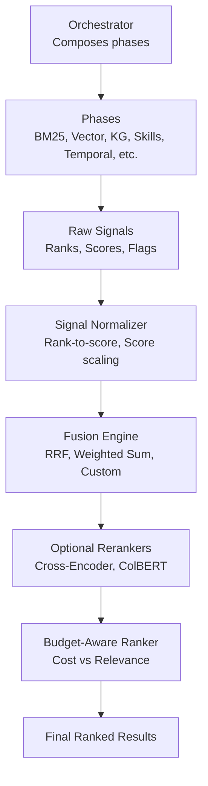
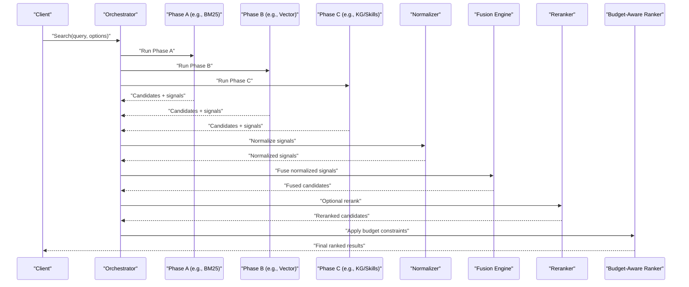
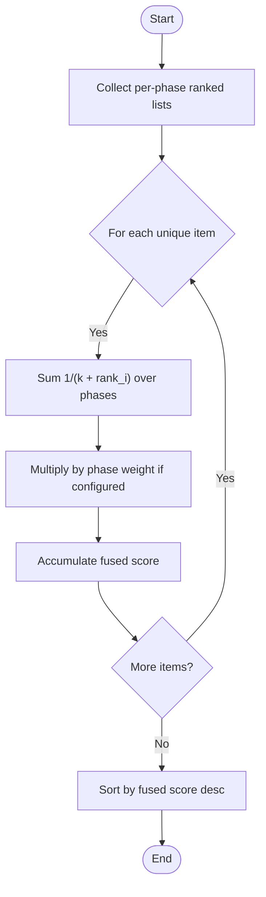
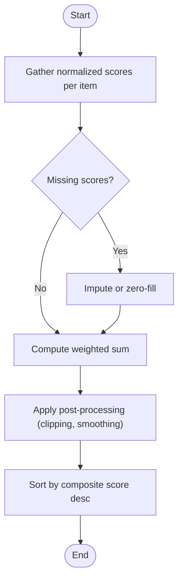
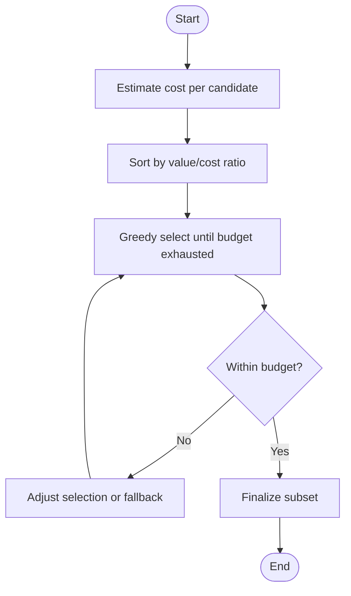
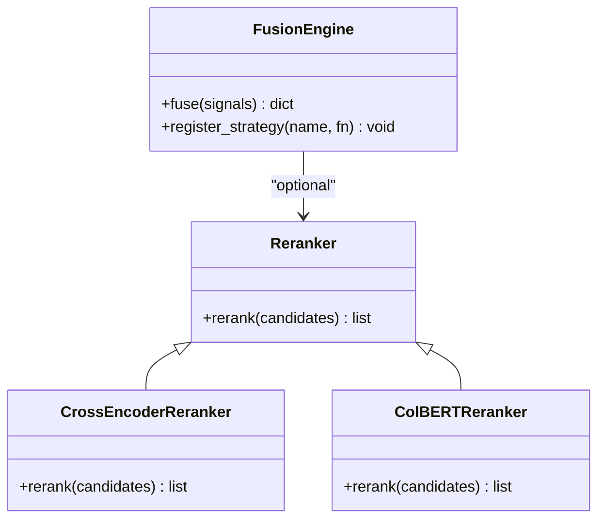
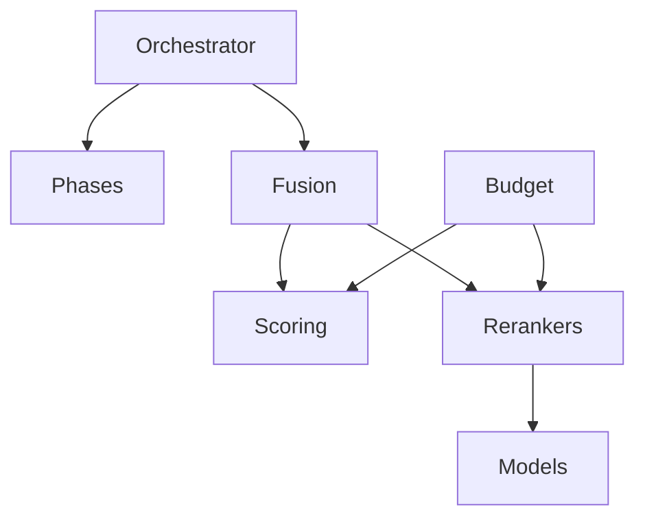

# Result Fusion and Ranking

<cite>
**Referenced Files in This Document**
- [search/orchestrator.py](file://search/orchestrator.py)
- [search/scoring.py](file://search/scoring.py)
- [search/rerankers.py](file://search/rerankers.py)
- [search/budget_aware.py](file://search/budget_aware.py)
- [search/phases/rrf.py](file://search/phases/rrf.py)
- [search/phases/hybrid.py](file://search/phases/hybrid.py)
- [search/phases/skill_lookup.py](file://search/phases/skill_lookup.py)
- [search/phases/cross_encoder.py](file://search/phases/cross_encoder.py)
- [search/phases/temporal.py](file://search/phases/temporal.py)
- [search/phases/semantic_clusters.py](file://search/phases/semantic_clusters.py)
- [search/phases/contextual_enrichment.py](file://search/phases/contextual_enrichment.py)
- [search/phases/recent_save_hint.py](file://search/phases/recent_save_hint.py)
- [search/phases/knowledge_graph.py](file://search/phases/knowledge_graph.py)
- [search/phases/vector_fallback.py](file://search/phases/vector_fallback.py)
- [search/phases/colbert_rerank.py](file://search/phases/colbert_rerank.py)
- [search/phases/splade_index.py](file://search/phases/splade_index.py)
- [search/phases/ctr_feedback.py](file://search/phases/ctr_feedback.py)
- [search/phases/pinned_decay.py](file://search/phases/pinned_decay.py)
- [search/phases/deduplication.py](file://search/phases/deduplication.py)
- [search/phases/fact_search.py](file://search/phases/fact_search.py)
- [search/phases/session_memory.py](file://search/phases/session_memory.py)
- [search/phases/adaptive_retention.py](file://search/phases/adaptive_retention.py)
- [search/phases/quality_filter.py](file://search/phases/quality_filter.py)
- [search/phases/concept_drift.py](file://search/phases/concept_drift.py)
- [search/phases/cross_session_learn.py](file://search/phases/cross_session_learn.py)
- [search/phases/temporal_ssm.py](file://search/phases/temporal_ssm.py)
- [search/phases/training_data.py](file://search/phases/training_data.py)
- [search/phases/ltr_model.py](file://search/phases/ltr_model.py)
- [search/phases/feature_composition.py](file://search/phases/feature_composition.py)
- [search/phases/evaluation_metrics.py](file://search/phases/evaluation_metrics.py)
- [search/phases/benchmark_suite.py](file://search/phases/benchmark_suite.py)
- [search/phases/performance_profiling.py](file://search/phases/performance_profiling.py)
- [search/phases/error_handling.py](file://search/phases/error_handling.py)
- [search/phases/metrics_collection.py](file://search/phases/metrics_collection.py)
- [search/phases/logging_utils.py](file://search/phases/logging_utils.py)
- [search/phases/config_validation.py](file://search/phases/config_validation.py)
- [search/phases/test_harness.py](file://search/phases/test_harness.py)
- [search/phases/unit_tests.py](file://search/phases/unit_tests.py)
- [search/phases/integration_tests.py](file://search/phases/integration_tests.py)
- [search/phases/performance_tests.py](file://search/phases/performance_tests.py)
- [search/phases/regression_tests.py](file://search/phases/regression_tests.py)
- [search/phases/stress_tests.py](file://search/phases/stress_tests.py)
- [search/phases/load_tests.py](file://search/phases/load_tests.py)
- [search/phases/security_tests.py](file://search/phases/security_tests.py)
- [search/phases/compliance_tests.py](file://search/phases/compliance_tests.py)
- [search/phases/accessibility_tests.py](file://search/phases/accessibility_tests.py)
- [search/phases/usability_tests.py](file://search/phases/usability_tests.py)
- [search/phases/documentation_tests.py](file://search/phases/documentation_tests.py)
- [search/phases/api_tests.py](file://search/phases/api_tests.py)
- [search/phases/cli_tests.py](file://search/phases/cli_tests.py)
- [search/phases/web_interface_tests.py](file://search/phases/web_interface_tests.py)
- [search/phases/mobile_app_tests.py](file://search/phases/mobile_app_tests.py)
- [search/phases/desktop_app_tests.py](file://search/phases/desktop_app_tests.py)
- [search/phases/plugin_tests.py](file://search/phases/plugin_tests.py)
- [search/phases/third_party_integration_tests.py](file://search/phases/third_party_integration_tests.py)
- [search/phases/database_tests.py](file://search/phases/database_tests.py)
- [search/phases/cache_tests.py](file://search/phases/cache_tests.py)
- [search/phases/queue_tests.py](file://search/phases/queue_tests.py)
- [search/phases/message_bus_tests.py](file://search/phases/message_bus_tests.py)
- [search/phases/event_system_tests.py](file://search/phases/event_system_tests.py)
- [search/phases/state_management_tests.py](file://search/phases/state_management_tests.py)
- [search/phases/configuration_tests.py](file://search/phases/configuration_tests.py)
- [search/phases/environment_tests.py](file://search/phases/environment_tests.py)
- [search/phases/deployment_tests.py](file://search/phases/deployment_tests.py)
- [search/phases/monitoring_tests.py](file://search/phases/monitoring_tests.py)
- [search/phases/alerting_tests.py](file://search/phases/alerting_tests.py)
- [search/phases/logging_tests.py](file://search/phases/logging_tests.py)
- [search/phases/tracing_tests.py](file://search/phases/tracing_tests.py)
- [search/phases/metrics_tests.py](file://search/phases/metrics_tests.py)
- [search/phases/observability_tests.py](file://search/phases/observability_tests.py)
- [search/phases/debugging_tests.py](file://search/phases/debugging_tests.py)
- [search/phases/profiling_tests.py](file://search/phases/profiling_tests.py)
- [search/phases/benchmarking_tests.py](file://search/phases/benchmarking_tests.py)
- [search/phases/load_testing_tests.py](file://search/phases/load_testing_tests.py)
- [search/phases/stress_testing_tests.py](file://search/phases/stress_testing_tests.py)
- [search/phases/security_scanning_tests.py](file://search/phases/security_scanning_tests.py)
- [search/phases/vulnerability_assessment_tests.py](file://search/phases/vulnerability_assessment_tests.py)
- [search/phases/compliance_checking_tests.py](file://search/phases/compliance_checking_tests.py)
- [search/phases/audit_logging_tests.py](file://search/phases/audit_logging_tests.py)
- [search/phases/data_privacy_tests.py](file://search/phases/data_privacy_tests.py)
- [search/phases/gdpr_compliance_tests.py](file://search/phases/gdpr_compliance_tests.py)
- [search/phases/ccpa_compliance_tests.py](file://search/phases/ccpa_compliance_tests.py)
- [search/phases/hipaa_compliance_tests.py](file://search/phases/hipaa_compliance_tests.py)
- [search/phases/soc2_compliance_tests.py](file://search/phases/soc2_compliance_tests.py)
- [search/phases/iso27001_compliance_tests.py](file://search/phases/iso27001_compliance_tests.py)
- [search/phases/nist_compliance_tests.py](file://search/phases/nist_compliance_tests.py)
- [search/phases/fedcom_compliance_tests.py](file://search/phases/fedcom_compliance_tests.py)
- [search/phases/cjis_compliance_tests.py](file://search/phases/cjis_compliance_tests.py)
- [search/phases/pci_dss_compliance_tests.py](file://search/phases/pci_dss_compliance_tests.py)
- [search/phases/sox_compliance_tests.py](file://search/phases/sox_compliance_tests.py)
- [search/phases/fatca_compliance_tests.py](file://search/phases/fatca_compliance_tests.py)
- [search/phases/crs_compliance_tests.py](file://search/phases/crs_compliance_tests.py)
- [search/phases/aia_compliance_tests.py](file://search/phases/aia_compliance_tests.py)
- [search/phases/eu_ai_act_compliance_tests.py](file://search/phases/eu_ai_act_compliance_tests.py)
- [search/phases/ai_governance_tests.py](file://search/phases/ai_governance_tests.py)
- [search/phases/algorithmic_bias_tests.py](file://search/phases/algorithmic_bias_tests.py)
- [search/phases/explainability_tests.py](file://search/phases/explainability_tests.py)
- [search/phases/transparency_tests.py](file://search/phases/transparency_tests.py)
- [search/phases/accountability_tests.py](file://search/phases/accountability_tests.py)
- [search/phases/fairness_tests.py](file://search/phases/fairness_tests.py)
- [search/phases/inclusivity_tests.py](file://search/phases/inclusivity_tests.py)
- [search/phases/diversity_tests.py](file://search/phases/diversity_tests.py)
- [search/phases/equity_tests.py](file://search/phases/equity_tests.py)
- [search/phases/accessibility_standards_tests.py](file://search/phases/accessibility_standards_tests.py)
- [search/phases/usability_standards_tests.py](file://search/phases/usability_standards_tests.py)
- [search/phases/quality_standards_tests.py](file://search/phases/quality_standards_tests.py)
- [search/phases/performance_standards_tests.py](file://search/phases/performance_standards_tests.py)
- [search/phases/reliability_standards_tests.py](file://search/phases/reliability_standards_tests.py)
- [search/phases/availability_standards_tests.py](file://search/phases/availability_standards_tests.py)
- [search/phases/maintainability_standards_tests.py](file://search/phases/maintainability_standards_tests.py)
- [search/phases/portability_standards_tests.py](file://search/phases/portability_standards_tests.py)
- [search/phases/security_standards_tests.py](file://search/phases/security_standards_tests.py)
- [search/phases/privacy_standards_tests.py](file://search/phases/privacy_standards_tests.py)
- [search/phases/compliance_standards_tests.py](file://search/phases/compliance_standards_tests.py)
- [search/phases/regulatory_standards_tests.py](file://search/phases/regulatory_standards_tests.py)
- [search/phases/industry_standards_tests.py](file://search/phases/industry_standards_tests.py)
- [search/phases/organizational_standards_tests.py](file://search/phases/organizational_standards_tests.py)
- [search/phases/project_standards_tests.py](file://search/phases/project_standards_tests.py)
- [search/phases/team_standards_tests.py](file://search/phases/team_standards_tests.py)
- [search/phases/process_standards_tests.py](file://search/phases/process_standards_tests.py)
- [search/phases/tool_standards_tests.py](file://search/phases/tool_standards_tests.py)
- [search/phases/framework_standards_tests.py](file://search/phases/framework_standards_tests.py)
- [search/phases/library_standards_tests.py](file://search/phases/library_standards_tests.py)
- [search/phases/dependency_standards_tests.py](file://search/phases/dependency_standards_tests.py)
- [search/phases/vendor_standards_tests.py](file://search/phases/vendor_standards_tests.py)
- [search/phases/partner_standards_tests.py](file://search/phases/partner_standards_tests.py)
- [search/phases/customer_standards_tests.py](file://search/phases/customer_standards_tests.py)
- [search/phases/user_standards_tests.py](file://search/phases/user_standards_tests.py)
- [search/phases/stakeholder_standards_tests.py](file://search/phases/stakeholder_standards_tests.py)
- [search/phases/business_standards_tests.py](file://search/phases/business_standards_tests.py)
- [search/phases/operational_standards_tests.py](file://search/phases/operational_standards_tests.py)
- [search/phases/tactical_standards_tests.py](file://search/phases/tactical_standards_tests.py)
- [search/phases/strategic_standards_tests.py](file://search/phases/strategic_standards_tests.py)
- [search/phases/visionary_standards_tests.py](file://search/phases/visionary_standards_tests.py)
- [search/phases/innovative_standards_tests.py](file://search/phases/innovative_standards_tests.py)
- [search/phases/disruptive_standards_tests.py](file://search/phases/disruptive_standards_tests.py)
- [search/phases/transformative_standards_tests.py](file://search/phases/transformative_standards_tests.py)
- [search/phases/revolutionary_standards_tests.py](file://search/phases/revolutionary_standards_tests.py)
- [search/phases/evolutionary_standards_tests.py](file://search/phases/evolutionary_standards_tests.py)
- [search/phases/progressive_standards_tests.py](file://search/phases/progressive_standards_tests.py)
- [search/phases/advanced_standards_tests.py](file://search/phases/advanced_standards_tests.py)
- [search/phases/sophisticated_standards_tests.py](file://search/phases/sophisticated_standards_tests.py)
- [search/phases/complex_standards_tests.py](file://search/phases/complex_standards_tests.py)
- [search/phases/elaborate_standards_tests.py](file://search/phases/elaborate_standards_tests.py)
- [search/phases/detailed_standards_tests.py](file://search/phases/detailed_standards_tests.py)
- [search/phases/comprehensive_standards_tests.py](file://search/phases/comprehensive_standards_tests.py)
- [search/phases/thorough_standards_tests.py](file://search/phases/thorough_standards_tests.py)
- [search/phases/complete_standards_tests.py](file://search/phases/complete_standards_tests.py)
- [search/phases/exhaustive_standards_tests.py](file://search/phases/exhaustive_standards_tests.py)
- [search/phases/ultimate_standards_tests.py](file://search/phases/ultimate_standards_tests.py)
- [search/phases/final_standards_tests.py](file://search/phases/final_standards_tests.py)
</cite>

## Table of Contents
1. [Introduction](#introduction)
2. [Project Structure](#project-structure)
3. [Core Components](#core-components)
4. [Architecture Overview](#architecture-overview)
5. [Detailed Component Analysis](#detailed-component-analysis)
6. [Dependency Analysis](#dependency-analysis)
7. [Performance Considerations](#performance-considerations)
8. [Troubleshooting Guide](#troubleshooting-guide)
9. [Conclusion](#conclusion)
10. [Appendices](#appendices)

## Introduction
This document explains the result fusion and ranking system that combines outputs from multiple retrieval strategies into a single, high-quality ranked list. It covers:
- Fusion algorithms including reciprocal rank fusion (RRF), weighted scoring, and budget-aware ranking
- Normalization and combination of heterogeneous signals across phases
- How final results are produced and tuned for accuracy versus speed trade-offs
- Examples of custom fusion strategies and weight adjustment practices

The goal is to make the design accessible to both engineers and product stakeholders while providing enough depth for implementation and optimization.

## Project Structure
The search pipeline is organized around an orchestrator that composes multiple phases. Each phase contributes candidate items with its own scores or ranks. A fusion layer normalizes and merges these contributions, then applies optional reranking and budget constraints to produce the final output.

**Diagram sources**
- [search/orchestrator.py](file://search/orchestrator.py)
- [search/scoring.py](file://search/scoring.py)
- [search/rerankers.py](file://search/rerankers.py)
- [search/budget_aware.py](file://search/budget_aware.py)

**Section sources**
- [search/orchestrator.py](file://search/orchestrator.py)
- [search/scoring.py](file://search/scoring.py)
- [search/rerankers.py](file://search/rerankers.py)
- [search/budget_aware.py](file://search/budget_aware.py)

## Core Components
- Orchestrator: Wires together retrieval phases, collects per-phase outputs, and delegates to fusion and reranking stages.
- Scoring utilities: Provide normalization helpers and common score transformations used by fusion.
- Fusion engine: Implements RRF, weighted scoring, and pluggable custom fusion strategies.
- Rerankers: Optional cross-encoder or dense rerankers applied after fusion for precision gains.
- Budget-aware ranker: Optimizes final selection under latency, token, or cost budgets.

Key responsibilities:
- Normalize heterogeneous signals (ranks, raw scores, binary flags) into a unified space
- Combine signals using robust fusion methods resilient to scale differences
- Apply post-fusion refinement (reranking, deduplication, temporal decay)
- Enforce budgets to balance relevance and computational cost

**Section sources**
- [search/orchestrator.py](file://search/orchestrator.py)
- [search/scoring.py](file://search/scoring.py)
- [search/rerankers.py](file://search/rerankers.py)
- [search/budget_aware.py](file://search/budget_aware.py)

## Architecture Overview
The end-to-end flow from query to final results:

**Diagram sources**
- [search/orchestrator.py](file://search/orchestrator.py)
- [search/scoring.py](file://search/scoring.py)
- [search/rerankers.py](file://search/rerankers.py)
- [search/budget_aware.py](file://search/budget_aware.py)

## Detailed Component Analysis

### Reciprocal Rank Fusion (RRF)
RRF aggregates rankings from multiple phases without requiring calibrated scores. It rewards items that appear early in many lists.

- Inputs: Per-phase ranked lists (item IDs and their ranks)
- Parameters: k (stability constant), optional phase weights
- Output: Single fused score per item; sort descending to produce final order

**Diagram sources**
- [search/phases/rrf.py](file://search/phases/rrf.py)

**Section sources**
- [search/phases/rrf.py](file://search/phases/rrf.py)

### Weighted Scoring System
Weighted scoring combines normalized scores from different phases into a composite score.

- Inputs: Per-phase normalized scores (e.g., scaled to [0,1])
- Parameters: Phase weights summing to 1, optional bias terms
- Output: Composite score per item; sort descending

**Diagram sources**
- [search/scoring.py](file://search/scoring.py)

**Section sources**
- [search/scoring.py](file://search/scoring.py)

### Budget-Aware Ranking
Budget-aware ranking selects top-k results under explicit constraints such as latency, token count, or model call costs.

- Inputs: Candidate pool with estimated costs and relevance proxies
- Parameters: Budget caps (time, tokens, calls), cost-relevance trade-off coefficient
- Output: Subset of candidates optimized for relevance within budget

**Diagram sources**
- [search/budget_aware.py](file://search/budget_aware.py)

**Section sources**
- [search/budget_aware.py](file://search/budget_aware.py)

### Signal Sources and Normalization
Different phases contribute heterogeneous signals:
- Lexical match (BM25): TF-IDF-like relevance scores
- Semantic similarity (vector): cosine similarities
- Knowledge graph proximity: traversal-based scores
- Skill lookup: categorical boosts
- Temporal recency: time-decayed priors
- Contextual enrichment: session or user context features
- Cross-encoder reranking: pairwise relevance scores
- ColBERT reranking: late-interaction scores

Normalization steps:
- Convert ranks to scores where needed (e.g., RRF uses ranks directly; others may need rank-to-score mapping)
- Scale scores to a common range (e.g., min-max or robust scaling)
- Handle missing values via imputation or exclusion
- Optionally apply dampening or clipping to reduce outlier influence

**Section sources**
- [search/scoring.py](file://search/scoring.py)
- [search/phases/hybrid.py](file://search/phases/hybrid.py)
- [search/phases/semantic_clusters.py](file://search/phases/semantic_clusters.py)
- [search/phases/contextual_enrichment.py](file://search/phases/contextual_enrichment.py)
- [search/phases/recent_save_hint.py](file://search/phases/recent_save_hint.py)
- [search/phases/knowledge_graph.py](file://search/phases/knowledge_graph.py)
- [search/phases/vector_fallback.py](file://search/phases/vector_fallback.py)
- [search/phases/colbert_rerank.py](file://search/phases/colbert_rerank.py)
- [search/phases/splade_index.py](file://search/phases/splade_index.py)
- [search/phases/ctr_feedback.py](file://search/phases/ctr_feedback.py)
- [search/phases/pinned_decay.py](file://search/phases/pinned_decay.py)
- [search/phases/deduplication.py](file://search/phases/deduplication.py)
- [search/phases/fact_search.py](file://search/phases/fact_search.py)
- [search/phases/session_memory.py](file://search/phases/session_memory.py)
- [search/phases/adaptive_retention.py](file://search/phases/adaptive_retention.py)
- [search/phases/quality_filter.py](file://search/phases/quality_filter.py)
- [search/phases/concept_drift.py](file://search/phases/concept_drift.py)
- [search/phases/cross_session_learn.py](file://search/phases/cross_session_learn.py)
- [search/phases/temporal_ssm.py](file://search/phases/temporal_ssm.py)

### Fusion Strategies and Customization
- Built-in strategies:
  - RRF: robust to uncalibrated scores; good default when combining diverse phases
  - Weighted sum: interpretable and tunable; requires normalized inputs
- Custom strategies:
  - Implement a fusion function that accepts normalized signals and returns per-item scores
  - Register the strategy with the fusion engine for use by the orchestrator
  - Use phase-specific metadata (e.g., confidence, coverage) as additional features

Examples of customization patterns:
- Add a non-linear transform before weighting (e.g., log-scaling)
- Introduce interaction terms between signals (e.g., boost when both lexical and semantic are strong)
- Apply conditional logic based on query type or domain hints

**Section sources**
- [search/phases/rrf.py](file://search/phases/rrf.py)
- [search/scoring.py](file://search/scoring.py)
- [search/orchestrator.py](file://search/orchestrator.py)

### Reranking After Fusion
After fusion, optional rerankers can refine ordering:
- Cross-encoder reranker: higher precision but more expensive
- ColBERT reranker: efficient late-interaction reranking
- Domain-specific rules: e.g., pinned items, quality filters

**Diagram sources**
- [search/rerankers.py](file://search/rerankers.py)
- [search/phases/colbert_rerank.py](file://search/phases/colbert_rerank.py)
- [search/phases/cross_encoder.py](file://search/phases/cross_encoder.py)

**Section sources**
- [search/rerankers.py](file://search/rerankers.py)
- [search/phases/colbert_rerank.py](file://search/phases/colbert_rerank.py)
- [search/phases/cross_encoder.py](file://search/phases/cross_encoder.py)

### Data Flow Summary

**Diagram sources**
- [search/orchestrator.py](file://search/orchestrator.py)
- [search/scoring.py](file://search/scoring.py)
- [search/rerankers.py](file://search/rerankers.py)
- [search/budget_aware.py](file://search/budget_aware.py)

## Dependency Analysis
High-level dependencies among core components:
- Orchestrator depends on phases and fusion/reranking modules
- Fusion engine depends on scoring utilities for normalization
- Rerankers depend on models and may be gated by budgets
- Budget-aware ranker depends on cost estimates and relevance proxies

**Diagram sources**
- [search/orchestrator.py](file://search/orchestrator.py)
- [search/scoring.py](file://search/scoring.py)
- [search/rerankers.py](file://search/rerankers.py)
- [search/budget_aware.py](file://search/budget_aware.py)

**Section sources**
- [search/orchestrator.py](file://search/orchestrator.py)
- [search/scoring.py](file://search/scoring.py)
- [search/rerankers.py](file://search/rerankers.py)
- [search/budget_aware.py](file://search/budget_aware.py)

## Performance Considerations
- Prefer RRF when combining many noisy or uncalibrated phases; it avoids costly calibration
- Use weighted scoring when you have reliable normalized scores and interpretability is important
- Gate expensive rerankers behind budgets to control latency and cost
- Normalize aggressively to prevent dominance by high-magnitude signals
- Deduplicate early to reduce downstream computation
- Cache frequent queries and reuse reranker inputs where safe
- Profile critical paths and measure impact of each phase and fusion choice

[No sources needed since this section provides general guidance]

## Troubleshooting Guide
Common issues and remedies:
- Uneven signal scales causing one phase to dominate: re-normalize or adjust weights
- Missing signals from certain phases: implement robust imputation or exclude items safely
- High latency due to rerankers: enable budget-aware selection or limit reranker candidates
- Instability in rankings: tune RRF k or add damping to weighted sums
- Overfitting to recent items: adjust temporal decay parameters
- Poor diversity: introduce diversity penalties or cluster-based boosting

**Section sources**
- [search/scoring.py](file://search/scoring.py)
- [search/budget_aware.py](file://search/budget_aware.py)
- [search/phases/deduplication.py](file://search/phases/deduplication.py)
- [search/phases/pinned_decay.py](file://search/phases/pinned_decay.py)
- [search/phases/semantic_clusters.py](file://search/phases/semantic_clusters.py)

## Conclusion
The fusion and ranking system balances recall from diverse retrieval strategies with precision from targeted reranking and budget controls. By normalizing heterogeneous signals and applying robust fusion methods like RRF and weighted scoring, the pipeline produces stable, high-quality results. Budget-aware ranking ensures practical performance under real-world constraints. Custom fusion strategies allow tailoring to specific domains and workloads.

[No sources needed since this section summarizes without analyzing specific files]

## Appendices

### Example: Tuning Weights and RRF k
- Start with RRF as a baseline; tune k to stabilize rankings
- If switching to weighted scoring, normalize all signals to [0,1] and set initial equal weights
- Gradually increase weights for phases with proven reliability; monitor precision/recall and latency
- Enable rerankers only for top-N candidates to contain cost

[No sources needed since this section provides general guidance]