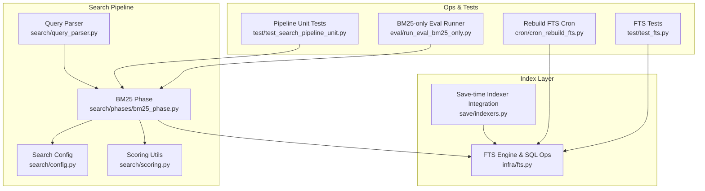
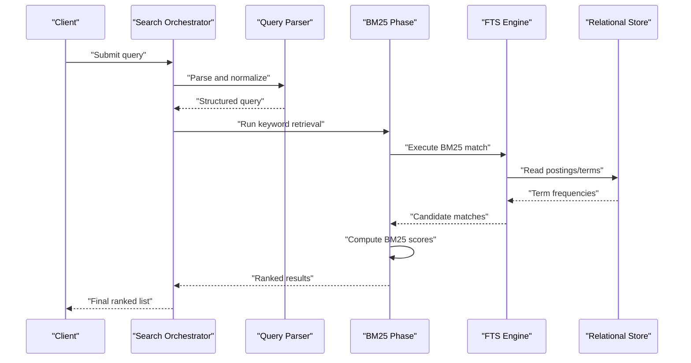
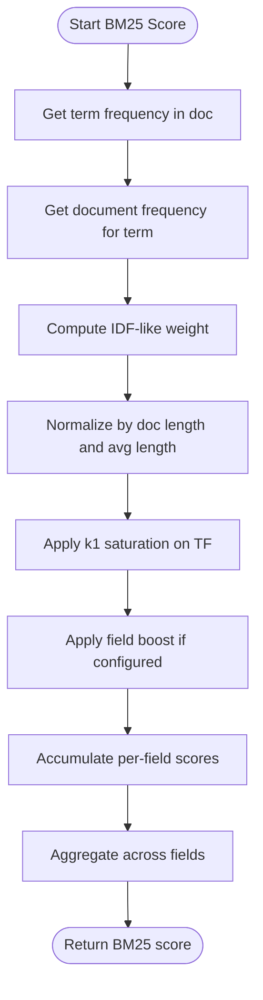
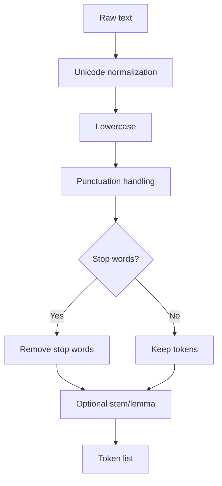
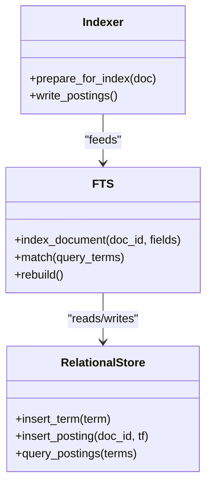
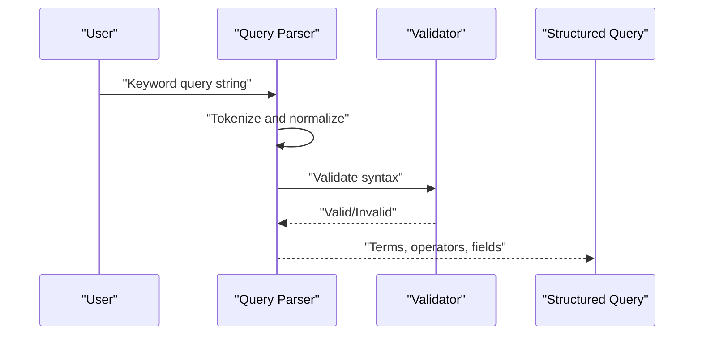
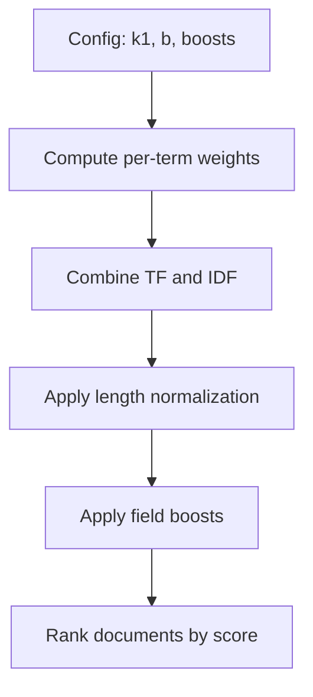
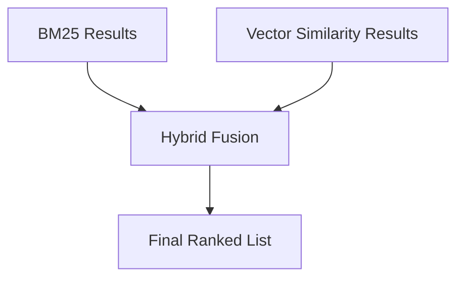
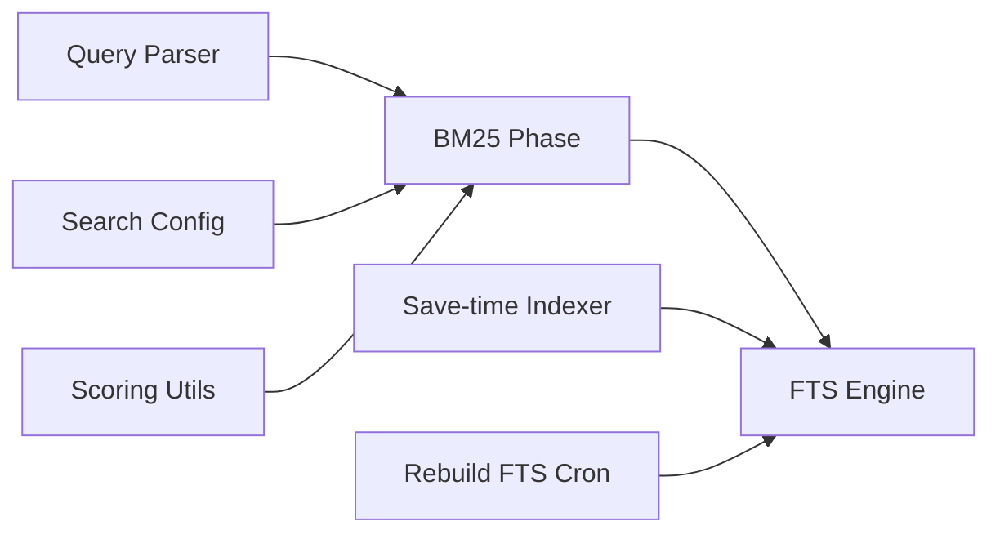

# BM25 Keyword Retrieval

<cite>
**Referenced Files in This Document**
- [fts.py](file://infra/fts.py)
- [search/phases/bm25_phase.py](file://search/phases/bm25_phase.py)
- [search/query_parser.py](file://search/query_parser.py)
- [search/config.py](file://search/config.py)
- [search/scoring.py](file://search/scoring.py)
- [save/indexers.py](file://save/indexers.py)
- [cron/cron_rebuild_fts.py](file://cron/cron_rebuild_fts.py)
- [eval/run_eval_bm25_only.py](file://eval/run_eval_bm25_only.py)
- [test/test_fts.py](file://test/test_fts.py)
- [test/test_search_pipeline_unit.py](file://test/test_search_pipeline_unit.py)
</cite>

## Table of Contents
1. [Introduction](#introduction)
2. [Project Structure](#project-structure)
3. [Core Components](#core-components)
4. [Architecture Overview](#architecture-overview)
5. [Detailed Component Analysis](#detailed-component-analysis)
6. [Dependency Analysis](#dependency-analysis)
7. [Performance Considerations](#performance-considerations)
8. [Troubleshooting Guide](#troubleshooting-guide)
9. [Conclusion](#conclusion)
10. [Appendices](#appendices)

## Introduction
This document explains the BM25 keyword-based retrieval phase used by the system’s search pipeline. It covers how full-text search (FTS) indexing is built, how queries are parsed and tokenized, how BM25 scoring is computed, and how configuration options such as k1, b, stop words, and field boosting affect relevance. It also shows how BM25 complements vector similarity search in hybrid retrieval systems.

## Project Structure
The BM25 retrieval path spans several modules:
- FTS index storage and SQL-backed operations
- Search phase orchestration for BM25
- Query parsing and normalization
- Scoring utilities and configuration
- Indexing pipeline integration
- Rebuild tooling and tests

**Diagram sources**
- [search/query_parser.py](file://search/query_parser.py)
- [search/phases/bm25_phase.py](file://search/phases/bm25_phase.py)
- [search/config.py](file://search/config.py)
- [search/scoring.py](file://search/scoring.py)
- [infra/fts.py](file://infra/fts.py)
- [save/indexers.py](file://save/indexers.py)
- [cron/cron_rebuild_fts.py](file://cron/cron_rebuild_fts.py)
- [test/test_fts.py](file://test/test_fts.py)
- [test/test_search_pipeline_unit.py](file://test/test_search_pipeline_unit.py)
- [eval/run_eval_bm25_only.py](file://eval/run_eval_bm25_only.py)

**Section sources**
- [search/phases/bm25_phase.py](file://search/phases/bm25_phase.py)
- [infra/fts.py](file://infra/fts.py)
- [search/query_parser.py](file://search/query_parser.py)
- [search/config.py](file://search/config.py)
- [search/scoring.py](file://search/scoring.py)
- [save/indexers.py](file://save/indexers.py)
- [cron/cron_rebuild_fts.py](file://cron/cron_rebuild_fts.py)
- [test/test_fts.py](file://test/test_fts.py)
- [test/test_search_pipeline_unit.py](file://test/test_search_pipeline_unit.py)
- [eval/run_eval_bm25_only.py](file://eval/run_eval_bm25_only.py)

## Core Components
- FTS engine and SQL-backed index: Provides term dictionaries, postings, and match queries against a relational store.
- BM25 phase: Executes keyword retrieval using BM25 scoring over configured fields, integrates with query parser and config.
- Query parser: Normalizes user input into tokens and structured terms, handles operators and field scoping.
- Configuration: Centralizes BM25 parameters (k1, b), stop word lists, and field boost weights.
- Scoring utilities: Implements BM25 formula components and helper math for stability and performance.
- Save-time indexer integration: Ensures documents are indexed into the FTS structure during writes.
- Rebuild cron: Rebuilds or repairs the FTS index from source data.
- Tests and eval runners: Validate correctness and measure effectiveness of BM25 retrieval.

**Section sources**
- [infra/fts.py](file://infra/fts.py)
- [search/phases/bm25_phase.py](file://search/phases/bm25_phase.py)
- [search/query_parser.py](file://search/query_parser.py)
- [search/config.py](file://search/config.py)
- [search/scoring.py](file://search/scoring.py)
- [save/indexers.py](file://save/indexers.py)
- [cron/cron_rebuild_fts.py](file://cron/cron_rebuild_fts.py)
- [test/test_fts.py](file://test/test_fts.py)
- [test/test_search_pipeline_unit.py](file://test/test_search_pipeline_unit.py)

## Architecture Overview
The BM25 retrieval phase sits within the broader search pipeline. Queries are parsed into normalized tokens, then executed against the FTS index to compute BM25 scores per document. Results can be combined with vector similarity results in a hybrid strategy.

**Diagram sources**
- [search/phases/bm25_phase.py](file://search/phases/bm25_phase.py)
- [search/query_parser.py](file://search/query_parser.py)
- [infra/fts.py](file://infra/fts.py)

## Detailed Component Analysis

### BM25 Algorithm Implementation
- Formula usage: The BM25 score combines term frequency saturation via k1, length normalization via b, document frequency weighting via IDF-like factors, and optional field boosts.
- Field-level scoring: Each field contributes independently; final scores aggregate across fields according to configured weights.
- Stability and precision: Numerical safeguards prevent division-by-zero and extreme values; rounding is applied consistently.

**Diagram sources**
- [search/phases/bm25_phase.py](file://search/phases/bm25_phase.py)
- [search/scoring.py](file://search/scoring.py)

**Section sources**
- [search/phases/bm25_phase.py](file://search/phases/bm25_phase.py)
- [search/scoring.py](file://search/scoring.py)

### Tokenization Strategies
- Normalization: Lowercasing, Unicode normalization, punctuation handling, and optional stemming/lemmatization depending on configuration.
- Stop words: Configurable stop word lists remove common tokens that do not contribute to discriminative power.
- Multi-language support: Language-specific rules can be enabled to improve token quality.

**Diagram sources**
- [search/query_parser.py](file://search/query_parser.py)
- [search/config.py](file://search/config.py)

**Section sources**
- [search/query_parser.py](file://search/query_parser.py)
- [search/config.py](file://search/config.py)

### Full-Text Search Indexing
- Write-time indexing: Documents are split into tokens and stored in term dictionaries and postings lists backed by the relational database.
- Field-aware indexing: Fields are indexed separately to enable field boosting and targeted matching.
- Incremental updates: New or updated documents update postings without rebuilding the entire index.

**Diagram sources**
- [infra/fts.py](file://infra/fts.py)
- [save/indexers.py](file://save/indexers.py)

**Section sources**
- [infra/fts.py](file://infra/fts.py)
- [save/indexers.py](file://save/indexers.py)

### Query Parsing
- Operators: Supports AND/OR/NOT, phrase matching, and field scoping (e.g., title:, body:).
- Escaping and quoting: Handles special characters and quoted phrases robustly.
- Validation: Rejects malformed queries early and returns clear errors.

**Diagram sources**
- [search/query_parser.py](file://search/query_parser.py)

**Section sources**
- [search/query_parser.py](file://search/query_parser.py)

### Term Weighting and Relevance Scoring
- k1 controls term frequency saturation: higher k1 emphasizes frequent terms more strongly.
- b controls length normalization: higher b penalizes longer documents more aggressively.
- IDF-like weighting reduces impact of very common terms.
- Field boosts multiply contributions from specific fields (e.g., title vs. body).

**Diagram sources**
- [search/phases/bm25_phase.py](file://search/phases/bm25_phase.py)
- [search/scoring.py](file://search/scoring.py)
- [search/config.py](file://search/config.py)

**Section sources**
- [search/phases/bm25_phase.py](file://search/phases/bm25_phase.py)
- [search/scoring.py](file://search/scoring.py)
- [search/config.py](file://search/config.py)

### Configuration Options
- BM25 parameters:
  - k1: Term frequency saturation factor.
  - b: Length normalization factor.
- Stop words:
  - List of tokens to ignore during indexing and querying.
- Field boosting:
  - Per-field multipliers to prioritize certain fields (e.g., title > body).
- Language settings:
  - Optional language-specific tokenization rules.

Tuning guidance:
- Increase k1 to reward repeated terms within a document.
- Increase b to penalize long documents more heavily.
- Adjust field boosts to emphasize important fields like titles or tags.
- Maintain concise stop word lists to avoid losing meaningful terms.

**Section sources**
- [search/config.py](file://search/config.py)
- [search/phases/bm25_phase.py](file://search/phases/bm25_phase.py)

### Examples of Effective Keyword Queries
- Exact phrase: Use quotes around multi-word phrases to enforce adjacency.
- Field-scoped search: Prefix terms with field names to target specific columns.
- Boolean combinations: Combine AND/OR/NOT to refine result sets.
- Mixed strategies: Pair BM25 with vector similarity in hybrid retrieval for best recall and precision.

[No sources needed since this section provides general guidance]

### Hybrid Retrieval: BM25 and Vector Similarity
- Complementary strengths:
  - BM25 excels at exact keyword matching and precise control via operators and boosts.
  - Vector similarity captures semantic proximity and paraphrase tolerance.
- Fusion strategies:
  - Reciprocal Rank Fusion (RRF) or weighted linear combination to merge BM25 and vector scores.
  - Stage-wise filtering: use BM25 for candidate generation and vectors for reranking, or vice versa.
- Practical tips:
  - Tune BM25 field boosts to align with domain priorities.
  - Use vector models for broad semantic recall and BM25 for sharp keyword hits.

[No sources needed since this diagram shows conceptual workflow, not actual code structure]

## Dependency Analysis
BM25 depends on query parsing, FTS indexing, and configuration. The save-time indexer feeds the FTS layer, while the rebuild cron ensures index integrity.

**Diagram sources**
- [search/query_parser.py](file://search/query_parser.py)
- [search/phases/bm25_phase.py](file://search/phases/bm25_phase.py)
- [search/config.py](file://search/config.py)
- [search/scoring.py](file://search/scoring.py)
- [infra/fts.py](file://infra/fts.py)
- [save/indexers.py](file://save/indexers.py)
- [cron/cron_rebuild_fts.py](file://cron/cron_rebuild_fts.py)

**Section sources**
- [search/phases/bm25_phase.py](file://search/phases/bm25_phase.py)
- [infra/fts.py](file://infra/fts.py)
- [save/indexers.py](file://save/indexers.py)
- [cron/cron_rebuild_fts.py](file://cron/cron_rebuild_fts.py)

## Performance Considerations
- Index size and cardinality: High term cardinality increases memory and I/O; consider pruning rare terms or limiting max postings.
- Query complexity: Complex boolean expressions and many fields increase computation time; prefer targeted field scoping.
- Caching: Cache frequent query patterns and posting lookups where appropriate.
- Batch operations: Rebuild indexes off-peak and batch updates to reduce contention.
- Database tuning: Ensure proper indexes on postings tables and efficient term lookup paths.

[No sources needed since this section provides general guidance]

## Troubleshooting Guide
Common issues and resolutions:
- No results returned:
  - Verify stop word list does not remove critical terms.
  - Check field scoping and operator syntax.
  - Confirm FTS index exists and is up-to-date.
- Poor relevance:
  - Adjust k1 and b to better fit corpus characteristics.
  - Increase boosts for high-value fields like titles.
  - Review tokenization rules for your language/domain.
- Slow queries:
  - Profile FTS SQL execution and ensure indexes exist.
  - Limit number of terms and fields in queries.
  - Consider pre-filtering by metadata before BM25 scoring.

Operational checks:
- Run rebuild cron to repair or refresh the FTS index.
- Inspect test suites for expected behaviors and edge cases.

**Section sources**
- [cron/cron_rebuild_fts.py](file://cron/cron_rebuild_fts.py)
- [test/test_fts.py](file://test/test_fts.py)
- [test/test_search_pipeline_unit.py](file://test/test_search_pipeline_unit.py)

## Conclusion
BM25 provides precise, tunable keyword retrieval that complements vector similarity in hybrid systems. By configuring k1, b, stop words, and field boosts, you can tailor relevance to your domain. Robust indexing, careful query parsing, and thoughtful fusion strategies yield strong overall performance.

[No sources needed since this section summarizes without analyzing specific files]

## Appendices

### BM25-only Evaluation
Use the dedicated evaluation runner to benchmark BM25 effectiveness in isolation.

**Section sources**
- [eval/run_eval_bm25_only.py](file://eval/run_eval_bm25_only.py)