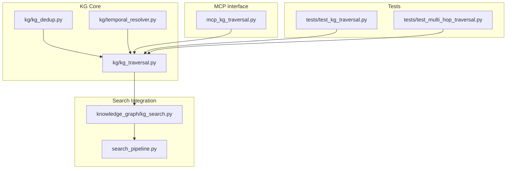
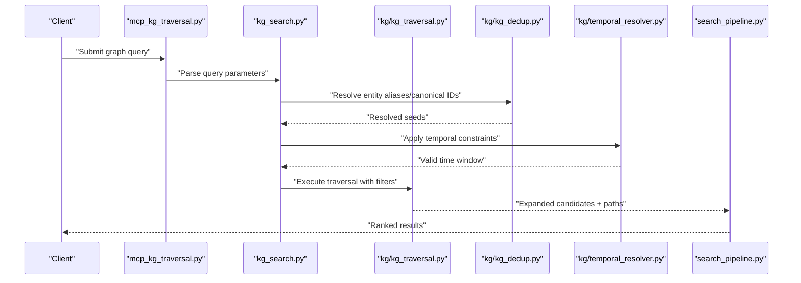
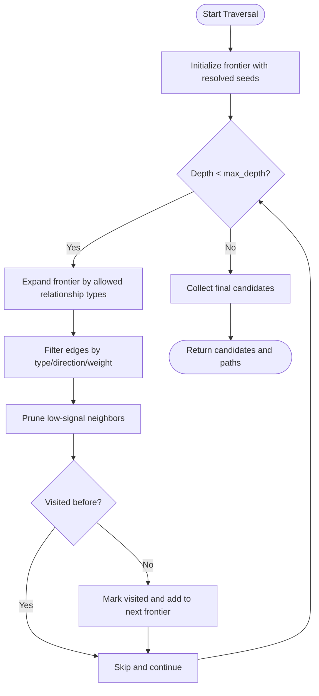
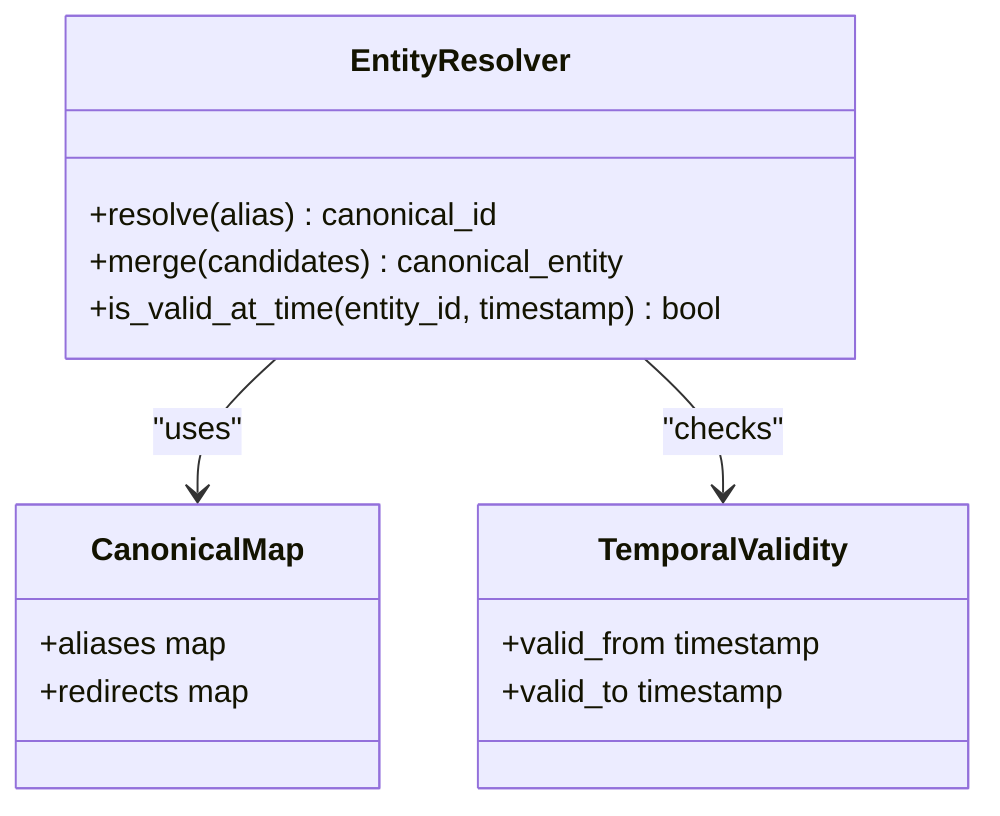
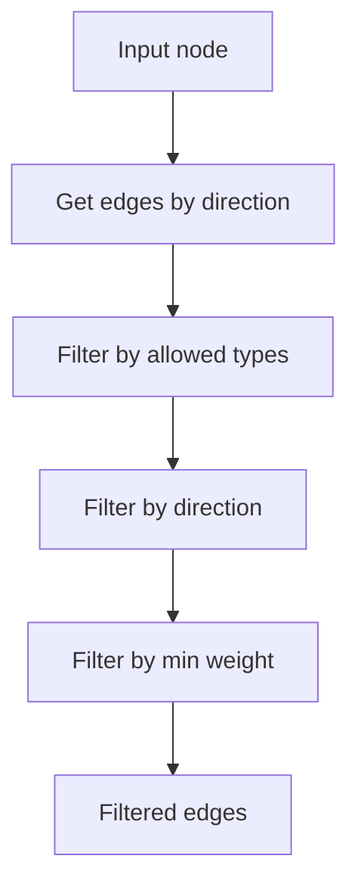
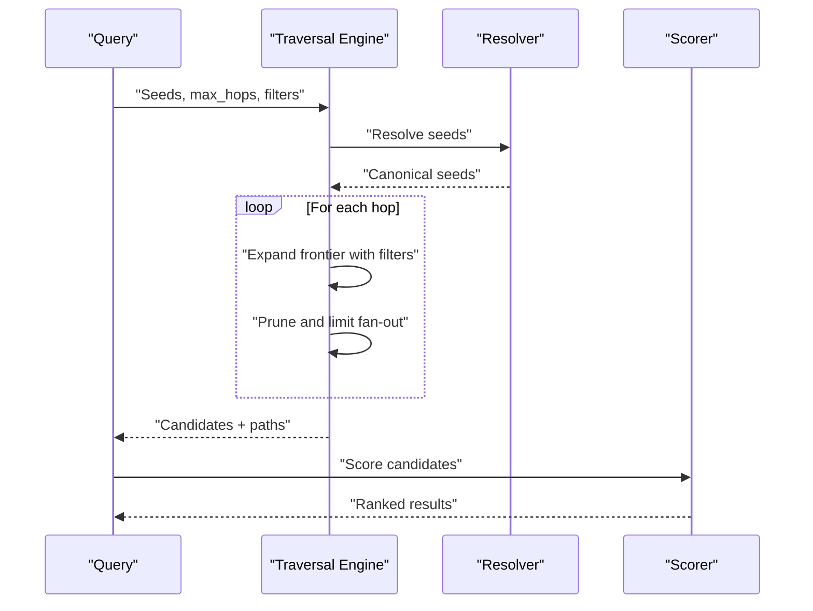
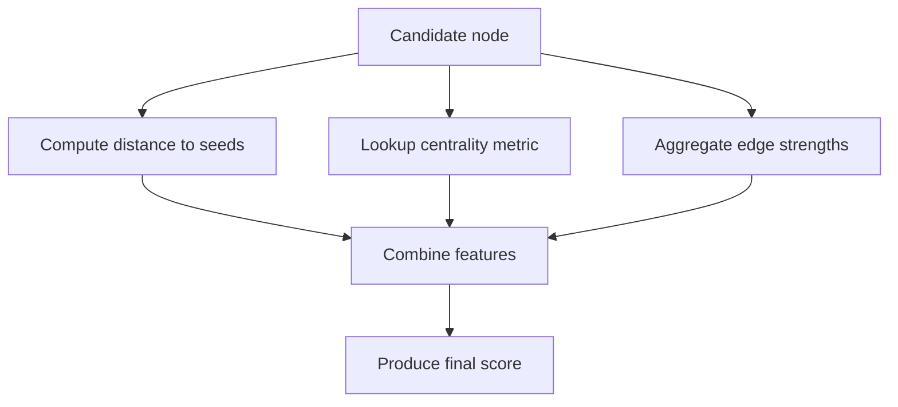
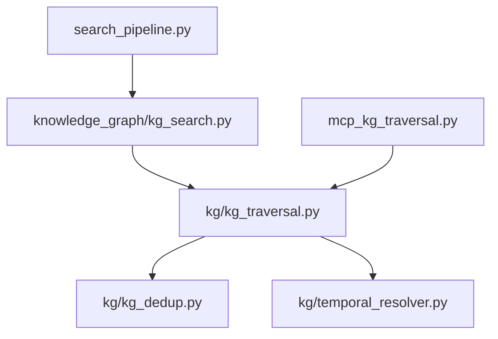
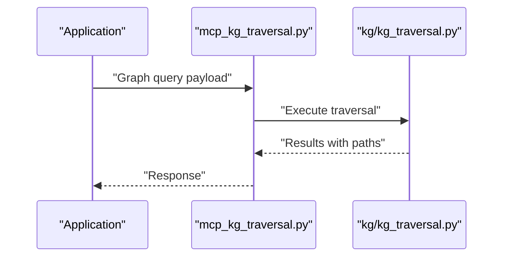

# Knowledge Graph Traversal

<cite>
**Referenced Files in This Document**
- [kg_traversal.py](file://kg/kg_traversal.py)
- [kg_search.py](file://knowledge_graph/kg_search.py)
- [kg_dedup.py](file://kg/kg_dedup.py)
- [temporal_resolver.py](file://kg/temporal_resolver.py)
- [test_kg_traversal.py](file://tests/test_kg_traversal.py)
- [test_multi_hop_traversal.py](file://tests/test_multi_hop_traversal.py)
- [search_pipeline.py](file://search_pipeline.py)
- [mcp_kg_traversal.py](file://mcp_kg_traversal.py)
</cite>

## Table of Contents
1. [Introduction](#introduction)
2. [Project Structure](#project-structure)
3. [Core Components](#core-components)
4. [Architecture Overview](#architecture-overview)
5. [Detailed Component Analysis](#detailed-component-analysis)
6. [Dependency Analysis](#dependency-analysis)
7. [Performance Considerations](#performance-considerations)
8. [Troubleshooting Guide](#troubleshooting-guide)
9. [Conclusion](#conclusion)
10. [Appendices](#appendices)

## Introduction
This document explains how knowledge graph traversal is implemented and used during retrieval. It covers entity resolution, relationship following algorithms, multi-hop traversal strategies, query interfaces, path finding, relevance scoring based on graph topology, configuration for depth limits and relationship filtering, and entity importance weighting. It also provides examples of complex queries that leverage graph relationships and explains how KG traversal enhances recall for conceptually related documents.

## Project Structure
The knowledge graph traversal functionality spans several modules:
- Core traversal logic and utilities
- Search integration and query parsing
- Entity deduplication and resolution
- Temporal-aware resolution
- Tests validating traversal behavior and multi-hop scenarios
- MCP interface exposing traversal operations to clients

**Diagram sources**
- [kg_traversal.py](file://kg/kg_traversal.py)
- [kg_dedup.py](file://kg/kg_dedup.py)
- [temporal_resolver.py](file://kg/temporal_resolver.py)
- [kg_search.py](file://knowledge_graph/kg_search.py)
- [search_pipeline.py](file://search_pipeline.py)
- [mcp_kg_traversal.py](file://mcp_kg_traversal.py)
- [test_kg_traversal.py](file://tests/test_kg_traversal.py)
- [test_multi_hop_traversal.py](file://tests/test_multi_hop_traversal.py)

**Section sources**
- [kg_traversal.py](file://kg/kg_traversal.py)
- [kg_search.py](file://knowledge_graph/kg_search.py)
- [kg_dedup.py](file://kg/kg_dedup.py)
- [temporal_resolver.py](file://kg/temporal_resolver.py)
- [search_pipeline.py](file://search_pipeline.py)
- [mcp_kg_traversal.py](file://mcp_kg_traversal.py)
- [test_kg_traversal.py](file://tests/test_kg_traversal.py)
- [test_multi_hop_traversal.py](file://tests/test_multi_hop_traversal.py)

## Core Components
- Traversal engine: Implements BFS/DFS with configurable depth, relationship type filters, and visited-set cycle prevention. Provides APIs to expand from seed entities and collect reachable nodes and edges.
- Entity resolution: Normalizes and merges equivalent entities using canonical IDs and alias maps; supports fuzzy matching and temporal validity windows.
- Relationship following: Enumerates outgoing/incoming edges by type, applies filters (allowed types, directionality), and optionally prunes low-weight edges.
- Multi-hop traversal: Iteratively expands frontier sets up to a maximum hop count, with pruning and caching to control cost.
- Relevance scoring: Combines topological signals (e.g., centrality, proximity to seeds, edge weights) with content scores to rank retrieved items.
- Query interface: Exposes a query language or structured parameters for specifying seeds, hops, relationship filters, and scoring options.

**Section sources**
- [kg_traversal.py](file://kg/kg_traversal.py)
- [kg_dedup.py](file://kg/kg_dedup.py)
- [kg_search.py](file://knowledge_graph/kg_search.py)
- [temporal_resolver.py](file://kg/temporal_resolver.py)

## Architecture Overview
The retrieval pipeline integrates KG traversal as an augmentation step. Queries are parsed into graph parameters, the traversal engine expands candidates, and results are scored and merged with other retrieval signals.

**Diagram sources**
- [mcp_kg_traversal.py](file://mcp_kg_traversal.py)
- [kg_search.py](file://knowledge_graph/kg_search.py)
- [kg_traversal.py](file://kg/kg_traversal.py)
- [kg_dedup.py](file://kg/kg_dedup.py)
- [temporal_resolver.py](file://kg/temporal_resolver.py)
- [search_pipeline.py](file://search_pipeline.py)

## Detailed Component Analysis

### Traversal Engine
- Algorithms: Breadth-first expansion with configurable max depth; optional DFS mode for deep exploration; visited set prevents cycles.
- Filters: Relationship type whitelist/blacklist, directionality (outgoing/incoming/both), weight thresholds.
- Expansion strategy: Frontier-based iteration with pruning of low-signal neighbors; supports per-edge-type limits to bound fan-out.
- Path tracking: Records shortest paths from seeds to discovered nodes for explainability and reranking.

**Diagram sources**
- [kg_traversal.py](file://kg/kg_traversal.py)

**Section sources**
- [kg_traversal.py](file://kg/kg_traversal.py)

### Entity Resolution
- Canonicalization: Maps aliases and variants to canonical IDs; maintains redirect tables for consistency.
- Deduplication: Merges near-duplicate entities using string similarity and contextual features; resolves conflicts deterministically.
- Temporal validity: Applies time-window constraints so only valid-at-time entities participate in traversal.

**Diagram sources**
- [kg_dedup.py](file://kg/kg_dedup.py)
- [temporal_resolver.py](file://kg/temporal_resolver.py)

**Section sources**
- [kg_dedup.py](file://kg/kg_dedup.py)
- [temporal_resolver.py](file://kg/temporal_resolver.py)

### Relationship Following and Filtering
- Edge enumeration: Retrieves outgoing/incoming edges for a node; supports multiple relationship types.
- Type filtering: Whitelist/blacklist of relationship types; directional constraints.
- Weight thresholding: Skips edges below a minimum weight to reduce noise.

**Diagram sources**
- [kg_traversal.py](file://kg/kg_traversal.py)

**Section sources**
- [kg_traversal.py](file://kg/kg_traversal.py)

### Multi-Hop Traversal Strategies
- Hop budgeting: Configurable maximum hops; early stopping when candidate set stabilizes or budget exhausted.
- Fan-out control: Per-type limits to prevent explosion; adaptive pruning based on edge weights and node importance.
- Path reconstruction: Maintains parent pointers to reconstruct shortest paths for explainability.

**Diagram sources**
- [kg_traversal.py](file://kg/kg_traversal.py)
- [kg_dedup.py](file://kg/kg_dedup.py)

**Section sources**
- [kg_traversal.py](file://kg/kg_traversal.py)

### Graph Query Language and Parameters
- Seed specification: One or more entity identifiers or names; supports alias resolution.
- Hop configuration: Maximum depth, per-type hop caps, and pruning thresholds.
- Relationship filters: Allowed types, directions, and minimum weights.
- Scoring options: Topology-only, hybrid with content, and custom feature composition.

Typical parameter groups include:
- Seeds: list of entity references
- Max hops: integer
- Relationship filters: object mapping type -> {direction, min_weight}
- Scoring: object with weights for proximity, centrality, edge strength

**Section sources**
- [kg_search.py](file://knowledge_graph/kg_search.py)
- [kg_traversal.py](file://kg/kg_traversal.py)

### Relevance Scoring Based on Graph Topology
- Proximity score: Inverse distance from nearest seed; shorter paths get higher scores.
- Centrality boost: Nodes with higher degree or betweenness receive a small additive boost.
- Edge strength aggregation: Sum or weighted average of incoming edge weights along the best path.
- Hybrid scoring: Combines topological score with content relevance (BM25/vector) via linear interpolation or learned weights.

**Diagram sources**
- [kg_traversal.py](file://kg/kg_traversal.py)
- [kg_search.py](file://knowledge_graph/kg_search.py)

**Section sources**
- [kg_traversal.py](file://kg/kg_traversal.py)
- [kg_search.py](file://knowledge_graph/kg_search.py)

### Configuration Options
Key configuration knobs typically available:
- max_hops: integer, default 2–3
- relationship_types: list of strings, default all
- direction: enum {outgoing, incoming, both}, default both
- min_edge_weight: float, default 0.0
- prune_threshold: float, default 0.0
- centrality_enabled: boolean, default true
- hybrid_weight: float in [0,1], default 0.5

These settings can be provided at query time or globally via configuration files.

**Section sources**
- [kg_search.py](file://knowledge_graph/kg_search.py)
- [kg_traversal.py](file://kg/kg_traversal.py)

### Examples of Complex Queries
- Two-hop discovery: Start from a person entity, follow “works_for” to organizations, then “located_in” to cities; filter by organization size and city population; return ranked documents mentioning those cities.
- Temporal reasoning: Resolve an entity valid at a specific date, traverse relationships within a time window, and retrieve documents authored after that date.
- Anti-cyclical expansion: Use visited sets and per-type hop caps to avoid loops while exploring dense communities.

These patterns improve recall by surfacing conceptually related documents that may not match the original keywords but are connected through meaningful relationships.

[No sources needed since this section provides conceptual examples]

## Dependency Analysis
The traversal system depends on entity resolution and temporal validity, and it integrates with the search pipeline for final ranking.

**Diagram sources**
- [kg_traversal.py](file://kg/kg_traversal.py)
- [kg_dedup.py](file://kg/kg_dedup.py)
- [temporal_resolver.py](file://kg/temporal_resolver.py)
- [kg_search.py](file://knowledge_graph/kg_search.py)
- [search_pipeline.py](file://search_pipeline.py)
- [mcp_kg_traversal.py](file://mcp_kg_traversal.py)

**Section sources**
- [kg_traversal.py](file://kg/kg_traversal.py)
- [kg_search.py](file://knowledge_graph/kg_search.py)
- [kg_dedup.py](file://kg/kg_dedup.py)
- [temporal_resolver.py](file://kg/temporal_resolver.py)
- [search_pipeline.py](file://search_pipeline.py)
- [mcp_kg_traversal.py](file://mcp_kg_traversal.py)

## Performance Considerations
- Control fan-out: Limit per-type neighbor counts and apply min_edge_weight to keep expansions tractable.
- Cache results: Memoize traversal outputs keyed by seeds, filters, and time windows to avoid recomputation.
- Early stopping: Stop expanding when candidate set converges or when marginal gain falls below a threshold.
- Indexing: Ensure adjacency lists and edge indices are optimized for fast lookups by node and relationship type.
- Parallelism: Expand independent branches concurrently where safe; synchronize visited sets carefully.

[No sources needed since this section provides general guidance]

## Troubleshooting Guide
Common issues and diagnostics:
- No results returned: Verify seed resolution and temporal validity; check relationship filters and min_edge_weight.
- Excessive runtime: Reduce max_hops, tighten relationship_type filters, increase prune_threshold.
- Duplicate candidates: Inspect deduplication rules and canonical mappings; ensure redirects are applied consistently.
- Unexpected cycles: Confirm visited set usage and per-type hop caps; review graph structure for self-loops.

Use tests to validate behavior:
- Unit tests for traversal correctness and cycle handling
- Multi-hop scenario tests for performance and result quality

**Section sources**
- [test_kg_traversal.py](file://tests/test_kg_traversal.py)
- [test_multi_hop_traversal.py](file://tests/test_multi_hop_traversal.py)

## Conclusion
Knowledge graph traversal augments retrieval by systematically following relationships from resolved entities, enabling recall of conceptually related documents beyond keyword matches. With careful configuration of depth limits, relationship filters, and scoring, traversal remains efficient and effective across diverse graphs.

[No sources needed since this section summarizes without analyzing specific files]

## Appendices

### API Surface for Clients
Clients interact with traversal via the MCP interface, which accepts structured query parameters and returns ranked candidates with paths.

**Diagram sources**
- [mcp_kg_traversal.py](file://mcp_kg_traversal.py)
- [kg_traversal.py](file://kg/kg_traversal.py)

**Section sources**
- [mcp_kg_traversal.py](file://mcp_kg_traversal.py)
- [kg_traversal.py](file://kg/kg_traversal.py)