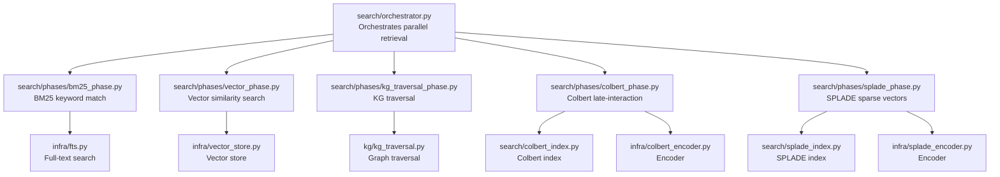
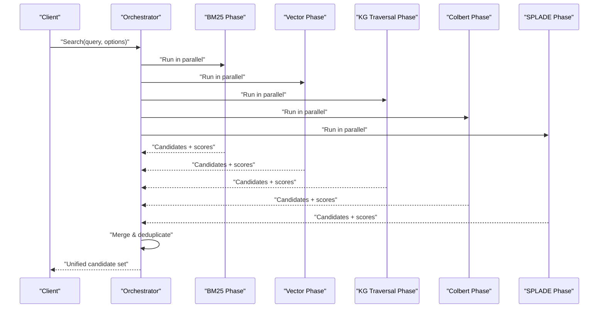
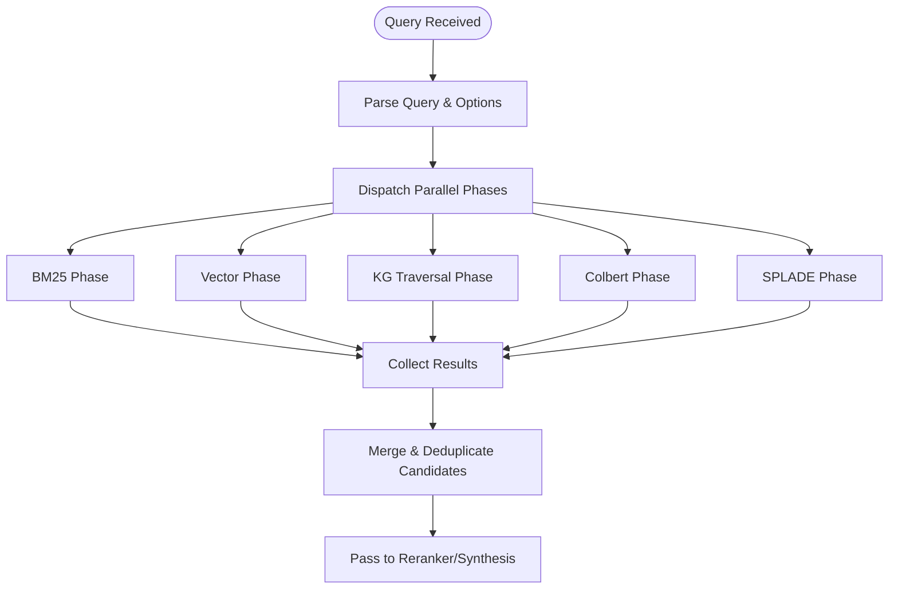
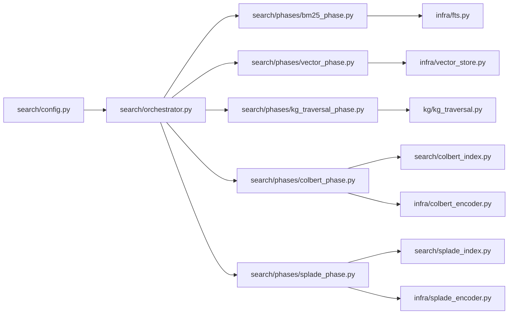

# Retrieval Phases

<cite>
**Referenced Files in This Document**
- [search/orchestrator.py](file://search/orchestrator.py)
- [search/phases/bm25_phase.py](file://search/phases/bm25_phase.py)
- [search/phases/vector_phase.py](file://search/phases/vector_phase.py)
- [search/phases/kg_traversal_phase.py](file://search/phases/kg_traversal_phase.py)
- [search/phases/colbert_phase.py](file://search/phases/colbert_phase.py)
- [search/phases/splade_phase.py](file://search/phases/splade_phase.py)
- [search/config.py](file://search/config.py)
- [search/chunk_index.py](file://search/chunk_index.py)
- [search/colbert_index.py](file://search/colbert_index.py)
- [search/splade_index.py](file://search/splade_index.py)
- [kg/kg_traversal.py](file://kg/kg_traversal.py)
- [infra/fts.py](file://infra/fts.py)
- [infra/vector_store.py](file://infra/vector_store.py)
- [infra/colbert_encoder.py](file://infra/colbert_encoder.py)
- [infra/splade_encoder.py](file://infra/splade_encoder.py)
</cite>

## Table of Contents
1. [Introduction](#introduction)
2. [Project Structure](#project-structure)
3. [Core Components](#core-components)
4. [Architecture Overview](#architecture-overview)
5. [Detailed Component Analysis](#detailed-component-analysis)
6. [Dependency Analysis](#dependency-analysis)
7. [Performance Considerations](#performance-considerations)
8. [Troubleshooting Guide](#troubleshooting-guide)
9. [Conclusion](#conclusion)

## Introduction
This document explains the multi-modal retrieval phases that run in parallel to gather candidate documents for a query. It covers:
- BM25 keyword matching over full-text search indexes
- Vector similarity search using dense embeddings
- Knowledge graph traversal for entity relationships and context expansion
- Specialized sparse/late-interaction indexes such as SPLADE and Colbert

It also details how each strategy contributes distinct relevance signals, how they complement one another, and how configuration controls index selection, parameter tuning, and fallback behavior when specific indexes are unavailable.

## Project Structure
The retrieval pipeline is orchestrated by a central orchestrator that dispatches multiple retrieval phases concurrently. Each phase targets a different index or data source and returns a ranked list of candidates with scores. The orchestrator merges these results into a unified candidate set for downstream reranking and synthesis.

**Diagram sources**
- [search/orchestrator.py](file://search/orchestrator.py)
- [search/phases/bm25_phase.py](file://search/phases/bm25_phase.py)
- [search/phases/vector_phase.py](file://search/phases/vector_phase.py)
- [search/phases/kg_traversal_phase.py](file://search/phases/kg_traversal_phase.py)
- [search/phases/colbert_phase.py](file://search/phases/colbert_phase.py)
- [search/phases/splade_phase.py](file://search/phases/splade_phase.py)
- [infra/fts.py](file://infra/fts.py)
- [infra/vector_store.py](file://infra/vector_store.py)
- [search/colbert_index.py](file://search/colbert_index.py)
- [search/splade_index.py](file://search/splade_index.py)
- [infra/colbert_encoder.py](file://infra/colbert_encoder.py)
- [infra/splade_encoder.py](file://infra/splade_encoder.py)
- [kg/kg_traversal.py](file://kg/kg_traversal.py)

**Section sources**
- [search/orchestrator.py](file://search/orchestrator.py)
- [search/config.py](file://search/config.py)

## Core Components
- Orchestrator: Initializes and runs all configured retrieval phases concurrently, collects partial results, and merges them into a single candidate pool.
- Phase interface: Each retrieval phase implements a common contract (e.g., name, parameters, execution, result schema) so the orchestrator can call them uniformly.
- Index backends:
  - Full-text search (BM25) via an FTS backend
  - Dense vector similarity via a vector store
  - Sparse token-weighted vectors via SPLADE
  - Late-interaction token-level matching via Colbert
  - Knowledge graph traversal for relational recall

Key responsibilities:
- Parameter validation and defaults from configuration
- Graceful handling of missing or degraded indexes
- Returning normalized candidate objects with scores and metadata for merging

**Section sources**
- [search/orchestrator.py](file://search/orchestrator.py)
- [search/config.py](file://search/config.py)

## Architecture Overview
The retrieval architecture emphasizes diversity and robustness:
- Parallelism: All phases execute concurrently to minimize latency.
- Diversity: Each phase captures different aspects of relevance (lexical, semantic, structural).
- Resilience: Missing or slow indexes fall back gracefully without failing the entire query.
- Extensibility: New phases can be added by implementing the standard interface and registering them.

**Diagram sources**
- [search/orchestrator.py](file://search/orchestrator.py)
- [search/phases/bm25_phase.py](file://search/phases/bm25_phase.py)
- [search/phases/vector_phase.py](file://search/phases/vector_phase.py)
- [search/phases/kg_traversal_phase.py](file://search/phases/kg_traversal_phase.py)
- [search/phases/colbert_phase.py](file://search/phases/colbert_phase.py)
- [search/phases/splade_phase.py](file://search/phases/splade_phase.py)

## Detailed Component Analysis

### BM25 Keyword Matching
Purpose:
- High precision for exact lexical matches and phrase queries
- Fast and deterministic scoring based on term frequency and inverse document frequency

How it works:
- Tokenizes the query and applies BM25 scoring against the full-text index
- Supports filters (e.g., time windows, tags) and boosting fields if provided

Relevance signal:
- Strong for exact terms, acronyms, IDs, and domain-specific jargon
- Complements semantic methods by capturing literal matches that embeddings may dilute

Configuration highlights:
- Enable/disable BM25
- Top-k per phase
- Field boosts and filters
- Minimum score threshold

Fallback behavior:
- If the FTS index is unavailable, the phase returns no results and the orchestrator continues other phases

**Section sources**
- [search/phases/bm25_phase.py](file://search/phases/bm25_phase.py)
- [infra/fts.py](file://infra/fts.py)
- [search/config.py](file://search/config.py)

### Vector Similarity Search with Embeddings
Purpose:
- Semantic recall across paraphrases, synonyms, and conceptual similarity
- Captures meaning beyond surface tokens

How it works:
- Encodes the query into a dense embedding
- Performs approximate nearest neighbor search in the vector store
- Returns top-k candidates with cosine or inner-product similarity

Relevance signal:
- Broad recall for conceptually related content
- Effective for natural language questions and descriptive queries

Configuration highlights:
- Enable/disable vector search
- Distance metric selection
- Top-k per phase
- Index version/model tracking for drift detection

Fallback behavior:
- If the vector store is unavailable or empty, the phase yields no results; other phases continue

**Section sources**
- [search/phases/vector_phase.py](file://search/phases/vector_phase.py)
- [infra/vector_store.py](file://infra/vector_store.py)
- [search/config.py](file://search/config.py)

### Knowledge Graph Traversal for Entity Relationships
Purpose:
- Expand recall through explicit entity links and relationships
- Surface contextually relevant documents connected to entities in the query

How it works:
- Extracts entities from the query (or uses provided hints)
- Traverses edges up to configurable depth to find related nodes
- Materializes candidate memories/documents associated with those nodes

Relevance signal:
- Structural and relational relevance, especially for named entities, organizations, and concepts
- Bridges gaps where lexical or semantic similarity is weak

Configuration highlights:
- Max depth and breadth
- Edge types to include/exclude
- Entity extraction mode (heuristic vs. model-based)
- Candidate limit per traversal branch

Fallback behavior:
- If KG is not available or traversal yields no hits, the phase completes with no results

**Section sources**
- [search/phases/kg_traversal_phase.py](file://search/phases/kg_traversal_phase.py)
- [kg/kg_traversal.py](file://kg/kg_traversal.py)
- [search/config.py](file://search/config.py)

### Colbert (Late Interaction) Index
Purpose:
- Token-level late interaction between query and passage for fine-grained relevance
- Improves precision over coarse vector similarity while retaining scalability

How it works:
- Encodes query tokens and passage tokens independently
- Computes cross-similarity at the token level and aggregates to a passage score
- Uses a dedicated Colbert index for efficient retrieval

Relevance signal:
- Precise alignment of key terms and phrases
- Particularly strong for technical documents and mixed terminology

Configuration highlights:
- Enable/disable Colbert
- Number of query tokens considered
- Passage chunk size and overlap
- Top-k per phase

Fallback behavior:
- If the Colbert index is missing or encoder unavailable, the phase skips gracefully

**Section sources**
- [search/phases/colbert_phase.py](file://search/phases/colbert_phase.py)
- [search/colbert_index.py](file://search/colbert_index.py)
- [infra/colbert_encoder.py](file://infra/colbert_encoder.py)
- [search/config.py](file://search/config.py)

### SPLADE (Sparse Vectors) Index
Purpose:
- Learnable sparse representations that capture important terms and weights
- Balances efficiency and expressiveness compared to pure BM25

How it works:
- Encodes the query into a sparse vector with learned term weights
- Matches against precomputed sparse indices using dot product or weighted overlap
- Often complements BM25 by emphasizing task-relevant terms

Relevance signal:
- Adaptive weighting of terms beyond raw frequency
- Helps when certain keywords carry more semantic importance than others

Configuration highlights:
- Enable/disable SPLADE
- Sparsity threshold and max non-zero terms
- Top-k per phase
- Index rebuild policy when models change

Fallback behavior:
- If the SPLADE index is absent or encoder fails, the phase returns no results

**Section sources**
- [search/phases/splade_phase.py](file://search/phases/splade_phase.py)
- [search/splade_index.py](file://search/splade_index.py)
- [infra/splade_encoder.py](file://infra/splade_encoder.py)
- [search/config.py](file://search/config.py)

### Conceptual Overview

[No sources needed since this diagram shows conceptual workflow, not actual code structure]

## Dependency Analysis
Retrieval phases depend on their respective backends and shared configuration. The orchestrator coordinates concurrency and result aggregation.

**Diagram sources**
- [search/config.py](file://search/config.py)
- [search/orchestrator.py](file://search/orchestrator.py)
- [search/phases/bm25_phase.py](file://search/phases/bm25_phase.py)
- [search/phases/vector_phase.py](file://search/phases/vector_phase.py)
- [search/phases/kg_traversal_phase.py](file://search/phases/kg_traversal_phase.py)
- [search/phases/colbert_phase.py](file://search/phases/colbert_phase.py)
- [search/phases/splade_phase.py](file://search/phases/splade_phase.py)
- [infra/fts.py](file://infra/fts.py)
- [infra/vector_store.py](file://infra/vector_store.py)
- [search/colbert_index.py](file://search/colbert_index.py)
- [search/splade_index.py](file://search/splade_index.py)
- [infra/colbert_encoder.py](file://infra/colbert_encoder.py)
- [infra/splade_encoder.py](file://infra/splade_encoder.py)
- [kg/kg_traversal.py](file://kg/kg_traversal.py)

**Section sources**
- [search/orchestrator.py](file://search/orchestrator.py)
- [search/config.py](file://search/config.py)

## Performance Considerations
- Parallel execution reduces end-to-end latency but increases resource usage; tune concurrency limits based on workload.
- Prefer enabling only necessary phases to balance recall and cost.
- Use appropriate top-k values per phase to avoid overwhelming downstream stages.
- Monitor index health and rebuild schedules for SPLADE and Colbert to maintain accuracy.
- Cache frequent queries and reuse embeddings where possible to reduce repeated computation.

[No sources needed since this section provides general guidance]

## Troubleshooting Guide
Common issues and resolutions:
- Missing indexes:
  - Symptom: A phase returns no results.
  - Action: Verify index availability and rebuild if needed; ensure encoder dependencies are installed.
- Degraded performance:
  - Symptom: High latency or timeouts.
  - Action: Reduce top-k, disable heavy phases (e.g., Colbert), and check resource utilization.
- Model drift:
  - Symptom: Declining quality over time.
  - Action: Rebuild SPLADE/Colbert indexes after model updates; verify vector store index versions.
- Configuration errors:
  - Symptom: Invalid parameters or unexpected behavior.
  - Action: Validate configuration keys and ranges; consult config reference.

**Section sources**
- [search/config.py](file://search/config.py)
- [search/orchestrator.py](file://search/orchestrator.py)

## Conclusion
The multi-modal retrieval system combines complementary strategies—BM25, vector similarity, knowledge graph traversal, SPLADE, and Colbert—to maximize recall and precision. By running these phases in parallel and merging their outputs, the system delivers robust candidate sets suitable for downstream reranking and synthesis. Careful configuration and fallback mechanisms ensure resilience and adaptability across diverse workloads and environments.