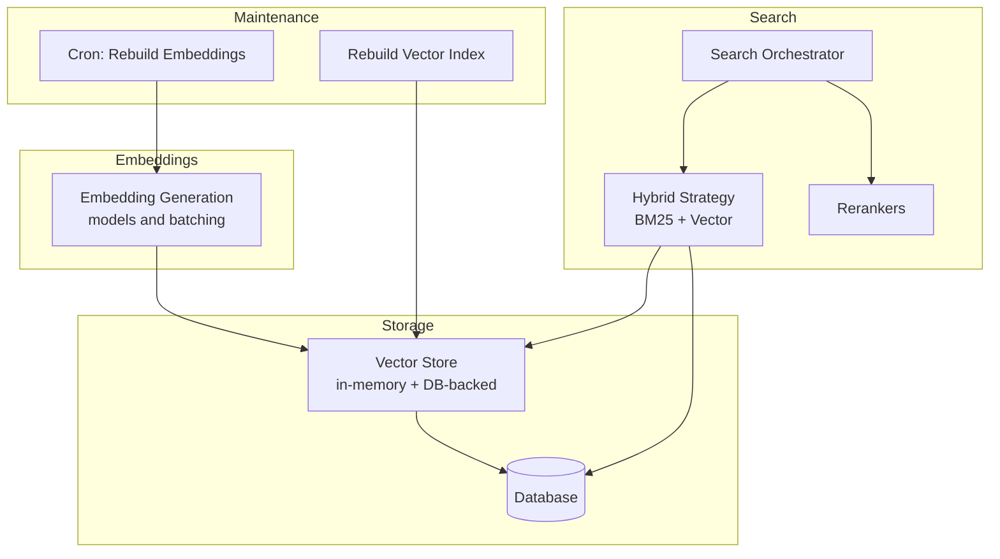
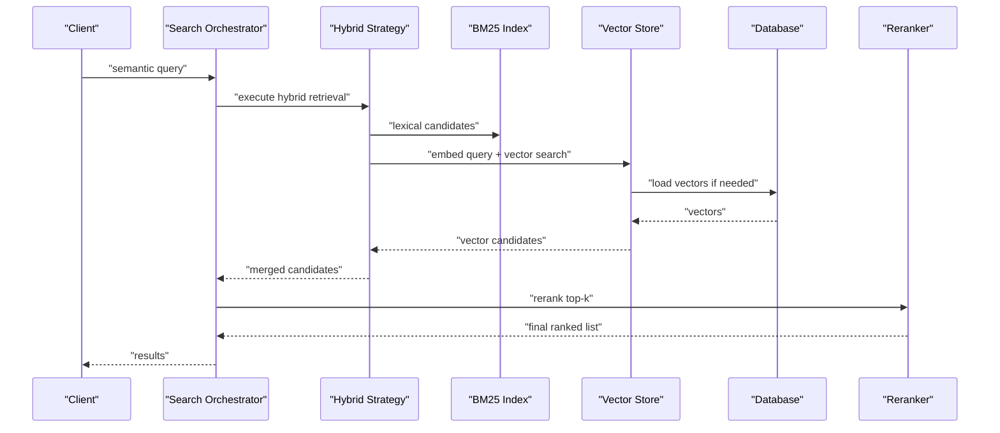
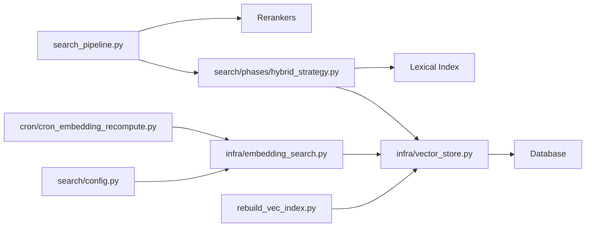

# Vector Similarity Search

<cite>
**Referenced Files in This Document**
- [vector_store.py](file://vector_store.py)
- [embedding_search.py](file://embedding_search.py)
- [search_pipeline.py](file://search_pipeline.py)
- [infra/vector_store.py](file://infra/vector_store.py)
- [infra/embedding_search.py](file://infra/embedding_search.py)
- [save/indexers.py](file://save/indexers.py)
- [search/phases/vec_index.py](file://search/phases/vec_index.py)
- [search/phases/hybrid_strategy.py](file://search/phases/hybrid_strategy.py)
- [search/config.py](file://search/config.py)
- [migrations/002_memory_embeddings.sql](file://migrations/002_memory_embeddings.sql)
- [migrations/004_memory_vec_idx.sql](file://migrations/004_memory_vec_idx.sql)
- [migrations/024_chunk_embeddings.sql](file://migrations/024_chunk_embeddings.sql)
- [migrations/058_colbert_tokens.sql](file://migrations/058_colbert_tokens.sql)
- [migrations/059_splade_index.sql](file://migrations/059_splade_index.sql)
- [cron/cron_embedding_recompute.py](file://cron/cron_embedding_recompute.py)
- [rebuild_vec_index.py](file://rebuild_vec_index.py)
- [eval/retrieval_benchmark.py](file://eval/retrieval_benchmark.py)
</cite>

## Table of Contents
1. [Introduction](#introduction)
2. [Project Structure](#project-structure)
3. [Core Components](#core-components)
4. [Architecture Overview](#architecture-overview)
5. [Detailed Component Analysis](#detailed-component-analysis)
6. [Dependency Analysis](#dependency-analysis)
7. [Performance Considerations](#performance-considerations)
8. [Troubleshooting Guide](#troubleshooting-guide)
9. [Conclusion](#conclusion)
10. [Appendices](#appendices)

## Introduction
This document explains the vector similarity search implementation, covering embedding generation, storage strategies, and similarity computation methods such as cosine similarity and dot product. It also documents vector index types, dimensionality considerations, performance optimization techniques, configuration for embedding models, batch processing settings, and fallback mechanisms when vector indexes are unavailable. Finally, it provides examples of semantic search queries and clarifies how embeddings capture contextual meaning beyond keywords.

## Project Structure
The vector search capability spans several modules:
- Embedding generation and model configuration
- Vector storage and indexing (in-memory and persistent)
- Search orchestration with hybrid retrieval and reranking
- Background jobs to maintain indices and recompute embeddings
- Database schema for storing vectors and tokens
- Benchmarks and tests validating behavior

[No sources needed since this diagram shows conceptual workflow, not actual code structure]

## Core Components
- Embedding generation: Converts text into dense vectors using configured models; supports batching and caching to reduce latency and cost.
- Vector storage: Persists vectors alongside metadata; supports both in-memory structures for low-latency reads and database-backed persistence for durability.
- Similarity computation: Implements cosine similarity and dot product; selects strategy based on configuration and normalization state.
- Index management: Builds and maintains vector indices; supports rebuilds and incremental updates.
- Search orchestration: Combines lexical (BM25) and vector retrieval via a hybrid strategy; applies rerankers for final ordering.
- Fallback mechanisms: Gracefully degrades to lexical-only retrieval when vector indexes are unavailable or disabled.

**Section sources**
- [vector_store.py](file://vector_store.py)
- [infra/vector_store.py](file://infra/vector_store.py)
- [embedding_search.py](file://embedding_search.py)
- [infra/embedding_search.py](file://infra/embedding_search.py)
- [search/phases/hybrid_strategy.py](file://search/phases/hybrid_strategy.py)
- [search/config.py](file://search/config.py)

## Architecture Overview
The system integrates embedding generation, vector storage, and search orchestration. During ingestion, texts are chunked and embedded; vectors are stored in memory and persisted to the database. At query time, the orchestrator runs BM25 and vector searches, merges results, and optionally reranks them. If vector indexes are missing or disabled, the pipeline falls back to BM25-only retrieval.

**Diagram sources**
- [search_pipeline.py](file://search_pipeline.py)
- [search/phases/hybrid_strategy.py](file://search/phases/hybrid_strategy.py)
- [infra/vector_store.py](file://infra/vector_store.py)
- [migrations/004_memory_vec_idx.sql](file://migrations/004_memory_vec_idx.sql)

**Section sources**
- [search_pipeline.py](file://search_pipeline.py)
- [search/phases/hybrid_strategy.py](file://search/phases/hybrid_strategy.py)
- [infra/vector_store.py](file://infra/vector_store.py)

## Detailed Component Analysis

### Embedding Generation and Configuration
- Model selection and parameters are configured centrally; the same configuration is used during ingestion and query-time embedding.
- Batching reduces API calls and improves throughput; configurable batch sizes balance latency and resource usage.
- Caching avoids redundant computations for identical inputs.

Key responsibilities:
- Normalize or scale vectors depending on chosen similarity metric.
- Track embedding model versions for reproducibility and drift detection.

Configuration highlights:
- Embedding model identifier and provider-specific options.
- Batch size and concurrency limits.
- Whether to normalize vectors for cosine similarity.

**Section sources**
- [search/config.py](file://search/config.py)
- [embedding_search.py](file://embedding_search.py)
- [infra/embedding_search.py](file://infra/embedding_search.py)

### Vector Storage Strategies
Two primary strategies coexist:
- In-memory store: Low-latency access for active workloads; suitable for single-process deployments.
- Database-backed store: Durable persistence across restarts; supports large corpora and multi-process access.

Storage features:
- Upsert operations to add or update vectors with associated metadata.
- Efficient retrieval by ID or nearest neighbors.
- Optional token-level storage for advanced retrieval modes (e.g., ColBERT).

Schema elements:
- Memory embeddings table for dense vectors.
- Dedicated vector index tables for fast ANN-like operations.
- Chunk embeddings and token tables for fine-grained retrieval.

**Section sources**
- [vector_store.py](file://vector_store.py)
- [infra/vector_store.py](file://infra/vector_store.py)
- [migrations/002_memory_embeddings.sql](file://migrations/002_memory_embeddings.sql)
- [migrations/004_memory_vec_idx.sql](file://migrations/004_memory_vec_idx.sql)
- [migrations/024_chunk_embeddings.sql](file://migrations/024_chunk_embeddings.sql)
- [migrations/058_colbert_tokens.sql](file://migrations/058_colbert_tokens.sql)

### Similarity Computation Methods
- Cosine similarity: Measures angle between vectors; often preferred when vectors are normalized.
- Dot product: Equivalent to cosine similarity on normalized vectors; can be faster when normalization is pre-applied.

Implementation notes:
- Metric choice depends on configuration and whether vectors are normalized.
- Normalization step ensures consistent behavior across models and batches.

**Section sources**
- [search/config.py](file://search/config.py)
- [infra/vector_store.py](file://infra/vector_store.py)

### Vector Index Types and Dimensionality
Index types:
- Dense vector index for approximate nearest neighbor search.
- Token-level index for late-interaction retrieval (e.g., ColBERT), enabling more precise matching at higher compute cost.

Dimensionality considerations:
- Vector dimension must match the selected embedding model.
- Larger dimensions improve expressiveness but increase storage and compute costs.
- Consistency checks prevent mismatches between model output and index expectations.

**Section sources**
- [migrations/004_memory_vec_idx.sql](file://migrations/004_memory_vec_idx.sql)
- [migrations/058_colbert_tokens.sql](file://migrations/058_colbert_tokens.sql)
- [search/config.py](file://search/config.py)

### Search Orchestration and Hybrid Retrieval
The orchestrator coordinates multiple phases:
- Lexical retrieval (BM25) for keyword recall.
- Vector retrieval for semantic recall.
- Candidate merging and deduplication.
- Optional reranking for precision improvement.

Fallback behavior:
- If vector indexes are unavailable or disabled, the pipeline uses BM25-only retrieval without errors.

**Section sources**
- [search_pipeline.py](file://search_pipeline.py)
- [search/phases/hybrid_strategy.py](file://search/phases/hybrid_strategy.py)

### Maintenance and Rebuilds
Background tasks ensure indices remain current:
- Recalculate embeddings when models change or data drifts.
- Rebuild vector indexes after schema changes or corruption recovery.

Operational hooks:
- Cron job triggers embedding recomputation.
- CLI tool rebuilds vector index on demand.

**Section sources**
- [cron/cron_embedding_recompute.py](file://cron/cron_embedding_recompute.py)
- [rebuild_vec_index.py](file://rebuild_vec_index.py)

### Examples of Semantic Search Queries
Semantic queries leverage embeddings to capture intent and context:
- “How do I configure rate limiting for the background worker?”
- “What changed in the last week regarding tenant isolation?”
- “Show me recent discussions about GDPR erasure flows.”

These queries benefit from contextual understanding beyond exact keyword matches, improving recall for paraphrased or conceptually related content.

[No sources needed since this section doesn't analyze specific files]

## Dependency Analysis
The following diagram maps key dependencies among core components involved in vector similarity search.

**Diagram sources**
- [search/config.py](file://search/config.py)
- [infra/embedding_search.py](file://infra/embedding_search.py)
- [infra/vector_store.py](file://infra/vector_store.py)
- [search_pipeline.py](file://search_pipeline.py)
- [search/phases/hybrid_strategy.py](file://search/phases/hybrid_strategy.py)
- [cron/cron_embedding_recompute.py](file://cron/cron_embedding_recompute.py)
- [rebuild_vec_index.py](file://rebuild_vec_index.py)

**Section sources**
- [search/config.py](file://search/config.py)
- [infra/embedding_search.py](file://infra/embedding_search.py)
- [infra/vector_store.py](file://infra/vector_store.py)
- [search_pipeline.py](file://search_pipeline.py)
- [search/phases/hybrid_strategy.py](file://search/phases/hybrid_strategy.py)
- [cron/cron_embedding_recompute.py](file://cron/cron_embedding_recompute.py)
- [rebuild_vec_index.py](file://rebuild_vec_index.py)

## Performance Considerations
- Batch embedding generation: Increase batch size to amortize overhead while monitoring memory and latency constraints.
- Vector normalization: Pre-normalize vectors when using cosine similarity to enable dot product acceleration.
- Index tuning: Adjust index parameters (e.g., number of partitions or probes) to balance recall and latency.
- Hybrid weighting: Tune the contribution of BM25 vs. vector scores to optimize precision-recall trade-offs.
- Reranking budget: Limit reranker input size to control latency; use coarse-to-fine ranking stages.
- Caching: Cache frequent embeddings and query results to reduce repeated computation.
- Schema alignment: Ensure vector dimensions match model outputs to avoid runtime errors and wasted compute.

[No sources needed since this section provides general guidance]

## Troubleshooting Guide
Common issues and resolutions:
- Missing vector index: The pipeline falls back to BM25-only retrieval; verify index availability and rebuild if necessary.
- Dimension mismatch: Confirm that the embedding model’s output dimension matches the index configuration; rebuild index after model changes.
- Stale embeddings: Run the embedding recomputation cron or manual rebuild to refresh vectors after model updates.
- High latency: Reduce reranker input size, increase cache hit rates, or adjust batch sizes.

Operational tools:
- Rebuild vector index on demand.
- Trigger embedding recomputation via cron or CLI.

**Section sources**
- [rebuild_vec_index.py](file://rebuild_vec_index.py)
- [cron/cron_embedding_recompute.py](file://cron/cron_embedding_recompute.py)
- [search/phases/hybrid_strategy.py](file://search/phases/hybrid_strategy.py)

## Conclusion
The vector similarity search implementation combines robust embedding generation, flexible storage strategies, and efficient similarity computation within a hybrid retrieval pipeline. With configurable metrics, index types, and maintenance workflows, it delivers scalable semantic search with graceful fallbacks and strong operational controls.

[No sources needed since this section summarizes without analyzing specific files]

## Appendices

### Configuration Reference
- Embedding model: Identifier and provider-specific options.
- Similarity metric: Cosine similarity or dot product; normalization behavior.
- Batch size: Controls embedding throughput and memory usage.
- Hybrid weights: Relative importance of BM25 vs. vector retrieval.
- Reranker settings: Top-k input size and scoring parameters.

**Section sources**
- [search/config.py](file://search/config.py)

### Data Models and Schema
- Memory embeddings: Stores dense vectors per memory item.
- Vector index tables: Optimized structures for fast nearest neighbor search.
- Chunk embeddings and tokens: Support fine-grained retrieval and late interaction.

**Section sources**
- [migrations/002_memory_embeddings.sql](file://migrations/002_memory_embeddings.sql)
- [migrations/004_memory_vec_idx.sql](file://migrations/004_memory_vec_idx.sql)
- [migrations/024_chunk_embeddings.sql](file://migrations/024_chunk_embeddings.sql)
- [migrations/058_colbert_tokens.sql](file://migrations/058_colbert_tokens.sql)

### Evaluation and Benchmarks
- Retrieval benchmarking scripts validate recall and latency under different configurations.
- Use benchmarks to compare hybrid vs. vector-only vs. BM25-only strategies.

**Section sources**
- [eval/retrieval_benchmark.py](file://eval/retrieval_benchmark.py)