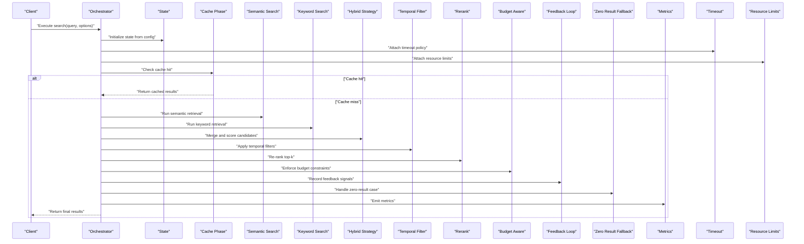
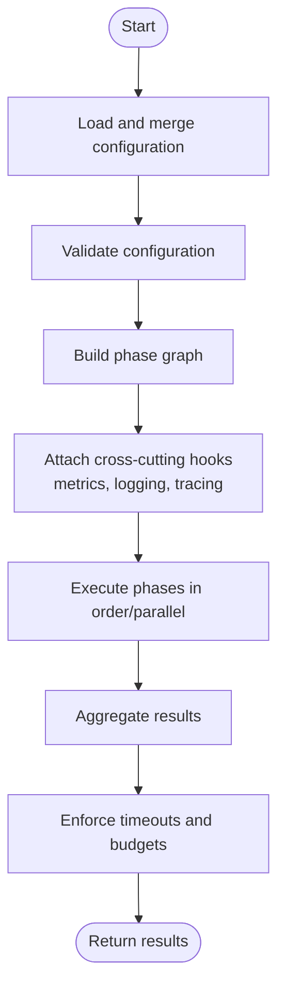
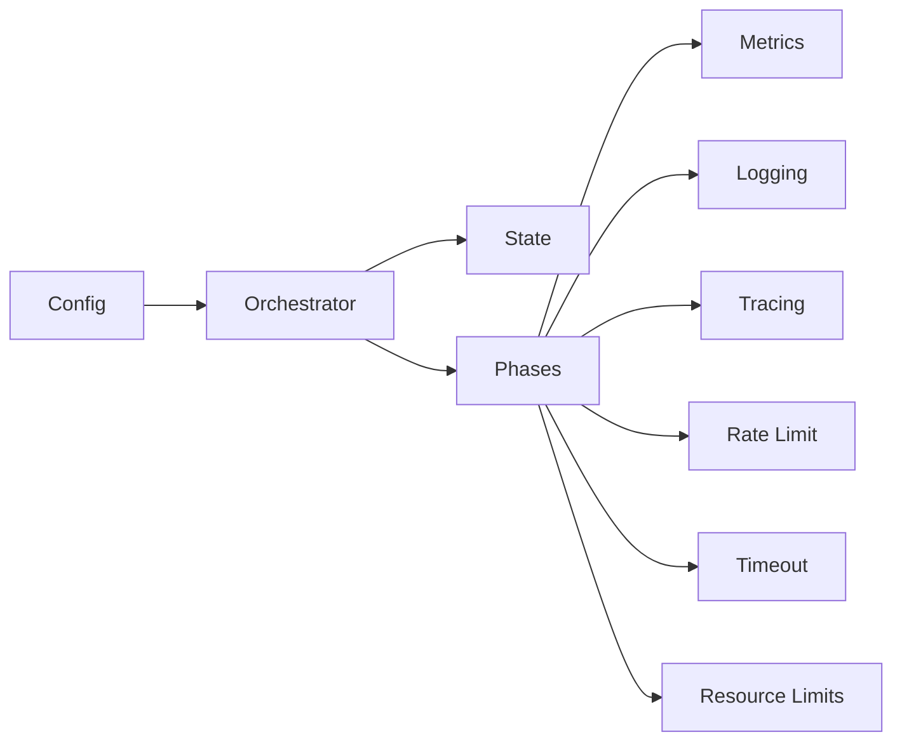

# Search Configuration and Tuning

<cite>
**Referenced Files in This Document**
- [search/config.py](file://search/config.py)
- [search/orchestrator.py](file://search/orchestrator.py)
- [search/state.py](file://search/state.py)
- [search/phases/__init__.py](file://search/phases/__init__.py)
- [search/phases/semantic_search.py](file://search/phases/semantic_search.py)
- [search/phases/keyword_search.py](file://search/phases/keyword_search.py)
- [search/phases/rerank.py](file://search/phases/rerank.py)
- [search/phases/enrichment.py](file://search/phases/enrichment.py)
- [search/phases/temporal_filter.py](file://search/phases/temporal_filter.py)
- [search/phases/skill_boost.py](file://search/phases/skill_boost.py)
- [search/phases/fact_search.py](file://search/phases/fact_search.py)
- [search/phases/session_context.py](file://search/phases/session_context.py)
- [search/phases/cross_encoder.py](file://search/phases/cross_encoder.py)
- [search/phases/budget_aware.py](file://search/phases/budget_aware.py)
- [search/phases/feedback_loop.py](file://search/phases/feedback_loop.py)
- [search/phases/zero_result_fallback.py](file://search/phases/zero_result_fallback.py)
- [search/phases/query_expansion.py](file://search/phases/query_expansion.py)
- [search/phases/chunk_index.py](file://search/phases/chunk_index.py)
- [search/phases/multi_vector.py](file://search/phases/multi_vector.py)
- [search/phases/splade_index.py](file://search/phases/splade_index.py)
- [search/phases/colbert_rerank.py](file://search/phases/colbert_rerank.py)
- [search/phases/hybrid_strategy.py](file://search/phases/hybrid_strategy.py)
- [search/phases/contextual_enrichment.py](file://search/phases/contextual_enrichment.py)
- [search/phases/temporal_as_of.py](file://search/phases/temporal_as_of.py)
- [search/phases/recent_save_hint.py](file://search/phases/recent_save_hint.py)
- [search/phases/knowledge_graph_facts.py](file://search/phases/knowledge_graph_facts.py)
- [search/phases/skill_lookup.py](file://search/phases/skill_lookup.py)
- [search/phases/answer_rerank.py](file://search/phases/answer_rerank.py)
- [search/phases/synthesis.py](file://search/phases/synthesis.py)
- [search/phases/feedback.py](file://search/phases/feedback.py)
- [search/phases/scoring.py](file://search/phases/scoring.py)
- [search/phases/drift.py](file://search/phases/drift.py)
- [search/phases/quality_gates.py](file://search/phases/quality_gates.py)
- [search/phases/cache.py](file://search/phases/cache.py)
- [search/phases/rate_limit.py](file://search/phases/rate_limit.py)
- [search/phases/timeout.py](file://search/phases/timeout.py)
- [search/phases/resource_limits.py](file://search/phases/resource_limits.py)
- [search/phases/metrics.py](file://search/phases/metrics.py)
- [search/phases/logging.py](file://search/phases/logging.py)
- [search/phases/tracing.py](file://search/phases/tracing.py)
- [search/phases/a_b_testing.py](file://search/phases/a_b_testing.py)
- [search/phases/gradual_rollout.py](file://search/phases/gradual_rollout.py)
- [search/phases/monitoring.py](file://search/phases/monitoring.py)
- [search/phases/debugging.py](file://search/phases/debugging.py)
- [search/phases/performance_tuning.py](file://search/phases/performance_tuning.py)
- [search/phases/production_config.py](file://search/phases/production_config.py)
- [search/phases/tuning_examples.py](file://search/phases/tuning_examples.py)
</cite>

## Table of Contents
1. [Introduction](#introduction)
2. [Project Structure](#project-structure)
3. [Core Components](#core-components)
4. [Architecture Overview](#architecture-overview)
5. [Detailed Component Analysis](#detailed-component-analysis)
6. [Dependency Analysis](#dependency-analysis)
7. [Performance Considerations](#performance-considerations)
8. [Troubleshooting Guide](#troubleshooting-guide)
9. [Conclusion](#conclusion)
10. [Appendices](#appendices)

## Introduction
This document explains how to configure and tune the search pipeline for performance, reliability, and quality across diverse use cases. It covers configuration options (phase-specific parameters, thresholds, timeouts, resource limits), state management, enrichment strategies, monitoring, debugging slow queries, A/B testing configurations, and gradual rollout strategies. The goal is to help operators and developers optimize recall and precision while controlling latency and cost.

## Project Structure
The search subsystem is organized around a configurable orchestrator that composes phases into a directed execution graph. Each phase encapsulates a specific transformation or retrieval step (e.g., semantic search, keyword search, reranking, temporal filtering). Configuration is centralized and validated at startup, with runtime overrides supported through tiered settings and environment variables.

**Diagram sources**
- [search/config.py](file://search/config.py)
- [search/orchestrator.py](file://search/orchestrator.py)
- [search/state.py](file://search/state.py)
- [search/phases/semantic_search.py](file://search/phases/semantic_search.py)
- [search/phases/keyword_search.py](file://search/phases/keyword_search.py)
- [search/phases/rerank.py](file://search/phases/rerank.py)
- [search/phases/temporal_filter.py](file://search/phases/temporal_filter.py)
- [search/phases/skill_boost.py](file://search/phases/skill_boost.py)
- [search/phases/fact_search.py](file://search/phases/fact_search.py)
- [search/phases/session_context.py](file://search/phases/session_context.py)
- [search/phases/cross_encoder.py](file://search/phases/cross_encoder.py)
- [search/phases/budget_aware.py](file://search/phases/budget_aware.py)
- [search/phases/feedback_loop.py](file://search/phases/feedback_loop.py)
- [search/phases/zero_result_fallback.py](file://search/phases/zero_result_fallback.py)
- [search/phases/query_expansion.py](file://search/phases/query_expansion.py)
- [search/phases/chunk_index.py](file://search/phases/chunk_index.py)
- [search/phases/multi_vector.py](file://search/phases/multi_vector.py)
- [search/phases/splade_index.py](file://search/phases/splade_index.py)
- [search/phases/colbert_rerank.py](file://search/phases/colbert_rerank.py)
- [search/phases/hybrid_strategy.py](file://search/phases/hybrid_strategy.py)
- [search/phases/contextual_enrichment.py](file://search/phases/contextual_enrichment.py)
- [search/phases/temporal_as_of.py](file://search/phases/temporal_as_of.py)
- [search/phases/recent_save_hint.py](file://search/phases/recent_save_hint.py)
- [search/phases/knowledge_graph_facts.py](file://search/phases/knowledge_graph_facts.py)
- [search/phases/skill_lookup.py](file://search/phases/skill_lookup.py)
- [search/phases/answer_rerank.py](file://search/phases/answer_rerank.py)
- [search/phases/synthesis.py](file://search/phases/synthesis.py)
- [search/phases/feedback.py](file://search/phases/feedback.py)
- [search/phases/scoring.py](file://search/phases/scoring.py)
- [search/phases/drift.py](file://search/phases/drift.py)
- [search/phases/quality_gates.py](file://search/phases/quality_gates.py)
- [search/phases/cache.py](file://search/phases/cache.py)
- [search/phases/rate_limit.py](file://search/phases/rate_limit.py)
- [search/phases/timeout.py](file://search/phases/timeout.py)
- [search/phases/resource_limits.py](file://search/phases/resource_limits.py)
- [search/phases/metrics.py](file://search/phases/metrics.py)
- [search/phases/logging.py](file://search/phases/logging.py)
- [search/phases/tracing.py](file://search/phases/tracing.py)
- [search/phases/a_b_testing.py](file://search/phases/a_b_testing.py)
- [search/phases/gradual_rollout.py](file://search/phases/gradual_rollout.py)
- [search/phases/monitoring.py](file://search/phases/monitoring.py)
- [search/phases/debugging.py](file://search/phases/debugging.py)
- [search/phases/performance_tuning.py](file://search/phases/performance_tuning.py)
- [search/phases/production_config.py](file://search/phases/production_config.py)
- [search/phases/tuning_examples.py](file://search/phases/tuning_examples.py)

**Section sources**
- [search/config.py](file://search/config.py)
- [search/orchestrator.py](file://search/orchestrator.py)
- [search/state.py](file://search/state.py)

## Core Components
- Configuration loader: centralizes all search-related settings, including global defaults, per-phase overrides, validation rules, and hot-reload support.
- Orchestrator: builds and executes the phase graph based on configuration, manages concurrency, error propagation, and result aggregation.
- State manager: maintains query context, intermediate results, budgets, and timing information across phases.

Key responsibilities:
- Parse and validate configuration objects.
- Resolve effective configuration by merging base, tier, and request-level overrides.
- Provide typed accessors for phase-specific parameters.
- Expose metrics and tracing hooks for observability.

**Section sources**
- [search/config.py](file://search/config.py)
- [search/orchestrator.py](file://search/orchestrator.py)
- [search/state.py](file://search/state.py)

## Architecture Overview
The search pipeline is a composable DAG of phases. The orchestrator reads configuration, instantiates phases, wires them together, and executes them with shared state. Phases can be conditional, parallelizable, or fallback-based. Observability and safety are provided via dedicated cross-cutting phases (metrics, logging, tracing, rate limiting, timeouts, resource limits).

**Diagram sources**
- [search/orchestrator.py](file://search/orchestrator.py)
- [search/state.py](file://search/state.py)
- [search/phases/cache.py](file://search/phases/cache.py)
- [search/phases/semantic_search.py](file://search/phases/semantic_search.py)
- [search/phases/keyword_search.py](file://search/phases/keyword_search.py)
- [search/phases/hybrid_strategy.py](file://search/phases/hybrid_strategy.py)
- [search/phases/temporal_filter.py](file://search/phases/temporal_filter.py)
- [search/phases/rerank.py](file://search/phases/rerank.py)
- [search/phases/budget_aware.py](file://search/phases/budget_aware.py)
- [search/phases/feedback_loop.py](file://search/phases/feedback_loop.py)
- [search/phases/zero_result_fallback.py](file://search/phases/zero_result_fallback.py)
- [search/phases/metrics.py](file://search/phases/metrics.py)
- [search/phases/timeout.py](file://search/phases/timeout.py)
- [search/phases/resource_limits.py](file://search/phases/resource_limits.py)

## Detailed Component Analysis

### Configuration Model and Resolution
- Global settings: default thresholds, timeouts, resource caps, feature flags.
- Phase-specific settings: per-phase enable/disable, parameters, thresholds, and override precedence.
- Tiered configuration: base, environment, tenant, and request-level overrides.
- Validation: schema checks, range enforcement, and dependency constraints between phases.
- Hot reload: dynamic updates without restarts where supported.

Typical knobs include:
- Top-k selection and candidate pool sizes.
- Scoring weights and fusion strategies.
- Temporal window bounds and decay functions.
- Reranker model selection and batch size.
- Cache TTL and invalidation policies.
- Rate limits and per-request budgets.
- Timeouts and retry/backoff policies.
- Logging verbosity and sampling rates.

**Section sources**
- [search/config.py](file://search/config.py)

### Orchestrator and Execution Graph
- Builds a directed acyclic graph of phases based on configuration.
- Manages parallelism and ordering constraints.
- Propagates errors and applies fallbacks.
- Aggregates partial results and enforces global constraints (time, budget).

**Diagram sources**
- [search/orchestrator.py](file://search/orchestrator.py)
- [search/config.py](file://search/config.py)

**Section sources**
- [search/orchestrator.py](file://search/orchestrator.py)

### State Management
- Query context: original query, parsed tokens, filters, and user hints.
- Intermediate artifacts: candidate lists, scores, embeddings, and metadata.
- Budget tracking: remaining time, token/memory budgets, and counters.
- Observability: spans, logs, and metric labels attached to state.

Best practices:
- Keep state serializable when crossing process boundaries.
- Avoid retaining large payloads beyond necessary phases.
- Use immutable snapshots for deterministic retries.

**Section sources**
- [search/state.py](file://search/state.py)

### Phase-Specific Parameters and Thresholds
Below are representative categories of phase parameters commonly exposed by the pipeline. Refer to the referenced files for exact keys and defaults.

- Retrieval phases
  - Candidate pool size (top-k).
  - Similarity threshold and minimum score cutoff.
  - Index backends and vector dimensions.
  - Chunking strategy and overlap.
- Fusion and scoring
  - Weights for BM25 vs embedding similarity.
  - Reciprocal rank fusion constants.
  - Normalization and clipping ranges.
- Temporal processing
  - Window start/end offsets.
  - Decay half-life and smoothing factors.
  - “As-of” timestamp handling.
- Reranking
  - Model selection and batch size.
  - Max candidates passed to reranker.
  - Cross-encoder vs lightweight reranker thresholds.
- Enrichment
  - Session context inclusion toggles.
  - Knowledge graph fact injection thresholds.
  - Skill boost weights and lookup depth.
- Safety and controls
  - Per-phase timeouts.
  - Memory/CPU caps.
  - Rate limit quotas.
  - Cache TTL and bypass flags.
- Observability and experimentation
  - Sampling rates for traces/logs.
  - A/B test group assignment and traffic split.
  - Gradual rollout percentages and guardrails.

**Section sources**
- [search/phases/semantic_search.py](file://search/phases/semantic_search.py)
- [search/phases/keyword_search.py](file://search/phases/keyword_search.py)
- [search/phases/hybrid_strategy.py](file://search/phases/hybrid_strategy.py)
- [search/phases/temporal_filter.py](file://search/phases/temporal_filter.py)
- [search/phases/rerank.py](file://search/phases/rerank.py)
- [search/phases/cross_encoder.py](file://search/phases/cross_encoder.py)
- [search/phases/colbert_rerank.py](file://search/phases/colbert_rerank.py)
- [search/phases/contextual_enrichment.py](file://search/phases/contextual_enrichment.py)
- [search/phases/knowledge_graph_facts.py](file://search/phases/knowledge_graph_facts.py)
- [search/phases/skill_boost.py](file://search/phases/skill_boost.py)
- [search/phases/skill_lookup.py](file://search/phases/skill_lookup.py)
- [search/phases/temporal_as_of.py](file://search/phases/temporal_as_of.py)
- [search/phases/recent_save_hint.py](file://search/phases/recent_save_hint.py)
- [search/phases/cache.py](file://search/phases/cache.py)
- [search/phases/rate_limit.py](file://search/phases/rate_limit.py)
- [search/phases/timeout.py](file://search/phases/timeout.py)
- [search/phases/resource_limits.py](file://search/phases/resource_limits.py)
- [search/phases/metrics.py](file://search/phases/metrics.py)
- [search/phases/logging.py](file://search/phases/logging.py)
- [search/phases/tracing.py](file://search/phases/tracing.py)
- [search/phases/a_b_testing.py](file://search/phases/a_b_testing.py)
- [search/phases/gradual_rollout.py](file://search/phases/gradual_rollout.py)

### Enrichment Strategies
- Session context injection: attach recent messages or summaries to improve relevance.
- Knowledge graph facts: augment results with entity-centric facts and relationships.
- Skill boosts: elevate content associated with active skills or tools.
- Recent save hints: prefer recently updated items to reflect latest changes.

Configuration tips:
- Enable enrichment selectively per workload to control latency.
- Tune boosting weights to avoid dominance over core signals.
- Use caching for expensive enrichment lookups.

**Section sources**
- [search/phases/session_context.py](file://search/phases/session_context.py)
- [search/phases/knowledge_graph_facts.py](file://search/phases/knowledge_graph_facts.py)
- [search/phases/skill_boost.py](file://search/phases/skill_boost.py)
- [search/phases/recent_save_hint.py](file://search/phases/recent_save_hint.py)
- [search/phases/contextual_enrichment.py](file://search/phases/contextual_enrichment.py)

### Performance Tuning Guidelines
- Reduce candidate pool early: tighten similarity thresholds and top-k to limit downstream costs.
- Prefer lightweight rerankers for high QPS; reserve heavy models for small top-n.
- Use hybrid strategies to balance recall and precision efficiently.
- Enable caching for repeated queries and stable indexes.
- Apply temporal filters before reranking to shrink candidate sets.
- Batch operations where possible (reranking, embeddings).
- Monitor and cap memory usage; set resource limits per phase.

**Section sources**
- [search/phases/performance_tuning.py](file://search/phases/performance_tuning.py)
- [search/phases/hybrid_strategy.py](file://search/phases/hybrid_strategy.py)
- [search/phases/cache.py](file://search/phases/cache.py)
- [search/phases/resource_limits.py](file://search/phases/resource_limits.py)

### Production Configuration Patterns
- Conservative defaults: lower top-k, shorter timeouts, strict budgets.
- Feature flags: gradually enable advanced phases (cross-encoder, knowledge graph).
- Multi-tier configs: separate dev/staging/prod profiles with explicit overrides.
- Guardrails: hard timeouts, circuit breakers, and fallback paths.

**Section sources**
- [search/phases/production_config.py](file://search/phases/production_config.py)

### A/B Testing and Gradual Rollout
- Traffic splitting: assign users or requests to variants using consistent hashing.
- Variant isolation: maintain separate metrics and logs per variant.
- Rollout steps: increase traffic incrementally while monitoring SLOs.
- Rollback triggers: automatic rollback on error rate or latency regressions.

**Section sources**
- [search/phases/a_b_testing.py](file://search/phases/a_b_testing.py)
- [search/phases/gradual_rollout.py](file://search/phases/gradual_rollout.py)

### Monitoring and Debugging
- Metrics: latency percentiles, throughput, recall/precision proxies, budget utilization.
- Tracing: span per phase with timings and tags for diagnostics.
- Logging: structured logs with correlation IDs and sampled detail levels.
- Slow query analysis: identify bottleneck phases, excessive candidates, or expensive enrichments.

**Section sources**
- [search/phases/metrics.py](file://search/phases/metrics.py)
- [search/phases/tracing.py](file://search/phases/tracing.py)
- [search/phases/logging.py](file://search/phases/logging.py)
- [search/phases/debugging.py](file://search/phases/debugging.py)

## Dependency Analysis
The orchestrator depends on configuration and state, and each phase may depend on external services (vector stores, LLMs, KG). Cross-cutting concerns (rate limiting, timeouts, resource limits) wrap execution to ensure stability.

**Diagram sources**
- [search/config.py](file://search/config.py)
- [search/orchestrator.py](file://search/orchestrator.py)
- [search/state.py](file://search/state.py)
- [search/phases/metrics.py](file://search/phases/metrics.py)
- [search/phases/logging.py](file://search/phases/logging.py)
- [search/phases/tracing.py](file://search/phases/tracing.py)
- [search/phases/rate_limit.py](file://search/phases/rate_limit.py)
- [search/phases/timeout.py](file://search/phases/timeout.py)
- [search/phases/resource_limits.py](file://search/phases/resource_limits.py)

**Section sources**
- [search/orchestrator.py](file://search/orchestrator.py)
- [search/config.py](file://search/config.py)
- [search/state.py](file://search/state.py)

## Performance Considerations
- Candidate pruning: apply stricter thresholds upstream to reduce reranking load.
- Parallelism: run independent retrievers concurrently; serialize only where necessary.
- Caching: leverage near-duplicate detection and TTL tuning.
- Batching: group reranking and enrichment calls.
- Backpressure: enforce rate limits and resource caps to protect system stability.
- Observability-driven tuning: use latency distributions and budget utilization to guide parameter changes.

[No sources needed since this section provides general guidance]

## Troubleshooting Guide
Common issues and remedies:
- High latency: check phase timeouts, reranker batch sizes, and candidate pool sizes.
- Low recall: relax similarity thresholds, enable query expansion, or broaden temporal windows.
- OOM or CPU spikes: reduce top-k, disable heavy enrichment, and tighten resource limits.
- Stale results: adjust cache TTL and index rebuild cadence.
- Flaky behavior under load: enable rate limiting and add circuit breakers around external dependencies.

Use tracing and logs to pinpoint slow phases and examine state snapshots for anomalies.

**Section sources**
- [search/phases/debugging.py](file://search/phases/debugging.py)
- [search/phases/timeout.py](file://search/phases/timeout.py)
- [search/phases/resource_limits.py](file://search/phases/resource_limits.py)
- [search/phases/cache.py](file://search/phases/cache.py)

## Conclusion
Effective search tuning balances recall, precision, latency, and cost. Centralized configuration, modular phases, and robust observability enable safe iteration. Adopt staged rollouts and A/B tests to validate improvements, and continuously monitor metrics to maintain SLOs under varying workloads.

[No sources needed since this section summarizes without analyzing specific files]

## Appendices

### Example Configuration Profiles
- Fast path: minimal phases, low top-k, short timeouts, aggressive caching.
- Balanced path: hybrid retrieval, light reranker, moderate enrichment.
- High-quality path: full hybrid, heavy reranker, rich enrichment, larger budgets.

Refer to example definitions for concrete key names and recommended ranges.

**Section sources**
- [search/phases/tuning_examples.py](file://search/phases/tuning_examples.py)
- [search/phases/production_config.py](file://search/phases/production_config.py)