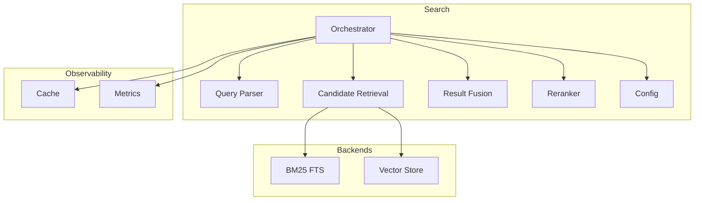
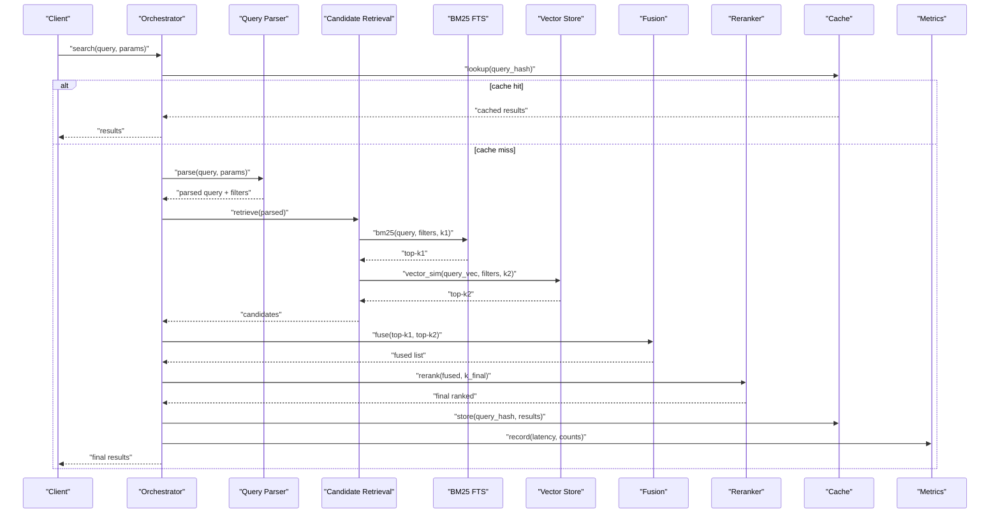
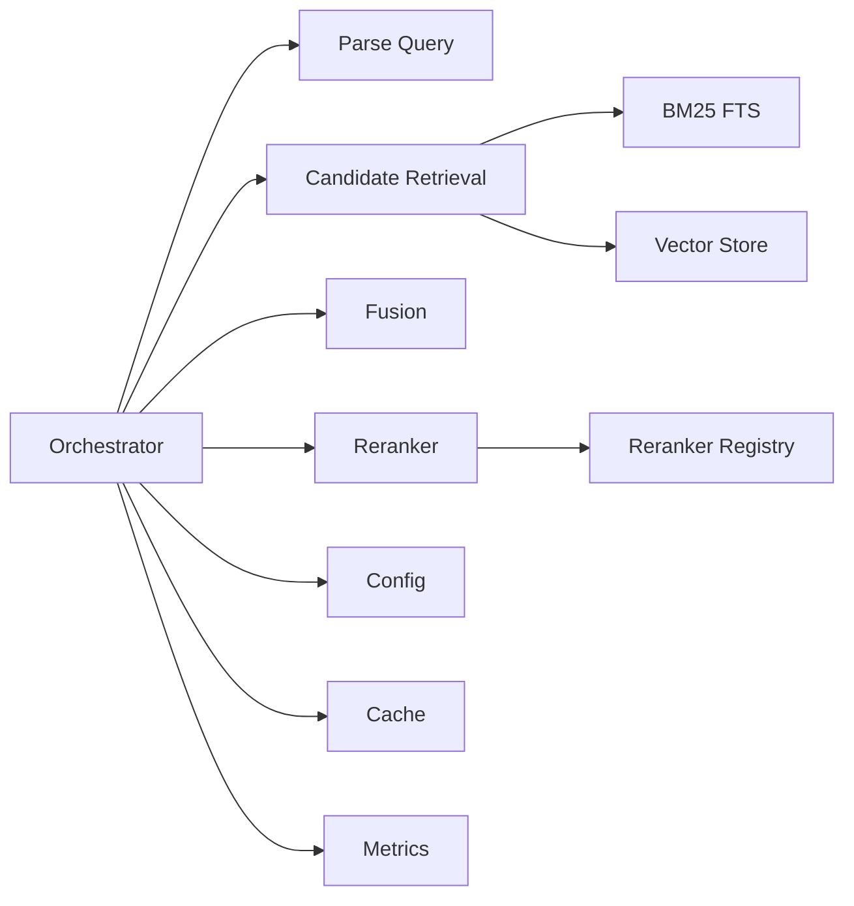
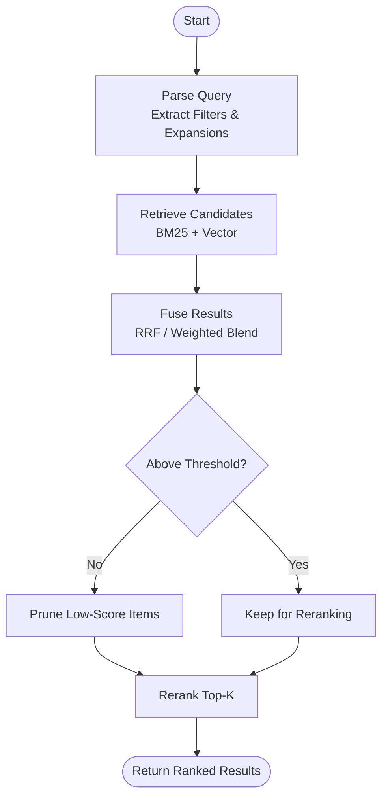

# Search Pipeline Architecture

<cite>
**Referenced Files in This Document**
- [search/orchestrator.py](file://search/orchestrator.py)
- [search/phases/parse_query.py](file://search/phases/parse_query.py)
- [search/phases/candidate_retrieval.py](file://search/phases/candidate_retrieval.py)
- [search/phases/fusion.py](file://search/phases/fusion.py)
- [search/phases/rerank.py](file://search/phases/rerank.py)
- [search/config.py](file://search/config.py)
- [search/query_parser.py](file://search/query_parser.py)
- [search/rerankers.py](file://search/rerankers.py)
- [search/splade_index.py](file://search/splade_index.py)
- [search/colbert_rerank.py](file://search/colbert_rerank.py)
- [infra/vector_store.py](file://infra/vector_store.py)
- [infra/fts.py](file://infra/fts.py)
- [infra/cache.py](file://infra/cache.py)
- [infra/metrics.py](file://infra/metrics.py)
- [docs/concepts/search-pipeline.md](file://docs/concepts/search-pipeline.md)
- [docs/how-to/debug-search.md](file://docs/how-to/debug-search.md)
</cite>

## Table of Contents
1. [Introduction](#introduction)
2. [Project Structure](#project-structure)
3. [Core Components](#core-components)
4. [Architecture Overview](#architecture-overview)
5. [Detailed Component Analysis](#detailed-component-analysis)
6. [Dependency Analysis](#dependency-analysis)
7. [Performance Considerations](#performance-considerations)
8. [Troubleshooting Guide](#troubleshooting-guide)
9. [Conclusion](#conclusion)
10. [Appendices](#appendices)

## Introduction
This document explains the multi-phase search pipeline that combines BM25 keyword matching with vector similarity to deliver hybrid retrieval. It covers each phase—query parsing, candidate retrieval, result fusion, and reranking—along with configuration options for tuning performance, relevance thresholds, and phase-specific parameters. It also includes examples of custom rerankers, search filters, query expansion techniques, caching strategies, performance monitoring, and debugging tools.

## Project Structure
The search subsystem is organized into a clear pipeline architecture:
- Orchestrator coordinates phases and manages execution flow.
- Phases implement discrete steps: parse, retrieve, fuse, rerank.
- Config centralizes tunables for all phases.
- Index backends provide BM25 (FTS) and vector stores.
- Rerankers include cross-encoders and lightweight models.
- Caching and metrics support observability and performance.

**Diagram sources**
- [search/orchestrator.py](file://search/orchestrator.py)
- [search/phases/parse_query.py](file://search/phases/parse_query.py)
- [search/phases/candidate_retrieval.py](file://search/phases/candidate_retrieval.py)
- [search/phases/fusion.py](file://search/phases/fusion.py)
- [search/phases/rerank.py](file://search/phases/rerank.py)
- [search/config.py](file://search/config.py)
- [infra/fts.py](file://infra/fts.py)
- [infra/vector_store.py](file://infra/vector_store.py)
- [infra/cache.py](file://infra/cache.py)
- [infra/metrics.py](file://infra/metrics.py)

**Section sources**
- [search/orchestrator.py](file://search/orchestrator.py)
- [search/phases/parse_query.py](file://search/phases/parse_query.py)
- [search/phases/candidate_retrieval.py](file://search/phases/candidate_retrieval.py)
- [search/phases/fusion.py](file://search/phases/fusion.py)
- [search/phases/rerank.py](file://search/phases/rerank.py)
- [search/config.py](file://search/config.py)
- [infra/fts.py](file://infra/fts.py)
- [infra/vector_store.py](file://infra/vector_store.py)
- [infra/cache.py](file://infra/cache.py)
- [infra/metrics.py](file://infra/metrics.py)

## Core Components
- Orchestrator: Initializes config, parses queries, runs phases, applies filters, fuses results, reranks, and returns final hits with metadata.
- Query Parser: Normalizes input, extracts filters, time windows, and optional expansions.
- Candidate Retrieval: Executes parallel BM25 and vector searches; supports SPLADE-style sparse vectors and dense embeddings.
- Fusion: Combines scores from multiple retrievers using strategies like Reciprocal Rank Fusion or weighted score blending.
- Reranking: Applies cross-encoder or model-based rerankers to refine top-k candidates.
- Configuration: Centralized settings for k values, thresholds, weights, cache behavior, and reranker selection.
- Backends: BM25 via FTS index and vector similarity via vector store.
- Observability: Cache layer for query-level and embedding-level caching; metrics for latency, recall proxies, and error rates.

**Section sources**
- [search/orchestrator.py](file://search/orchestrator.py)
- [search/query_parser.py](file://search/query_parser.py)
- [search/phases/candidate_retrieval.py](file://search/phases/candidate_retrieval.py)
- [search/phases/fusion.py](file://search/phases/fusion.py)
- [search/phases/rerank.py](file://search/phases/rerank.py)
- [search/config.py](file://search/config.py)
- [infra/fts.py](file://infra/fts.py)
- [infra/vector_store.py](file://infra/vector_store.py)
- [infra/cache.py](file://infra/cache.py)
- [infra/metrics.py](file://infra/metrics.py)

## Architecture Overview
The pipeline executes a deterministic sequence of phases with optional branching based on configuration and runtime conditions.

**Diagram sources**
- [search/orchestrator.py](file://search/orchestrator.py)
- [search/phases/parse_query.py](file://search/phases/parse_query.py)
- [search/phases/candidate_retrieval.py](file://search/phases/candidate_retrieval.py)
- [search/phases/fusion.py](file://search/phases/fusion.py)
- [search/phases/rerank.py](file://search/phases/rerank.py)
- [infra/fts.py](file://infra/fts.py)
- [infra/vector_store.py](file://infra/vector_store.py)
- [infra/cache.py](file://infra/cache.py)
- [infra/metrics.py](file://infra/metrics.py)

## Detailed Component Analysis

### Phase 1: Query Parsing
Responsibilities:
- Normalize text, tokenize, and extract structured filters (e.g., tenant, tags, date ranges).
- Support query types (keyword, semantic, mixed) and optional expansions (synonyms, related terms).
- Produce a parsed representation consumed by downstream phases.

Key behaviors:
- Filter extraction ensures scoping and safety.
- Expansion can be enabled/disabled per request or globally.
- Validation guards against malformed inputs.

Configuration highlights:
- Enable/disable expansion strategies.
- Define synonym sets or external expansion sources.
- Set maximum expansion size to control cost.

**Section sources**
- [search/phases/parse_query.py](file://search/phases/parse_query.py)
- [search/query_parser.py](file://search/query_parser.py)
- [search/config.py](file://search/config.py)

### Phase 2: Candidate Retrieval
Responsibilities:
- Execute BM25 over FTS index with filters.
- Execute vector similarity over dense embeddings with filters.
- Optionally use SPLADE-style sparse representations for improved lexical coverage.

Key behaviors:
- Parallel execution of BM25 and vector retrievers.
- Independent k values per retriever to balance recall and cost.
- Filters applied at backend level for efficiency.

Configuration highlights:
- BM25 k1 and boost parameters.
- Vector similarity metric and top-k.
- SPLADE enablement and tokenization settings.

**Section sources**
- [search/phases/candidate_retrieval.py](file://search/phases/candidate_retrieval.py)
- [infra/fts.py](file://infra/fts.py)
- [infra/vector_store.py](file://infra/vector_store.py)
- [search/splade_index.py](file://search/splade_index.py)
- [search/config.py](file://search/config.py)

### Phase 3: Result Fusion
Responsibilities:
- Combine BM25 and vector candidate lists into a single ordered list.
- Apply fusion strategy (e.g., reciprocal rank fusion or weighted score blending).
- Enforce minimum relevance threshold before passing to reranker.

Key behaviors:
- Deduplication by document ID.
- Thresholding to reduce reranker load.
- Strategy selection via configuration.

Configuration highlights:
- Fusion method and weights.
- Relevance cutoffs.
- Maximum fused size passed to reranker.

**Section sources**
- [search/phases/fusion.py](file://search/phases/fusion.py)
- [search/config.py](file://search/config.py)

### Phase 4: Reranking
Responsibilities:
- Refine fused candidates using a reranker (cross-encoder or lightweight model).
- Return final ranked results with scores and metadata.

Key behaviors:
- Supports multiple reranker implementations.
- Optional early exit if fused list is small enough.
- Error handling and fallback to fused order when reranker fails.

Configuration highlights:
- Reranker selection and parameters.
- Top-k after reranking.
- Timeout and retry policies.

Custom reranker example pattern:
- Implement a class with a standard interface (e.g., score(documents, query)).
- Register it in configuration under reranker registry.
- Ensure it handles filters and returns normalized scores.

**Section sources**
- [search/phases/rerank.py](file://search/phases/rerank.py)
- [search/rerankers.py](file://search/rerankers.py)
- [search/colbert_rerank.py](file://search/colbert_rerank.py)
- [search/config.py](file://search/config.py)

### Hybrid Retrieval: BM25 + Vector Similarity
Concept:
- BM25 captures exact lexical matches and phrase structure.
- Vector similarity captures semantic proximity and paraphrases.
- Fusion balances both signals to improve precision and recall.

Implementation notes:
- Independent retrieval paths allow independent tuning.
- Fusion strategy determines how strongly each signal influences ranking.
- Reranker provides final discrimination among top candidates.

**Section sources**
- [search/phases/candidate_retrieval.py](file://search/phases/candidate_retrieval.py)
- [search/phases/fusion.py](file://search/phases/fusion.py)
- [search/phases/rerank.py](file://search/phases/rerank.py)
- [infra/fts.py](file://infra/fts.py)
- [infra/vector_store.py](file://infra/vector_store.py)

### Query Expansion Techniques
Options:
- Synonym expansion using curated dictionaries.
- Related-term expansion via embeddings or knowledge graph neighbors.
- Temporal expansion to broaden time windows when needed.

Controls:
- Expansion budget (max terms).
- Expansion source selection.
- Per-query toggles for controlled experimentation.

**Section sources**
- [search/phases/parse_query.py](file://search/phases/parse_query.py)
- [search/config.py](file://search/config.py)

### Search Filters
Types:
- Tenant isolation and user scoping.
- Tag/category filters.
- Temporal constraints (as-of timestamps, ranges).
- Custom predicates exposed through parser and enforced at retrieval.

Best practices:
- Push filters to backends to minimize data movement.
- Validate filter syntax and ranges early.

**Section sources**
- [search/phases/parse_query.py](file://search/phases/parse_query.py)
- [search/phases/candidate_retrieval.py](file://search/phases/candidate_retrieval.py)
- [infra/fts.py](file://infra/fts.py)
- [infra/vector_store.py](file://infra/vector_store.py)

## Dependency Analysis
High-level dependencies between components:

**Diagram sources**
- [search/orchestrator.py](file://search/orchestrator.py)
- [search/phases/parse_query.py](file://search/phases/parse_query.py)
- [search/phases/candidate_retrieval.py](file://search/phases/candidate_retrieval.py)
- [search/phases/fusion.py](file://search/phases/fusion.py)
- [search/phases/rerank.py](file://search/phases/rerank.py)
- [search/rerankers.py](file://search/rerankers.py)
- [infra/fts.py](file://infra/fts.py)
- [infra/vector_store.py](file://infra/vector_store.py)
- [infra/cache.py](file://infra/cache.py)
- [infra/metrics.py](file://infra/metrics.py)

**Section sources**
- [search/orchestrator.py](file://search/orchestrator.py)
- [search/rerankers.py](file://search/rerankers.py)
- [infra/fts.py](file://infra/fts.py)
- [infra/vector_store.py](file://infra/vector_store.py)
- [infra/cache.py](file://infra/cache.py)
- [infra/metrics.py](file://infra/metrics.py)

## Performance Considerations
- Tuning k values: Increase BM25 and vector k to improve recall; decrease to reduce reranker cost.
- Fusion weights: Adjust to emphasize lexical vs semantic signals depending on corpus characteristics.
- Relevance thresholds: Raise to prune low-quality candidates before reranking.
- Caching: Enable query-level cache for repeated queries; consider embedding cache for expensive encoders.
- Reranker selection: Use lightweight rerankers for high-throughput scenarios; reserve heavy cross-encoders for critical queries.
- Indexing: Maintain up-to-date BM25 and vector indexes; monitor drift and schedule recomputation.

[No sources needed since this section provides general guidance]

## Troubleshooting Guide
Common issues and diagnostics:
- Zero results: Check filters, time windows, and corpus indexing status.
- Slow queries: Inspect cache misses, large k values, and reranker latency.
- Poor relevance: Tune fusion weights, thresholds, and reranker parameters.
- Inconsistent results: Verify determinism flags and random seeds in rerankers.

Tools and references:
- Debugging guide for search workflows and logs.
- Metrics endpoints for latency, throughput, and error rates.
- Cache inspection utilities to validate hit ratios.

**Section sources**
- [docs/how-to/debug-search.md](file://docs/how-to/debug-search.md)
- [infra/metrics.py](file://infra/metrics.py)
- [infra/cache.py](file://infra/cache.py)

## Conclusion
The multi-phase search pipeline delivers robust hybrid retrieval by combining BM25 and vector similarity, fusing their outputs, and refining with rerankers. With configurable phases, filters, and observability, teams can tune performance and relevance to match workload needs while maintaining scalability and reliability.

[No sources needed since this section summarizes without analyzing specific files]

## Appendices

### Configuration Options Summary
- General
  - cache_enabled: Boolean flag to enable query-level caching.
  - metrics_enabled: Boolean flag to enable metrics collection.
- Parsing
  - expansion_enabled: Toggle query expansion.
  - expansion_max_terms: Cap on expansion size.
- Retrieval
  - bm25_k: Number of BM25 candidates.
  - vector_k: Number of vector candidates.
  - splade_enabled: Use SPLADE-style sparse vectors.
- Fusion
  - fusion_strategy: Method (e.g., RRF or weighted blend).
  - fusion_weights: Weights for BM25 and vector signals.
  - relevance_threshold: Minimum score to pass to reranker.
- Reranking
  - reranker_name: Selected reranker implementation.
  - reranker_top_k: Final number of results.
  - reranker_timeout_ms: Timeout for reranker calls.

**Section sources**
- [search/config.py](file://search/config.py)

### Example Patterns

#### Custom Reranker
- Implement a class conforming to the reranker interface.
- Register it in the reranker registry.
- Configure reranker_name to your implementation.

**Section sources**
- [search/rerankers.py](file://search/rerankers.py)
- [search/config.py](file://search/config.py)

#### Search Filters
- Apply tenant, tag, and temporal filters in the parser.
- Pass filters to BM25 and vector backends for efficient pruning.

**Section sources**
- [search/phases/parse_query.py](file://search/phases/parse_query.py)
- [search/phases/candidate_retrieval.py](file://search/phases/candidate_retrieval.py)
- [infra/fts.py](file://infra/fts.py)
- [infra/vector_store.py](file://infra/vector_store.py)

#### Query Expansion
- Enable expansion and set max terms.
- Choose expansion sources (synonyms, KG neighbors).

**Section sources**
- [search/phases/parse_query.py](file://search/phases/parse_query.py)
- [search/config.py](file://search/config.py)

### Conceptual Overview

[No sources needed since this diagram shows conceptual workflow, not actual code structure]