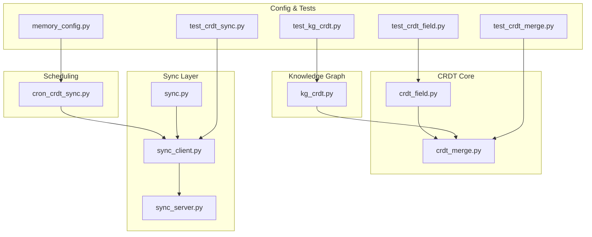
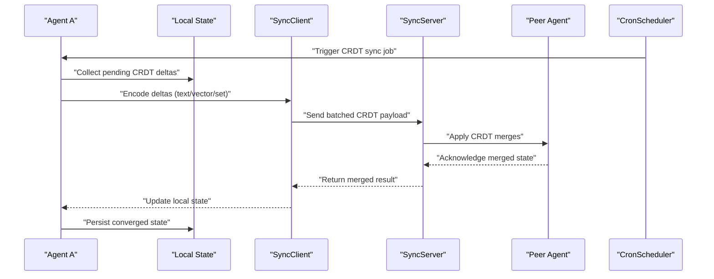
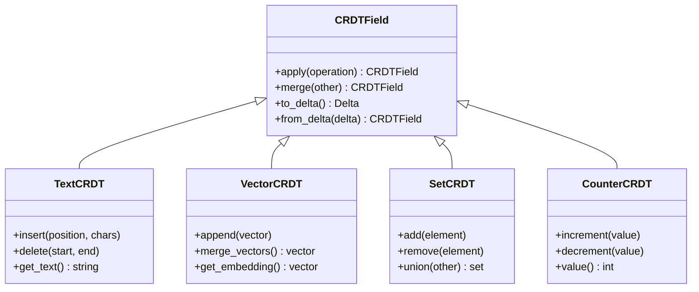
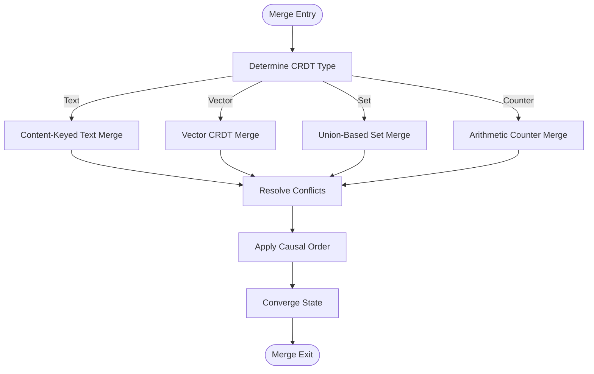
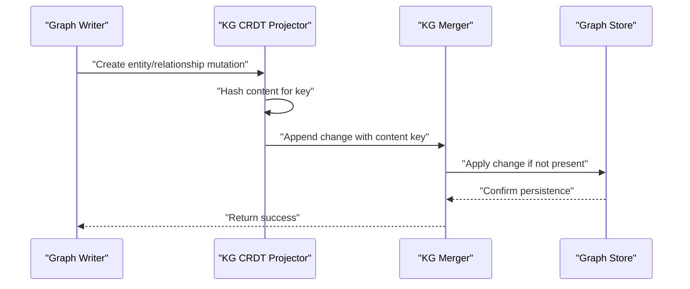
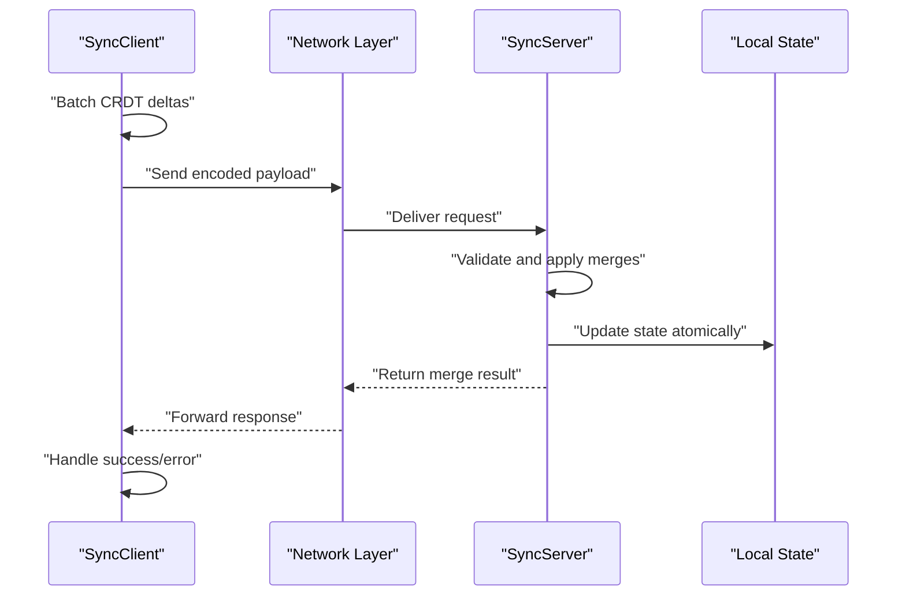
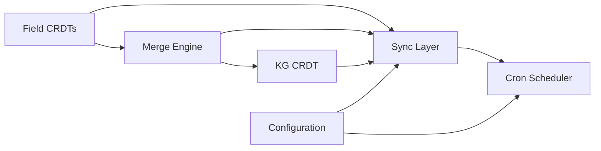

# CRDT Synchronization

<cite>
**Referenced Files in This Document**
- [crdt_field.py](file://crdt/crdt_field.py)
- [crdt_merge.py](file://crdt/crdt_merge.py)
- [kg_crdt.py](file://kg/kg_crdt.py)
- [sync.py](file://agentic_memory/sync.py)
- [cron_crdt_sync.py](file://cron/cron_crdt_sync.py)
- [sync_client.py](file://infra/sync_client.py)
- [sync_server.py](file://infra/sync_server.py)
- [memory_config.py](file://infra/memory_config.py)
- [test_crdt_field.py](file://eval/test_crdt_field.py)
- [test_crdt_merge.py](file://eval/test_crdt_merge.py)
- [test_crdt_sync.py](file://eval/test_crdt_sync.py)
- [test_kg_crdt.py](file://eval/test_kg_crdt.py)
</cite>

## Table of Contents
1. [Introduction](#introduction)
2. [Project Structure](#project-structure)
3. [Core Components](#core-components)
4. [Architecture Overview](#architecture-overview)
5. [Detailed Component Analysis](#detailed-component-analysis)
6. [Dependency Analysis](#dependency-analysis)
7. [Performance Considerations](#performance-considerations)
8. [Troubleshooting Guide](#troubleshooting-guide)
9. [Conclusion](#conclusion)

## Introduction
This document explains the Conflict-Free Replicated Data Types (CRDT) synchronization mechanisms used to keep memory state consistent across distributed agents. It covers theoretical foundations, field-level CRDT operations, merge strategies, and conflict resolution algorithms. It also documents content-keyed CRDTs for knowledge graph consistency, vector CRDTs for embeddings, and text CRDTs for memory content. Practical guidance is provided for configuring CRDT policies, handling concurrent modifications, and debugging synchronization issues, along with performance considerations and consistency guarantees.

## Project Structure
The CRDT subsystem spans several modules:
- Field-level CRDT primitives and merge logic
- Knowledge graph CRDT projection and reconciliation
- Sync client/server for network transport
- Cron-based scheduling for periodic synchronization
- Configuration and tests validating behavior

**Diagram sources**
- [crdt_field.py](file://crdt/crdt_field.py)
- [crdt_merge.py](file://crdt/crdt_merge.py)
- [kg_crdt.py](file://kg/kg_crdt.py)
- [sync_client.py](file://infra/sync_client.py)
- [sync_server.py](file://infra/sync_server.py)
- [sync.py](file://agentic_memory/sync.py)
- [cron_crdt_sync.py](file://cron/cron_crdt_sync.py)
- [memory_config.py](file://infra/memory_config.py)
- [test_crdt_field.py](file://eval/test_crdt_field.py)
- [test_crdt_merge.py](file://eval/test_crdt_merge.py)
- [test_crdt_sync.py](file://eval/test_crdt_sync.py)
- [test_kg_crdt.py](file://eval/test_kg_crdt.py)

**Section sources**
- [crdt_field.py](file://crdt/crdt_field.py)
- [crdt_merge.py](file://crdt/crdt_merge.py)
- [kg_crdt.py](file://kg/kg_crdt.py)
- [sync_client.py](file://infra/sync_client.py)
- [sync_server.py](file://infra/sync_server.py)
- [sync.py](file://agentic_memory/sync.py)
- [cron_crdt_sync.py](file://cron/cron_crdt_sync.py)
- [memory_config.py](file://infra/memory_config.py)

## Core Components
- Field-level CRDTs: Provide atomic operations for text, vectors, sets, counters, and maps at the field level, enabling fine-grained merges without global locks.
- Merge engine: Implements commutative, associative, and idempotent merge functions ensuring convergence across replicas.
- Knowledge graph CRDT: Projects graph mutations into append-only, content-keyed changes that reconcile deterministically.
- Sync client/server: Encodes CRDT deltas, transmits over the network, and applies them locally with conflict-free semantics.
- Cron scheduler: Triggers periodic sync jobs to propagate updates and resolve drift.

Key responsibilities:
- Representing CRDT fields with explicit operation histories or stateful structures
- Merging incoming deltas with local state while preserving monotonicity and convergence
- Serializing/deserializing CRDT payloads for efficient network transfer
- Ensuring tenant isolation and auditability during sync

**Section sources**
- [crdt_field.py](file://crdt/crdt_field.py)
- [crdt_merge.py](file://crdt/crdt_merge.py)
- [kg_crdt.py](file://kg/kg_crdt.py)
- [sync_client.py](file://infra/sync_client.py)
- [sync_server.py](file://infra/sync_server.py)
- [sync.py](file://agentic_memory/sync.py)
- [cron_crdt_sync.py](file://cron/cron_crdt_sync.py)

## Architecture Overview
The CRDT synchronization architecture separates concerns into field-level primitives, merge logic, graph projections, and network transport. The cron job orchestrates periodic synchronization between peers.

**Diagram sources**
- [cron_crdt_sync.py](file://cron/cron_crdt_sync.py)
- [sync_client.py](file://infra/sync_client.py)
- [sync_server.py](file://infra/sync_server.py)
- [sync.py](file://agentic_memory/sync.py)

## Detailed Component Analysis

### Field-Level CRDT Operations
Field-level CRDTs support:
- Text CRDTs: Character/word-level insertions and deletions with causal ordering
- Vector CRDTs: Append-only embedding updates with versioned vectors
- Set CRDTs: Union-based membership tracking
- Counter CRDTs: Monotonic increments/decrements with eventual consistency

Operations are designed to be commutative, associative, and idempotent, ensuring deterministic merges regardless of delivery order.

**Diagram sources**
- [crdt_field.py](file://crdt/crdt_field.py)

**Section sources**
- [crdt_field.py](file://crdt/crdt_field.py)
- [test_crdt_field.py](file://eval/test_crdt_field.py)

### Merge Strategies and Conflict Resolution
The merge engine implements:
- Content-addressed merging for text and vectors
- Union-based merging for sets
- Arithmetic merging for counters with conflict detection
- Causal ordering enforcement to prevent out-of-order application

Conflict resolution strategies include:
- Last-writer-wins with logical clocks for scalar fields
- Semantic merge for overlapping text edits
- Vector averaging or concatenation based on policy

**Diagram sources**
- [crdt_merge.py](file://crdt/crdt_merge.py)

**Section sources**
- [crdt_merge.py](file://crdt/crdt_merge.py)
- [test_crdt_merge.py](file://eval/test_crdt_merge.py)

### Knowledge Graph CRDT Projection
The knowledge graph uses content-keyed CRDTs to ensure consistency:
- Entities and relationships are represented as append-only changes
- Each change is keyed by content hash to prevent duplicates
- Reconciliation ensures graph topology remains consistent across agents

**Diagram sources**
- [kg_crdt.py](file://kg/kg_crdt.py)

**Section sources**
- [kg_crdt.py](file://kg/kg_crdt.py)
- [test_kg_crdt.py](file://eval/test_kg_crdt.py)

### Sync Client and Server
The sync layer handles:
- Batch encoding of CRDT deltas
- Network transmission with retry and backoff
- Acknowledgment and error handling
- Local state reconciliation after successful sync

**Diagram sources**
- [sync_client.py](file://infra/sync_client.py)
- [sync_server.py](file://infra/sync_server.py)
- [sync.py](file://agentic_memory/sync.py)

**Section sources**
- [sync_client.py](file://infra/sync_client.py)
- [sync_server.py](file://infra/sync_server.py)
- [sync.py](file://agentic_memory/sync.py)
- [test_crdt_sync.py](file://eval/test_crdt_sync.py)

### Cron-Based Synchronization
The cron job orchestrates periodic synchronization:
- Scans for pending CRDT changes
- Initiates sync cycles with configured peers
- Handles failures and retries with exponential backoff
- Logs sync metrics and health status

**Section sources**
- [cron_crdt_sync.py](file://cron/cron_crdt_sync.py)

### Configuration and Policies
CRDT behavior is controlled through configuration:
- Sync frequency and peer discovery settings
- Merge policy selection (e.g., last-writer-wins vs semantic merge)
- Network timeout and retry parameters
- Tenant isolation and audit logging options

**Section sources**
- [memory_config.py](file://infra/memory_config.py)

## Dependency Analysis
The CRDT system has clear dependency boundaries:
- Field-level CRDTs depend only on core data structures
- Merge logic depends on field implementations
- Knowledge graph CRDT depends on merge engine and storage
- Sync layer depends on network protocols and serialization
- Cron job depends on all components for orchestration

**Diagram sources**
- [crdt_field.py](file://crdt/crdt_field.py)
- [crdt_merge.py](file://crdt/crdt_merge.py)
- [kg_crdt.py](file://kg/kg_crdt.py)
- [sync_client.py](file://infra/sync_client.py)
- [sync_server.py](file://infra/sync_server.py)
- [cron_crdt_sync.py](file://cron/cron_crdt_sync.py)
- [memory_config.py](file://infra/memory_config.py)

**Section sources**
- [crdt_field.py](file://crdt/crdt_field.py)
- [crdt_merge.py](file://crdt/crdt_merge.py)
- [kg_crdt.py](file://kg/kg_crdt.py)
- [sync_client.py](file://infra/sync_client.py)
- [sync_server.py](file://infra/sync_server.py)
- [cron_crdt_sync.py](file://cron/cron_crdt_sync.py)
- [memory_config.py](file://infra/memory_config.py)

## Performance Considerations
- **Batching**: CRDT deltas are batched to reduce network overhead and improve throughput
- **Content addressing**: Duplicate detection prevents redundant transfers and storage
- **Lazy evaluation**: Expensive merge operations are deferred until needed
- **Incremental sync**: Only changed fields are synchronized, minimizing bandwidth usage
- **Connection pooling**: Reuses network connections for better latency
- **Memory management**: CRDT states are garbage collected when no longer referenced

## Troubleshooting Guide
Common issues and solutions:
- **Sync failures**: Check network connectivity and peer availability
- **Merge conflicts**: Review conflict resolution policies and causal ordering
- **Performance degradation**: Monitor batch sizes and connection pools
- **Data inconsistency**: Verify content hashing and duplicate prevention
- **Audit trail gaps**: Ensure logging is enabled and accessible

Debugging steps:
1. Enable detailed sync logging
2. Inspect CRDT delta payloads
3. Verify merge results against expected state
4. Check cron job execution logs
5. Validate peer connectivity and authentication

**Section sources**
- [test_crdt_sync.py](file://eval/test_crdt_sync.py)
- [cron_crdt_sync.py](file://cron/cron_crdt_sync.py)

## Conclusion
The CRDT synchronization system provides robust, conflict-free replication for memory state across distributed agents. By combining field-level CRDTs, sophisticated merge strategies, and efficient network transport, it ensures consistency while maintaining high performance. The modular architecture allows for flexible configuration and easy extension to support new data types and merge policies. Proper monitoring and debugging tools help maintain system reliability in production environments.