# Distributed Coordination

<cite>
**Referenced Files in This Document**
- [coordination/__init__.py](file://coordination/__init__.py)
- [coordination/durability.py](file://coordination/durability.py)
- [coordination/hooks.py](file://coordination/hooks.py)
- [coordination/locking.py](file://coordination/locking.py)
- [coordination/messaging.py](file://coordination/messaging.py)
- [coordination/project_state.py](file://coordination/project_state.py)
- [infra/dist_lock.py](file://infra/dist_lock.py)
- [infra/file_lock.py](file://infra/file_lock.py)
- [infra/lock_manager.py](file://infra/lock_manager.py)
- [infra/sync_client.py](file://infra/sync_client.py)
- [infra/sync_server.py](file://infra/sync_server.py)
- [infra/mdns_discovery.py](file://infra/mdns_discovery.py)
- [cron/_flock.py](file://cron/_flock.py)
- [background/fleet_entry.py](file://background/fleet_entry.py)
- [background/fleet_worker.py](file://background/fleet_worker.py)
- [background/inbox.py](file://background/inbox.py)
- [background/background_queue.py](file://background/background_queue.py)
- [background/background_worker.py](file://background/background_worker.py)
- [saga.py](file://saga.py)
- [crdt/crdt_field.py](file://crdt/crdt_field.py)
- [crdt/crdt_merge.py](file://crdt/crdt_merge.py)
- [kg/kg_crdt.py](file://kg/kg_crdt.py)
- [mcp_coordination.py](file://mcp_coordination.py)
- [db_write_queue.py](file://db_write_queue.py)
- [write_journal.py](file://write_journal.py)
</cite>

## Table of Contents
1. [Introduction](#introduction)
2. [Project Structure](#project-structure)
3. [Core Components](#core-components)
4. [Architecture Overview](#architecture-overview)
5. [Detailed Component Analysis](#detailed-component-analysis)
6. [Dependency Analysis](#dependency-analysis)
7. [Performance Considerations](#performance-considerations)
8. [Troubleshooting Guide](#troubleshooting-guide)
9. [Conclusion](#conclusion)
10. [Appendices](#appendices)

## Introduction
This document explains the distributed coordination mechanisms used by agents and background workers to coordinate writes, synchronize state, and maintain consistency across processes and nodes. It covers message passing protocols, event-driven communication, inter-process coordination patterns, distributed locking strategies, leader election, consensus via CRDTs, durable messaging, ordering guarantees, failure recovery, and operational guidance for performance, scalability, and monitoring.

## Project Structure
The coordination subsystem is organized into focused modules:
- coordination/: high-level coordination primitives (locking, durability, messaging, hooks, project state)
- infra/: low-level infrastructure (distributed locks, file locks, sync client/server, discovery)
- background/: worker orchestration, fleet management, inbox, queues
- crdt/, kg/: conflict-free data structures and knowledge graph CRDT integration
- cron/_flock.py: process-level flock-based coordination
- mcp_coordination.py: MCP-based coordination surface
- db_write_queue.py, write_journal.py: durable write paths

```mermaid
graph TB
subgraph "Coordination Layer"
CInit["coordination/__init__.py"]
CLock["coordination/locking.py"]
CDur["coordination/durability.py"]
CMess["coordination/messaging.py"]
CHooks["coordination/hooks.py"]
CState["coordination/project_state.py"]
end
subgraph "Infrastructure"
IDL["infra/dist_lock.py"]
IFL["infra/file_lock.py"]
ILM["infra/lock_manager.py"]
ISC["infra/sync_client.py"]
ISS["infra/sync_server.py"]
IMD["infra/mdns_discovery.py"]
end
subgraph "Background & Fleet"
BEntry["background/fleet_entry.py"]
BWorker["background/fleet_worker.py"]
BInbox["background/inbox.py"]
BQueue["background/background_queue.py"]
BMain["background/background_worker.py"]
end
subgraph "Data Consistency"
CRDTField["crdt/crdt_field.py"]
CRDTMerge["crdt/crdt_merge.py"]
KGCrdt["kg/kg_crdt.py"]
end
subgraph "Durable IO"
DBWQ["db_write_queue.py"]
WJ["write_journal.py"]
end
subgraph "Process Flock"
CFlock["cron/_flock.py"]
end
subgraph "MCP Surface"
MCPCoord["mcp_coordination.py"]
end
CInit --> CLock
CInit --> CDur
CInit --> CMess
CInit --> CHooks
CInit --> CState
CLock --> IDL
CLock --> IFL
CLock --> ILM
CMess --> BInbox
CMess --> BQueue
CMess --> BMain
CDur --> DBWQ
CDur --> WJ
CState --> ISC
CState --> ISS
CState --> IMD
BEntry --> BWorker
BWorker --> BInbox
BWorker --> BQueue
CRDTField --> CRDTMerge
CRDTMerge --> KGCrdt
MCPCoord --> CLock
MCPCoord --> CMess
MCPCoord --> CDur
CFlock --> CLock
```

**Diagram sources**
- [coordination/__init__.py](file://coordination/__init__.py)
- [coordination/locking.py](file://coordination/locking.py)
- [coordination/durability.py](file://coordination/durability.py)
- [coordination/messaging.py](file://coordination/messaging.py)
- [coordination/hooks.py](file://coordination/hooks.py)
- [coordination/project_state.py](file://coordination/project_state.py)
- [infra/dist_lock.py](file://infra/dist_lock.py)
- [infra/file_lock.py](file://infra/file_lock.py)
- [infra/lock_manager.py](file://infra/lock_manager.py)
- [infra/sync_client.py](file://infra/sync_client.py)
- [infra/sync_server.py](file://infra/sync_server.py)
- [infra/mdns_discovery.py](file://infra/mdns_discovery.py)
- [background/fleet_entry.py](file://background/fleet_entry.py)
- [background/fleet_worker.py](file://background/fleet_worker.py)
- [background/inbox.py](file://background/inbox.py)
- [background/background_queue.py](file://background/background_queue.py)
- [background/background_worker.py](file://background/background_worker.py)
- [crdt/crdt_field.py](file://crdt/crdt_field.py)
- [crdt/crdt_merge.py](file://crdt/crdt_merge.py)
- [kg/kg_crdt.py](file://kg/kg_crdt.py)
- [db_write_queue.py](file://db_write_queue.py)
- [write_journal.py](file://write_journal.py)
- [cron/_flock.py](file://cron/_flock.py)
- [mcp_coordination.py](file://mcp_coordination.py)

**Section sources**
- [coordination/__init__.py](file://coordination/__init__.py)
- [coordination/locking.py](file://coordination/locking.py)
- [coordination/durability.py](file://coordination/durability.py)
- [coordination/messaging.py](file://coordination/messaging.py)
- [coordination/hooks.py](file://coordination/hooks.py)
- [coordination/project_state.py](file://coordination/project_state.py)
- [infra/dist_lock.py](file://infra/dist_lock.py)
- [infra/file_lock.py](file://infra/file_lock.py)
- [infra/lock_manager.py](file://infra/lock_manager.py)
- [infra/sync_client.py](file://infra/sync_client.py)
- [infra/sync_server.py](file://infra/sync_server.py)
- [infra/mdns_discovery.py](file://infra/mdns_discovery.py)
- [background/fleet_entry.py](file://background/fleet_entry.py)
- [background/fleet_worker.py](file://background/fleet_worker.py)
- [background/inbox.py](file://background/inbox.py)
- [background/background_queue.py](file://background/background_queue.py)
- [background/background_worker.py](file://background/background_worker.py)
- [crdt/crdt_field.py](file://crdt/crdt_field.py)
- [crdt/crdt_merge.py](file://crdt/crdt_merge.py)
- [kg/kg_crdt.py](file://kg/kg_crdt.py)
- [db_write_queue.py](file://db_write_queue.py)
- [write_journal.py](file://write_journal.py)
- [cron/_flock.py](file://cron/_flock.py)
- [mcp_coordination.py](file://mcp_coordination.py)

## Core Components
- Locking primitives: cross-process and cross-node locks with timeouts, fencing tokens, and backoff.
- Durable messaging: outbox-style persistence, at-least-once delivery, idempotent consumers, and retry policies.
- Event-driven coordination: publish-subscribe channels, fan-out to workers, and ordered processing per key.
- State synchronization: lightweight sync client/server for configuration and registry updates; mdns-based discovery.
- Conflict resolution: CRDT fields and merges applied to knowledge graph entities to converge without central consensus.
- Process flock: single-writer semantics for long-running tasks using OS-level locks.

Key responsibilities:
- coordination/locking.py: unified lock API over dist_lock and file_lock.
- coordination/durability.py: durable write helpers and transactional boundaries.
- coordination/messaging.py: channel abstractions, queueing, and delivery semantics.
- coordination/hooks.py: lifecycle hooks for pre/post operations during coordination.
- coordination/project_state.py: shared project state access and versioning.

**Section sources**
- [coordination/locking.py](file://coordination/locking.py)
- [coordination/durability.py](file://coordination/durability.py)
- [coordination/messaging.py](file://coordination/messaging.py)
- [coordination/hooks.py](file://coordination/hooks.py)
- [coordination/project_state.py](file://coordination/project_state.py)

## Architecture Overview
The system combines multiple coordination strategies:
- Distributed locks for exclusive access to resources or critical sections.
- Durable queues and outbox tables for reliable message delivery.
- CRDTs for eventual consistency across replicas.
- Leader election via flock for periodic maintenance jobs.
- Sync client/server for fast state propagation among peers.

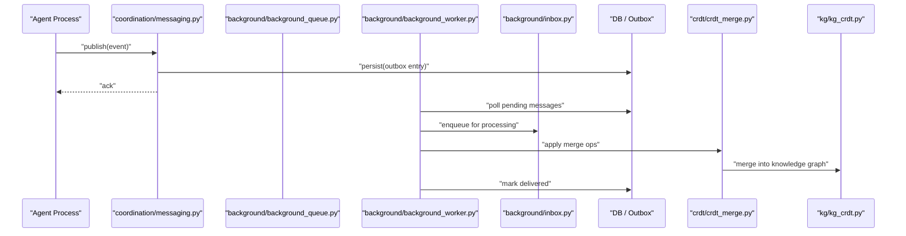

**Diagram sources**
- [coordination/messaging.py](file://coordination/messaging.py)
- [background/background_queue.py](file://background/background_queue.py)
- [background/background_worker.py](file://background/background_worker.py)
- [background/inbox.py](file://background/inbox.py)
- [crdt/crdt_merge.py](file://crdt/crdt_merge.py)
- [kg/kg_crdt.py](file://kg/kg_crdt.py)

## Detailed Component Analysis

### Distributed Locking
Locking provides mutual exclusion across processes and nodes. The coordination layer abstracts over:
- File-based locks for local coalescing and fallback.
- Network-backed locks for cluster-wide exclusivity.
- Timeouts, fencing tokens, and exponential backoff to handle failures and partitions.

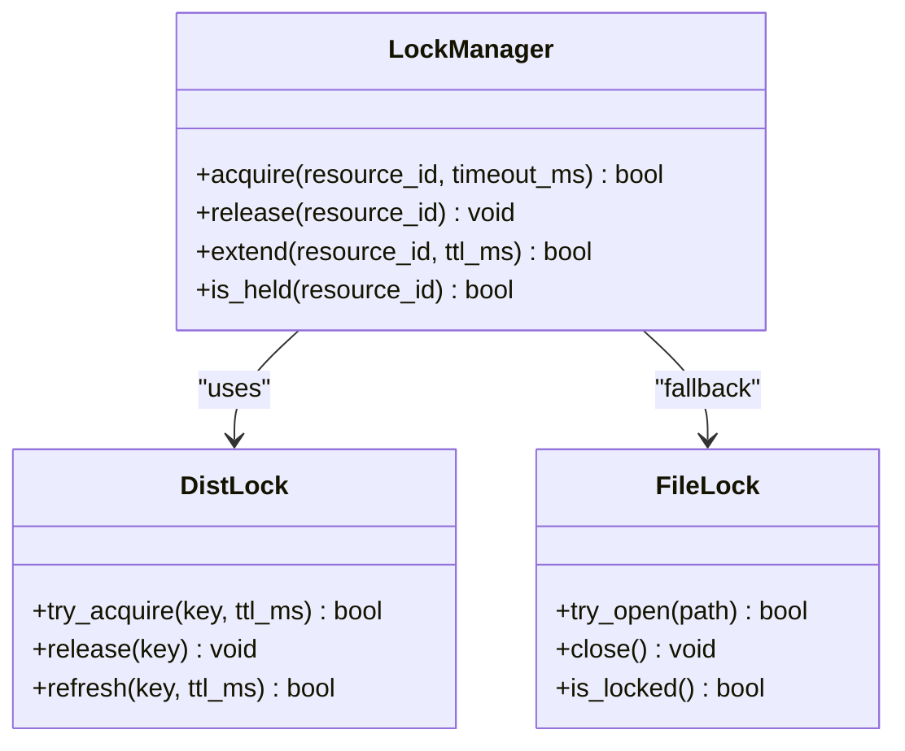

Operational notes:
- Use short TTLs and periodic refresh for long-held locks.
- Always release on exit paths and handle broken leases gracefully.
- Prefer keyed locks to avoid global contention.

**Diagram sources**
- [infra/lock_manager.py](file://infra/lock_manager.py)
- [infra/dist_lock.py](file://infra/dist_lock.py)
- [infra/file_lock.py](file://infra/file_lock.py)

**Section sources**
- [coordination/locking.py](file://coordination/locking.py)
- [infra/lock_manager.py](file://infra/lock_manager.py)
- [infra/dist_lock.py](file://infra/dist_lock.py)
- [infra/file_lock.py](file://infra/file_lock.py)

### Durable Messaging and Ordering
Messages are persisted before acknowledgment to ensure at-least-once delivery. Consumers poll from a durable store, apply idempotent handlers, and mark completion only after successful processing. Ordering can be guaranteed per-key using partitioned queues or sequence numbers.

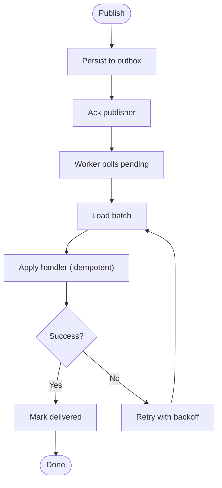

Guidelines:
- Enforce idempotency keys in payloads.
- Batch reads with bounded size and timeout.
- Track per-message offsets or sequence numbers for ordering.

**Diagram sources**
- [coordination/durability.py](file://coordination/durability.py)
- [coordination/messaging.py](file://coordination/messaging.py)
- [background/background_queue.py](file://background/background_queue.py)
- [background/background_worker.py](file://background/background_worker.py)
- [background/inbox.py](file://background/inbox.py)

**Section sources**
- [coordination/durability.py](file://coordination/durability.py)
- [coordination/messaging.py](file://coordination/messaging.py)
- [background/background_queue.py](file://background/background_queue.py)
- [background/background_worker.py](file://background/background_worker.py)
- [background/inbox.py](file://background/inbox.py)

### Event-Driven Communication and Hooks
Hooks integrate coordination points into save pipelines and lifecycle events. They allow side effects like notifications, audits, or triggering downstream work while preserving transactional boundaries.

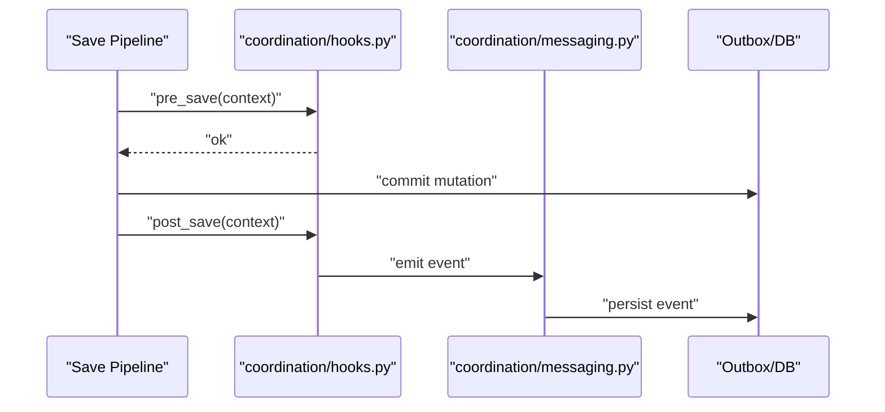

Best practices:
- Keep hooks fast and non-blocking where possible.
- Fail open for non-critical hooks; log and continue.
- Use idempotent event IDs to prevent duplicates.

**Diagram sources**
- [coordination/hooks.py](file://coordination/hooks.py)
- [coordination/messaging.py](file://coordination/messaging.py)

**Section sources**
- [coordination/hooks.py](file://coordination/hooks.py)
- [coordination/messaging.py](file://coordination/messaging.py)

### Inter-Process Coordination Patterns
- Flock-based leadership: cron/_flock.py ensures a single process runs certain jobs at a time.
- Fleet management: background/fleet_entry.py and background/fleet_worker.py manage worker registration and task distribution.
- Local inbox: background/inbox.py coordinates intra-process message routing.

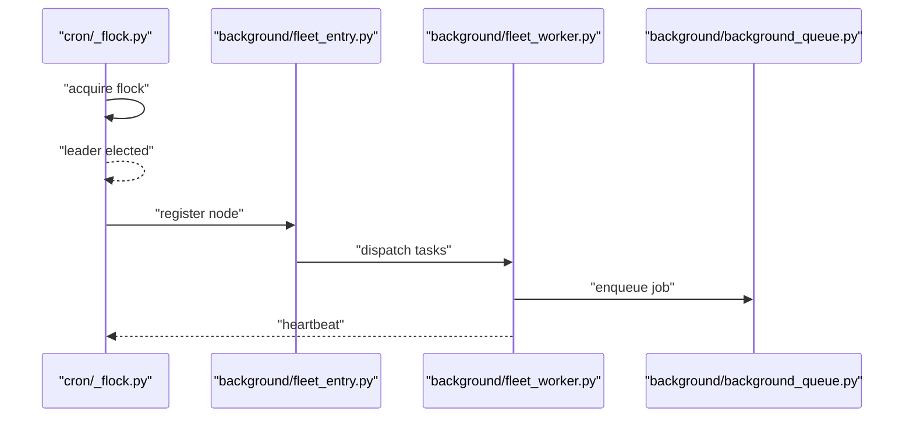

**Diagram sources**
- [cron/_flock.py](file://cron/_flock.py)
- [background/fleet_entry.py](file://background/fleet_entry.py)
- [background/fleet_worker.py](file://background/fleet_worker.py)
- [background/background_queue.py](file://background/background_queue.py)

**Section sources**
- [cron/_flock.py](file://cron/_flock.py)
- [background/fleet_entry.py](file://background/fleet_entry.py)
- [background/fleet_worker.py](file://background/fleet_worker.py)
- [background/background_queue.py](file://background/background_queue.py)

### Consensus via CRDTs
Conflict-free replicated data types enable convergence without centralized consensus. Field-level CRDTs and merges are applied to knowledge graph entities to resolve concurrent edits deterministically.

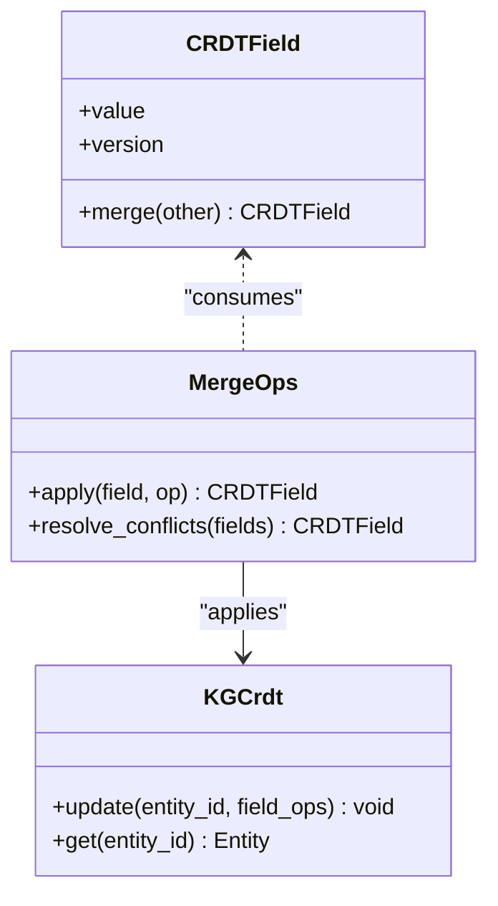

Properties:
- Commutative, associative, idempotent merge.
- Monotonic versioning prevents regressions.
- Deterministic resolution yields identical results across replicas.

**Diagram sources**
- [crdt/crdt_field.py](file://crdt/crdt_field.py)
- [crdt/crdt_merge.py](file://crdt/crdt_merge.py)
- [kg/kg_crdt.py](file://kg/kg_crdt.py)

**Section sources**
- [crdt/crdt_field.py](file://crdt/crdt_field.py)
- [crdt/crdt_merge.py](file://crdt/crdt_merge.py)
- [kg/kg_crdt.py](file://kg/kg_crdt.py)

### Synchronization and Discovery
A lightweight sync client/server pair propagates configuration and registry updates. MDNS discovery helps peers find each other in dynamic environments.

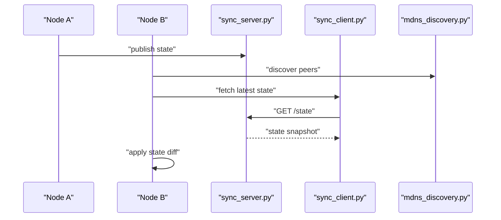

**Diagram sources**
- [infra/sync_server.py](file://infra/sync_server.py)
- [infra/sync_client.py](file://infra/sync_client.py)
- [infra/mdns_discovery.py](file://infra/mdns_discovery.py)

**Section sources**
- [infra/sync_server.py](file://infra/sync_server.py)
- [infra/sync_client.py](file://infra/sync_client.py)
- [infra/mdns_discovery.py](file://infra/mdns_discovery.py)

### MCP-Based Coordination Surface
MCP coordination exposes tools and queries for external orchestrators to trigger coordination actions such as acquiring locks, publishing events, or querying health.

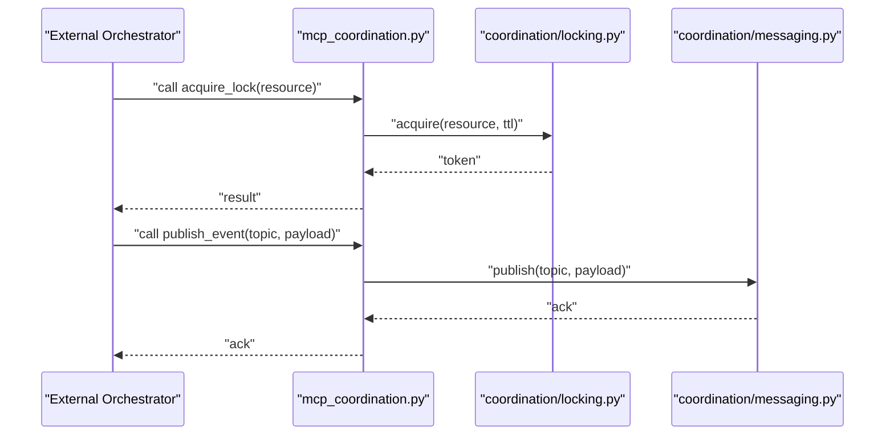

**Diagram sources**
- [mcp_coordination.py](file://mcp_coordination.py)
- [coordination/locking.py](file://coordination/locking.py)
- [coordination/messaging.py](file://coordination/messaging.py)

**Section sources**
- [mcp_coordination.py](file://mcp_coordination.py)
- [coordination/locking.py](file://coordination/locking.py)
- [coordination/messaging.py](file://coordination/messaging.py)

### Durable Write Path
Writes are buffered and flushed through a dedicated queue and journal to guarantee durability and reduce contention.

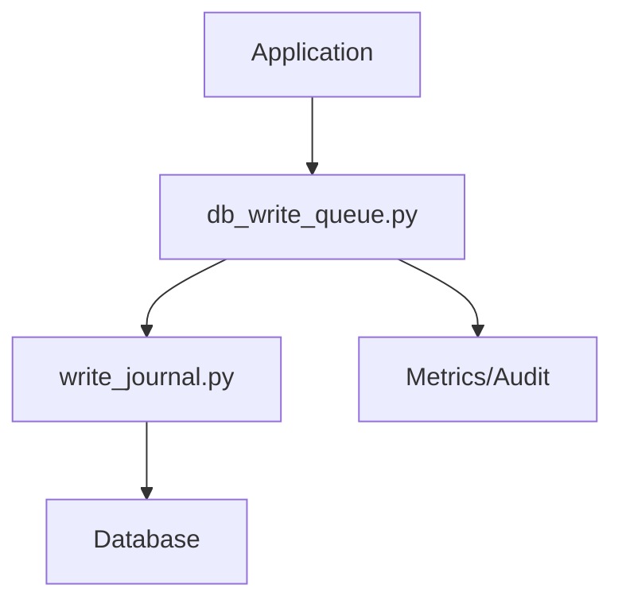

**Diagram sources**
- [db_write_queue.py](file://db_write_queue.py)
- [write_journal.py](file://write_journal.py)

**Section sources**
- [db_write_queue.py](file://db_write_queue.py)
- [write_journal.py](file://write_journal.py)

## Dependency Analysis
High-level dependencies between coordination components:

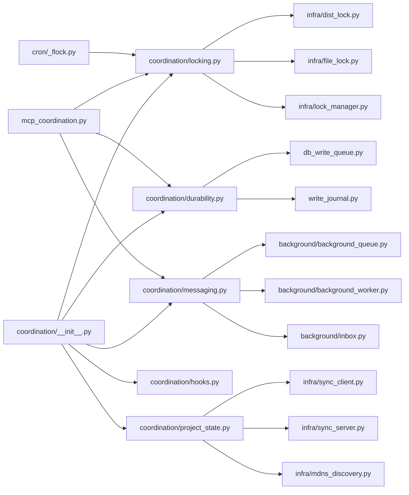

**Diagram sources**
- [coordination/__init__.py](file://coordination/__init__.py)
- [coordination/locking.py](file://coordination/locking.py)
- [coordination/durability.py](file://coordination/durability.py)
- [coordination/messaging.py](file://coordination/messaging.py)
- [coordination/hooks.py](file://coordination/hooks.py)
- [coordination/project_state.py](file://coordination/project_state.py)
- [infra/dist_lock.py](file://infra/dist_lock.py)
- [infra/file_lock.py](file://infra/file_lock.py)
- [infra/lock_manager.py](file://infra/lock_manager.py)
- [background/background_queue.py](file://background/background_queue.py)
- [background/background_worker.py](file://background/background_worker.py)
- [background/inbox.py](file://background/inbox.py)
- [db_write_queue.py](file://db_write_queue.py)
- [write_journal.py](file://write_journal.py)
- [infra/sync_client.py](file://infra/sync_client.py)
- [infra/sync_server.py](file://infra/sync_server.py)
- [infra/mdns_discovery.py](file://infra/mdns_discovery.py)
- [cron/_flock.py](file://cron/_flock.py)
- [mcp_coordination.py](file://mcp_coordination.py)

**Section sources**
- [coordination/__init__.py](file://coordination/__init__.py)
- [coordination/locking.py](file://coordination/locking.py)
- [coordination/durability.py](file://coordination/durability.py)
- [coordination/messaging.py](file://coordination/messaging.py)
- [coordination/hooks.py](file://coordination/hooks.py)
- [coordination/project_state.py](file://coordination/project_state.py)
- [infra/dist_lock.py](file://infra/dist_lock.py)
- [infra/file_lock.py](file://infra/file_lock.py)
- [infra/lock_manager.py](file://infra/lock_manager.py)
- [background/background_queue.py](file://background/background_queue.py)
- [background/background_worker.py](file://background/background_worker.py)
- [background/inbox.py](file://background/inbox.py)
- [db_write_queue.py](file://db_write_queue.py)
- [write_journal.py](file://write_journal.py)
- [infra/sync_client.py](file://infra/sync_client.py)
- [infra/sync_server.py](file://infra/sync_server.py)
- [infra/mdns_discovery.py](file://infra/mdns_discovery.py)
- [cron/_flock.py](file://cron/_flock.py)
- [mcp_coordination.py](file://mcp_coordination.py)

## Performance Considerations
- Lock contention:
  - Use fine-grained keys and short TTLs.
  - Implement exponential backoff and jitter to avoid thundering herds.
- Message throughput:
  - Batch polling and processing; tune batch sizes and timeouts.
  - Partition queues by key to preserve ordering while scaling horizontally.
- CRDT merges:
  - Keep merge functions small and deterministic.
  - Avoid heavy computation inside hot paths; defer to background workers.
- Durable writes:
  - Coalesce writes and use append-only journals.
  - Periodic checkpoints to limit replay cost.
- Discovery and sync:
  - Cache peer lists and debounce re-discovery.
  - Use diffs instead of full snapshots when feasible.

[No sources needed since this section provides general guidance]

## Troubleshooting Guide
Common issues and remedies:
- Stale locks:
  - Verify TTL and heartbeat refresh logic; implement lease expiration checks.
  - Inspect lock manager logs for failed refreshes.
- Duplicate deliveries:
  - Ensure idempotency keys are present and enforced in handlers.
  - Check outbox persistence and ack semantics.
- Ordering violations:
  - Confirm per-key partitioning and monotonic sequence handling.
  - Validate consumer offset tracking.
- Leader flapping:
  - Increase flock hold duration and add stabilization windows.
  - Monitor heartbeat intervals and network latency.
- Sync divergence:
  - Compare state versions and force resync if drift detected.
  - Review MDNS reachability and firewall rules.

**Section sources**
- [infra/lock_manager.py](file://infra/lock_manager.py)
- [coordination/messaging.py](file://coordination/messaging.py)
- [background/background_worker.py](file://background/background_worker.py)
- [cron/_flock.py](file://cron/_flock.py)
- [infra/sync_client.py](file://infra/sync_client.py)
- [infra/sync_server.py](file://infra/sync_server.py)
- [infra/mdns_discovery.py](file://infra/mdns_discovery.py)

## Conclusion
The coordination subsystem blends robust primitives—distributed locks, durable messaging, CRDT-based convergence, and lightweight sync—to deliver consistent, scalable behavior across agents and workers. By combining process-level flock leadership with event-driven pipelines and conflict-free data structures, the system achieves resilience under failures and partitions while maintaining strong operational controls.

[No sources needed since this section summarizes without analyzing specific files]

## Appendices

### Practical Examples

- Implementing custom coordination logic:
  - Wrap critical sections with the lock API and attach hooks for audit and metrics.
  - Publish domain events post-commit to drive asynchronous workflows.
  - Reference: [coordination/locking.py](file://coordination/locking.py), [coordination/hooks.py](file://coordination/hooks.py), [coordination/messaging.py](file://coordination/messaging.py)

- Handling network partitions:
  - Design handlers to be idempotent and tolerant of partial progress.
  - Use CRDT merges to reconcile divergent states upon recovery.
  - Reference: [crdt/crdt_merge.py](file://crdt/crdt_merge.py), [kg/kg_crdt.py](file://kg/kg_crdt.py)

- Debugging distributed transactions:
  - Trace outbox entries and consumer offsets to identify stuck messages.
  - Inspect lock acquisition attempts and refresh cycles.
  - Reference: [coordination/durability.py](file://coordination/durability.py), [background/background_worker.py](file://background/background_worker.py), [infra/lock_manager.py](file://infra/lock_manager.py)

- Monitoring distributed system health:
  - Expose metrics for lock wait times, message backlog, CRDT merge latency, and sync lag.
  - Integrate MCP coordination endpoints for remote diagnostics.
  - Reference: [mcp_coordination.py](file://mcp_coordination.py), [background/background_queue.py](file://background/background_queue.py)

[No sources needed since this section provides general guidance]