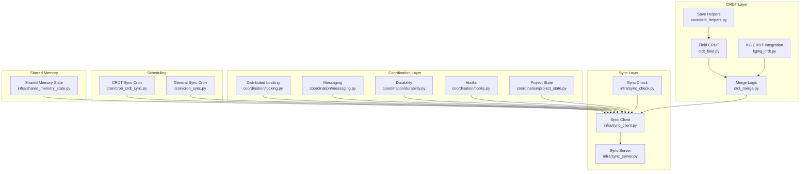
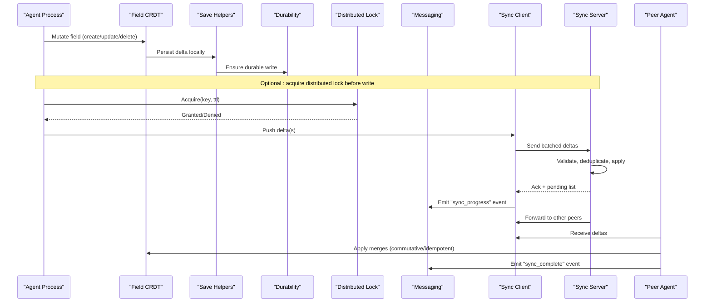
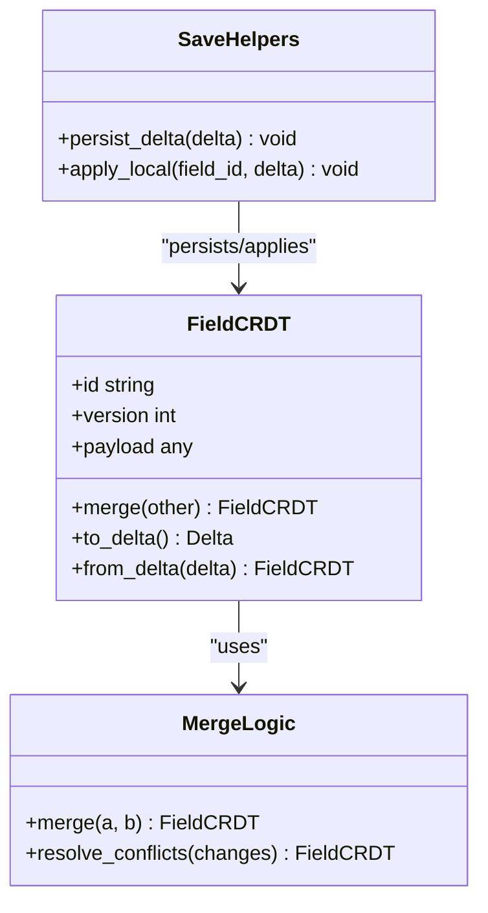
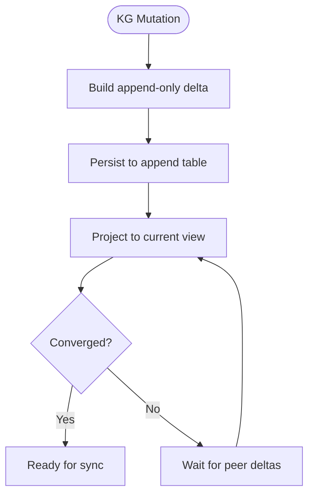
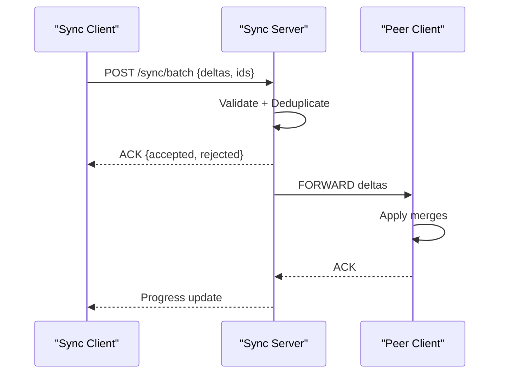
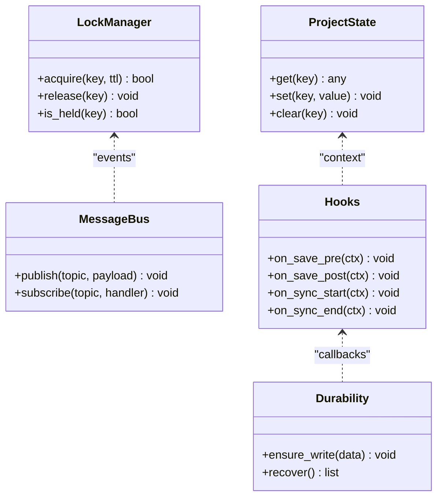
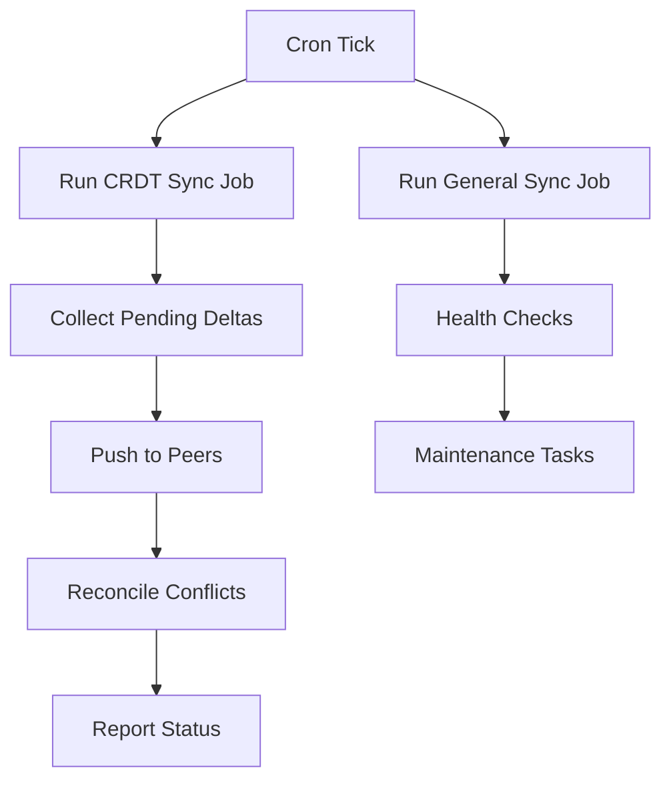
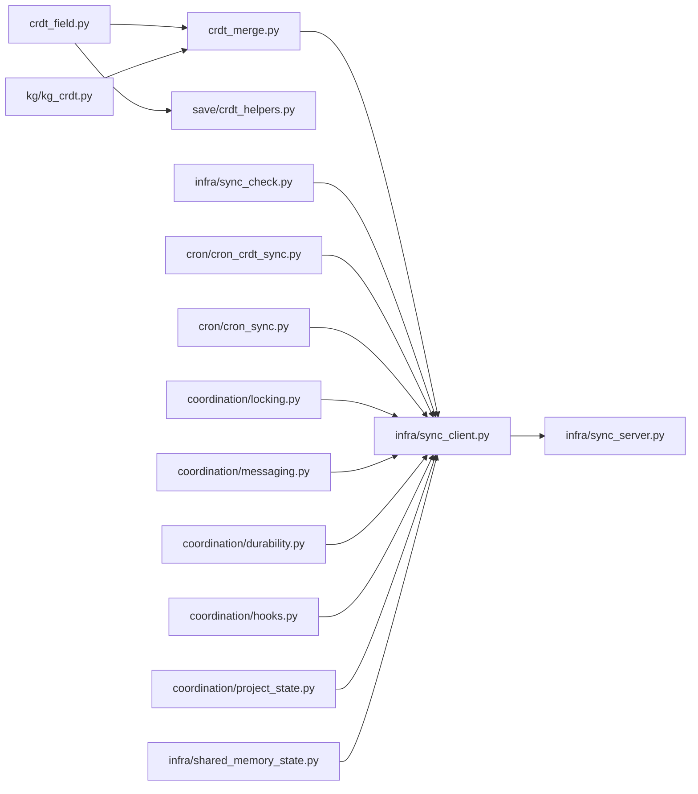

# Multi-Agent Collaboration

<cite>
**Referenced Files in This Document**
- [multi-agent-sync.md](file://docs/concepts/multi-agent-sync.md)
- [MULTI_AGENT.md](file://docs/MULTI_AGENT.md)
- [crdt_field.py](file://agentic_memory/crdt_field.py)
- [crdt_merge.py](file://agentic_memory/crdt_merge.py)
- [sync.py](file://agentic_memory/sync.py)
- [coordination/locking.py](file://coordination/locking.py)
- [coordination/messaging.py](file://coordination/messaging.py)
- [coordination/durability.py](file://coordination/durability.py)
- [coordination/hooks.py](file://coordination/hooks.py)
- [coordination/project_state.py](file://coordination/project_state.py)
- [cron/cron_crdt_sync.py](file://cron/cron_crdt_sync.py)
- [cron/cron_sync.py](file://cron/cron_sync.py)
- [infra/sync_client.py](file://infra/sync_client.py)
- [infra/sync_server.py](file://infra/sync_server.py)
- [infra/sync_check.py](file://infra/sync_check.py)
- [infra/shared_memory_state.py](file://infra/shared_memory_state.py)
- [kg/kg_crdt.py](file://kg/kg_crdt.py)
- [save/crdt_helpers.py](file://save/crdt_helpers.py)
- [test_crdt_sync.py](file://eval/test_crdt_sync.py)
- [test_coordination.py](file://eval/test_coordination.py)
- [test_shared_memory_state.py](file://eval/test_shared_memory_state.py)
</cite>

## Table of Contents
1. [Introduction](#introduction)
2. [Project Structure](#project-structure)
3. [Core Components](#core-components)
4. [Architecture Overview](#architecture-overview)
5. [Detailed Component Analysis](#detailed-component-analysis)
6. [Dependency Analysis](#dependency-analysis)
7. [Performance Considerations](#performance-considerations)
8. [Troubleshooting Guide](#troubleshooting-guide)
9. [Conclusion](#conclusion)
10. [Appendices](#appendices)

## Introduction
This document explains the multi-agent collaboration features, focusing on conflict-free data replication using CRDTs, real-time coordination between agents, tenant isolation, shared memory spaces, and access control policies. It also covers distributed locking, message passing protocols, consistency guarantees, practical setup examples, sync policy configuration, concurrent modification handling, monitoring sync status, debugging conflicts, and optimizing network performance.

## Project Structure
The multi-agent collaboration surface spans several modules:
- CRDT primitives and merge logic for field-level and graph-level structures
- Synchronization client/server for peer-to-peer or server-mediated sync
- Coordination layer providing distributed locks, messaging, durability, hooks, and project state
- Cron jobs that drive periodic CRDT synchronization and general sync tasks
- Shared memory state utilities for cross-process visibility
- Knowledge graph CRDT integration for structured knowledge sharing
- Tests validating behavior under concurrency and network partitions

**Diagram sources**
- [crdt_field.py](file://agentic_memory/crdt_field.py)
- [crdt_merge.py](file://agentic_memory/crdt_merge.py)
- [kg/kg_crdt.py](file://kg/kg_crdt.py)
- [save/crdt_helpers.py](file://save/crdt_helpers.py)
- [infra/sync_client.py](file://infra/sync_client.py)
- [infra/sync_server.py](file://infra/sync_server.py)
- [infra/sync_check.py](file://infra/sync_check.py)
- [coordination/locking.py](file://coordination/locking.py)
- [coordination/messaging.py](file://coordination/messaging.py)
- [coordination/durability.py](file://coordination/durability.py)
- [coordination/hooks.py](file://coordination/hooks.py)
- [coordination/project_state.py](file://coordination/project_state.py)
- [cron/cron_crdt_sync.py](file://cron/cron_crdt_sync.py)
- [cron/cron_sync.py](file://cron/cron_sync.py)
- [infra/shared_memory_state.py](file://infra/shared_memory_state.py)

**Section sources**
- [multi-agent-sync.md](file://docs/concepts/multi-agent-sync.md)
- [MULTI_AGENT.md](file://docs/MULTI_AGENT.md)

## Core Components
- Field-level CRDTs provide per-field versioning and merge semantics to ensure convergence without central coordination.
- Merge logic implements commutative, associative, and idempotent operations to guarantee eventual consistency across peers.
- Sync client/server mediates exchange of CRDT deltas and state snapshots with backpressure and retry strategies.
- Coordination primitives (locks, messages, durability, hooks, project state) enable safe concurrent writes and event-driven updates.
- Cron jobs orchestrate periodic synchronization and health checks.
- Shared memory state exposes lightweight process-local insights useful for diagnostics and local coordination.

**Section sources**
- [crdt_field.py](file://agentic_memory/crdt_field.py)
- [crdt_merge.py](file://agentic_memory/crdt_merge.py)
- [infra/sync_client.py](file://infra/sync_client.py)
- [infra/sync_server.py](file://infra/sync_server.py)
- [coordination/locking.py](file://coordination/locking.py)
- [coordination/messaging.py](file://coordination/messaging.py)
- [coordination/durability.py](file://coordination/durability.py)
- [coordination/hooks.py](file://coordination/hooks.py)
- [coordination/project_state.py](file://coordination/project_state.py)
- [cron/cron_crdt_sync.py](file://cron/cron_crdt_sync.py)
- [cron/cron_sync.py](file://cron/cron_sync.py)
- [infra/shared_memory_state.py](file://infra/shared_memory_state.py)

## Architecture Overview
The system uses a hybrid approach:
- Local CRDT mutations are applied immediately and durably persisted.
- Deltas are propagated via the sync client to peers or a coordinating server.
- The server validates, deduplicates, and forwards to other peers.
- Hooks and project state coordinate side effects and UI/state refreshes.
- Distributed locks protect critical sections when necessary.
- Messaging enables asynchronous notifications for events like lock acquisition or sync completion.

**Diagram sources**
- [crdt_field.py](file://agentic_memory/crdt_field.py)
- [save/crdt_helpers.py](file://save/crdt_helpers.py)
- [coordination/durability.py](file://coordination/durability.py)
- [coordination/locking.py](file://coordination/locking.py)
- [coordination/messaging.py](file://coordination/messaging.py)
- [infra/sync_client.py](file://infra/sync_client.py)
- [infra/sync_server.py](file://infra/sync_server.py)

## Detailed Component Analysis

### CRDT Field Primitives and Merge Semantics
- Field-level CRDTs encapsulate per-field state with unique identifiers and vector clocks or similar metadata to track causality.
- Merge functions implement commutativity, associativity, and idempotence to converge regardless of delivery order or duplicates.
- Save helpers integrate CRDTs into the persistence pipeline, ensuring atomicity and durability of local writes.

**Diagram sources**
- [crdt_field.py](file://agentic_memory/crdt_field.py)
- [crdt_merge.py](file://agentic_memory/crdt_merge.py)
- [save/crdt_helpers.py](file://save/crdt_helpers.py)

**Section sources**
- [crdt_field.py](file://agentic_memory/crdt_field.py)
- [crdt_merge.py](file://agentic_memory/crdt_merge.py)
- [save/crdt_helpers.py](file://save/crdt_helpers.py)

### Knowledge Graph CRDT Integration
- KG CRDT integrates structured entities and relationships with CRDT semantics, enabling conflict-free updates to graphs.
- Append-only design ensures history preservation while projections compute current state.

**Diagram sources**
- [kg/kg_crdt.py](file://kg/kg_crdt.py)

**Section sources**
- [kg/kg_crdt.py](file://kg/kg_crdt.py)

### Sync Client and Server
- The sync client batches deltas, handles retries, and manages backpressure.
- The sync server validates incoming changes, deduplicates, applies them, and fans out to peers.
- Sync check utilities monitor lag and detect anomalies.

**Diagram sources**
- [infra/sync_client.py](file://infra/sync_client.py)
- [infra/sync_server.py](file://infra/sync_server.py)
- [infra/sync_check.py](file://infra/sync_check.py)

**Section sources**
- [infra/sync_client.py](file://infra/sync_client.py)
- [infra/sync_server.py](file://infra/sync_server.py)
- [infra/sync_check.py](file://infra/sync_check.py)

### Coordination Layer: Locking, Messaging, Durability, Hooks, Project State
- Distributed locking prevents conflicting writes to critical resources when needed.
- Messaging provides async notifications for lifecycle events and sync progress.
- Durability ensures writes survive crashes and restarts.
- Hooks allow side effects around save and sync phases.
- Project state tracks global coordination context.

**Diagram sources**
- [coordination/locking.py](file://coordination/locking.py)
- [coordination/messaging.py](file://coordination/messaging.py)
- [coordination/durability.py](file://coordination/durability.py)
- [coordination/hooks.py](file://coordination/hooks.py)
- [coordination/project_state.py](file://coordination/project_state.py)

**Section sources**
- [coordination/locking.py](file://coordination/locking.py)
- [coordination/messaging.py](file://coordination/messaging.py)
- [coordination/durability.py](file://coordination/durability.py)
- [coordination/hooks.py](file://coordination/hooks.py)
- [coordination/project_state.py](file://coordination/project_state.py)

### Cron Jobs for CRDT Sync and General Sync
- CRDT sync cron periodically triggers synchronization cycles, reconciling pending deltas and reporting status.
- General sync cron coordinates broader sync tasks such as health checks and maintenance.

**Diagram sources**
- [cron/cron_crdt_sync.py](file://cron/cron_crdt_sync.py)
- [cron/cron_sync.py](file://cron/cron_sync.py)

**Section sources**
- [cron/cron_crdt_sync.py](file://cron/cron_crdt_sync.py)
- [cron/cron_sync.py](file://cron/cron_sync.py)

### Shared Memory State
- Provides lightweight process-local state for diagnostics and quick coordination signals.
- Useful for monitoring sync progress and debugging within a single host.

**Section sources**
- [infra/shared_memory_state.py](file://infra/shared_memory_state.py)

### Tenant Isolation, Shared Memory Spaces, and Access Control
- Tenant scoping is enforced at the storage and query layers to isolate data across tenants.
- Shared memory spaces can be scoped by tenant to prevent cross-tenant leakage.
- Access control policies restrict who can read/write shared resources and CRDT fields.

**Section sources**
- [multi-agent-sync.md](file://docs/concepts/multi-agent-sync.md)
- [MULTI_AGENT.md](file://docs/MULTI_AGENT.md)

## Dependency Analysis
The following diagram highlights key dependencies among core components:

**Diagram sources**
- [crdt_field.py](file://agentic_memory/crdt_field.py)
- [crdt_merge.py](file://agentic_memory/crdt_merge.py)
- [save/crdt_helpers.py](file://save/crdt_helpers.py)
- [kg/kg_crdt.py](file://kg/kg_crdt.py)
- [infra/sync_client.py](file://infra/sync_client.py)
- [infra/sync_server.py](file://infra/sync_server.py)
- [infra/sync_check.py](file://infra/sync_check.py)
- [cron/cron_crdt_sync.py](file://cron/cron_crdt_sync.py)
- [cron/cron_sync.py](file://cron/cron_sync.py)
- [coordination/locking.py](file://coordination/locking.py)
- [coordination/messaging.py](file://coordination/messaging.py)
- [coordination/durability.py](file://coordination/durability.py)
- [coordination/hooks.py](file://coordination/hooks.py)
- [coordination/project_state.py](file://coordination/project_state.py)
- [infra/shared_memory_state.py](file://infra/shared_memory_state.py)

**Section sources**
- [crdt_field.py](file://agentic_memory/crdt_field.py)
- [crdt_merge.py](file://agentic_memory/crdt_merge.py)
- [save/crdt_helpers.py](file://save/crdt_helpers.py)
- [kg/kg_crdt.py](file://kg/kg_crdt.py)
- [infra/sync_client.py](file://infra/sync_client.py)
- [infra/sync_server.py](file://infra/sync_server.py)
- [infra/sync_check.py](file://infra/sync_check.py)
- [cron/cron_crdt_sync.py](file://cron/cron_crdt_sync.py)
- [cron/cron_sync.py](file://cron/cron_sync.py)
- [coordination/locking.py](file://coordination/locking.py)
- [coordination/messaging.py](file://coordination/messaging.py)
- [coordination/durability.py](file://coordination/durability.py)
- [coordination/hooks.py](file://coordination/hooks.py)
- [coordination/project_state.py](file://coordination/project_state.py)
- [infra/shared_memory_state.py](file://infra/shared_memory_state.py)

## Performance Considerations
- Batch deltas to reduce network overhead; tune batch size based on payload and latency.
- Use backpressure in the sync client to avoid overwhelming peers during bursts.
- Prefer append-only CRDT designs to minimize expensive rewrites.
- Leverage hooks to perform lightweight pre/post processing instead of heavy computations during sync.
- Monitor sync lag and adjust cron intervals to balance freshness and load.
- Scope shared memory state to tenant boundaries to reduce contention.

[No sources needed since this section provides general guidance]

## Troubleshooting Guide
- Monitoring sync status:
  - Use sync check utilities to inspect lag and anomalies.
  - Observe messaging events for progress and completion signals.
- Debugging conflicts:
  - Inspect CRDT merge logs and delta histories.
  - Verify merge function properties (commutativity, associativity, idempotence).
- Network issues:
  - Check client/server connectivity and retry/backoff settings.
  - Validate server-side validation and deduplication logs.
- Lock contention:
  - Review lock acquisition patterns and TTLs.
  - Ensure proper release paths in error branches.
- Tenant isolation:
  - Confirm tenant IDs are attached to all mutations and queries.
  - Validate access control policies for shared resources.

**Section sources**
- [infra/sync_check.py](file://infra/sync_check.py)
- [coordination/messaging.py](file://coordination/messaging.py)
- [crdt_merge.py](file://agentic_memory/crdt_merge.py)
- [infra/sync_client.py](file://infra/sync_client.py)
- [infra/sync_server.py](file://infra/sync_server.py)
- [coordination/locking.py](file://coordination/locking.py)
- [multi-agent-sync.md](file://docs/concepts/multi-agent-sync.md)

## Conclusion
Multi-agent collaboration in this system is built on robust CRDT primitives, reliable sync client/server communication, and a coordination layer that provides locking, messaging, durability, hooks, and project state. With careful configuration of sync policies, monitoring, and access controls, teams can achieve consistent, scalable, and secure collaboration across agents and tenants.

[No sources needed since this section summarizes without analyzing specific files]

## Appendices

### Practical Setup Examples
- Setting up a multi-agent environment:
  - Initialize agents with CRDT-enabled fields and configure sync endpoints.
  - Enable cron jobs for CRDT sync and general sync tasks.
- Configuring sync policies:
  - Tune batch sizes, retry limits, and backoff strategies in the sync client.
  - Set appropriate TTLs for distributed locks and hook timeouts.
- Handling concurrent modifications:
  - Use distributed locks for critical sections where necessary.
  - Rely on CRDT merge semantics for automatic conflict resolution.

**Section sources**
- [cron/cron_crdt_sync.py](file://cron/cron_crdt_sync.py)
- [cron/cron_sync.py](file://cron/cron_sync.py)
- [infra/sync_client.py](file://infra/sync_client.py)
- [coordination/locking.py](file://coordination/locking.py)
- [crdt_merge.py](file://agentic_memory/crdt_merge.py)

### Monitoring and Diagnostics
- Use shared memory state for local diagnostics.
- Subscribe to messaging topics for sync progress and errors.
- Periodically run sync checks to detect drift and reconcile.

**Section sources**
- [infra/shared_memory_state.py](file://infra/shared_memory_state.py)
- [coordination/messaging.py](file://coordination/messaging.py)
- [infra/sync_check.py](file://infra/sync_check.py)

### Validation and Tests
- Refer to tests for CRDT sync behavior, coordination primitives, and shared memory state to understand expected outcomes and edge cases.

**Section sources**
- [test_crdt_sync.py](file://eval/test_crdt_sync.py)
- [test_coordination.py](file://eval/test_coordination.py)
- [test_shared_memory_state.py](file://eval/test_shared_memory_state.py)