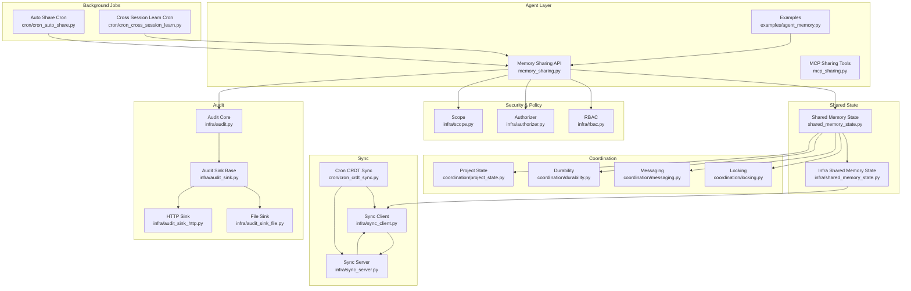
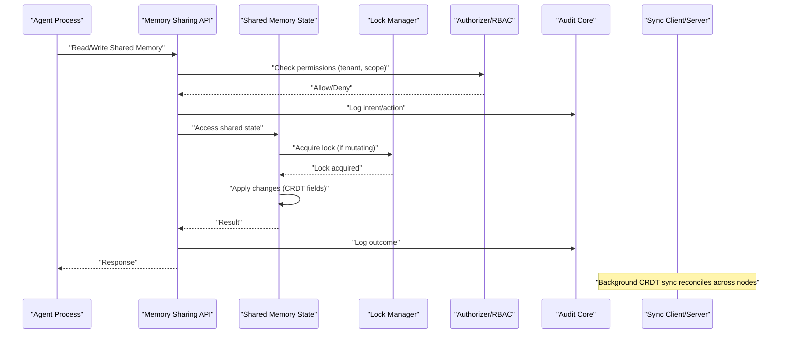
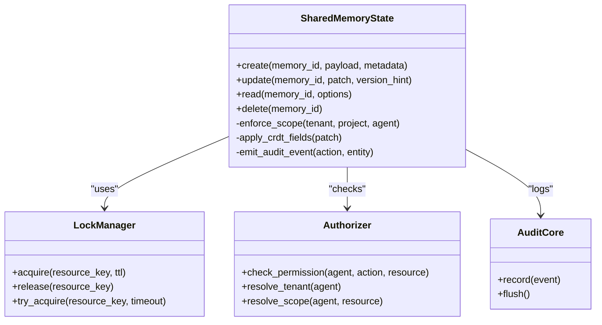
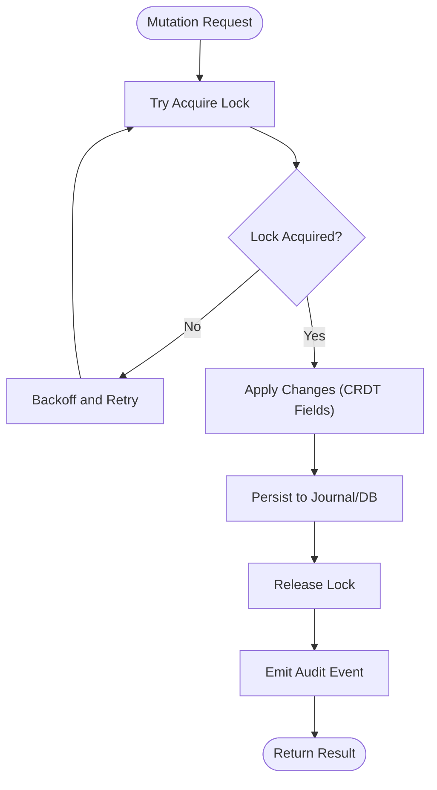
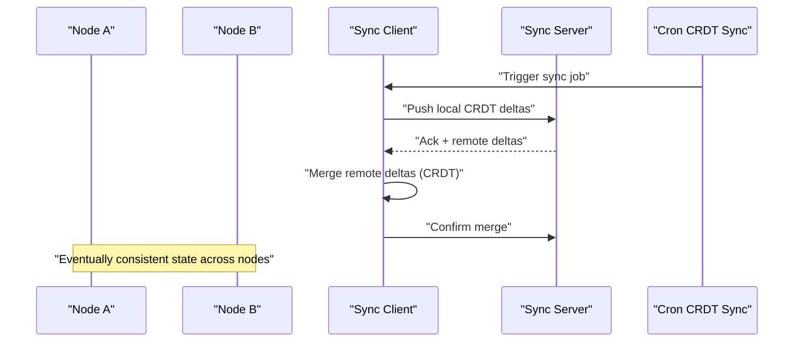
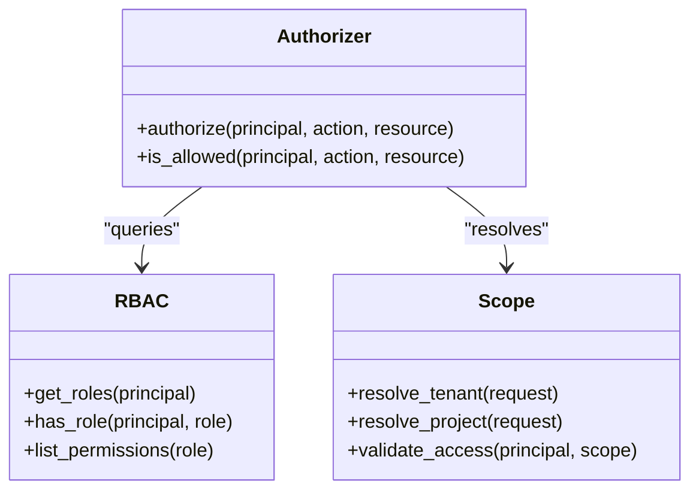
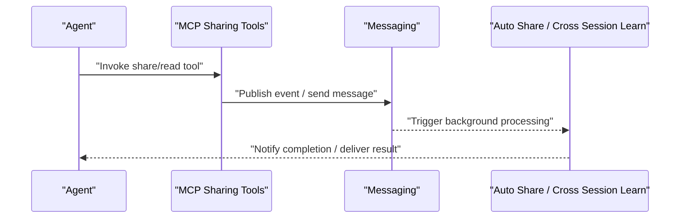
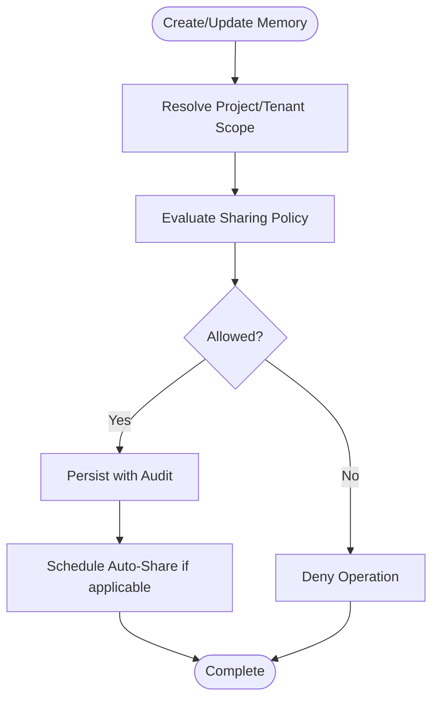
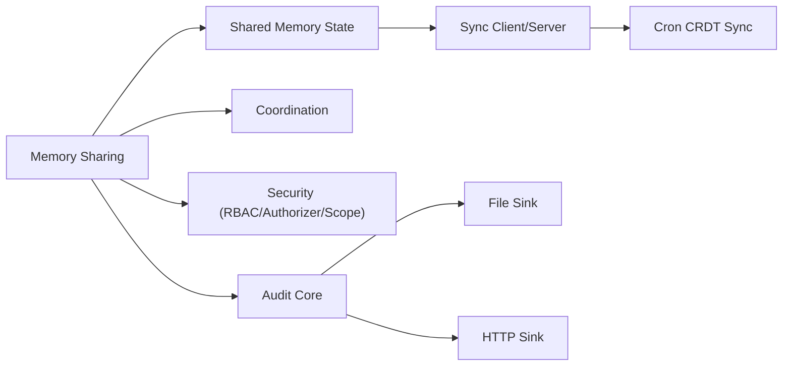

# Shared Memory Spaces

<cite>
**Referenced Files in This Document**
- [shared_memory_state.py](file://shared_memory_state.py)
- [memory_sharing.py](file://memory_sharing.py)
- [mcp_sharing.py](file://mcp_sharing.py)
- [coordination/messaging.py](file://coordination/messaging.py)
- [coordination/locking.py](file://coordination/locking.py)
- [coordination/durability.py](file://coordination/durability.py)
- [coordination/project_state.py](file://coordination/project_state.py)
- [infra/shared_memory_state.py](file://infra/shared_memory_state.py)
- [infra/sync_client.py](file://infra/sync_client.py)
- [infra/sync_server.py](file://infra/sync_server.py)
- [infra/rbac.py](file://infra/rbac.py)
- [infra/authorizer.py](file://infra/authorizer.py)
- [infra/scope.py](file://infra/scope.py)
- [infra/audit.py](file://infra/audit.py)
- [infra/audit_sink.py](file://infra/audit_sink.py)
- [infra/audit_sink_file.py](file://infra/audit_sink_file.py)
- [infra/audit_sink_http.py](file://infra/audit_sink_http.py)
- [infra/lock_manager.py](file://infra/lock_manager.py)
- [infra/db_write_queue.py](file://infra/db_write_queue.py)
- [cron/cron_crdt_sync.py](file://cron/cron_crdt_sync.py)
- [cron/cron_auto_share.py](file://cron/cron_auto_share.py)
- [cron/cron_cross_session_learn.py](file://cron/cross_session_learn.py)
- [examples/agent_memory.py](file://examples/agent_memory.py)
- [docs/concepts/multi-agent-sync.md](file://docs/concepts/multi-agent-sync.md)
- [docs/security/tenant_isolation.md](file://docs/security/tenant_isolation.md)
- [docs/reference/configuration.md](file://docs/reference/configuration.md)
</cite>

## Table of Contents
1. [Introduction](#introduction)
2. [Project Structure](#project-structure)
3. [Core Components](#core-components)
4. [Architecture Overview](#architecture-overview)
5. [Detailed Component Analysis](#detailed-component-analysis)
6. [Dependency Analysis](#dependency-analysis)
7. [Performance Considerations](#performance-considerations)
8. [Troubleshooting Guide](#troubleshooting-guide)
9. [Conclusion](#conclusion)
10. [Appendices](#appendices)

## Introduction
This document explains how shared memory spaces and agent collaboration patterns are implemented, focusing on safe concurrent access, tenant isolation, scope-based access control, project-based organization, cross-agent communication protocols, data sharing policies, configuration, security, audit logging, and monitoring. It is intended for developers integrating multiple agents into a collaborative environment using the repository’s shared memory subsystems.

## Project Structure
The shared memory and collaboration features span several layers:
- High-level APIs and examples for agents to read/write shared memories
- Coordination primitives (locking, messaging, durability, project state)
- Sync layer for multi-process/multi-host consistency
- Security and policy enforcement (RBAC, authorizer, scopes)
- Audit logging and sinks
- Background jobs for CRDT sync, auto-sharing, and cross-session learning

**Diagram sources**
- [examples/agent_memory.py](file://examples/agent_memory.py)
- [memory_sharing.py](file://memory_sharing.py)
- [mcp_sharing.py](file://mcp_sharing.py)
- [shared_memory_state.py](file://shared_memory_state.py)
- [infra/shared_memory_state.py](file://infra/shared_memory_state.py)
- [coordination/locking.py](file://coordination/locking.py)
- [coordination/messaging.py](file://coordination/messaging.py)
- [coordination/durability.py](file://coordination/durability.py)
- [coordination/project_state.py](file://coordination/project_state.py)
- [infra/sync_client.py](file://infra/sync_client.py)
- [infra/sync_server.py](file://infra/sync_server.py)
- [cron/cron_crdt_sync.py](file://cron/cron_crdt_sync.py)
- [infra/rbac.py](file://infra/rbac.py)
- [infra/authorizer.py](file://infra/authorizer.py)
- [infra/scope.py](file://infra/scope.py)
- [infra/audit.py](file://infra/audit.py)
- [infra/audit_sink.py](file://infra/audit_sink.py)
- [infra/audit_sink_file.py](file://infra/audit_sink_file.py)
- [infra/audit_sink_http.py](file://infra/audit_sink_http.py)
- [cron/cron_auto_share.py](file://cron/cron_auto_share.py)
- [cron/cron_cross_session_learn.py](file://cron/cron_cross_session_learn.py)

**Section sources**
- [docs/concepts/multi-agent-sync.md](file://docs/concepts/multi-agent-sync.md)
- [docs/security/tenant_isolation.md](file://docs/security/tenant_isolation.md)
- [docs/reference/configuration.md](file://docs/reference/configuration.md)

## Core Components
- Shared memory state management provides the primary interface for reading and writing shared memories across agents.
- Coordination layer ensures safe concurrent access via distributed locks, durable operations, and project-scoped state.
- Messaging enables asynchronous inter-agent communication through events or channels.
- Sync layer reconciles state across processes/nodes using CRDTs and background synchronization.
- Security layer enforces tenant isolation, RBAC, and scope-based authorization.
- Audit subsystem records all relevant actions with pluggable sinks.

Key responsibilities:
- Safe mutation under contention
- Tenant-aware scoping and access control
- Cross-agent discovery and communication
- Consistency guarantees via CRDTs and durable writes
- Observability and auditing

**Section sources**
- [shared_memory_state.py](file://shared_memory_state.py)
- [infra/shared_memory_state.py](file://infra/shared_memory_state.py)
- [coordination/locking.py](file://coordination/locking.py)
- [coordination/messaging.py](file://coordination/messaging.py)
- [coordination/durability.py](file://coordination/durability.py)
- [coordination/project_state.py](file://coordination/project_state.py)
- [infra/rbac.py](file://infra/rbac.py)
- [infra/authorizer.py](file://infra/authorizer.py)
- [infra/scope.py](file://infra/scope.py)
- [infra/audit.py](file://infra/audit.py)

## Architecture Overview
The system separates concerns between high-level APIs, coordination primitives, persistence and sync, and security/audit. Agents interact with shared memory through stable APIs that automatically apply locking, scoping, and auditing. The sync layer maintains eventual consistency across nodes using CRDTs and scheduled reconciliation.

**Diagram sources**
- [memory_sharing.py](file://memory_sharing.py)
- [shared_memory_state.py](file://shared_memory_state.py)
- [infra/lock_manager.py](file://infra/lock_manager.py)
- [infra/authorizer.py](file://infra/authorizer.py)
- [infra/rbac.py](file://infra/rbac.py)
- [infra/audit.py](file://infra/audit.py)
- [infra/sync_client.py](file://infra/sync_client.py)
- [infra/sync_server.py](file://infra/sync_server.py)

## Detailed Component Analysis

### Shared Memory State Management
Responsibilities:
- Provide typed interfaces for creating, updating, and querying shared memories
- Enforce tenant and project scoping
- Integrate with CRDT field-level updates for safe merges
- Emit audit events for mutations

Concurrency model:
- Mutations acquire distributed locks keyed by resource identifiers
- Reads may be lock-free depending on consistency requirements
- Writes are persisted via durable queues and backfilled by workers

**Diagram sources**
- [shared_memory_state.py](file://shared_memory_state.py)
- [infra/shared_memory_state.py](file://infra/shared_memory_state.py)
- [infra/lock_manager.py](file://infra/lock_manager.py)
- [infra/authorizer.py](file://infra/authorizer.py)
- [infra/rbac.py](file://infra/rbac.py)
- [infra/audit.py](file://infra/audit.py)

**Section sources**
- [shared_memory_state.py](file://shared_memory_state.py)
- [infra/shared_memory_state.py](file://infra/shared_memory_state.py)

### Coordination Primitives
- Locking: Distributed locks ensure exclusive access during critical sections; supports timeouts and retry strategies.
- Messaging: Asynchronous event bus for cross-agent notifications and workflow triggers.
- Durability: Write-ahead journaling and idempotent operations to survive crashes.
- Project State: Maintains per-project context and lifecycle hooks.

**Diagram sources**
- [coordination/locking.py](file://coordination/locking.py)
- [coordination/durability.py](file://coordination/durability.py)
- [coordination/messaging.py](file://coordination/messaging.py)
- [coordination/project_state.py](file://coordination/project_state.py)

**Section sources**
- [coordination/locking.py](file://coordination/locking.py)
- [coordination/durability.py](file://coordination/durability.py)
- [coordination/messaging.py](file://coordination/messaging.py)
- [coordination/project_state.py](file://coordination/project_state.py)

### Sync Layer and CRDT Reconciliation
- Sync client/server pair coordinates state propagation across processes and hosts.
- CRDT fields enable conflict-free merges for concurrent edits.
- Cron job periodically triggers sync tasks and resolves drift.

**Diagram sources**
- [infra/sync_client.py](file://infra/sync_client.py)
- [infra/sync_server.py](file://infra/sync_server.py)
- [cron/cron_crdt_sync.py](file://cron/cron_crdt_sync.py)

**Section sources**
- [infra/sync_client.py](file://infra/sync_client.py)
- [infra/sync_server.py](file://infra/sync_server.py)
- [cron/cron_crdt_sync.py](file://cron/cron_crdt_sync.py)

### Security Model: Tenant Isolation, Scopes, and RBAC
- Tenant isolation ensures data separation at query and write paths.
- Scope-based access control restricts operations to specific projects or resources.
- RBAC defines roles and permissions; authorizer enforces decisions.

**Diagram sources**
- [infra/rbac.py](file://infra/rbac.py)
- [infra/authorizer.py](file://infra/authorizer.py)
- [infra/scope.py](file://infra/scope.py)

**Section sources**
- [infra/rbac.py](file://infra/rbac.py)
- [infra/authorizer.py](file://infra/authorizer.py)
- [infra/scope.py](file://infra/scope.py)
- [docs/security/tenant_isolation.md](file://docs/security/tenant_isolation.md)

### Cross-Agent Communication Protocols
- MCP tools expose sharing capabilities to agents.
- Messaging primitives support pub/sub or request/response patterns.
- Auto-share and cross-session learn jobs coordinate knowledge flow.

**Diagram sources**
- [mcp_sharing.py](file://mcp_sharing.py)
- [coordination/messaging.py](file://coordination/messaging.py)
- [cron/cron_auto_share.py](file://cron/cron_auto_share.py)
- [cron/cron_cross_session_learn.py](file://cron/cron_cross_session_learn.py)

**Section sources**
- [mcp_sharing.py](file://mcp_sharing.py)
- [coordination/messaging.py](file://coordination/messaging.py)
- [cron/cron_auto_share.py](file://cron/cron_auto_share.py)
- [cron/cron_cross_session_learn.py](file://cron/cron_cross_session_learn.py)

### Data Sharing Policies and Project-Based Organization
- Project-based scoping organizes memories by project boundaries.
- Policies govern who can read/write within a project and across tenants.
- Auto-share mechanisms propagate approved content according to policy.

**Diagram sources**
- [coordination/project_state.py](file://coordination/project_state.py)
- [infra/scope.py](file://infra/scope.py)
- [infra/rbac.py](file://infra/rbac.py)
- [cron/cron_auto_share.py](file://cron/cron_auto_share.py)

**Section sources**
- [coordination/project_state.py](file://coordination/project_state.py)
- [infra/scope.py](file://infra/scope.py)
- [infra/rbac.py](file://infra/rbac.py)
- [cron/cron_auto_share.py](file://cron/cron_auto_share.py)

## Dependency Analysis
High-level dependencies among core components:
- Memory sharing depends on shared memory state, coordination, security, and audit.
- Sync layer depends on sync client/server and cron jobs.
- Security depends on RBAC and scope resolution.
- Audit depends on sink implementations.

**Diagram sources**
- [memory_sharing.py](file://memory_sharing.py)
- [shared_memory_state.py](file://shared_memory_state.py)
- [infra/shared_memory_state.py](file://infra/shared_memory_state.py)
- [coordination/locking.py](file://coordination/locking.py)
- [coordination/messaging.py](file://coordination/messaging.py)
- [coordination/durability.py](file://coordination/durability.py)
- [infra/rbac.py](file://infra/rbac.py)
- [infra/authorizer.py](file://infra/authorizer.py)
- [infra/scope.py](file://infra/scope.py)
- [infra/audit.py](file://infra/audit.py)
- [infra/audit_sink_file.py](file://infra/audit_sink_file.py)
- [infra/audit_sink_http.py](file://infra/audit_sink_http.py)
- [infra/sync_client.py](file://infra/sync_client.py)
- [infra/sync_server.py](file://infra/sync_server.py)
- [cron/cron_crdt_sync.py](file://cron/cron_crdt_sync.py)

**Section sources**
- [memory_sharing.py](file://memory_sharing.py)
- [shared_memory_state.py](file://shared_memory_state.py)
- [infra/shared_memory_state.py](file://infra/shared_memory_state.py)
- [coordination/locking.py](file://coordination/locking.py)
- [coordination/messaging.py](file://coordination/messaging.py)
- [coordination/durability.py](file://coordination/durability.py)
- [infra/rbac.py](file://infra/rbac.py)
- [infra/authorizer.py](file://infra/authorizer.py)
- [infra/scope.py](file://infra/scope.py)
- [infra/audit.py](file://infra/audit.py)
- [infra/audit_sink_file.py](file://infra/audit_sink_file.py)
- [infra/audit_sink_http.py](file://infra/audit_sink_http.py)
- [infra/sync_client.py](file://infra/sync_client.py)
- [infra/sync_server.py](file://infra/sync_server.py)
- [cron/cron_crdt_sync.py](file://cron/cron_crdt_sync.py)

## Performance Considerations
- Prefer batched writes and idempotent operations to reduce contention.
- Use lock timeouts and exponential backoff to avoid deadlocks.
- Enable CRDT merges to minimize conflict resolution overhead.
- Tune sync intervals based on workload characteristics.
- Monitor queue depths and audit sink throughput to prevent bottlenecks.

[No sources needed since this section provides general guidance]

## Troubleshooting Guide
Common issues and diagnostics:
- Permission denied errors: verify tenant and scope resolution, RBAC roles, and principal identities.
- Lock contention spikes: review lock keys, TTLs, and retry strategies; consider coalescing writes.
- Sync lag: check sync server health, network connectivity, and cron scheduling.
- Audit gaps: validate sink configurations and delivery status.

Operational checks:
- Inspect audit logs via file or HTTP sinks.
- Review sync client/server metrics and error counters.
- Validate project state and scope bindings.

**Section sources**
- [infra/audit_sink_file.py](file://infra/audit_sink_file.py)
- [infra/audit_sink_http.py](file://infra/audit_sink_http.py)
- [infra/audit.py](file://infra/audit.py)
- [infra/sync_client.py](file://infra/sync_client.py)
- [infra/sync_server.py](file://infra/sync_server.py)
- [infra/lock_manager.py](file://infra/lock_manager.py)
- [infra/db_write_queue.py](file://infra/db_write_queue.py)

## Conclusion
The shared memory subsystem provides a robust foundation for multi-agent collaboration with strong safety, isolation, and observability guarantees. By combining coordinated access, CRDT-based consistency, tenant-aware scoping, and comprehensive auditing, teams can build secure and scalable collaborative workflows. Proper configuration and monitoring ensure reliability and performance in production environments.

[No sources needed since this section summarizes without analyzing specific files]

## Appendices

### Configuration Examples
- Define tenant isolation settings and default scopes for projects.
- Configure RBAC roles and permission mappings for agents.
- Set up audit sinks (file and HTTP) and retention policies.
- Adjust sync intervals and CRDT merge parameters.

For detailed configuration keys and defaults, refer to the reference documentation.

**Section sources**
- [docs/reference/configuration.md](file://docs/reference/configuration.md)

### Usage Example Path
- See the example demonstrating agent interaction with shared memory.

**Section sources**
- [examples/agent_memory.py](file://examples/agent_memory.py)