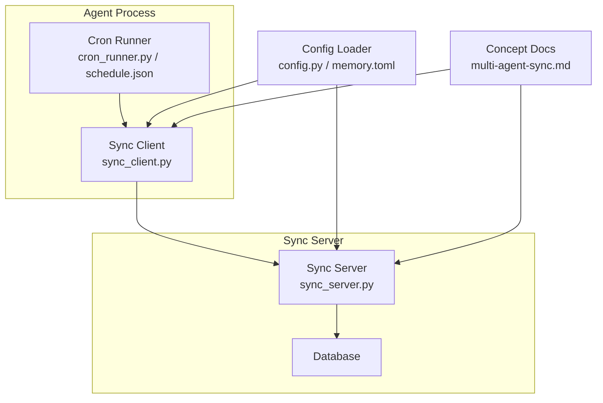
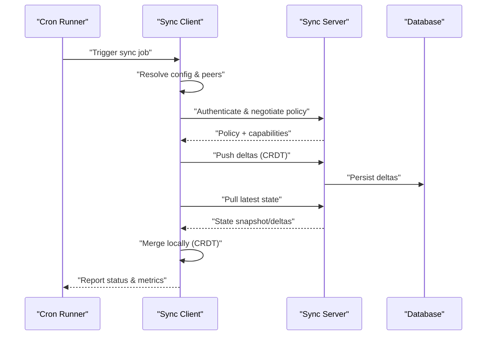
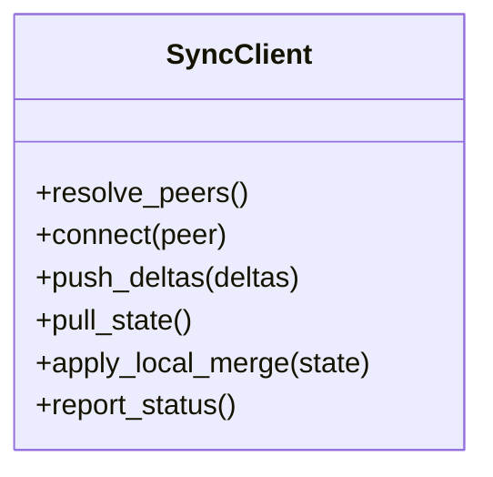
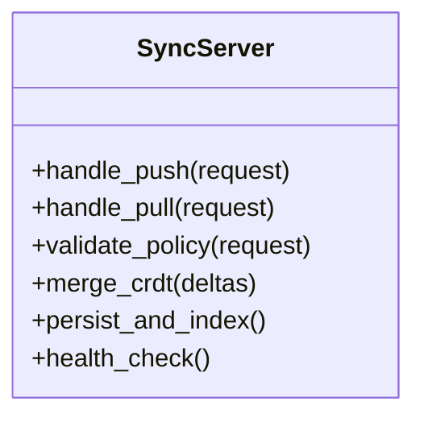
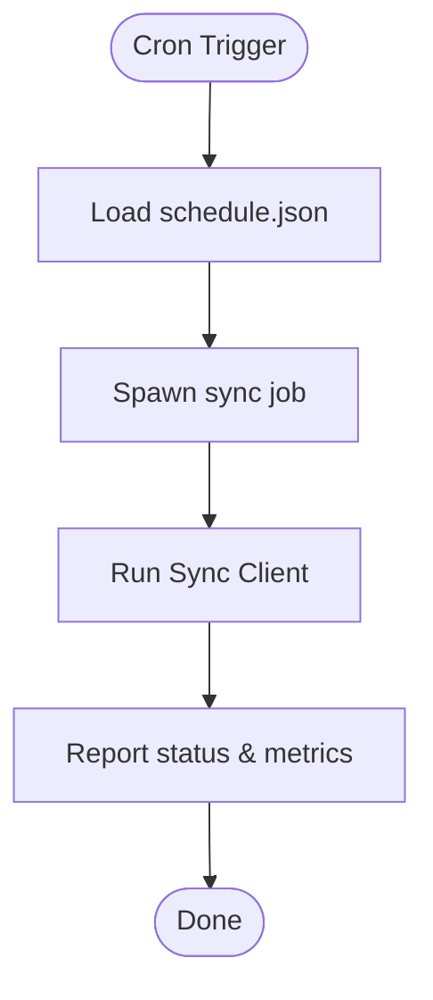
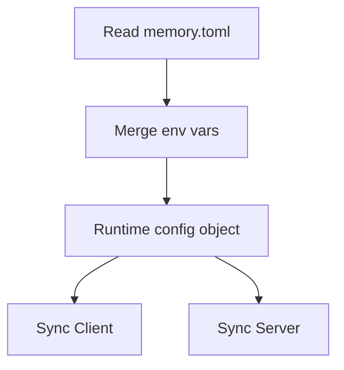
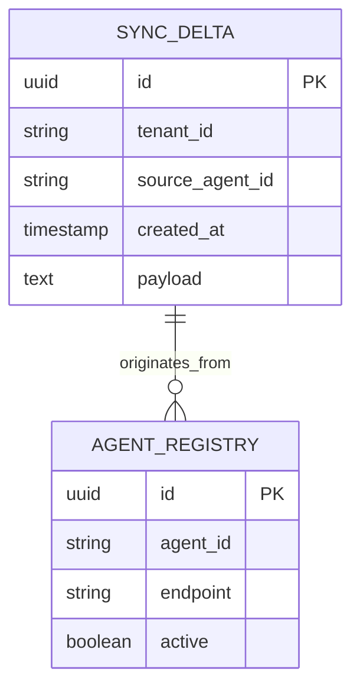
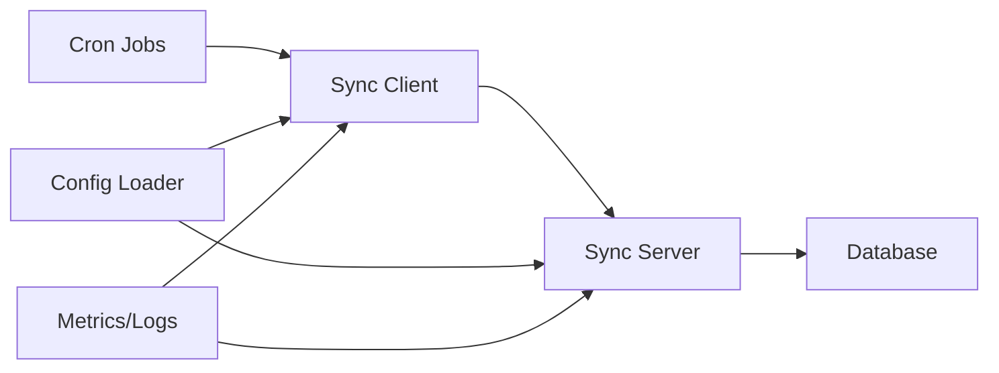

# Sync Configuration and Management

<cite>
**Referenced Files in This Document**
- [sync.py](file://agentic_memory/sync.py)
- [sync_client.py](file://infra/sync_client.py)
- [sync_server.py](file://infra/sync_server.py)
- [cron_crdt_sync.py](file://cron/cron_crdt_sync.py)
- [cron_sync.py](file://cron/cron_sync.py)
- [memory.toml](file://memory.toml)
- [config.py](file://infra/config.py)
- [env_vars.md](file://docs/env_vars.md)
- [multi-agent-sync.md](file://docs/concepts/multi-agent-sync.md)
- [architecture.md](file://docs/architecture.md)
- [self-hosting.md](file://docs/self-hosting.md)
- [docker-compose.yml](file://docker-compose.yml)
- [start_services.sh](file://scripts/start_services.sh)
- [cron_runner.py](file://docker/cron_runner.py)
- [schedule.json](file://docker/schedule.json)
- [test_sync_check.py](file://eval/test_sync_check.py)
- [test_sync_layer.py](file://eval/test_sync_layer.py)
- [test_sync_tenant_isolation.py](file://eval/test_sync_tenant_isolation.py)
- [test_security_sync_auth.py](file://eval/test_security_sync_auth.py)
- [test_sync_server_tls.py](file://eval/test_sync_server_tls.py)
- [test_multi_agent_unit.py](file://eval/test_multi_agent_unit.py)
</cite>

## Table of Contents
1. [Introduction](#introduction)
2. [Project Structure](#project-structure)
3. [Core Components](#core-components)
4. [Architecture Overview](#architecture-overview)
5. [Detailed Component Analysis](#detailed-component-analysis)
6. [Dependency Analysis](#dependency-analysis)
7. [Performance Considerations](#performance-considerations)
8. [Troubleshooting Guide](#troubleshooting-guide)
9. [Conclusion](#conclusion)
10. [Appendices](#appendices)

## Introduction
This document explains how to configure and manage multi-agent synchronization across nodes or processes. It covers sync policy configuration, network topology setup, connection management, scheduling, bandwidth throttling, conflict resolution, monitoring, logging, and troubleshooting connectivity issues. It also provides practical deployment examples, firewall/proxy guidance, performance optimization tips, and procedures for backup/restore, disaster recovery, and migration between sync configurations.

## Project Structure
The repository implements a client-server sync model with CRDT-based merging, cron-driven scheduling, and robust observability. Key areas:
- Client-side sync orchestration and transport
- Server-side sync endpoints and persistence
- Cron jobs that drive periodic sync tasks
- Configuration via TOML and environment variables
- Tests validating behavior under isolation, security, and TLS

**Diagram sources**
- [sync_client.py](file://infra/sync_client.py)
- [sync_server.py](file://infra/sync_server.py)
- [cron_runner.py](file://docker/cron_runner.py)
- [schedule.json](file://docker/schedule.json)
- [config.py](file://infra/config.py)
- [memory.toml](file://memory.toml)
- [multi-agent-sync.md](file://docs/concepts/multi-agent-sync.md)

**Section sources**
- [sync_client.py](file://infra/sync_client.py)
- [sync_server.py](file://infra/sync_server.py)
- [cron_crdt_sync.py](file://cron/cron_crdt_sync.py)
- [cron_sync.py](file://cron/cron_sync.py)
- [config.py](file://infra/config.py)
- [memory.toml](file://memory.toml)
- [multi-agent-sync.md](file://docs/concepts/multi-agent-sync.md)

## Core Components
- Sync client: manages outbound connections, retries, backoff, and local state updates.
- Sync server: exposes endpoints for peers to push/pull changes, enforces policies, and persists CRDT deltas.
- Cron subsystem: schedules sync runs, health checks, and maintenance tasks.
- Configuration: centralized loading from TOML and environment variables; runtime overrides where applicable.
- Observability: metrics, logs, and health endpoints to monitor sync status and latency.

Key responsibilities:
- Policy enforcement (who can sync, what data is shared, rate limits).
- Network topology discovery and peer management.
- Conflict-free merging using CRDTs.
- Secure transport (TLS, auth).
- Resilient retries and idempotency.

**Section sources**
- [sync_client.py](file://infra/sync_client.py)
- [sync_server.py](file://infra/sync_server.py)
- [cron_crdt_sync.py](file://cron/cron_crdt_sync.py)
- [cron_sync.py](file://cron/cron_sync.py)
- [config.py](file://infra/config.py)
- [memory.toml](file://memory.toml)

## Architecture Overview
The system uses a client-server architecture with optional mesh-like topologies through multiple server endpoints. Clients periodically initiate sync cycles driven by cron jobs. The server applies CRDT merges and persists changes. Policies control tenant isolation, authentication, and rate limiting.

**Diagram sources**
- [cron_runner.py](file://docker/cron_runner.py)
- [schedule.json](file://docker/schedule.json)
- [sync_client.py](file://infra/sync_client.py)
- [sync_server.py](file://infra/sync_server.py)

**Section sources**
- [multi-agent-sync.md](file://docs/concepts/multi-agent-sync.md)
- [architecture.md](file://docs/architecture.md)

## Detailed Component Analysis

### Sync Client
Responsibilities:
- Resolve configured peers and endpoints.
- Establish secure connections (TLS), handle auth tokens.
- Implement retry/backoff and circuit breaking.
- Build and send CRDT delta payloads; apply received deltas.
- Track sync status and emit metrics/logs.

Operational notes:
- Uses configuration from the central loader and environment variables.
- Supports multiple target servers for fan-out or failover topologies.
- Enforces per-peer policy constraints (rate limits, allowed scopes).

**Diagram sources**
- [sync_client.py](file://infra/sync_client.py)

**Section sources**
- [sync_client.py](file://infra/sync_client.py)
- [config.py](file://infra/config.py)
- [memory.toml](file://memory.toml)

### Sync Server
Responsibilities:
- Expose REST/gRPC endpoints for push/pull operations.
- Validate requests, enforce tenant isolation and RBAC.
- Apply CRDT merges deterministically.
- Persist changes and maintain indexes.
- Provide health, metrics, and log endpoints.

Security:
- TLS termination and certificate validation.
- Authentication and authorization checks.
- Rate limiting and request quotas.

**Diagram sources**
- [sync_server.py](file://infra/sync_server.py)

**Section sources**
- [sync_server.py](file://infra/sync_server.py)
- [test_security_sync_auth.py](file://eval/test_security_sync_auth.py)
- [test_sync_server_tls.py](file://eval/test_sync_server_tls.py)

### Cron Scheduling
Responsibilities:
- Schedule periodic sync jobs and health checks.
- Manage task timeouts and retries.
- Integrate with containerized runners and OS-level crontab.

Configuration:
- Job definitions and intervals are defined centrally.
- Overrides via environment variables and TOML.

**Diagram sources**
- [cron_runner.py](file://docker/cron_runner.py)
- [schedule.json](file://docker/schedule.json)
- [cron_crdt_sync.py](file://cron/cron_crdt_sync.py)
- [cron_sync.py](file://cron/cron_sync.py)

**Section sources**
- [cron_crdt_sync.py](file://cron/cron_crdt_sync.py)
- [cron_sync.py](file://cron/cron_sync.py)
- [cron_runner.py](file://docker/cron_runner.py)
- [schedule.json](file://docker/schedule.json)

### Configuration Model
Centralized configuration includes:
- Sync policy: enabled flags, peer lists, scope rules, rate limits.
- Network settings: endpoints, timeouts, TLS options, proxy support.
- Scheduling: intervals, concurrency, backoff strategies.
- Security: auth schemes, token rotation, tenant isolation.

Sources:
- TOML file for declarative configuration.
- Environment variables for runtime overrides.
- Config loader module for unified access.

**Diagram sources**
- [memory.toml](file://memory.toml)
- [config.py](file://infra/config.py)
- [env_vars.md](file://docs/env_vars.md)

**Section sources**
- [memory.toml](file://memory.toml)
- [config.py](file://infra/config.py)
- [env_vars.md](file://docs/env_vars.md)

### Data Models and CRDT Merging
- CRDT fields ensure eventual consistency without locks.
- Merge strategy is deterministic and commutative.
- Tenant-scoped entities prevent cross-tenant leakage.

**Diagram sources**
- [sync_server.py](file://infra/sync_server.py)
- [sync_client.py](file://infra/sync_client.py)

**Section sources**
- [sync_server.py](file://infra/sync_server.py)
- [sync_client.py](file://infra/sync_client.py)
- [test_sync_tenant_isolation.py](file://eval/test_sync_tenant_isolation.py)

## Dependency Analysis
Components interact through well-defined interfaces:
- Cron depends on scheduler and runner utilities.
- Client depends on config loader, HTTP/TLS stack, and metrics/logging.
- Server depends on database, policy engine, and auth middleware.

**Diagram sources**
- [cron_crdt_sync.py](file://cron/cron_crdt_sync.py)
- [cron_sync.py](file://cron/cron_sync.py)
- [sync_client.py](file://infra/sync_client.py)
- [sync_server.py](file://infra/sync_server.py)
- [config.py](file://infra/config.py)

**Section sources**
- [cron_crdt_sync.py](file://cron/cron_crdt_sync.py)
- [cron_sync.py](file://cron/cron_sync.py)
- [sync_client.py](file://infra/sync_client.py)
- [sync_server.py](file://infra/sync_server.py)
- [config.py](file://infra/config.py)

## Performance Considerations
- Bandwidth throttling: configure per-peer rate limits and batch sizes to avoid saturation.
- Concurrency: tune parallel sync workers and backpressure mechanisms.
- Indexing: ensure efficient indexing of synced entities to reduce pull latency.
- Backoff: use exponential backoff with jitter for transient failures.
- Caching: cache capability negotiation and policy lookups where safe.
- Monitoring: track queue depths, error rates, and merge durations.

[No sources needed since this section provides general guidance]

## Troubleshooting Guide
Common issues and resolutions:
- Connectivity failures: verify endpoints, TLS certificates, and firewall rules.
- Auth errors: check token validity, scopes, and tenant IDs.
- Sync lag: inspect cron schedules, worker queues, and server load.
- Conflicts: review CRDT merge logs and ensure deterministic keys.
- Tenant isolation violations: audit tenant scoping and policy enforcement.

Useful diagnostics:
- Health endpoints on server and client.
- Sync logs and metrics dashboards.
- Cron job run history and error traces.

**Section sources**
- [test_sync_check.py](file://eval/test_sync_check.py)
- [test_sync_layer.py](file://eval/test_sync_layer.py)
- [test_security_sync_auth.py](file://eval/test_security_sync_auth.py)
- [test_sync_server_tls.py](file://eval/test_sync_server_tls.py)

## Conclusion
Multi-agent synchronization in this system is built around CRDTs, secure client-server communication, and robust scheduling. Proper configuration of policies, network topology, and security ensures reliable convergence across agents. Monitoring and troubleshooting tools enable operators to maintain healthy sync pipelines and quickly resolve issues.

[No sources needed since this section summarizes without analyzing specific files]

## Appendices

### Deployment Topologies
- Star topology: one central server with multiple clients.
- Mesh topology: multiple servers interconnected for redundancy.
- Hybrid: star with regional hubs and edge clients.

Guidance:
- Use DNS/load balancers for high availability.
- Configure failover peers in client settings.
- Ensure consistent policy across all servers.

**Section sources**
- [docker-compose.yml](file://docker-compose.yml)
- [self-hosting.md](file://docs/self-hosting.md)

### Firewall and Proxy Configuration
- Open required ports for client-to-server traffic.
- Enable TLS termination at proxies.
- Whitelist internal CIDRs for inter-node sync.
- Configure proxy headers for auth passthrough if needed.

**Section sources**
- [self-hosting.md](file://docs/self-hosting.md)
- [start_services.sh](file://scripts/start_services.sh)

### Backup and Restore Procedures
- Snapshot database containing CRDT deltas and indexes.
- Export policy and configuration files.
- Verify integrity post-restore with health checks.
- Re-run sync to converge state after restore.

**Section sources**
- [cron_backup.py](file://cron/cron_backup.py)
- [cron_backup_validate.py](file://cron/cron_backup_validate.py)

### Disaster Recovery Planning
- Define RPO/RTO targets for sync systems.
- Maintain offsite backups and test restores regularly.
- Automate failover with redundant servers and clients.
- Monitor sync lag and alert on divergence.

**Section sources**
- [architecture.md](file://docs/architecture.md)
- [cron_runner.py](file://docker/cron_runner.py)

### Migration Strategies Between Sync Configurations
- Plan incremental rollout of new policies.
- Use dual-write periods during transition.
- Validate CRDT compatibility before switching.
- Rollback plan with versioned configs.

**Section sources**
- [memory.toml](file://memory.toml)
- [config.py](file://infra/config.py)
- [test_multi_agent_unit.py](file://eval/test_multi_agent_unit.py)