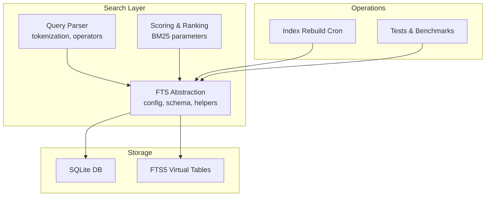
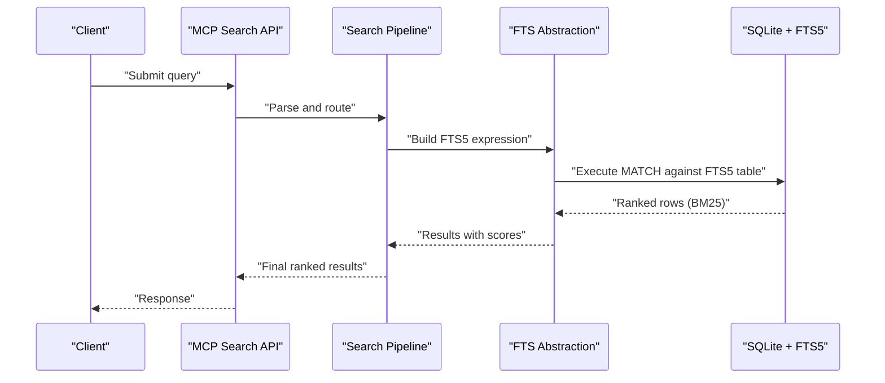
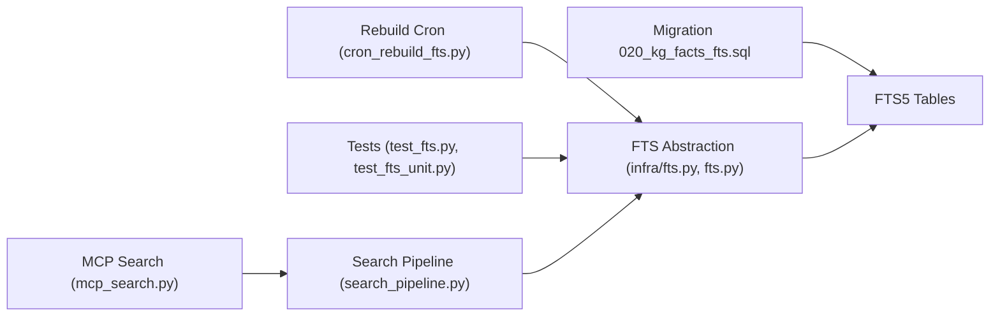

# Keyword Search (BM25)

<cite>
**Referenced Files in This Document**
- [fts.py](file://infra/fts.py)
- [fts.py](file://fts.py)
- [cron_rebuild_fts.py](file://cron/cron_rebuild_fts.py)
- [test_fts.py](file://test/test_fts.py)
- [test_fts_unit.py](file://test/test_fts_unit.py)
- [mcp_search.py](file://mcp/mcp_search.py)
- [search_pipeline.py](file://search_pipeline.py)
- [020_kg_facts_fts.sql](file://migrations/020_kg_facts_fts.sql)
</cite>

## Table of Contents
1. [Introduction](#introduction)
2. [Project Structure](#project-structure)
3. [Core Components](#core-components)
4. [Architecture Overview](#architecture-overview)
5. [Detailed Component Analysis](#detailed-component-analysis)
6. [Dependency Analysis](#dependency-analysis)
7. [Performance Considerations](#performance-considerations)
8. [Troubleshooting Guide](#troubleshooting-guide)
9. [Conclusion](#conclusion)
10. [Appendices](#appendices)

## Introduction
This document explains the BM25 keyword search implementation, focusing on full-text search configuration, indexing strategies, query parsing mechanisms, field weighting, phrase matching, and fuzzy search capabilities. It also covers FTS5 integration, index maintenance, performance tuning for large collections, and practical examples for optimizing BM25 queries and ranking parameters.

## Project Structure
The BM25 keyword search is implemented using SQLite’s FTS5 extension. The codebase provides:
- A high-level FTS abstraction layer that configures and manages FTS5 virtual tables and exposes search APIs.
- Database migrations to create and maintain FTS5 indexes.
- Background jobs to rebuild or repair FTS indexes when needed.
- Tests validating behavior across different query types and edge cases.
- Integration points with the broader search pipeline and MCP tools.

[No sources needed since this diagram shows conceptual workflow, not actual code structure]

## Core Components
- FTS Abstraction Layer: Provides functions to initialize FTS5 tables, configure tokenizers, manage content mapping, and expose search endpoints. It encapsulates FTS5-specific SQL generation and parameter binding.
- Query Parser: Translates user queries into FTS5-compatible expressions, handling operators like exact phrases, boolean logic, and optional fuzzy expansions.
- Scoring and Ranking: Applies BM25 scoring via FTS5 rank options and integrates additional features such as field weights and recency boosts where applicable.
- Index Maintenance: Periodic tasks to rebuild or optimize FTS indexes to keep them consistent after data mutations.
- Tests: Unit and integration tests covering query syntax, phrase matching, fuzzy behavior, and performance characteristics.

**Section sources**
- [fts.py](file://infra/fts.py)
- [fts.py](file://fts.py)
- [cron_rebuild_fts.py](file://cron/cron_rebuild_fts.py)
- [test_fts.py](file://test/test_fts.py)
- [test_fts_unit.py](file://test/test_fts_unit.py)

## Architecture Overview
The system uses SQLite FTS5 virtual tables to provide fast keyword retrieval. The FTS abstraction layer constructs and maintains these tables, while the query parser translates higher-level query specifications into FTS5 match expressions. The search pipeline may combine BM25 results with other signals (e.g., vector similarity) through reranking or fusion strategies.

**Diagram sources**
- [mcp_search.py](file://mcp/mcp_search.py)
- [search_pipeline.py](file://search_pipeline.py)
- [fts.py](file://infra/fts.py)
- [fts.py](file://fts.py)

## Detailed Component Analysis

### FTS5 Configuration and Schema
- FTS5 virtual tables are created via database migrations. The migration defines columns, tokenizer settings, and any auxiliary options required by BM25.
- The FTS abstraction layer ensures the virtual tables exist and are aligned with the application schema. It may also manage triggers or views to keep FTS content synchronized with base tables.

Key responsibilities:
- Define FTS5 table schema and column mappings.
- Configure tokenizers and options suitable for BM25.
- Provide helper functions to insert/update/delete indexed content consistently.

**Section sources**
- [020_kg_facts_fts.sql](file://migrations/020_kg_facts_fts.sql)
- [fts.py](file://infra/fts.py)
- [fts.py](file://fts.py)

### Indexing Strategies
- Content selection: Only relevant fields are included in the FTS index to reduce size and improve precision.
- Tokenization: Choose a tokenizer appropriate for the domain (e.g., ASCII case-insensitive). For multi-language text, consider Unicode-aware tokenizers if supported.
- Incremental updates: Use triggers or explicit update calls to keep FTS in sync with base table changes.
- Partitioning by tenant or scope: If multi-tenant, ensure queries include tenant scoping to avoid cross-tenant leakage.

Practical tips:
- Keep indexed content concise; strip boilerplate and metadata not useful for search.
- Normalize text (lowercasing, punctuation stripping) before indexing if the tokenizer does not handle it.
- Avoid overly long documents; chunking can improve recall and speed.

**Section sources**
- [fts.py](file://infra/fts.py)
- [fts.py](file://fts.py)

### Query Parsing Mechanisms
The query parser converts user input into FTS5 expressions. Supported patterns typically include:
- Term matching: Single words or tokens.
- Phrase matching: Quoted strings for exact adjacency.
- Boolean operators: AND, OR, NOT for combining terms.
- Field filters: Optional constraints based on document attributes (e.g., tags, date ranges) applied outside FTS5.
- Fuzzy expansion: Approximate matches using edit distance or phonetic variants, implemented by expanding the query into multiple terms before passing to FTS5.

Implementation notes:
- Validate and sanitize inputs to prevent malformed FTS5 expressions.
- Escape special characters and quotes appropriately.
- Apply tenant scoping and access controls at parse time.

**Section sources**
- [fts.py](file://infra/fts.py)
- [fts.py](file://fts.py)
- [test_fts.py](file://test/test_fts.py)
- [test_fts_unit.py](file://test/test_fts_unit.py)

### Field Weighting and Phrase Matching
- Field weighting: While FTS5 supports per-column weighting, many implementations prefer post-processing adjustments or hybrid scoring to emphasize certain fields (e.g., title over body).
- Phrase matching: Enclose multi-word queries in quotes to enforce adjacency. Combine with other operators for precise control.
- Hybrid strategies: Fuse BM25 results with vector similarity or knowledge graph signals using reciprocal rank fusion or learned models.

Optimization guidance:
- Prefer phrase matching for specific entity names or technical terms.
- Use field filters to narrow candidate sets early, reducing FTS5 workload.
- Tune BM25 parameters (k1, b) to balance term frequency saturation and document length normalization.

**Section sources**
- [fts.py](file://infra/fts.py)
- [fts.py](file://fts.py)
- [search_pipeline.py](file://search_pipeline.py)

### Fuzzy Search Capabilities
Fuzzy search is achieved by expanding queries into approximate variants before executing FTS5 MATCH. Common techniques:
- Edit-distance expansion: Generate candidates within a small Levenshtein distance.
- Phonetic encoding: Soundex or Metaphone to capture pronunciation similarities.
- N-gram overlap: Break terms into overlapping substrings to tolerate typos.

Trade-offs:
- Fuzziness increases query size and latency; limit expansion depth and breadth.
- Combine fuzziness with strict filters to constrain search space.
- Cache frequent fuzzy expansions to reduce repeated computation.

**Section sources**
- [fts.py](file://infra/fts.py)
- [fts.py](file://fts.py)
- [test_fts_unit.py](file://test/test_fts_unit.py)

### BM25 Tuning and Ranking Parameters
BM25 ranking depends on:
- k1 (term frequency saturation): Controls how quickly term frequency contributes to score. Lower values penalize repetition more strongly.
- b (length normalization): Adjusts for document length effects. Higher values favor shorter documents.
- c (optional constant): Some implementations use an additional constant to stabilize scores.

Tuning approach:
- Start with default values and measure precision/recall on representative queries.
- Increase k1 to reward frequent terms; decrease to reduce dominance of very common terms.
- Increase b to penalize longer documents; decrease to be more lenient with length.
- Use feedback loops (click-through rates, relevance labels) to iteratively adjust parameters.

**Section sources**
- [fts.py](file://infra/fts.py)
- [fts.py](file://fts.py)
- [search_pipeline.py](file://search_pipeline.py)

### Index Maintenance and Rebuilds
- Rebuild cron: A scheduled job rebuilds FTS indexes to recover from corruption or drift.
- Incremental updates: Ensure inserts, updates, and deletes propagate to FTS tables promptly.
- Vacuum and optimize: Periodically compact FTS tables to reclaim space and improve performance.

Operational practices:
- Run rebuilds during low-traffic windows.
- Monitor index sizes and growth trends.
- Log failures and alert on prolonged rebuild times.

**Section sources**
- [cron_rebuild_fts.py](file://cron/cron_rebuild_fts.py)
- [fts.py](file://infra/fts.py)
- [fts.py](file://fts.py)

### Practical Examples and Optimization Recipes
- Optimize phrase-heavy queries:
  - Use quoted phrases for key entities.
  - Add field filters (e.g., tag=“technical”) to reduce candidate set.
- Improve recall for noisy inputs:
  - Apply limited fuzzy expansion only to critical terms.
  - Combine with synonym dictionaries to broaden coverage.
- Handle large collections:
  - Chunk long documents into smaller segments.
  - Pre-filter by date range or tenant before invoking FTS5.
  - Use pagination and result caching for popular queries.
- Tune BM25:
  - Adjust k1 and b based on domain characteristics (e.g., short messages vs. long articles).
  - Incorporate recency boost for time-sensitive content.

[No sources needed since this section provides general guidance]

## Dependency Analysis
The BM25 subsystem depends on:
- SQLite with FTS5 enabled.
- Migration scripts to create and evolve FTS5 schemas.
- Background jobs for index maintenance.
- Tests to validate correctness and performance.

**Diagram sources**
- [020_kg_facts_fts.sql](file://migrations/020_kg_facts_fts.sql)
- [fts.py](file://infra/fts.py)
- [fts.py](file://fts.py)
- [cron_rebuild_fts.py](file://cron/cron_rebuild_fts.py)
- [test_fts.py](file://test/test_fts.py)
- [test_fts_unit.py](file://test/test_fts_unit.py)
- [search_pipeline.py](file://search_pipeline.py)
- [mcp_search.py](file://mcp/mcp_search.py)

**Section sources**
- [020_kg_facts_fts.sql](file://migrations/020_kg_facts_fts.sql)
- [fts.py](file://infra/fts.py)
- [fts.py](file://fts.py)
- [cron_rebuild_fts.py](file://cron/cron_rebuild_fts.py)
- [test_fts.py](file://test/test_fts.py)
- [test_fts_unit.py](file://test/test_fts_unit.py)
- [search_pipeline.py](file://search_pipeline.py)
- [mcp_search.py](file://mcp/mcp_search.py)

## Performance Considerations
- Index size: Minimize indexed fields and normalize content to reduce memory footprint.
- Query complexity: Limit fuzzy expansions and deep boolean combinations.
- Filtering: Apply strong pre-filters (tenant, date, tags) to shrink candidate sets.
- Caching: Cache frequent queries and their results.
- Batch operations: Group writes to reduce FTS churn.
- Monitoring: Track query latency distributions and index rebuild durations.

[No sources needed since this section provides general guidance]

## Troubleshooting Guide
Common issues and resolutions:
- No results for expected terms:
  - Verify tokenizer settings and text normalization.
  - Check whether content was indexed and not filtered out by tenant or status.
- Slow queries:
  - Add pre-filters to reduce candidate set.
  - Reduce fuzzy expansion breadth.
  - Inspect FTS table size and run optimization if necessary.
- Stale results:
  - Ensure incremental updates propagate to FTS tables.
  - Trigger a rebuild if corruption is suspected.
- Incorrect phrase matches:
  - Confirm quoting and escaping in parsed expressions.
  - Validate that adjacent tokens are preserved by the tokenizer.

Diagnostic steps:
- Inspect FTS table contents and row counts.
- Log generated FTS5 expressions for review.
- Compare BM25 scores across parameter variations.

**Section sources**
- [test_fts.py](file://test/test_fts.py)
- [test_fts_unit.py](file://test/test_fts_unit.py)
- [fts.py](file://infra/fts.py)
- [fts.py](file://fts.py)

## Conclusion
The BM25 keyword search leverages SQLite FTS5 to deliver efficient, tunable retrieval. By carefully configuring FTS5 schemas, normalizing content, parsing queries robustly, and applying targeted optimizations (phrase matching, limited fuzziness, strong filters), teams can achieve high precision and recall. Ongoing tuning of BM25 parameters and proactive index maintenance ensure sustained performance even as collections grow.

[No sources needed since this section summarizes without analyzing specific files]

## Appendices

### Appendix A: BM25 Parameter Tuning Checklist
- Start with defaults; measure baseline metrics.
- Adjust k1 to control term frequency impact.
- Adjust b to account for document length differences.
- Introduce recency or field-weight boosts post-ranking.
- Iterate with labeled feedback and A/B testing.

[No sources needed since this section provides general guidance]

### Appendix B: Example Query Patterns
- Exact phrase: “machine learning”
- Boolean combination: “python AND (fts OR bm25)”
- Negation: “error NOT timeout”
- Fuzzy expansion: Expand “recieve” to “receive” and nearby variants before MATCH.

[No sources needed since this section provides general guidance]