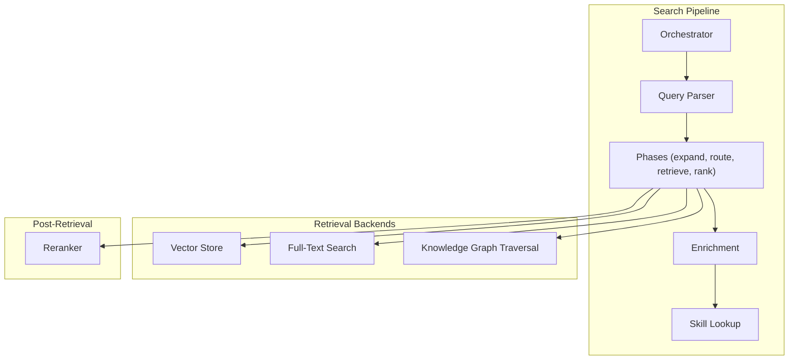
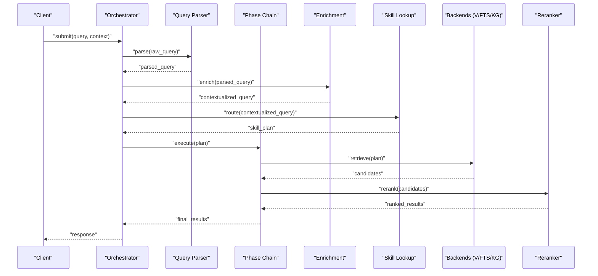
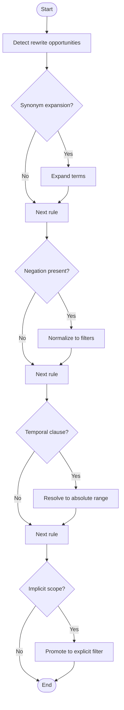
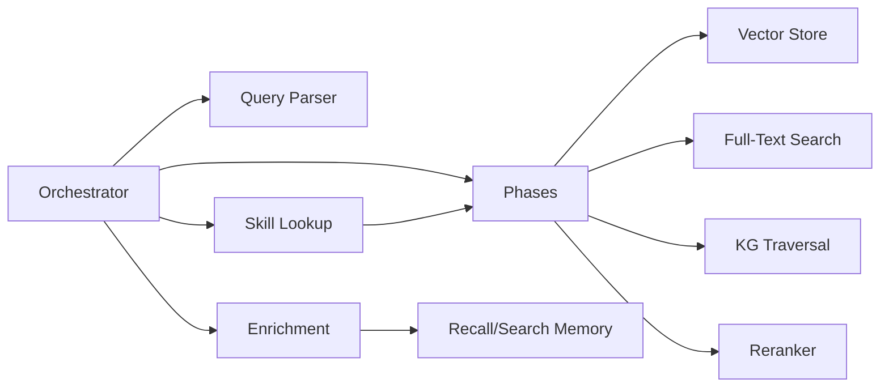

# Query Processing and Expansion

<cite>
**Referenced Files in This Document**
- [search/orchestrator.py](file://search/orchestrator.py)
- [search/query_parser.py](file://search/query_parser.py)
- [search/phases/](file://search/phases/)
- [search/enrichment.py](file://search/enrichment.py)
- [search/skill_lookup.py](file://search/skill_lookup.py)
- [recall/search_memory.py](file://recall/search_memory.py)
- [kg/kg_traversal.py](file://kg/kg_traversal.py)
- [knowledge_graph/kg_search.py](file://knowledge_graph/kg_search.py)
- [infra/reranker.py](file://infra/reranker.py)
- [infra/vector_store.py](file://infra/vector_store.py)
- [infra/fts.py](file://infra/fts.py)
</cite>

## Table of Contents
1. [Introduction](#introduction)
2. [Project Structure](#project-structure)
3. [Core Components](#core-components)
4. [Architecture Overview](#architecture-overview)
5. [Detailed Component Analysis](#detailed-component-analysis)
6. [Dependency Analysis](#dependency-analysis)
7. [Performance Considerations](#performance-considerations)
8. [Troubleshooting Guide](#troubleshooting-guide)
9. [Conclusion](#conclusion)
10. [Appendices](#appendices)

## Introduction
This document explains the query processing and expansion mechanisms used by the system to understand user intent, extract attributes, route queries to skills or knowledge sources, enrich context, and rewrite queries for improved retrieval. It covers parsing, intent detection, attribute extraction, skill-based routing, contextual enrichment, rewriting strategies, ambiguity resolution, and natural language processing integration points. Practical guidance is provided for implementing custom processors and handling complex patterns.

## Project Structure
The query pipeline is implemented primarily under the search package with supporting components in recall, knowledge graph, and infrastructure layers. Key modules include:
- Orchestrator: end-to-end orchestration of phases
- Query parser: tokenization, normalization, and initial structure
- Phases: modular stages (e.g., expansion, routing, retrieval, reranking)
- Enrichment: contextual augmentation from session, history, and metadata
- Skill lookup: mapping intents to available skills/tools
- Retrieval backends: vector store, full-text search, knowledge graph traversal
- Reranking: cross-encoder or model-based reordering

[No sources needed since this diagram shows conceptual workflow, not actual code structure]

## Core Components
- Orchestrator: coordinates lifecycle of a query through parsing, expansion, routing, retrieval, and ranking. It composes phase handlers and manages state across steps.
- Query Parser: normalizes input text, detects basic query types, extracts named entities, time windows, filters, and structured constraints.
- Phases: pluggable stages that transform the parsed query into an executable plan. Typical phases include expansion, skill routing, retrieval planning, and result synthesis.
- Enrichment: augments the query with session context, recent memories, agent profile, and prior interactions to disambiguate intent.
- Skill Lookup: maps detected intents and attributes to registered skills or tools, enabling targeted execution paths.
- Retrieval Backends: execute plans against vector embeddings, full-text indices, and knowledge graph edges/facts.
- Reranker: refines candidate results using learned models or heuristics.

**Section sources**
- [search/orchestrator.py](file://search/orchestrator.py)
- [search/query_parser.py](file://search/query_parser.py)
- [search/phases/](file://search/phases/)
- [search/enrichment.py](file://search/enrichment.py)
- [search/skill_lookup.py](file://search/skill_lookup.py)
- [infra/reranker.py](file://infra/reranker.py)
- [infra/vector_store.py](file://infra/vector_store.py)
- [infra/fts.py](file://infra/fts.py)
- [kg/kg_traversal.py](file://kg/kg_traversal.py)
- [knowledge_graph/kg_search.py](file://knowledge_graph/kg_search.py)

## Architecture Overview
The high-level flow transforms a raw user query into ranked results via a sequence of well-defined stages. The orchestrator initializes the request, delegates to the parser, then iterates through phases. Each phase can read and mutate a shared query state object. Enrichment runs early to provide context; skill routing selects specialized handlers; retrieval executes multi-modal searches; reranking finalizes output.

**Diagram sources**
- [search/orchestrator.py](file://search/orchestrator.py)
- [search/query_parser.py](file://search/query_parser.py)
- [search/phases/](file://search/phases/)
- [search/enrichment.py](file://search/enrichment.py)
- [search/skill_lookup.py](file://search/skill_lookup.py)
- [infra/reranker.py](file://infra/reranker.py)
- [infra/vector_store.py](file://infra/vector_store.py)
- [infra/fts.py](file://infra/fts.py)
- [kg/kg_traversal.py](file://kg/kg_traversal.py)
- [knowledge_graph/kg_search.py](file://knowledge_graph/kg_search.py)

## Detailed Component Analysis

### Query Parsing and Intent Detection
Parsing converts free-form text into a structured representation suitable for downstream phases. Responsibilities include:
- Normalization: lowercasing, punctuation handling, Unicode normalization
- Tokenization and segmentation: splitting into tokens and phrases
- Entity recognition: names, organizations, locations, dates, durations
- Temporal parsing: relative times (“last week”), absolute timestamps, “as-of” semantics
- Attribute extraction: filters, scopes, tags, authorship, source type
- Intent classification: question, command, browse, compare, summarize, list
- Ambiguity flags: unresolved pronouns, missing scope, multiple possible intents

Implementation notes:
- Use regex and lightweight NLP rules for speed-critical fields (dates, numbers).
- Integrate entity recognizers where available; fallback to dictionary-based matching.
- Produce a canonical query object with typed fields and confidence scores.

Practical example pattern:
- Input: “Show me my notes about project X last month.”
- Output: {intent: "list", entities: ["project X"], temporal: "last month", scope: "user_notes"}

**Section sources**
- [search/query_parser.py](file://search/query_parser.py)

### Skill-Based Query Routing
Routing maps parsed intents and attributes to specific skills or tool invocations. Steps:
- Intent-skill registry: map intents to one or more candidate skills
- Attribute matching: ensure required parameters are present or can be inferred
- Disambiguation: choose among multiple skills using context and confidence
- Plan generation: produce an executable plan describing backend calls and data flow

Example mappings:
- Intent “summarize” -> skill “summarizer”
- Intent “compare” -> skill “comparison_engine”
- Intent “find facts” -> knowledge graph traversal

Ambiguity resolution:
- If multiple skills match, prefer the one with highest confidence or most complete attributes.
- Prompt for clarification when critical attributes are missing.

**Section sources**
- [search/skill_lookup.py](file://search/skill_lookup.py)

### Contextual Enrichment
Enrichment augments the query with relevant context to improve precision and reduce ambiguity:
- Session context: current topic, active agents, recent actions
- History: prior queries and results within the session
- Profile: user preferences, roles, permissions
- Knowledge graph hints: related concepts, entities, and relationships
- Temporal priors: recent changes, decay weights, recency bias

Processing logic:
- Gather context from session manager and memory stores
- Merge with parsed query, preserving original fields
- Attach provenance and feature flags for downstream phases

**Section sources**
- [search/enrichment.py](file://search/enrichment.py)

### Query Rewriting Strategies
Rewriting improves retrieval quality by transforming the query while preserving intent:
- Synonym expansion: replace terms with synonyms or hypernyms
- Negation handling: convert negative constraints into explicit filters
- Temporal normalization: translate relative times to absolute ranges
- Scope promotion: lift implicit scopes (e.g., “my files”) to explicit filters
- Multi-hop formulation: decompose complex questions into subqueries
- Deduplication and pruning: remove redundant clauses

Flowchart for rewriting:

**Diagram sources**
- [search/phases/](file://search/phases/)

**Section sources**
- [search/phases/](file://search/phases/)

### Retrieval Execution and Integration Points
After planning and rewriting, retrieval executes against multiple backends:
- Vector store: semantic similarity search using embeddings
- Full-text search: lexical matching and phrase queries
- Knowledge graph: entity-centric lookups and relationship traversal
- Hybrid combination: merge results using reciprocal rank fusion or weighted scoring

Integration details:
- Vector store interface supports indexing, embedding computation, and approximate nearest neighbor search
- FTS index supports boolean operators, faceting, and highlighting
- KG traversal leverages fact tables and schema-aware queries

**Section sources**
- [infra/vector_store.py](file://infra/vector_store.py)
- [infra/fts.py](file://infra/fts.py)
- [kg/kg_traversal.py](file://kg/kg_traversal.py)
- [knowledge_graph/kg_search.py](file://knowledge_graph/kg_search.py)

### Result Ranking and Synthesis
Reranking refines candidate sets:
- Cross-encoder or learned models score relevance
- Heuristics apply recency, authority, and diversity boosts
- Final synthesis formats responses, including summaries and citations

**Section sources**
- [infra/reranker.py](file://infra/reranker.py)

## Dependency Analysis
The following diagram illustrates key dependencies between core modules involved in query processing and expansion.

**Diagram sources**
- [search/orchestrator.py](file://search/orchestrator.py)
- [search/query_parser.py](file://search/query_parser.py)
- [search/phases/](file://search/phases/)
- [search/enrichment.py](file://search/enrichment.py)
- [search/skill_lookup.py](file://search/skill_lookup.py)
- [infra/reranker.py](file://infra/reranker.py)
- [infra/vector_store.py](file://infra/vector_store.py)
- [infra/fts.py](file://infra/fts.py)
- [kg/kg_traversal.py](file://kg/kg_traversal.py)
- [recall/search_memory.py](file://recall/search_memory.py)

**Section sources**
- [search/orchestrator.py](file://search/orchestrator.py)
- [search/query_parser.py](file://search/query_parser.py)
- [search/phases/](file://search/phases/)
- [search/enrichment.py](file://search/enrichment.py)
- [search/skill_lookup.py](file://search/skill_lookup.py)
- [infra/reranker.py](file://infra/reranker.py)
- [infra/vector_store.py](file://infra/vector_store.py)
- [infra/fts.py](file://infra/fts.py)
- [kg/kg_traversal.py](file://kg/kg_traversal.py)
- [recall/search_memory.py](file://recall/search_memory.py)

## Performance Considerations
- Prefer fast, deterministic parsing for common cases; defer expensive NLP to optional phases.
- Cache enriched contexts per session to avoid recomputation.
- Use hybrid retrieval with early filtering to reduce candidate set size before reranking.
- Apply budget-aware strategies to limit compute on low-confidence branches.
- Parallelize independent retrievals (vector vs. FTS vs. KG) when safe.
- Monitor latency and throughput metrics; tune thresholds for synonym expansion and rewrite rules.

[No sources needed since this section provides general guidance]

## Troubleshooting Guide
Common issues and diagnostics:
- Empty results after expansion: verify rewrite rules did not over-constrain filters; check temporal normalization.
- Misrouted skills: inspect intent-skill registry and attribute completeness; add clarifying prompts.
- Slow queries: profile phase timings; disable heavy expansions for short queries; enable caching.
- Inconsistent rankings: review reranker configuration and diversity boosts; validate feature inputs.
- Context mismatches: ensure enrichment pulls correct session and profile data; confirm tenant scoping.

Operational checks:
- Validate parser outputs for expected fields and confidence scores.
- Confirm skill plans contain all required parameters.
- Inspect backend query logs for anomalies.
- Review reranker scores and feature contributions.

**Section sources**
- [search/orchestrator.py](file://search/orchestrator.py)
- [search/phases/](file://search/phases/)
- [infra/reranker.py](file://infra/reranker.py)

## Conclusion
The query processing and expansion system combines robust parsing, contextual enrichment, skill-based routing, and multi-backend retrieval with learned reranking. By structuring the pipeline into modular phases and providing clear extension points, it supports both simple keyword searches and complex, intent-driven queries. Custom processors can be added by implementing phase handlers, enrichers, or skill routers, integrating seamlessly with existing backends and rerankers.

[No sources needed since this section summarizes without analyzing specific files]

## Appendices

### Implementing a Custom Query Processor
Steps:
- Define a new phase handler class with standard methods for preprocessing, execution, and postprocessing.
- Register the handler in the phase chain configuration.
- Ensure the handler reads/writes the shared query state consistently.
- Add unit tests covering edge cases and performance budgets.

Best practices:
- Keep handlers idempotent and side-effect-free except for documented mutations.
- Provide clear error messages and fallbacks.
- Instrument with metrics and tracing for observability.

[No sources needed since this section provides general guidance]

### Handling Complex Query Patterns
Patterns and strategies:
- Multi-hop questions: decompose into subqueries and join results at the synthesis stage.
- Comparative queries: generate parallel retrieval plans and align entities before ranking.
- Temporal reasoning: normalize relative times and apply decay functions during scoring.
- Ambiguity resolution: use context and confidence thresholds to prompt users for clarification.

[No sources needed since this section provides general guidance]