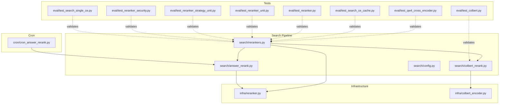
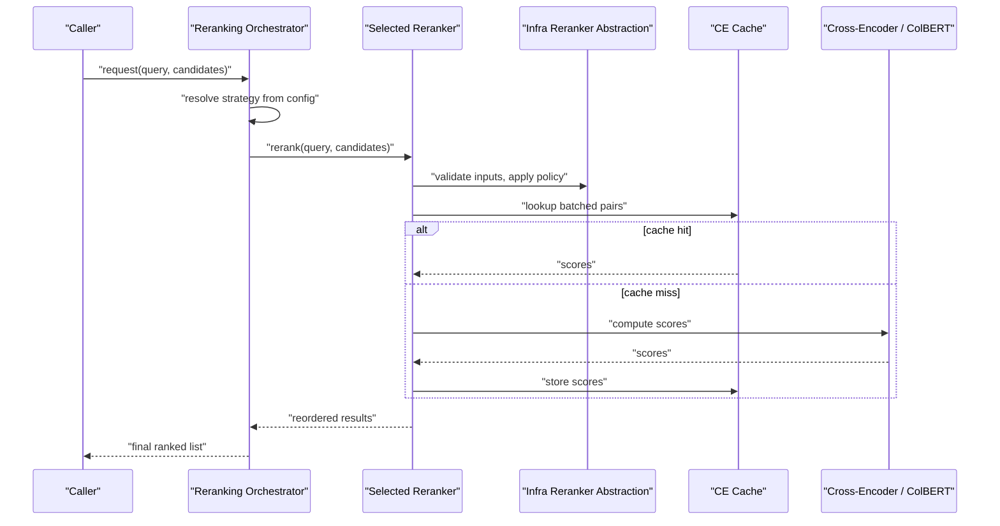
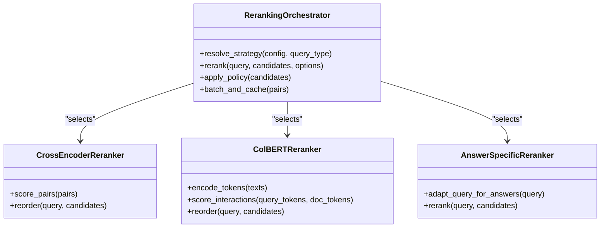
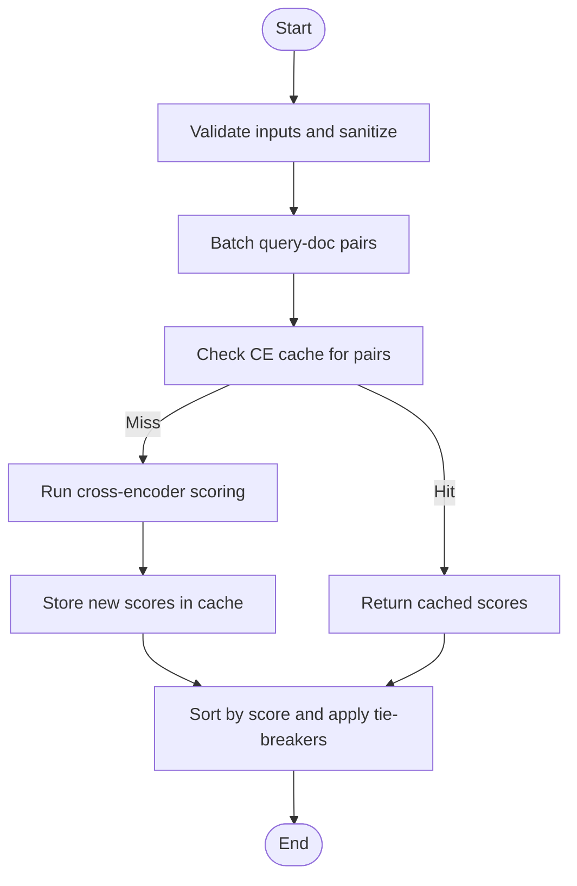
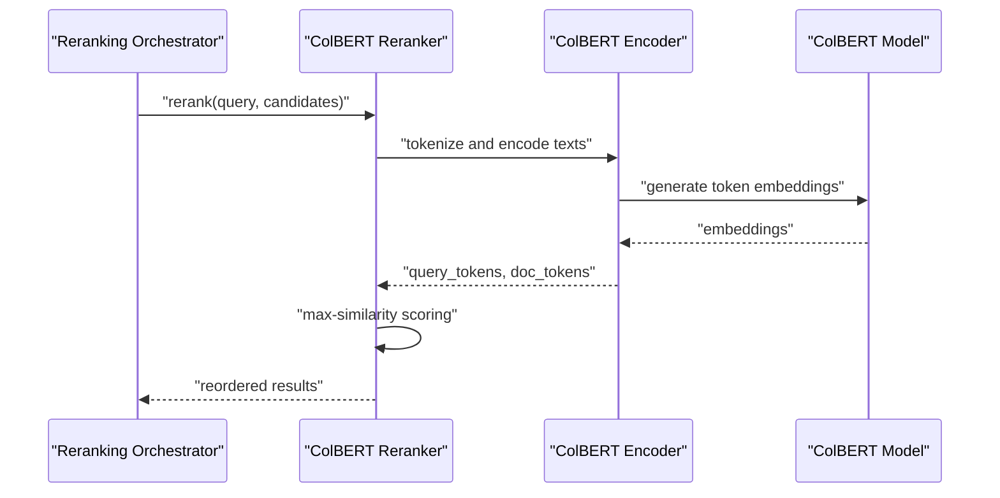
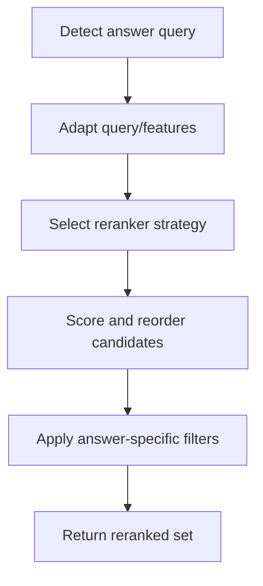
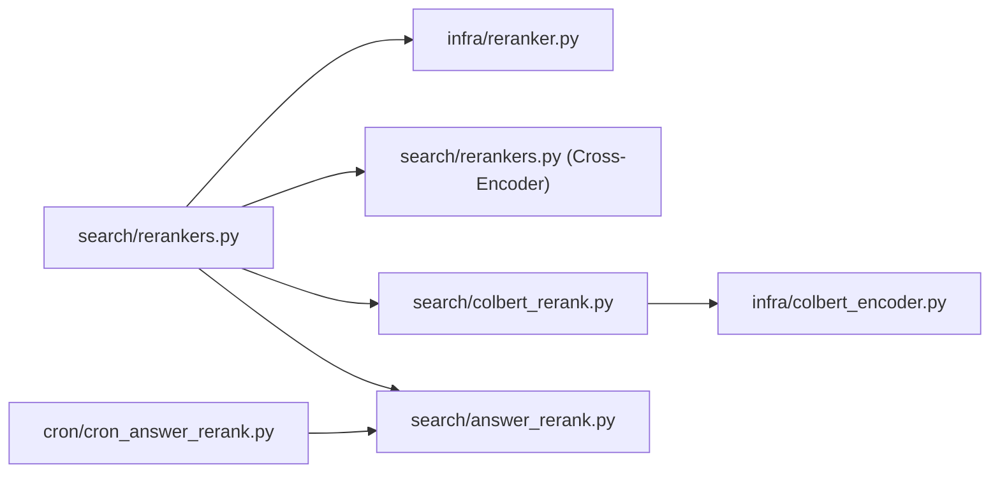

# Reranking System

<cite>
**Referenced Files in This Document**
- [search/rerankers.py](file://search/rerankers.py)
- [search/colbert_rerank.py](file://search/colbert_rerank.py)
- [search/answer_rerank.py](file://search/answer_rerank.py)
- [infra/reranker.py](file://infra/reranker.py)
- [cron/cron_answer_rerank.py](file://cron/cron_answer_rerank.py)
- [eval/test_qw4_cross_encoder.py](file://eval/test_qw4_cross_encoder.py)
- [eval/test_colbert.py](file://eval/test_colbert.py)
- [eval/test_search_ce_cache.py](file://eval/test_search_ce_cache.py)
- [eval/test_reranker.py](file://eval/test_reranker.py)
- [eval/test_reranker_unit.py](file://eval/test_reranker_unit.py)
- [eval/test_reranker_strategy_unit.py](file://eval/test_reranker_strategy_unit.py)
- [eval/test_reranker_security.py](file://eval/test_reranker_security.py)
- [eval/test_search_single_ce.py](file://eval/test_search_single_ce.py)
- [infra/colbert_encoder.py](file://infra/colbert_encoder.py)
- [search/config.py](file://search/config.py)
</cite>

## Table of Contents
1. [Introduction](#introduction)
2. [Project Structure](#project-structure)
3. [Core Components](#core-components)
4. [Architecture Overview](#architecture-overview)
5. [Detailed Component Analysis](#detailed-component-analysis)
6. [Dependency Analysis](#dependency-analysis)
7. [Performance Considerations](#performance-considerations)
8. [Troubleshooting Guide](#troubleshooting-guide)
9. [Conclusion](#conclusion)
10. [Appendices](#appendices)

## Introduction
This document explains the reranking system architecture with a focus on neural reranking models, cross-encoder implementations, and result reordering strategies. It covers ColBERT-based reranking, answer-specific reranking, and how to develop custom rerankers. Practical guidance is provided for configuring reranking models, implementing domain-specific rerankers, optimizing performance, selecting models, managing latency, and improving accuracy through reranking.

## Project Structure
The reranking subsystem spans several modules:
- Core reranking orchestration and strategy selection
- Cross-encoder reranking implementation
- ColBERT-based reranking integration
- Answer-specific reranking pipeline
- Background scheduling for answer reranking
- Configuration and encoder utilities
- Tests validating behavior, security, caching, and single CE usage

**Diagram sources**
- [search/rerankers.py](file://search/rerankers.py)
- [search/colbert_rerank.py](file://search/colbert_rerank.py)
- [search/answer_rerank.py](file://search/answer_rerank.py)
- [infra/reranker.py](file://infra/reranker.py)
- [infra/colbert_encoder.py](file://infra/colbert_encoder.py)
- [cron/cron_answer_rerank.py](file://cron/cron_answer_rerank.py)
- [eval/test_qw4_cross_encoder.py](file://eval/test_qw4_cross_encoder.py)
- [eval/test_colbert.py](file://eval/test_colbert.py)
- [eval/test_search_ce_cache.py](file://eval/test_search_ce_cache.py)
- [eval/test_reranker.py](file://eval/test_reranker.py)
- [eval/test_reranker_unit.py](file://eval/test_reranker_unit.py)
- [eval/test_reranker_strategy_unit.py](file://eval/test_reranker_strategy_unit.py)
- [eval/test_reranker_security.py](file://eval/test_reranker_security.py)
- [eval/test_search_single_ce.py](file://eval/test_search_single_ce.py)

**Section sources**
- [search/rerankers.py](file://search/rerankers.py)
- [search/colbert_rerank.py](file://search/colbert_rerank.py)
- [search/answer_rerank.py](file://search/answer_rerank.py)
- [infra/reranker.py](file://infra/reranker.py)
- [infra/colbert_encoder.py](file://infra/colbert_encoder.py)
- [cron/cron_answer_rerank.py](file://cron/cron_answer_rerank.py)
- [search/config.py](file://search/config.py)

## Core Components
- Reranking orchestrator and strategy registry: centralizes model selection, batching, and fallbacks across reranking strategies.
- Cross-encoder reranker: implements dense query-document scoring using a cross-encoder model.
- ColBERT reranker: integrates token-level matching via ColBERT encoders for fine-grained relevance scoring.
- Answer-specific reranker: tailors reranking signals to answer-centric queries and downstream generation.
- Infrastructure reranker abstraction: provides common interfaces, caching, and safety checks used by search components.
- ColBERT encoder utility: handles tokenization and encoding for ColBERT-style interactions.
- Cron job for answer reranking: schedules periodic reranking tasks for answers.

Key responsibilities:
- Strategy resolution based on configuration and runtime context
- Efficient batching and caching of expensive model calls
- Security and input validation before model inference
- Consistent output schema for downstream consumers

**Section sources**
- [search/rerankers.py](file://search/rerankers.py)
- [search/colbert_rerank.py](file://search/colbert_rerank.py)
- [search/answer_rerank.py](file://search/answer_rerank.py)
- [infra/reranker.py](file://infra/reranker.py)
- [infra/colbert_encoder.py](file://infra/colbert_encoder.py)
- [cron/cron_answer_rerank.py](file://cron/cron_answer_rerank.py)

## Architecture Overview
The reranking layer sits after initial retrieval (e.g., vector or hybrid search) and refines candidate results into a final ranked list. The orchestrator selects a strategy (cross-encoder, ColBERT, or answer-specific), applies it with appropriate batching and caching, and returns reordered results.

**Diagram sources**
- [search/rerankers.py](file://search/rerankers.py)
- [infra/reranker.py](file://infra/reranker.py)
- [search/colbert_rerank.py](file://search/colbert_rerank.py)
- [search/answer_rerank.py](file://search/answer_rerank.py)
- [eval/test_search_ce_cache.py](file://eval/test_search_ce_cache.py)

## Detailed Component Analysis

### Reranking Orchestrator and Strategy Registry
Responsibilities:
- Resolve which reranking strategy to use based on configuration and query context
- Enforce global policies such as maximum candidates, timeouts, and security constraints
- Coordinate batching and caching across strategies
- Provide consistent output format for downstream consumers

Design patterns:
- Strategy pattern for pluggable rerankers
- Centralized configuration-driven routing
- Safety gates and input validation prior to model execution

**Diagram sources**
- [search/rerankers.py](file://search/rerankers.py)
- [search/colbert_rerank.py](file://search/colbert_rerank.py)
- [search/answer_rerank.py](file://search/answer_rerank.py)

**Section sources**
- [search/rerankers.py](file://search/rerankers.py)
- [search/config.py](file://search/config.py)

### Cross-Encoder Reranker
Implementation highlights:
- Computes joint representations for query-document pairs
- Uses efficient batching to reduce overhead
- Integrates with a cache to avoid redundant computations
- Applies ranking transformation and tie-breaking rules

Operational characteristics:
- High accuracy but higher latency than sparse methods
- Sensitive to input length; truncation and normalization are applied
- Supports per-tenant or per-query overrides when configured

**Diagram sources**
- [search/rerankers.py](file://search/rerankers.py)
- [eval/test_search_ce_cache.py](file://eval/test_search_ce_cache.py)

**Section sources**
- [search/rerankers.py](file://search/rerankers.py)
- [eval/test_qw4_cross_encoder.py](file://eval/test_qw4_cross_encoder.py)
- [eval/test_search_ce_cache.py](file://eval/test_search_ce_cache.py)
- [eval/test_search_single_ce.py](file://eval/test_search_single_ce.py)

### ColBERT-Based Reranker
Implementation highlights:
- Encodes queries and documents into token-level embeddings
- Computes max-similarity over tokens for interaction scoring
- Leverages a dedicated ColBERT encoder utility for tokenization and embedding
- Suitable for domains requiring fine-grained lexical overlap

Integration points:
- Uses infra ColBERT encoder for tokenization and embedding
- Plugged into the orchestrator as an alternative strategy
- Can be enabled conditionally based on configuration or query type

**Diagram sources**
- [search/colbert_rerank.py](file://search/colbert_rerank.py)
- [infra/colbert_encoder.py](file://infra/colbert_encoder.py)

**Section sources**
- [search/colbert_rerank.py](file://search/colbert_rerank.py)
- [infra/colbert_encoder.py](file://infra/colbert_encoder.py)
- [eval/test_colbert.py](file://eval/test_colbert.py)

### Answer-Specific Reranking
Purpose:
- Tailor reranking signals for answer-centric queries that will feed downstream generation
- Adjust candidate weighting and filtering to improve answer quality and coherence

Workflow:
- Detect answer-oriented queries
- Adapt query representation or candidate features
- Apply reranking strategy with answer-aware adjustments
- Persist or expose reranked outputs for answer synthesis

**Diagram sources**
- [search/answer_rerank.py](file://search/answer_rerank.py)
- [cron/cron_answer_rerank.py](file://cron/cron_answer_rerank.py)

**Section sources**
- [search/answer_rerank.py](file://search/answer_rerank.py)
- [cron/cron_answer_rerank.py](file://cron/cron_answer_rerank.py)

### Infrastructure Reranker Abstraction
Provides:
- Common interface for all rerankers
- Input validation and sanitization
- Policy enforcement (e.g., max candidates, timeouts)
- Shared logging and metrics hooks

Usage:
- Imported by both cross-encoder and ColBERT rerankers
- Ensures consistent behavior across strategies

**Section sources**
- [infra/reranker.py](file://infra/reranker.py)

### Configuration and Model Selection
Configuration aspects:
- Strategy selection (cross-encoder vs ColBERT vs answer-specific)
- Candidate limits and thresholds
- Cache enablement and TTL settings
- Per-tenant or per-query overrides

Selection criteria:
- Accuracy needs vs latency budget
- Domain lexical overlap (favor ColBERT) vs semantic nuance (favor cross-encoder)
- Query type (answer-focused may benefit from answer-specific reranker)

**Section sources**
- [search/config.py](file://search/config.py)
- [search/rerankers.py](file://search/rerankers.py)

## Dependency Analysis
High-level dependencies:
- Reranking orchestrator depends on strategy implementations and infrastructure abstractions
- Cross-encoder reranker depends on shared infrastructure and cache utilities
- ColBERT reranker depends on ColBERT encoder module
- Answer-specific reranker coordinates with cron jobs for background processing

**Diagram sources**
- [search/rerankers.py](file://search/rerankers.py)
- [search/colbert_rerank.py](file://search/colbert_rerank.py)
- [search/answer_rerank.py](file://search/answer_rerank.py)
- [infra/reranker.py](file://infra/reranker.py)
- [infra/colbert_encoder.py](file://infra/colbert_encoder.py)
- [cron/cron_answer_rerank.py](file://cron/cron_answer_rerank.py)

**Section sources**
- [search/rerankers.py](file://search/rerankers.py)
- [search/colbert_rerank.py](file://search/colbert_rerank.py)
- [search/answer_rerank.py](file://search/answer_rerank.py)
- [infra/reranker.py](file://infra/reranker.py)
- [infra/colbert_encoder.py](file://infra/colbert_encoder.py)
- [cron/cron_answer_rerank.py](file://cron/cron_answer_rerank.py)

## Performance Considerations
- Batching: Group query-document pairs to amortize model initialization and memory overhead.
- Caching: Use CE cache to avoid recomputation for repeated pairs; tune TTL and keys.
- Candidate limits: Cap candidates before reranking to control latency.
- Tokenization: For ColBERT, manage token lengths and padding to minimize compute.
- Hardware utilization: Prefer GPU acceleration for cross-encoder and ColBERT where available.
- Concurrency: Parallelize independent batches while respecting rate limits and quotas.
- Monitoring: Track latency percentiles, throughput, and cache hit rates to guide tuning.

[No sources needed since this section provides general guidance]

## Troubleshooting Guide
Common issues and diagnostics:
- Validation failures: Ensure inputs are sanitized and within allowed lengths.
- Cache misses: Verify cache key construction and TTL; check storage backend health.
- Latency spikes: Reduce candidate count, increase batch size, or switch strategies.
- Security violations: Confirm policy enforcement and access controls around reranking.
- Single CE mode: Validate configuration flags for single cross-encoder usage.

Relevant tests for debugging:
- Cross-encoder behavior and caching
- ColBERT integration correctness
- Strategy unit tests and security checks
- Single CE mode validation

**Section sources**
- [eval/test_qw4_cross_encoder.py](file://eval/test_qw4_cross_encoder.py)
- [eval/test_search_ce_cache.py](file://eval/test_search_ce_cache.py)
- [eval/test_colbert.py](file://eval/test_colbert.py)
- [eval/test_reranker.py](file://eval/test_reranker.py)
- [eval/test_reranker_unit.py](file://eval/test_reranker_unit.py)
- [eval/test_reranker_strategy_unit.py](file://eval/test_reranker_strategy_unit.py)
- [eval/test_reranker_security.py](file://eval/test_reranker_security.py)
- [eval/test_search_single_ce.py](file://eval/test_search_single_ce.py)

## Conclusion
The reranking system combines flexible strategy selection, robust infrastructure safeguards, and specialized rerankers for different use cases. Cross-encoders deliver high accuracy, ColBERT excels at fine-grained lexical matching, and answer-specific reranking optimizes for downstream generation. With careful configuration, caching, and monitoring, teams can achieve strong accuracy improvements while maintaining acceptable latency.

[No sources needed since this section summarizes without analyzing specific files]

## Appendices

### Practical Examples and How-To Guidance
- Configure reranking models:
  - Select strategy via configuration (cross-encoder, ColBERT, answer-specific)
  - Set candidate limits, thresholds, and cache parameters
  - Enable per-tenant overrides when necessary
- Implement domain-specific rerankers:
  - Extend the infrastructure reranker interface
  - Add domain-aware preprocessing and scoring logic
  - Integrate with the orchestrator’s strategy registry
- Optimize reranking performance:
  - Increase batch sizes within resource limits
  - Tune cache TTL and key design
  - Profile tokenization and embedding steps for ColBERT
- Model selection criteria:
  - Favor cross-encoder for semantic richness
  - Favor ColBERT for lexical overlap-heavy domains
  - Use answer-specific reranker for answer-centric queries
- Latency considerations:
  - Monitor p95/p99 latencies and adjust candidate caps
  - Use caching aggressively for repeated queries
  - Consider hardware acceleration and concurrency controls
- Accuracy improvements:
  - Combine reranking with pre-filtering and enrichment
  - Iterate on candidate sets and thresholds based on evaluation
  - Use answer-specific signals for generative pipelines

[No sources needed since this section provides general guidance]