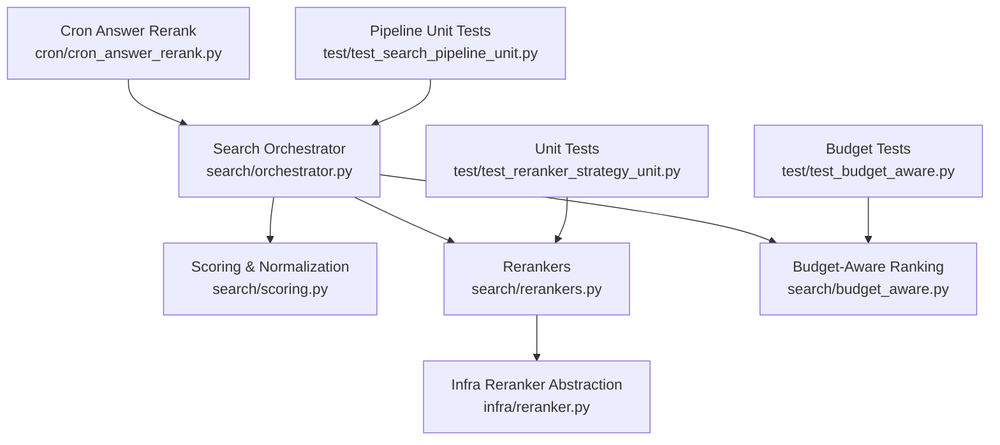
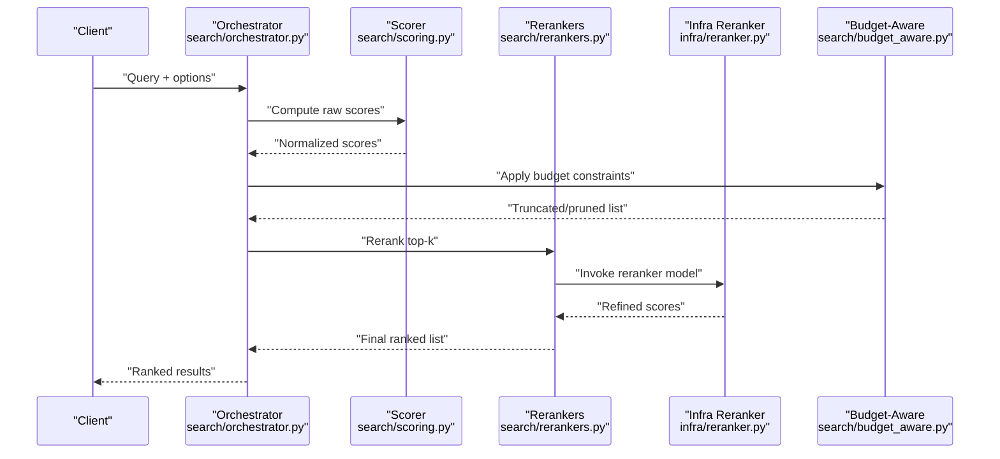
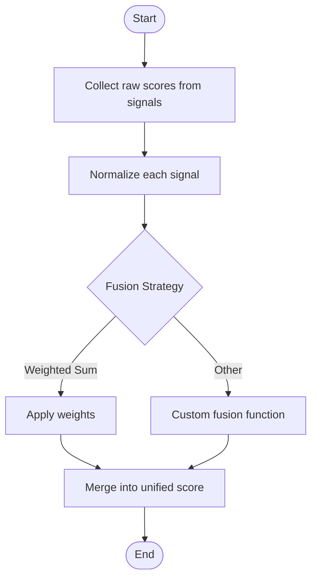
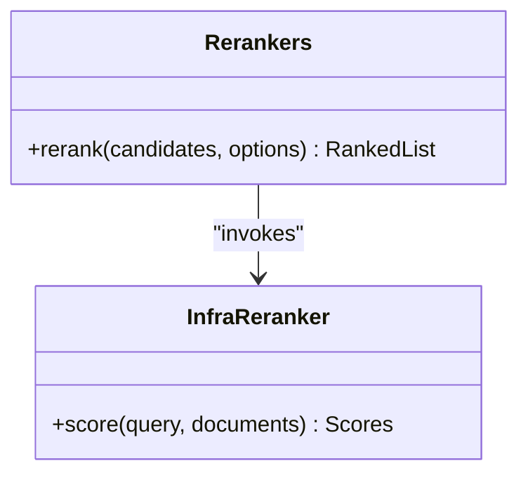
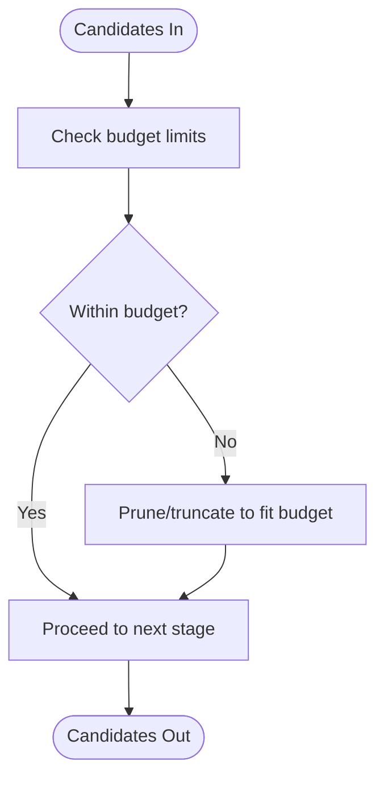
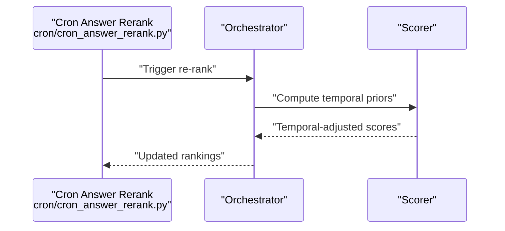
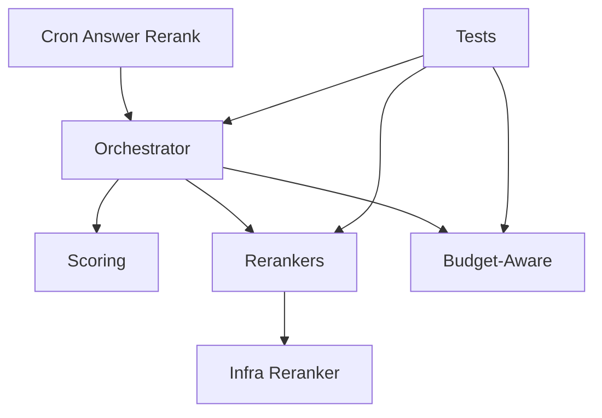

# Result Fusion and Ranking

<cite>
**Referenced Files in This Document**
- [search/orchestrator.py](file://search/orchestrator.py)
- [search/scoring.py](file://search/scoring.py)
- [search/rerankers.py](file://search/rerankers.py)
- [search/budget_aware.py](file://search/budget_aware.py)
- [infra/reranker.py](file://infra/reranker.py)
- [cron/cron_answer_rerank.py](file://cron/cron_answer_rerank.py)
- [eval/longmemeval_s/run_eval_main_pipeline.py](file://eval/longmemeval_s/run_eval_main_pipeline.py)
- [test/test_reranker_strategy_unit.py](file://test/test_reranker_strategy_unit.py)
- [test/test_budget_aware.py](file://test/test_budget_aware.py)
- [test/test_search_pipeline_unit.py](file://test/test_search_pipeline_unit.py)
</cite>

## Table of Contents
1. [Introduction](#introduction)
2. [Project Structure](#project-structure)
3. [Core Components](#core-components)
4. [Architecture Overview](#architecture-overview)
5. [Detailed Component Analysis](#detailed-component-analysis)
6. [Dependency Analysis](#dependency-analysis)
7. [Performance Considerations](#performance-considerations)
8. [Troubleshooting Guide](#troubleshooting-guide)
9. [Conclusion](#conclusion)
10. [Appendices](#appendices)

## Introduction
This document explains the result fusion and ranking subsystem, focusing on:
- Score normalization across heterogeneous signals
- Weighted fusion strategies and how to implement custom ones
- Temporal relevance scoring for time-aware ordering
- Budget-aware ranking to respect latency and cost constraints
- Diversity optimization and personalization features
- Practical examples for tuning weights and injecting business logic
- Fairness considerations, bias mitigation, and evaluation metrics for ranking quality

The goal is to provide both a conceptual overview and concrete guidance grounded in the repository’s search pipeline components.

## Project Structure
The fusion and ranking functionality spans several modules:
- Orchestrator coordinates retrieval phases and merges candidate sets
- Scoring computes normalized scores from multiple sources (BM25, embeddings, etc.)
- Rerankers apply cross-encoders or learned models to refine orderings
- Budget-aware ranking enforces limits on candidates and compute
- Cron jobs periodically re-rank answers based on feedback and temporal priors
- Tests validate strategy behavior and budget enforcement

**Diagram sources**
- [search/orchestrator.py](file://search/orchestrator.py)
- [search/scoring.py](file://search/scoring.py)
- [search/rerankers.py](file://search/rerankers.py)
- [search/budget_aware.py](file://search/budget_aware.py)
- [infra/reranker.py](file://infra/reranker.py)
- [cron/cron_answer_rerank.py](file://cron/cron_answer_rerank.py)
- [test/test_reranker_strategy_unit.py](file://test/test_reranker_strategy_unit.py)
- [test/test_budget_aware.py](file://test/test_budget_aware.py)
- [test/test_search_pipeline_unit.py](file://test/test_search_pipeline_unit.py)

**Section sources**
- [search/orchestrator.py](file://search/orchestrator.py)
- [search/scoring.py](file://search/scoring.py)
- [search/rerankers.py](file://search/rerankers.py)
- [search/budget_aware.py](file://search/budget_aware.py)
- [infra/reranker.py](file://infra/reranker.py)
- [cron/cron_answer_rerank.py](file://cron/cron_answer_rerank.py)
- [test/test_reranker_strategy_unit.py](file://test/test_reranker_strategy_unit.py)
- [test/test_budget_aware.py](file://test/test_budget_aware.py)
- [test/test_search_pipeline_unit.py](file://test/test_search_pipeline_unit.py)

## Core Components
- Search orchestrator:
  - Coordinates multi-phase retrieval and merges results
  - Applies fusion and reranking strategies
  - Integrates with budget controls and diversity filters
- Scoring and normalization:
  - Computes per-signal scores (e.g., BM25, vector similarity)
  - Normalizes scores to a common scale for fusion
- Rerankers:
  - Cross-encoder or learned models that refine ordering
  - Pluggable via an abstraction layer
- Budget-aware ranking:
  - Enforces hard limits on number of candidates and compute usage
  - Truncates or prunes lists to meet latency/cost targets
- Cron answer rerank:
  - Periodically updates rankings using feedback and temporal priors

Practical tips:
- Use normalization before fusion to avoid dominance by one signal
- Keep rerankers lightweight; rely on budget-aware pruning upstream
- Tune weights per workload and monitor fairness and diversity

**Section sources**
- [search/orchestrator.py](file://search/orchestrator.py)
- [search/scoring.py](file://search/scoring.py)
- [search/rerankers.py](file://search/rerankers.py)
- [search/budget_aware.py](file://search/budget_aware.py)
- [infra/reranker.py](file://infra/reranker.py)
- [cron/cron_answer_rerank.py](file://cron/cron_answer_rerank.py)

## Architecture Overview
The end-to-end flow integrates retrieval, fusion, reranking, and budget control.

**Diagram sources**
- [search/orchestrator.py](file://search/orchestrator.py)
- [search/scoring.py](file://search/scoring.py)
- [search/rerankers.py](file://search/rerankers.py)
- [infra/reranker.py](file://infra/reranker.py)
- [search/budget_aware.py](file://search/budget_aware.py)

## Detailed Component Analysis

### Score Normalization and Weighted Fusion
- Purpose:
  - Combine heterogeneous signals (lexical, semantic, recency) into a unified score
- Key behaviors:
  - Normalize each signal to a comparable range
  - Apply weighted sum or other fusion rules
  - Allow pluggable fusion strategies
- Implementation pointers:
  - Normalization and fusion logic are implemented in the scoring module
  - The orchestrator invokes scoring and passes fused scores downstream
- Tuning guidance:
  - Start with equal weights and adjust based on offline metrics
  - Monitor impact on precision/recall and diversity

**Diagram sources**
- [search/scoring.py](file://search/scoring.py)
- [search/orchestrator.py](file://search/orchestrator.py)

**Section sources**
- [search/scoring.py](file://search/scoring.py)
- [search/orchestrator.py](file://search/orchestrator.py)

### Reranking and Cross-Encoders
- Purpose:
  - Refine initial rankings using more expensive but accurate models
- Key behaviors:
  - Select top-k candidates after budget-aware pruning
  - Invoke reranker via infra abstraction
  - Return refined ordering
- Implementation pointers:
  - Rerankers module defines strategy interfaces and orchestration
  - Infra reranker provides model invocation details
- Best practices:
  - Limit reranker input size to control latency
  - Cache reranker outputs when feasible

**Diagram sources**
- [search/rerankers.py](file://search/rerankers.py)
- [infra/reranker.py](file://infra/reranker.py)

**Section sources**
- [search/rerankers.py](file://search/rerankers.py)
- [infra/reranker.py](file://infra/reranker.py)

### Budget-Aware Ranking
- Purpose:
  - Ensure ranking respects latency, cost, and throughput budgets
- Key behaviors:
  - Prune or truncate candidate lists early
  - Enforce maximum reranker calls and final output size
- Implementation pointers:
  - Budget-aware module applies constraints during orchestration
- Tuning guidance:
  - Set budgets based on SLA targets
  - Validate with load tests and error budgets

**Diagram sources**
- [search/budget_aware.py](file://search/budget_aware.py)
- [search/orchestrator.py](file://search/orchestrator.py)

**Section sources**
- [search/budget_aware.py](file://search/budget_aware.py)
- [search/orchestrator.py](file://search/orchestrator.py)

### Temporal Relevance Scoring
- Purpose:
  - Boost or decay scores based on recency and temporal context
- Key behaviors:
  - Compute temporal priors and integrate into fusion
  - Support “as-of” queries and time-window filtering
- Implementation pointers:
  - Cron job recomputes temporal priors periodically
  - Scoring integrates temporal factors into final scores
- Practical example:
  - Increase weight for recent memories in time-sensitive queries

**Diagram sources**
- [cron/cron_answer_rerank.py](file://cron/cron_answer_rerank.py)
- [search/scoring.py](file://search/scoring.py)
- [search/orchestrator.py](file://search/orchestrator.py)

**Section sources**
- [cron/cron_answer_rerank.py](file://cron/cron_answer_rerank.py)
- [search/scoring.py](file://search/scoring.py)
- [search/orchestrator.py](file://search/orchestrator.py)

### Diversity Optimization and Personalization
- Diversity:
  - Encourage variety across categories or sources to reduce redundancy
  - Apply post-fusion selection heuristics to spread coverage
- Personalization:
  - Adjust weights based on user preferences or historical interactions
  - Incorporate session context and prior clicks
- Implementation pointers:
  - Extend fusion strategy to include diversity penalties
  - Inject personalization features into scoring inputs

[No sources needed since this section provides general guidance]

### Implementing Custom Fusion Strategies
- Steps:
  - Define a fusion function that accepts normalized scores and returns combined scores
  - Register the strategy with the orchestrator or reranker configuration
  - Validate with unit tests and offline evals
- Example references:
  - Strategy unit tests demonstrate how to plug in custom fusion logic
  - Main pipeline runner shows integration points for fusion and reranking

**Section sources**
- [test/test_reranker_strategy_unit.py](file://test/test_reranker_strategy_unit.py)
- [eval/longmemeval_s/run_eval_main_pipeline.py](file://eval/longmemeval_s/run_eval_main_pipeline.py)

### Tuning Ranking Weights and Business Logic
- Approach:
  - Start with baseline weights; tune using offline metrics (NDCG, MRR, Recall@K)
  - Add business rules (e.g., boost pinned items, demote low-quality sources)
  - Monitor online KPIs and fairness metrics
- Validation:
  - Use regression tests to ensure changes do not degrade performance
  - Run targeted scenarios for edge cases and adversarial inputs

**Section sources**
- [test/test_search_pipeline_unit.py](file://test/test_search_pipeline_unit.py)

## Dependency Analysis
Key dependencies and relationships:
- Orchestrator depends on scoring, rerankers, and budget-aware modules
- Rerankers depend on infra reranker abstraction
- Cron job interacts with orchestrator and scoring to update rankings
- Tests validate strategy behavior and budget enforcement

**Diagram sources**
- [search/orchestrator.py](file://search/orchestrator.py)
- [search/scoring.py](file://search/scoring.py)
- [search/rerankers.py](file://search/rerankers.py)
- [search/budget_aware.py](file://search/budget_aware.py)
- [infra/reranker.py](file://infra/reranker.py)
- [cron/cron_answer_rerank.py](file://cron/cron_answer_rerank.py)
- [test/test_reranker_strategy_unit.py](file://test/test_reranker_strategy_unit.py)
- [test/test_budget_aware.py](file://test/test_budget_aware.py)
- [test/test_search_pipeline_unit.py](file://test/test_search_pipeline_unit.py)

**Section sources**
- [search/orchestrator.py](file://search/orchestrator.py)
- [search/scoring.py](file://search/scoring.py)
- [search/rerankers.py](file://search/rerankers.py)
- [search/budget_aware.py](file://search/budget_aware.py)
- [infra/reranker.py](file://infra/reranker.py)
- [cron/cron_answer_rerank.py](file://cron/cron_answer_rerank.py)
- [test/test_reranker_strategy_unit.py](file://test/test_reranker_strategy_unit.py)
- [test/test_budget_aware.py](file://test/test_budget_aware.py)
- [test/test_search_pipeline_unit.py](file://test/test_search_pipeline_unit.py)

## Performance Considerations
- Normalize scores efficiently to avoid repeated computations
- Limit reranker inputs via budget-aware pruning
- Cache reranker outputs where possible
- Profile critical paths and set SLOs for latency and throughput
- Use batch operations for reranking when supported

[No sources needed since this section provides general guidance]

## Troubleshooting Guide
Common issues and diagnostics:
- Degraded ranking quality after weight changes:
  - Re-run offline evaluations and compare metrics
  - Inspect fusion strategy logs and intermediate scores
- Latency spikes due to reranking:
  - Verify budget constraints and prune earlier
  - Reduce reranker top-k or enable caching
- Temporal boosts not taking effect:
  - Confirm cron job runs and temporal priors are updated
  - Check scoring integration points for temporal factors

Validation references:
- Strategy unit tests confirm correct fusion behavior
- Budget tests ensure truncation and limits are enforced
- Pipeline unit tests validate end-to-end ordering

**Section sources**
- [test/test_reranker_strategy_unit.py](file://test/test_reranker_strategy_unit.py)
- [test/test_budget_aware.py](file://test/test_budget_aware.py)
- [test/test_search_pipeline_unit.py](file://test/test_search_pipeline_unit.py)

## Conclusion
The fusion and ranking subsystem combines normalized scores, reranking, and budget-aware controls to deliver high-quality, timely results. By implementing robust normalization, flexible fusion strategies, and careful budget management, teams can tailor ranking to business needs while maintaining performance and fairness. Regular evaluation and monitoring are essential to sustain quality over time.

[No sources needed since this section summarizes without analyzing specific files]

## Appendices

### Practical Examples and References
- Custom fusion strategy implementation:
  - See strategy unit tests for patterns and hooks
- End-to-end pipeline integration:
  - Refer to main pipeline runner for orchestration points
- Budget enforcement validation:
  - Consult budget-aware tests for expected behaviors

**Section sources**
- [test/test_reranker_strategy_unit.py](file://test/test_reranker_strategy_unit.py)
- [eval/longmemeval_s/run_eval_main_pipeline.py](file://eval/longmemeval_s/run_eval_main_pipeline.py)
- [test/test_budget_aware.py](file://test/test_budget_aware.py)