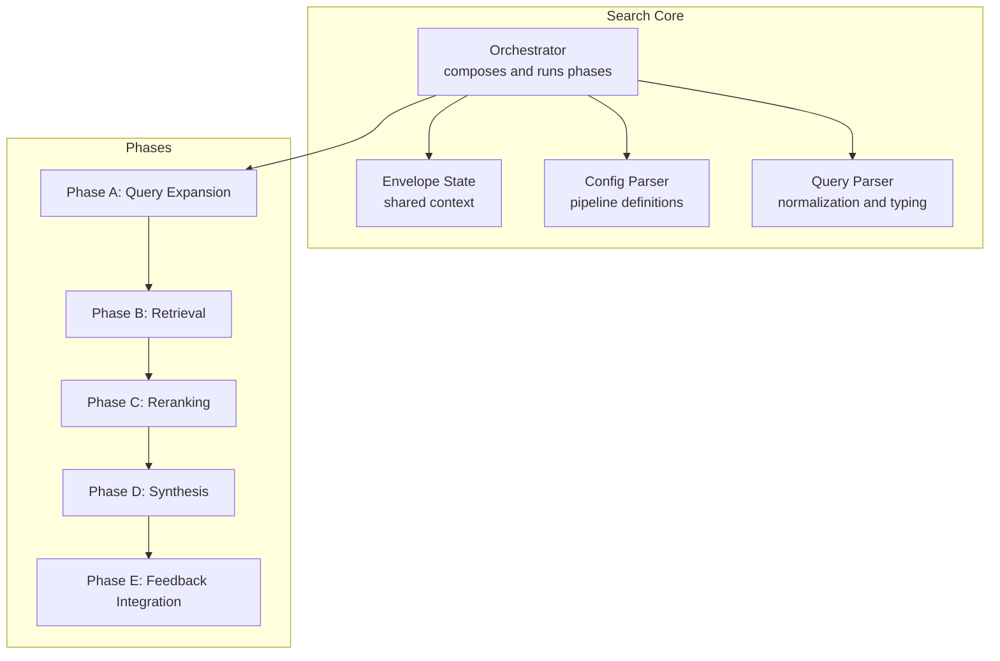
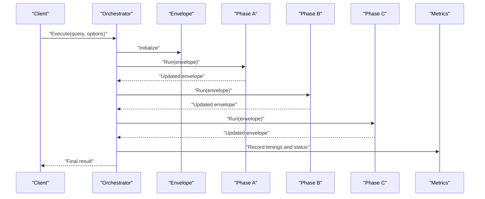
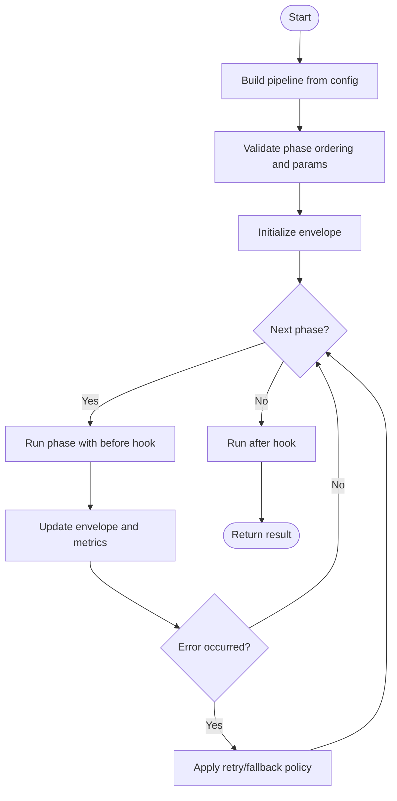
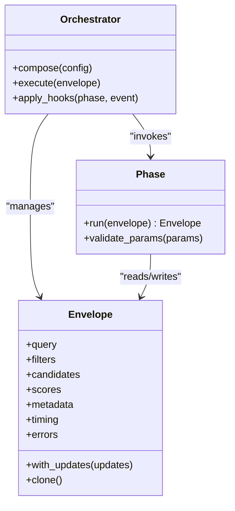
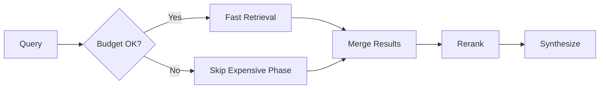
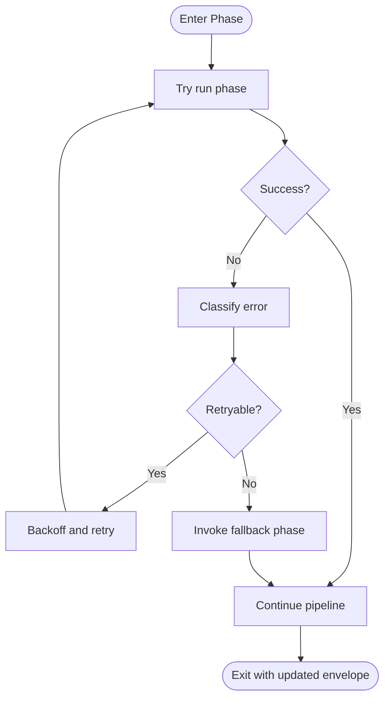
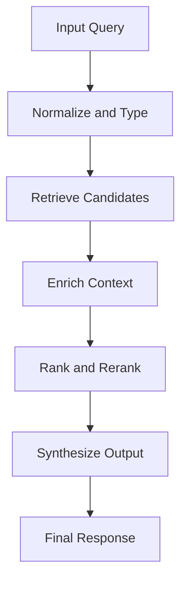

# Search Pipeline Architecture

<cite>
**Referenced Files in This Document**
- [search/orchestrator.py](file://search/orchestrator.py)
- [search/state.py](file://search/state.py)
- [search/phases/__init__.py](file://search/phases/__init__.py)
- [search/config.py](file://search/config.py)
- [search/query_parser.py](file://search/query_parser.py)
- [search/rerankers.py](file://search/rerankers.py)
- [search/feedback.py](file://search/feedback.py)
- [search/synthesis.py](file://search/synthesis.py)
- [search/budget_aware.py](file://search/budget_aware.py)
- [search/enrichment.py](file://search/enrichment.py)
- [search/skill_lookup.py](file://search/skill_lookup.py)
- [search/drift.py](file://search/drift.py)
- [search/scoring.py](file://search/scoring.py)
- [search/chunk_index.py](file://search/chunk_index.py)
- [search/colbert_index.py](file://search/colbert_index.py)
- [search/colbert_rerank.py](file://search/colbert_rerank.py)
- [search/splade_index.py](file://search/splade_index.py)
- [search/answer_rerank.py](file://search/answer_rerank.py)
- [recall/search_memory.py](file://recall/search_memory.py)
- [docs/concepts/search-pipeline.md](file://docs/concepts/search-pipeline.md)
- [docs/how-to/debug-search.md](file://docs/how-to/debug-search.md)
- [eval/perf_envelope.py](file://eval/perf_envelope.py)
- [infra/metrics.py](file://infra/metrics.py)
</cite>

## Table of Contents
1. [Introduction](#introduction)
2. [Project Structure](#project-structure)
3. [Core Components](#core-components)
4. [Architecture Overview](#architecture-overview)
5. [Detailed Component Analysis](#detailed-component-analysis)
6. [Dependency Analysis](#dependency-analysis)
7. [Performance Considerations](#performance-considerations)
8. [Troubleshooting Guide](#troubleshooting-guide)
9. [Conclusion](#conclusion)
10. [Appendices](#appendices)

## Introduction
This document explains the search pipeline architecture with a focus on multi-phase orchestration, phase lifecycle management, and state coordination across stages. It covers the envelope pattern used to carry request context through phases, strategies for composing pipelines from reusable phases, and robust error handling mechanisms. Practical guidance is provided for configuring custom pipelines, implementing new phases, and debugging execution. Performance monitoring, timing analysis, and optimization techniques are also included.

## Project Structure
The search subsystem is organized around an orchestrator that composes and executes a sequence of phases. Each phase encapsulates a specific transformation or enrichment step and operates on a shared envelope carrying query context, intermediate results, and metadata. Supporting modules provide configuration parsing, query normalization, reranking utilities, feedback integration, synthesis, budget-aware control, and index-specific helpers.

**Diagram sources**
- [search/orchestrator.py](file://search/orchestrator.py)
- [search/state.py](file://search/state.py)
- [search/config.py](file://search/config.py)
- [search/query_parser.py](file://search/query_parser.py)

**Section sources**
- [search/orchestrator.py](file://search/orchestrator.py)
- [search/state.py](file://search/state.py)
- [search/config.py](file://search/config.py)
- [search/query_parser.py](file://search/query_parser.py)

## Core Components
- Orchestrator: Builds a pipeline from configuration, validates phase ordering, manages lifecycle hooks (before/after), coordinates state transitions, and handles errors and retries.
- Envelope: Immutable-ish request/response container passed through phases; includes query, filters, candidate set, scores, metadata, and timing information.
- Configuration: Declarative pipeline definitions specifying phases, parameters, and composition rules.
- Query Parser: Normalizes input queries into typed structures consumed by phases.
- Rerankers: Pluggable reranking strategies applied after retrieval.
- Feedback: Integrates click-through and relevance signals to influence ranking.
- Synthesis: Aggregates and summarizes final outputs based on enriched candidates.
- Budget-Aware Control: Limits cost and latency by gating expensive phases.
- Index Helpers: Utilities for chunking, vector indices, SPLADE, and ColBERT components.

**Section sources**
- [search/orchestrator.py](file://search/orchestrator.py)
- [search/state.py](file://search/state.py)
- [search/config.py](file://search/config.py)
- [search/query_parser.py](file://search/query_parser.py)
- [search/rerankers.py](file://search/rerankers.py)
- [search/feedback.py](file://search/feedback.py)
- [search/synthesis.py](file://search/synthesis.py)
- [search/budget_aware.py](file://search/budget_aware.py)
- [search/chunk_index.py](file://search/chunk_index.py)
- [search/colbert_index.py](file://search/colbert_index.py)
- [search/splade_index.py](file://search/splade_index.py)

## Architecture Overview
The pipeline follows a multi-phase orchestration model where each phase reads and writes to the envelope. The orchestrator enforces lifecycle semantics, ensures idempotency where applicable, and provides consistent error propagation and recovery. Phases can be conditionally executed based on budget constraints and query characteristics.

**Diagram sources**
- [search/orchestrator.py](file://search/orchestrator.py)
- [search/state.py](file://search/state.py)
- [infra/metrics.py](file://infra/metrics.py)

## Detailed Component Analysis

### Orchestrator and Phase Lifecycle
The orchestrator constructs a directed graph of phases from configuration, validates dependencies, and executes them in order. It supports before/after hooks, conditional execution, and retry policies. Errors are captured per phase with context preserved in the envelope for downstream diagnostics.

**Diagram sources**
- [search/orchestrator.py](file://search/orchestrator.py)
- [search/state.py](file://search/state.py)

**Section sources**
- [search/orchestrator.py](file://search/orchestrator.py)
- [search/state.py](file://search/state.py)

### Envelope Pattern Implementation
The envelope carries immutable query inputs, mutable intermediate results, and read-only metadata. Phases receive the envelope, produce updates, and return a new envelope instance to preserve immutability. Timing and error traces are appended to the envelope for observability.

**Diagram sources**
- [search/state.py](file://search/state.py)
- [search/orchestrator.py](file://search/orchestrator.py)

**Section sources**
- [search/state.py](file://search/state.py)
- [search/orchestrator.py](file://search/orchestrator.py)

### Phase Composition Strategies
Phases are composed declaratively via configuration. Composition supports:
- Sequential chaining
- Conditional branching based on query type or budget
- Parallel fan-out for independent retrievers with later merge
- Fallback chains when primary phases fail

**Diagram sources**
- [search/config.py](file://search/config.py)
- [search/budget_aware.py](file://search/budget_aware.py)

**Section sources**
- [search/config.py](file://search/config.py)
- [search/budget_aware.py](file://search/budget_aware.py)

### Error Handling Mechanisms
Errors are captured at phase boundaries with stack traces and contextual metadata. The orchestrator applies retry policies, fallback phases, and circuit-breaking logic to prevent cascading failures. Partial results may be returned if configured, preserving user experience under degraded conditions.

**Diagram sources**
- [search/orchestrator.py](file://search/orchestrator.py)

**Section sources**
- [search/orchestrator.py](file://search/orchestrator.py)

### Practical Examples

#### Configuring Custom Pipelines
- Define phases in configuration with parameters and ordering.
- Use conditional blocks to enable/disable phases based on budget or query features.
- Register custom rerankers and synthesis strategies.

**Section sources**
- [search/config.py](file://search/config.py)
- [search/rerankers.py](file://search/rerankers.py)
- [search/synthesis.py](file://search/synthesis.py)

#### Implementing New Phases
- Implement a phase class with a run method that accepts and returns an envelope.
- Validate parameters during initialization.
- Append timing and error info to the envelope for observability.
- Integrate with feedback if your phase produces actionable signals.

**Section sources**
- [search/state.py](file://search/state.py)
- [search/feedback.py](file://search/feedback.py)

#### Debugging Pipeline Execution
- Enable detailed logging and tracing in the orchestrator.
- Inspect envelope snapshots at each phase boundary.
- Use debug utilities to visualize phase timings and error stacks.

**Section sources**
- [docs/how-to/debug-search.md](file://docs/how-to/debug-search.md)
- [search/orchestrator.py](file://search/orchestrator.py)

### Conceptual Overview
The search pipeline abstracts complex retrieval workflows into modular, testable phases. By leveraging the envelope pattern, it ensures consistent state propagation and simplifies debugging. Composition strategies allow flexible adaptation to different workloads and constraints.

[No sources needed since this diagram shows conceptual workflow, not actual code structure]

## Dependency Analysis
The search subsystem depends on infrastructure services for metrics and on index implementations for retrieval. Phases may depend on external encoders and models.

```mermaid
graph TB
Orchestrator["Orchestrator"] --> State["State/Envelope"]
Orchestrator --> Config["Config"]
Orchestrator --> Metrics["Metrics"]
Orchestrator --> QueryParser["Query Parser"]
Orchestrator --> Rerankers["Rerankers"]
Orchestrator --> Feedback["Feedback"]
Orchestrator --> Synthesis["Synthesis"]
Orchestrator --> Budget["Budget-Aware"]
Orchestrator --> ChunkIndex["Chunk Index"]
Orchestrator --> ColbertIndex["ColBERT Index"]
Orchestrator --> SpladeIndex["SPLADE Index"]
Orchestrator --> AnswerRerank["Answer Rerank"]
Orchestrator --> Drift["Drift Detection"]
Orchestrator --> Scoring["Scoring"]
Orchestrator --> SkillLookup["Skill Lookup"]
Orchestrator --> Enrichment["Enrichment"]
```

**Diagram sources**
- [search/orchestrator.py](file://search/orchestrator.py)
- [search/state.py](file://search/state.py)
- [search/config.py](file://search/config.py)
- [search/rerankers.py](file://search/rerankers.py)
- [search/feedback.py](file://search/feedback.py)
- [search/synthesis.py](file://search/synthesis.py)
- [search/budget_aware.py](file://search/budget_aware.py)
- [search/chunk_index.py](file://search/chunk_index.py)
- [search/colbert_index.py](file://search/colbert_index.py)
- [search/splade_index.py](file://search/splade_index.py)
- [search/answer_rerank.py](file://search/answer_rerank.py)
- [search/drift.py](file://search/drift.py)
- [search/scoring.py](file://search/scoring.py)
- [search/skill_lookup.py](file://search/skill_lookup.py)
- [search/enrichment.py](file://search/enrichment.py)
- [infra/metrics.py](file://infra/metrics.py)

**Section sources**
- [search/orchestrator.py](file://search/orchestrator.py)
- [infra/metrics.py](file://infra/metrics.py)

## Performance Considerations
- Phase Timing Analysis: Record per-phase durations and aggregate totals for bottleneck identification.
- Budget-Aware Gating: Skip expensive phases when latency or cost budgets are exceeded.
- Caching and Deduplication: Cache encoder outputs and deduplicate candidate sets to reduce redundant work.
- Parallelism: Fan out independent retrievers and merge results efficiently.
- Monitoring: Use metrics endpoints to track throughput, latency percentiles, and error rates.

Practical references:
- Performance envelope evaluation scripts for benchmarking.
- Metrics module for instrumentation.

**Section sources**
- [eval/perf_envelope.py](file://eval/perf_envelope.py)
- [infra/metrics.py](file://infra/metrics.py)
- [search/budget_aware.py](file://search/budget_aware.py)

## Troubleshooting Guide
Common issues and resolutions:
- Missing phase parameters: Validate configuration schema and required fields.
- High latency: Profile phase timings, enable caching, and adjust budget thresholds.
- Degraded quality: Inspect reranker weights and feedback signals; tune synthesis prompts.
- Error propagation: Review error classification and fallback policies; ensure envelope captures full context.

Useful resources:
- Debugging guide for search execution.
- Concepts overview for pipeline behavior.

**Section sources**
- [docs/how-to/debug-search.md](file://docs/how-to/debug-search.md)
- [docs/concepts/search-pipeline.md](file://docs/concepts/search-pipeline.md)

## Conclusion
The search pipeline architecture leverages a multi-phase orchestration model with a strong envelope pattern to manage state and lifecycle. Its configurable composition, robust error handling, and performance-oriented design enable flexible, high-quality retrieval workflows. By following the guidelines for customization, debugging, and optimization, teams can tailor pipelines to diverse use cases while maintaining reliability and efficiency.

## Appendices

### API Entry Points
- High-level search entry points integrate with the orchestrator and expose convenient APIs for clients.

**Section sources**
- [recall/search_memory.py](file://recall/search_memory.py)