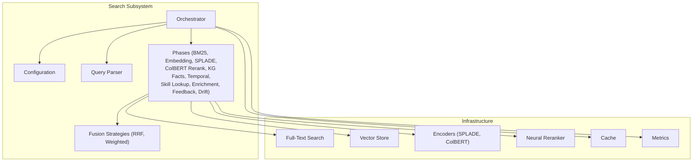
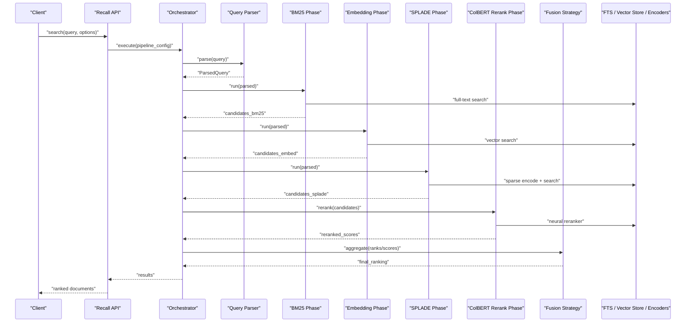
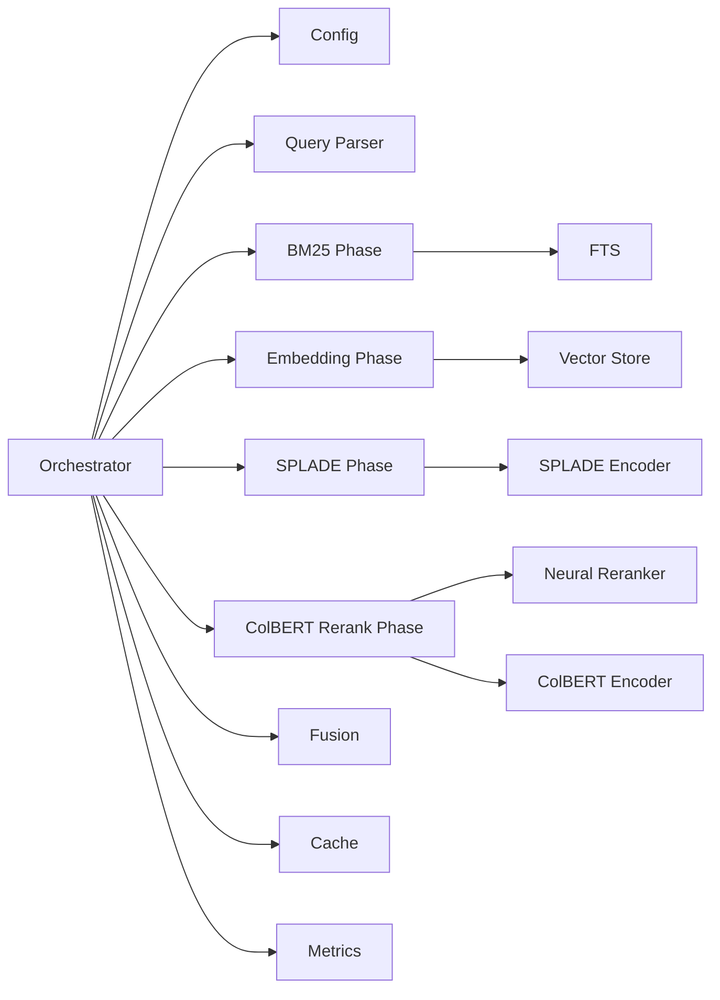

# Search and Retrieval

<cite>
**Referenced Files in This Document**
- [search/orchestrator.py](file://search/orchestrator.py)
- [search/config.py](file://search/config.py)
- [search/query_parser.py](file://search/query_parser.py)
- [phases/bm25_phase.py](file://search/phases/bm25_phase.py)
- [phases/embedding_phase.py](file://search/phases/embedding_phase.py)
- [phases/colbert_rerank_phase.py](file://search/phases/colbert_rerank_phase.py)
- [phases/splade_phase.py](file://search/phases/splade_phase.py)
- [phases/kg_facts_phase.py](file://search/phases/kg_facts_phase.py)
- [phases/temporal_phase.py](file://search/phases/temporal_phase.py)
- [phases/skill_lookup_phase.py](file://search/phases/skill_lookup_phase.py)
- [phases/enrichment_phase.py](file://search/phases/enrichment_phase.py)
- [phases/feedback_phase.py](file://search/phases/feedback_phase.py)
- [phases/drift_phase.py](file://search/phases/drift_phase.py)
- [phases/fusion_rrf.py](file://search/phases/fusion_rrf.py)
- [phases/fusion_weighted.py](file://search/phases/fusion_weighted.py)
- [infra/fts.py](file://infra/fts.py)
- [infra/vector_store.py](file://infra/vector_store.py)
- [infra/reranker.py](file://infra/reranker.py)
- [infra/splade_encoder.py](file://infra/splade_encoder.py)
- [infra/colbert_encoder.py](file://infra/colbert_encoder.py)
- [infra/cache.py](file://infra/cache.py)
- [infra/metrics.py](file://infra/metrics.py)
- [recall/search_memory.py](file://recall/search_memory.py)
- [eval/retrieval_benchmark.py](file://eval/retrieval_benchmark.py)
- [docs/concepts/search-pipeline.md](file://docs/concepts/search-pipeline.md)
</cite>

## Table of Contents
1. [Introduction](#introduction)
2. [Project Structure](#project-structure)
3. [Core Components](#core-components)
4. [Architecture Overview](#architecture-overview)
5. [Detailed Component Analysis](#detailed-component-analysis)
6. [Dependency Analysis](#dependency-analysis)
7. [Performance Considerations](#performance-considerations)
8. [Troubleshooting Guide](#troubleshooting-guide)
9. [Conclusion](#conclusion)
10. [Appendices](#appendices)

## Introduction
This document explains the search and retrieval system with a focus on its multi-phase pipeline architecture. The pipeline supports BM25 keyword matching, embedding-based semantic search, and neural reranking. It covers query parsing, phase configuration, result fusion strategies, performance optimization techniques (including caching), and scaling considerations. Practical examples are provided for customizing behavior, implementing custom phases, tuning parameters, hybrid search strategies, query expansion, and relevance feedback mechanisms.

## Project Structure
The search subsystem is organized around a pluggable phase-based pipeline orchestrated by a central controller. Key areas:
- Orchestrator: composes phases, manages execution order, and handles fusion and scoring.
- Phases: modular components that implement specific retrieval or enrichment logic (BM25, embeddings, SPLADE, ColBERT rerank, KG facts, temporal filters, skill lookup, enrichment, feedback, drift).
- Configuration: declarative pipeline definitions, per-phase options, and fusion strategy settings.
- Query Parsing: transforms user queries into structured representations consumed by phases.
- Infrastructure: external integrations for full-text search, vector stores, encoders, rerankers, caching, and metrics.
- Recall API: public entry points to execute searches against configured pipelines.

**Diagram sources**
- [search/orchestrator.py](file://search/orchestrator.py)
- [search/config.py](file://search/config.py)
- [search/query_parser.py](file://search/query_parser.py)
- [search/phases/bm25_phase.py](file://search/phases/bm25_phase.py)
- [search/phases/embedding_phase.py](file://search/phases/embedding_phase.py)
- [search/phases/splade_phase.py](file://search/phases/splade_phase.py)
- [search/phases/colbert_rerank_phase.py](file://search/phases/colbert_rerank_phase.py)
- [search/phases/kg_facts_phase.py](file://search/phases/kg_facts_phase.py)
- [search/phases/temporal_phase.py](file://search/phases/temporal_phase.py)
- [search/phases/skill_lookup_phase.py](file://search/phases/skill_lookup_phase.py)
- [search/phases/enrichment_phase.py](file://search/phases/enrichment_phase.py)
- [search/phases/feedback_phase.py](file://search/phases/feedback_phase.py)
- [search/phases/drift_phase.py](file://search/phases/drift_phase.py)
- [search/phases/fusion_rrf.py](file://search/phases/fusion_rrf.py)
- [search/phases/fusion_weighted.py](file://search/phases/fusion_weighted.py)
- [infra/fts.py](file://infra/fts.py)
- [infra/vector_store.py](file://infra/vector_store.py)
- [infra/splade_encoder.py](file://infra/splade_encoder.py)
- [infra/colbert_encoder.py](file://infra/colbert_encoder.py)
- [infra/reranker.py](file://infra/reranker.py)
- [infra/cache.py](file://infra/cache.py)
- [infra/metrics.py](file://infra/metrics.py)

**Section sources**
- [search/orchestrator.py](file://search/orchestrator.py)
- [search/config.py](file://search/config.py)
- [search/query_parser.py](file://search/query_parser.py)
- [docs/concepts/search-pipeline.md](file://docs/concepts/search-pipeline.md)

## Core Components
- Orchestrator: Builds and executes the pipeline from configuration, wires phases, applies fusion, and returns ranked results.
- Configuration: Defines phases, their parameters, ordering, and fusion strategy; supports overrides and environment-driven toggles.
- Query Parser: Normalizes input, extracts filters (temporal, scope), and prepares tokens/terms for downstream phases.
- Phases:
  - BM25 Phase: lexical matching via full-text index.
  - Embedding Phase: dense retrieval using vector store.
  - SPLADE Phase: learned sparse representation retrieval.
  - ColBERT Rerank Phase: neural cross-encoder style re-ranking over candidate set.
  - KG Facts Phase: retrieves relevant knowledge graph facts to augment recall.
  - Temporal Phase: time-aware filtering and boosting.
  - Skill Lookup Phase: augments results based on skills context.
  - Enrichment Phase: attaches metadata, summaries, or related items.
  - Feedback Phase: integrates click-through or explicit feedback signals.
  - Drift Phase: adapts weights or thresholds based on concept drift detection.
- Fusion Strategies:
  - Reciprocal Rank Fusion (RRF): robust rank aggregation across heterogeneous scorers.
  - Weighted Fusion: linear combination of normalized scores with configurable weights.
- Infrastructure Integrations:
  - Full-Text Search: BM25-backed indexing and querying.
  - Vector Store: ANN search for dense vectors.
  - Encoders: SPLADE and ColBERT tokenization/encoding.
  - Neural Reranker: cross-encoder or late-interaction models.
  - Cache: query-level and encoder-level caches.
  - Metrics: latency, throughput, recall/precision tracking.

**Section sources**
- [search/orchestrator.py](file://search/orchestrator.py)
- [search/config.py](file://search/config.py)
- [search/phases/bm25_phase.py](file://search/phases/bm25_phase.py)
- [search/phases/embedding_phase.py](file://search/phases/embedding_phase.py)
- [search/phases/splade_phase.py](file://search/phases/splade_phase.py)
- [search/phases/colbert_rerank_phase.py](file://search/phases/colbert_rerank_phase.py)
- [search/phases/kg_facts_phase.py](file://search/phases/kg_facts_phase.py)
- [search/phases/temporal_phase.py](file://search/phases/temporal_phase.py)
- [search/phases/skill_lookup_phase.py](file://search/phases/skill_lookup_phase.py)
- [search/phases/enrichment_phase.py](file://search/phases/enrichment_phase.py)
- [search/phases/feedback_phase.py](file://search/phases/feedback_phase.py)
- [search/phases/drift_phase.py](file://search/phases/drift_phase.py)
- [search/phases/fusion_rrf.py](file://search/phases/fusion_rrf.py)
- [search/phases/fusion_weighted.py](file://search/phases/fusion_weighted.py)
- [infra/fts.py](file://infra/fts.py)
- [infra/vector_store.py](file://infra/vector_store.py)
- [infra/splade_encoder.py](file://infra/splade_encoder.py)
- [infra/colbert_encoder.py](file://infra/colbert_encoder.py)
- [infra/reranker.py](file://infra/reranker.py)
- [infra/cache.py](file://infra/cache.py)
- [infra/metrics.py](file://infra/metrics.py)

## Architecture Overview
The pipeline is a directed sequence of phases with optional branching and fusion. Each phase receives a parsed query and produces intermediate results or modifications to the candidate set. Fusion combines outputs from multiple phases into a final ranking.

**Diagram sources**
- [recall/search_memory.py](file://recall/search_memory.py)
- [search/orchestrator.py](file://search/orchestrator.py)
- [search/query_parser.py](file://search/query_parser.py)
- [search/phases/bm25_phase.py](file://search/phases/bm25_phase.py)
- [search/phases/embedding_phase.py](file://search/phases/embedding_phase.py)
- [search/phases/splade_phase.py](file://search/phases/splade_phase.py)
- [search/phases/colbert_rerank_phase.py](file://search/phases/colbert_rerank_phase.py)
- [search/phases/fusion_rrf.py](file://search/phases/fusion_rrf.py)
- [infra/fts.py](file://infra/fts.py)
- [infra/vector_store.py](file://infra/vector_store.py)
- [infra/splade_encoder.py](file://infra/splade_encoder.py)
- [infra/reranker.py](file://infra/reranker.py)

## Detailed Component Analysis

### Query Parsing
Responsibilities:
- Normalize text, extract filters (time windows, scopes), and tokenize terms.
- Produce a structured representation consumed by all phases.
- Support query types (keyword, semantic, mixed) and flags (e.g., expand, boost).

Key behaviors:
- Tokenization and normalization for BM25/SPLADE.
- Semantic intent extraction for embedding and reranking.
- Filter compilation for temporal and KG constraints.

**Section sources**
- [search/query_parser.py](file://search/query_parser.py)

### BM25 Keyword Matching
Responsibilities:
- Lexical retrieval using full-text search backend.
- Term weighting and phrase/near-operator support if available.
- Candidate generation for subsequent fusion or reranking.

Integration:
- Uses full-text search infrastructure for inverted indices and scoring.

**Section sources**
- [search/phases/bm25_phase.py](file://search/phases/bm25_phase.py)
- [infra/fts.py](file://infra/fts.py)

### Embedding-Based Semantic Search
Responsibilities:
- Encode query into dense vectors and perform ANN search.
- Return top-k candidates based on cosine similarity or equivalent metric.

Integration:
- Vector store provides scalable approximate nearest neighbor search.

**Section sources**
- [search/phases/embedding_phase.py](file://search/phases/embedding_phase.py)
- [infra/vector_store.py](file://infra/vector_store.py)

### SPLADE Sparse Retrieval
Responsibilities:
- Learn sparse term weights for queries/documents.
- Retrieve via sparse dot products, complementing BM25.

Integration:
- SPLADE encoder transforms queries into sparse vectors.

**Section sources**
- [search/phases/splade_phase.py](file://search/phases/splade_phase.py)
- [infra/splade_encoder.py](file://infra/splade_encoder.py)

### ColBERT Reranking
Responsibilities:
- Late-interaction neural reranking over candidate set.
- Improves precision by modeling fine-grained token interactions.

Integration:
- ColBERT encoder/tokenizer and reranker service.

**Section sources**
- [search/phases/colbert_rerank_phase.py](file://search/phases/colbert_rerank_phase.py)
- [infra/colbert_encoder.py](file://infra/colbert_encoder.py)
- [infra/reranker.py](file://infra/reranker.py)

### Knowledge Graph Facts Augmentation
Responsibilities:
- Retrieve relevant facts/entities to enhance recall and contextualize results.
- Can be used to filter or boost results based on entity relations.

**Section sources**
- [search/phases/kg_facts_phase.py](file://search/phases/kg_facts_phase.py)

### Temporal Filtering and Boosting
Responsibilities:
- Apply time-window filters and recency boosts.
- Ensure results respect observed_at or timestamp fields.

**Section sources**
- [search/phases/temporal_phase.py](file://search/phases/temporal_phase.py)

### Skill Lookup Augmentation
Responsibilities:
- Use current agent skills or context to prioritize relevant memories.
- Adjust candidate sets or scores based on skill relevance.

**Section sources**
- [search/phases/skill_lookup_phase.py](file://search/phases/skill_lookup_phase.py)

### Enrichment Phase
Responsibilities:
- Attach additional metadata, summaries, or related links to results.
- Prepare output for presentation or downstream consumption.

**Section sources**
- [search/phases/enrichment_phase.py](file://search/phases/enrichment_phase.py)

### Feedback Phase
Responsibilities:
- Incorporate implicit/explicit feedback (clicks, thumbs up/down).
- Adjust future rankings or feature weights.

**Section sources**
- [search/phases/feedback_phase.py](file://search/phases/feedback_phase.py)

### Drift Adaptation Phase
Responsibilities:
- Detect concept drift and adapt thresholds or weights.
- Maintain retrieval quality over time.

**Section sources**
- [search/phases/drift_phase.py](file://search/phases/drift_phase.py)

### Fusion Strategies
- Reciprocal Rank Fusion (RRF):
  - Aggregates ranks from multiple phases without requiring score normalization.
  - Robust to different scoring scales.
- Weighted Fusion:
  - Combines normalized scores with configurable weights.
  - Allows fine-tuning emphasis between BM25, embeddings, SPLADE, etc.

**Section sources**
- [search/phases/fusion_rrf.py](file://search/phases/fusion_rrf.py)
- [search/phases/fusion_weighted.py](file://search/phases/fusion_weighted.py)

### Pipeline Orchestration
Responsibilities:
- Build execution plan from configuration.
- Manage parallelism, error handling, and fallbacks.
- Apply fusion and return final ranked list.

**Section sources**
- [search/orchestrator.py](file://search/orchestrator.py)

## Dependency Analysis
The orchestrator depends on configuration and parser, while phases depend on infrastructure services. Fusion consumes outputs from multiple phases.

**Diagram sources**
- [search/orchestrator.py](file://search/orchestrator.py)
- [search/config.py](file://search/config.py)
- [search/query_parser.py](file://search/query_parser.py)
- [search/phases/bm25_phase.py](file://search/phases/bm25_phase.py)
- [search/phases/embedding_phase.py](file://search/phases/embedding_phase.py)
- [search/phases/splade_phase.py](file://search/phases/splade_phase.py)
- [search/phases/colbert_rerank_phase.py](file://search/phases/colbert_rerank_phase.py)
- [search/phases/fusion_rrf.py](file://search/phases/fusion_rrf.py)
- [infra/fts.py](file://infra/fts.py)
- [infra/vector_store.py](file://infra/vector_store.py)
- [infra/splade_encoder.py](file://infra/splade_encoder.py)
- [infra/colbert_encoder.py](file://infra/colbert_encoder.py)
- [infra/reranker.py](file://infra/reranker.py)
- [infra/cache.py](file://infra/cache.py)
- [infra/metrics.py](file://infra/metrics.py)

**Section sources**
- [search/orchestrator.py](file://search/orchestrator.py)
- [infra/fts.py](file://infra/fts.py)
- [infra/vector_store.py](file://infra/vector_store.py)
- [infra/splade_encoder.py](file://infra/splade_encoder.py)
- [infra/colbert_encoder.py](file://infra/colbert_encoder.py)
- [infra/reranker.py](file://infra/reranker.py)
- [infra/cache.py](file://infra/cache.py)
- [infra/metrics.py](file://infra/metrics.py)

## Performance Considerations
- Caching:
  - Query cache: memoize expensive operations (encodings, reranking) keyed by normalized query and options.
  - Encoder cache: reuse SPLADE/ColBERT outputs when possible.
- Parallelism:
  - Run independent phases concurrently where feasible (BM25, Embedding, SPLADE).
  - Limit concurrency to avoid resource contention with vector store and reranker.
- Candidate Set Management:
  - Keep reranking candidate sets small (e.g., top-k from each phase) to control latency.
- Index Tuning:
  - Tune BM25 parameters (k1, b) and vector store parameters (top_k, distance metric).
  - Periodically rebuild indexes after significant corpus changes.
- Monitoring:
  - Track latency percentiles, throughput, and recall/precision via metrics.
  - Alert on degradation and drift.

[No sources needed since this section provides general guidance]

## Troubleshooting Guide
Common issues and diagnostics:
- No Results:
  - Verify query parsing and filters; ensure temporal windows match data timestamps.
  - Check BM25 index health and vector store connectivity.
- Low Precision:
  - Enable reranking and adjust fusion weights to emphasize semantic matches.
  - Review SPLADE vs BM25 contributions; consider query expansion.
- High Latency:
  - Reduce candidate set size before reranking.
  - Enable caching for repeated queries; check encoder throughput.
- Drift Degradation:
  - Inspect drift phase logs and adapt thresholds; retrain or update encoders if necessary.

Operational checks:
- Validate configuration schema and phase ordering.
- Confirm infrastructure endpoints (FTS, vector store, reranker) are healthy.
- Review metrics dashboards for anomalies.

**Section sources**
- [search/orchestrator.py](file://search/orchestrator.py)
- [infra/cache.py](file://infra/cache.py)
- [infra/metrics.py](file://infra/metrics.py)

## Conclusion
The search and retrieval system implements a flexible, multi-phase pipeline combining lexical, sparse, and dense retrieval with neural reranking. Its configuration-driven design enables easy customization, hybrid strategies, and continuous adaptation through feedback and drift detection. With careful tuning of phases, fusion, and infrastructure parameters, the system achieves high recall and precision while maintaining low latency at scale.

[No sources needed since this section summarizes without analyzing specific files]

## Appendices

### Practical Examples

- Customizing Search Behavior:
  - Adjust fusion strategy (RRF vs weighted) and weights in configuration.
  - Toggle phases on/off based on workload (e.g., disable SPLADE for low-latency paths).
  - Configure temporal filters and recency boosts for time-sensitive queries.

- Implementing a Custom Phase:
  - Define a new phase class/module with standard inputs/outputs compatible with the orchestrator.
  - Integrate with infrastructure (e.g., external indexer or model) and register it in the pipeline config.
  - Add metrics and logging for observability.

- Tuning Retrieval Parameters:
  - BM25: tune k1 and b for term saturation and length normalization.
  - Embedding: adjust top_k and similarity threshold.
  - SPLADE: modify sparsity controls and vocabulary pruning.
  - ColBERT Rerank: limit candidate set size and batch size for throughput.

- Hybrid Search Strategies:
  - Combine BM25 and embedding results via RRF for robustness.
  - Use SPLADE to capture learned sparse features alongside BM25.
  - Apply reranking only on fused top candidates to balance accuracy and latency.

- Query Expansion Techniques:
  - Expand terms using synonyms or related entities from KG facts.
  - Leverage SPLADE-generated sparse vectors to broaden lexical coverage.
  - Use feedback phase to learn expansions from user interactions.

- Relevance Feedback Mechanisms:
  - Collect clicks and explicit ratings; feed into feedback phase.
  - Update weights or thresholds in drift phase to adapt to evolving preferences.
  - Periodically retrain or recalibrate encoders based on aggregated feedback.

**Section sources**
- [search/config.py](file://search/config.py)
- [search/phases/fusion_rrf.py](file://search/phases/fusion_rrf.py)
- [search/phases/fusion_weighted.py](file://search/phases/fusion_weighted.py)
- [search/phases/feedback_phase.py](file://search/phases/feedback_phase.py)
- [search/phases/drift_phase.py](file://search/phases/drift_phase.py)
- [search/phases/kg_facts_phase.py](file://search/phases/kg_facts_phase.py)
- [search/phases/splade_phase.py](file://search/phases/splade_phase.py)
- [search/phases/bm25_phase.py](file://search/phases/bm25_phase.py)
- [search/phases/embedding_phase.py](file://search/phases/embedding_phase.py)
- [search/phases/colbert_rerank_phase.py](file://search/phases/colbert_rerank_phase.py)

### Evaluation and Benchmarks
- Use retrieval benchmarks to measure recall/precision and latency under various configurations.
- Compare single-phase vs hybrid strategies and reranking impact.
- Monitor drift effects and validate improvements after parameter tuning.

**Section sources**
- [eval/retrieval_benchmark.py](file://eval/retrieval_benchmark.py)