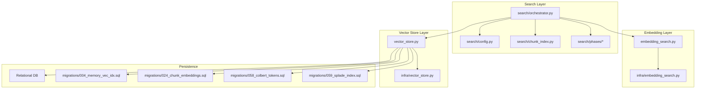
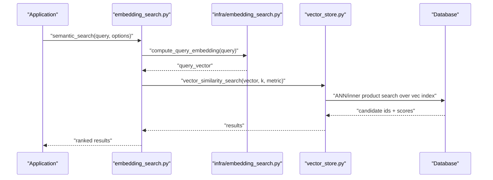
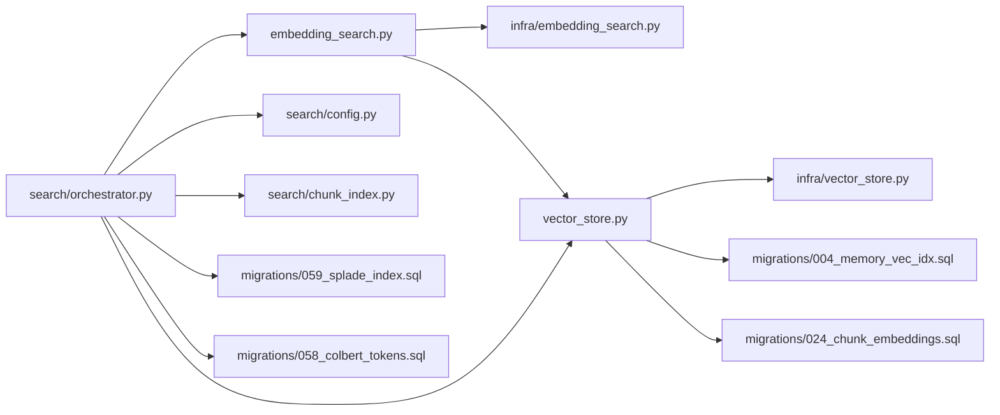

# Semantic Search with Embeddings

<cite>
**Referenced Files in This Document**
- [embedding_search.py](file://embedding_search.py)
- [vector_store.py](file://vector_store.py)
- [search/config.py](file://search/config.py)
- [search/chunk_index.py](file://search/chunk_index.py)
- [search/orchestrator.py](file://search/orchestrator.py)
- [search/phases/](file://search/phases/)
- [infra/vector_store.py](file://infra/vector_store.py)
- [infra/embedding_search.py](file://infra/embedding_search.py)
- [migrations/002_memory_embeddings.sql](file://migrations/002_memory_embeddings.sql)
- [migrations/004_memory_vec_idx.sql](file://migrations/004_memory_vec_idx.sql)
- [migrations/024_chunk_embeddings.sql](file://migrations/024_chunk_embeddings.sql)
- [migrations/058_colbert_tokens.sql](file://migrations/058_colbert_tokens.sql)
- [migrations/059_splade_index.sql](file://migrations/059_splade_index.sql)
- [examples/basic_save_search.py](file://examples/basic_save_search.py)
- [eval/retrieval_benchmark.py](file://eval/retrieval_benchmark.py)
- [benchmarks/bench_search.py](file://benchmarks/bench_search.py)
</cite>

## Table of Contents
1. [Introduction](#introduction)
2. [Project Structure](#project-structure)
3. [Core Components](#core-components)
4. [Architecture Overview](#architecture-overview)
5. [Detailed Component Analysis](#detailed-component-analysis)
6. [Dependency Analysis](#dependency-analysis)
7. [Performance Considerations](#performance-considerations)
8. [Troubleshooting Guide](#troubleshooting-guide)
9. [Conclusion](#conclusion)
10. [Appendices](#appendices)

## Introduction
This document explains embedding-based semantic search as implemented in the repository. It covers vector similarity computation, embedding model selection, chunking strategies, vector store configuration, index optimization, and memory management. It also provides practical guidance for customizing embedding models, implementing hybrid search strategies, tuning similarity thresholds, and scaling vector search operations. The content is grounded in the repository’s codebase and migration schemas to ensure accuracy and reproducibility.

## Project Structure
The semantic search capability spans several modules:
- High-level search orchestration and pipeline configuration
- Vector storage and indexing backed by a relational database with specialized indexes
- Chunking and tokenization utilities for text segmentation
- Embedding generation and caching
- Hybrid retrieval combining dense vectors and sparse lexical signals (e.g., SPLADE)
- Evaluation and benchmarking harnesses

**Diagram sources**
- [search/orchestrator.py](file://search/orchestrator.py)
- [search/config.py](file://search/config.py)
- [search/chunk_index.py](file://search/chunk_index.py)
- [embedding_search.py](file://embedding_search.py)
- [infra/embedding_search.py](file://infra/embedding_search.py)
- [vector_store.py](file://vector_store.py)
- [infra/vector_store.py](file://infra/vector_store.py)
- [migrations/004_memory_vec_idx.sql](file://migrations/004_memory_vec_idx.sql)
- [migrations/024_chunk_embeddings.sql](file://migrations/024_chunk_embeddings.sql)
- [migrations/058_colbert_tokens.sql](file://migrations/058_colbert_tokens.sql)
- [migrations/059_splade_index.sql](file://migrations/059_splade_index.sql)

**Section sources**
- [search/orchestrator.py](file://search/orchestrator.py)
- [search/config.py](file://search/config.py)
- [search/chunk_index.py](file://search/chunk_index.py)
- [embedding_search.py](file://embedding_search.py)
- [infra/embedding_search.py](file://infra/embedding_search.py)
- [vector_store.py](file://vector_store.py)
- [infra/vector_store.py](file://infra/vector_store.py)
- [migrations/002_memory_embeddings.sql](file://migrations/002_memory_embeddings.sql)
- [migrations/004_memory_vec_idx.sql](file://migrations/004_memory_vec_idx.sql)
- [migrations/024_chunk_embeddings.sql](file://migrations/024_chunk_embeddings.sql)
- [migrations/058_colbert_tokens.sql](file://migrations/058_colbert_tokens.sql)
- [migrations/059_splade_index.sql](file://migrations/059_splade_index.sql)

## Core Components
- Embedding search entry points: high-level functions that compute query embeddings and perform retrieval against stored vectors.
- Vector store abstraction: persistence layer for vectors, tokens, and related metadata; supports efficient similarity search via database-backed indexes.
- Search orchestrator: composes phases such as candidate retrieval, reranking, and fusion for hybrid strategies.
- Chunking and indexing: splits documents into chunks, computes embeddings per chunk, and persists them with identifiers for traceability.
- Configuration: controls model selection, similarity metrics, top-k, thresholds, and hybrid weights.

Key responsibilities:
- Compute embeddings for queries and documents
- Persist and retrieve vectors efficiently
- Combine dense and sparse signals for hybrid retrieval
- Provide configurable thresholds and ranking strategies

**Section sources**
- [embedding_search.py](file://embedding_search.py)
- [infra/embedding_search.py](file://infra/embedding_search.py)
- [vector_store.py](file://vector_store.py)
- [infra/vector_store.py](file://infra/vector_store.py)
- [search/orchestrator.py](file://search/orchestrator.py)
- [search/config.py](file://search/config.py)
- [search/chunk_index.py](file://search/chunk_index.py)

## Architecture Overview
The system implements a layered architecture:
- Application layer calls embedding search APIs
- Embedding layer generates or retrieves embeddings using configured models
- Vector store layer persists and queries vectors with optimized indexes
- Database layer stores vectors, tokens, and indices defined by migrations

**Diagram sources**
- [embedding_search.py](file://embedding_search.py)
- [infra/embedding_search.py](file://infra/embedding_search.py)
- [vector_store.py](file://vector_store.py)
- [migrations/004_memory_vec_idx.sql](file://migrations/004_memory_vec_idx.sql)

## Detailed Component Analysis

### Embedding Model Selection and Computation
- Model selection is driven by configuration and environment, allowing different embedding backends.
- Query embeddings are computed once per request and reused within the same operation.
- Caching mechanisms reduce redundant embedding computations across requests and workers.

Practical customization:
- Configure an alternative embedding provider through settings
- Ensure consistent dimensionality and normalization expectations between query and document embeddings

**Section sources**
- [search/config.py](file://search/config.py)
- [embedding_search.py](file://embedding_search.py)
- [infra/embedding_search.py](file://infra/embedding_search.py)

### Vector Similarity Computation
- Similarity metrics include cosine similarity and inner product depending on vector normalization and index type.
- Index types support approximate nearest neighbor (ANN) search for scalability.
- Normalization strategy affects which metric yields optimal recall and precision.

Tuning guidance:
- Choose inner product when vectors are L2-normalized
- Use cosine similarity when vectors are not normalized
- Validate metric choice against evaluation benchmarks

**Section sources**
- [vector_store.py](file://vector_store.py)
- [infra/vector_store.py](file://infra/vector_store.py)
- [migrations/004_memory_vec_idx.sql](file://migrations/004_memory_vec_idx.sql)

### Chunking Strategies
- Documents are split into chunks before embedding to balance context richness and retrieval granularity.
- Chunk size and overlap affect both recall and latency; larger chunks improve context but may dilute relevance.
- Chunk identifiers link embeddings back to source documents for explainability.

Best practices:
- Use domain-aware chunk boundaries (paragraphs, sections)
- Apply overlap to preserve cross-boundary semantics
- Track chunk metadata for filtering and provenance

**Section sources**
- [search/chunk_index.py](file://search/chunk_index.py)
- [migrations/024_chunk_embeddings.sql](file://migrations/024_chunk_embeddings.sql)

### Hybrid Search Strategies
- Combines dense vector similarity with sparse lexical signals (e.g., SPLADE) to improve recall for rare terms and exact matches.
- Fusion can use reciprocal rank fusion (RRF) or weighted scoring based on calibration.
- Phase composition allows pluggable rerankers and filters.

Implementation notes:
- Enable SPLADE index and tokens where applicable
- Tune fusion weights to balance semantic and lexical contributions
- Validate hybrid performance on representative datasets

**Section sources**
- [search/orchestrator.py](file://search/orchestrator.py)
- [migrations/059_splade_index.sql](file://migrations/059_splade_index.sql)
- [migrations/058_colbert_tokens.sql](file://migrations/058_colbert_tokens.sql)

### Vector Store Configuration and Index Optimization
- Vector tables and indexes are defined in migrations, including dedicated columns for vectors and tokens.
- Index creation includes parameters for ANN search (e.g., number of neighbors, ef construction/search).
- Memory usage depends on vector dimensionality, index size, and cache policies.

Optimization tips:
- Adjust index parameters based on corpus size and latency targets
- Monitor disk and memory footprint during index builds
- Periodically rebuild indexes after significant data changes

**Section sources**
- [migrations/002_memory_embeddings.sql](file://migrations/002_memory_embeddings.sql)
- [migrations/004_memory_vec_idx.sql](file://migrations/004_memory_vec_idx.sql)
- [migrations/024_chunk_embeddings.sql](file://migrations/024_chunk_embeddings.sql)
- [migrations/058_colbert_tokens.sql](file://migrations/058_colbert_tokens.sql)
- [migrations/059_splade_index.sql](file://migrations/059_splade_index.sql)

### Similarity Thresholds and Ranking
- Top-k limits the number of candidates returned from vector search.
- A similarity threshold can filter out low-confidence matches post-retrieval.
- Reranking layers refine order using cross-encoders or learned models.

Tuning workflow:
- Start with a moderate top-k (e.g., 20–50)
- Apply a conservative threshold initially and relax based on precision/recall trade-offs
- Use evaluation harnesses to measure impact of thresholds and fusion weights

**Section sources**
- [search/config.py](file://search/config.py)
- [search/orchestrator.py](file://search/orchestrator.py)

### Practical Examples
- Basic save-and-search example demonstrates end-to-end flow: ingest, embed, index, and retrieve.
- Retrieval benchmarks provide scripts to evaluate recall and latency under different configurations.

Usage references:
- Example script path for quickstart
- Benchmark scripts for performance validation

**Section sources**
- [examples/basic_save_search.py](file://examples/basic_save_search.py)
- [eval/retrieval_benchmark.py](file://eval/retrieval_benchmark.py)
- [benchmarks/bench_search.py](file://benchmarks/bench_search.py)

## Dependency Analysis
The following diagram shows key dependencies among core components involved in semantic search.

**Diagram sources**
- [embedding_search.py](file://embedding_search.py)
- [infra/embedding_search.py](file://infra/embedding_search.py)
- [vector_store.py](file://vector_store.py)
- [infra/vector_store.py](file://infra/vector_store.py)
- [search/orchestrator.py](file://search/orchestrator.py)
- [search/config.py](file://search/config.py)
- [search/chunk_index.py](file://search/chunk_index.py)
- [migrations/004_memory_vec_idx.sql](file://migrations/004_memory_vec_idx.sql)
- [migrations/024_chunk_embeddings.sql](file://migrations/024_chunk_embeddings.sql)
- [migrations/058_colbert_tokens.sql](file://migrations/058_colbert_tokens.sql)
- [migrations/059_splade_index.sql](file://migrations/059_splade_index.sql)

**Section sources**
- [embedding_search.py](file://embedding_search.py)
- [infra/embedding_search.py](file://infra/embedding_search.py)
- [vector_store.py](file://vector_store.py)
- [infra/vector_store.py](file://infra/vector_store.py)
- [search/orchestrator.py](file://search/orchestrator.py)
- [search/config.py](file://search/config.py)
- [search/chunk_index.py](file://search/chunk_index.py)
- [migrations/004_memory_vec_idx.sql](file://migrations/004_memory_vec_idx.sql)
- [migrations/024_chunk_embeddings.sql](file://migrations/024_chunk_embeddings.sql)
- [migrations/058_colbert_tokens.sql](file://migrations/058_colbert_tokens.sql)
- [migrations/059_splade_index.sql](file://migrations/059_splade_index.sql)

## Performance Considerations
- Index parameters: tune ANN index settings (e.g., m, efConstruction, efSearch) to balance recall and latency.
- Vector normalization: prefer normalized vectors for inner product searches to reduce overhead.
- Caching: leverage embedding caches to avoid recomputation for repeated queries.
- Batch processing: batch embedding generation and index updates to reduce I/O and model invocation costs.
- Hybrid fusion: calibrate fusion weights to minimize expensive reranking while maintaining quality.
- Monitoring: track recall, latency, and resource utilization during index builds and peak loads.

[No sources needed since this section provides general guidance]

## Troubleshooting Guide
Common issues and remedies:
- Low recall: increase top-k, adjust similarity threshold, enable hybrid search, or expand SPLADE coverage.
- High latency: reduce top-k, optimize ANN index parameters, normalize vectors, and enable caching.
- Dimensionality mismatch: verify embedding model output dimensions match index schema.
- Stale embeddings: rebuild indexes after model upgrades or corpus changes.
- Resource pressure: monitor memory and disk usage; consider incremental reindexing and compaction.

Validation steps:
- Run retrieval benchmarks to compare configurations
- Inspect index statistics and query plans
- Review logs for embedding failures and fallback paths

**Section sources**
- [eval/retrieval_benchmark.py](file://eval/retrieval_benchmark.py)
- [benchmarks/bench_search.py](file://benchmarks/bench_search.py)

## Conclusion
Embedding-based semantic search in this repository combines dense vector retrieval with sparse lexical signals, orchestrated through a modular pipeline. By carefully selecting embedding models, configuring vector indexes, and tuning thresholds and fusion weights, you can achieve robust recall and acceptable latency at scale. Use the provided examples and benchmarks to validate your choices and iterate toward optimal performance.

[No sources needed since this section summarizes without analyzing specific files]

## Appendices

### Data Models and Migrations
- Embeddings table and vector column definitions
- Dedicated vector index creation for ANN search
- Chunk embeddings table linking chunks to their vectors
- SPLADE index and token storage for sparse retrieval

**Section sources**
- [migrations/002_memory_embeddings.sql](file://migrations/002_memory_embeddings.sql)
- [migrations/004_memory_vec_idx.sql](file://migrations/004_memory_vec_idx.sql)
- [migrations/024_chunk_embeddings.sql](file://migrations/024_chunk_embeddings.sql)
- [migrations/058_colbert_tokens.sql](file://migrations/058_colbert_tokens.sql)
- [migrations/059_splade_index.sql](file://migrations/059_splade_index.sql)