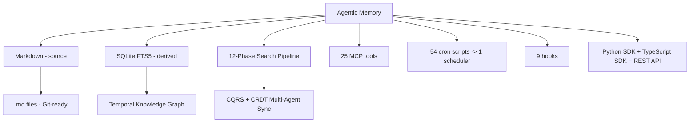

# Agentic Memory

[](LICENSE)
[](https://www.python.org/downloads/)
[](#testing)
[](docs/reference/schema.md)
[](docs/reference/mcp-tools.md)
[](docs/concepts/multi-agent-sync.md)
[](docs/concepts/temporal-kg.md)
[](CHANGELOG.md)
[](paper_pipeline/)
[](docs/reference/benchmarks.md)

[Quick Start](#quick-start) · [Features](#features) · [Architecture](#architecture) · [MCP Server](#mcp-server) · [SDKs](#sdks) · [Comparison](#comparison) · [Docs](docs/index.md) · [Contributing](CONTRIBUTING.md)

---

## What is Agentic Memory?

Agentic Memory gives AI agents **persistent, cross-session, local-first memory** — no cloud, no vendor lock-in, no API keys required. Memories are stored as human-readable Markdown files. A derived SQLite index enables fast full-text, semantic, and knowledge-graph search.

Built for **Claude Code**, **OpenCode**, **MiMoCode**, and any MCP-compatible agent harness.



---

## Quick Start

### Python SDK (Recommended)

```python
from agentic_memory import MemoryClient

mc = MemoryClient()
mc.save("User prefers dark mode", category="preferences")
results = mc.search("dark mode")
for r in results:
    print(f"[{r.score:.2f}] {r.content}")
```

### Agent Scoping

```python
from agentic_memory import AgentMemory

coder = AgentMemory(agent_id="coder")
coder.save("Frontend uses React with TypeScript")

designer = AgentMemory(agent_id="designer")
designer.save("Brand colors are #FF5733 and #33FF57")
```

### MCP Server

```bash
# Add to your MCP config
{
  "agentic-memory": {
    "command": "agentic-memory-server"
  }
}
```

### REST API

```bash
agentic-memory api --port 9878
curl http://localhost:9878/api/v1/search?q=dark+mode
```

---

## Features

### Search — 12-Phase Hybrid Pipeline

| Phase | Technique | Purpose |
|-------|-----------|---------|
| 0 | Unicode normalization | Input normalization |
| 1 | FTS5 BM25 | Keyword retrieval |
| 2 | usearch ANN + model2vec | Semantic vector search |
| 3 | ColBERT late-interaction | Token-level matching |
| 4 | Reciprocal Rank Fusion | Merge all retrievers |
| 5 | Cross-encoder rerank | Neural reranking (weak or deep CE) |
| 6 | Temporal decay | Recency bias |
| 7 | Neural forget curve | Surprise-based retention |
| 8 | KG concept boost | Knowledge graph boost |
| 9 | Final scoring | Weighted combination |
| 10 | Result envelope | Output formatting |
| 11 | Error counter | Per-phase observability |

Each phase is independently isolated — no single failure kills the search.

### Write — Crash-Safe, Conflict-Preserving

- **Saga transactions** — Crash-consistent writes with undo/redo
- **CQRS write journal** — Lock-free multi-agent writes via journal.db
- **CRDT field-level LWWES** — Concurrent edits to different fields both win
- **Safe atomic write** — POSIX rename, conflict file preservation

### Knowledge Graph — Temporal + Contradiction-Aware

- Entity extraction with Jaccard fuzzy matching
- Temporal edges with `valid_at` / `invalid_at`
- Contradiction detection and supersession chains
- Graph analytics (centrality, community detection)

### Neural Forget Curve

Surprise-based retention formula considering access patterns, query relevance, recency, and importance:

```
retention = sigmoid(w_acc × access + w_surp × surprise + w_imp × importance + w_fit × fitness - w_rec × recency - bias)
```

### Cron Consolidation

39 crontab entries replaced with **1 consolidated scheduler** that runs every 5 minutes, checks which jobs are due by frequency tier, and runs them sequentially.

### System Health Dashboard

`memory_system_health` MCP tool returns green/yellow/red across 6 dimensions with actionable next steps: database, search, worker, crons, auto-save, disk.

---

## Architecture

```
agentic-memory/
├── agentic_memory/              # Python SDK (pip installable)
│   ├── client.py                # MemoryClient (save/search/CRUD)
│   ├── temporal.py              # TemporalKG
│   ├── kg.py                    # KnowledgeGraph
│   ├── integrations/            # LangChain + CrewAI adapters
│   └── models.py                # 8 typed dataclasses
├── search/                      # 14-phase search pipeline
│   ├── orchestrator.py          # Main pipeline (2,825 LOC)
│   ├── scoring.py               # RRF, temporal decay, KG boost
│   ├── rerankers.py             # Cross-encoder, ColBERT
│   ├── chunk_index.py           # Semantic chunking
│   └── synthesis.py             # Answer synthesis
├── save/                        # Write path
│   ├── pipeline.py              # Saga-wrapped save
│   ├── backlinks.py             # Wiki-style backlinks
│   └── post_save_hooks.py       # Post-save operations
├── infra/                       # Infrastructure
│   ├── db.py                    # Connection pool + WAL
│   ├── write_journal.py         # CQRS write journal
│   ├── embedding_search.py      # Semantic embeddings
│   ├── reranker.py              # Neural reranker
│   ├── vector_store.py          # ANN index abstraction
│   ├── api_server.py            # REST + WebSocket
│   └── cache.py                 # Multi-level caching
├── knowledge_graph/             # KG extraction + search
├── kg/                          # Temporal KG + analytics
├── crdt/                        # Field-level CRDT merge
├── fact/                        # Fact extraction + temporal
├── background/                  # Daemon + worker + circuit breaker
├── cron/                        # 47+ cron jobs + consolidated scheduler
├── hooks/                       # 6 lifecycle hooks
├── migrations/                  # 57 reversible migrations
├── eval/                        # 4,766+ tests
├── ts-sdk/                      # TypeScript SDK
├── mcp_*.py                     # 31 MCP modules
├── mcp_health.py                # System health MCP tool
└── dashboard.py                 # Streamlit observability
```

**Production stats:** ~110K LOC, 297 test files, 4,766+ test functions, schema v56, 57 reversible migrations, 17 CORE MCP tools, 1 consolidated scheduler, 6 lifecycle hooks.

---

## SDKs

### Python

```bash
pip install agentic-memory
```

```python
from agentic_memory import MemoryClient, AgentMemory, TemporalKG

mc = MemoryClient()
mc.save("Important context", category="lessons")
results = mc.search("context")
stats = mc.stats()
```

### TypeScript

```bash
npm install @agentic-memory/sdk
```

```typescript
import { MemoryClient } from '@agentic-memory/sdk';
const client = new MemoryClient();
await client.add('Important context');
const results = await client.search('context');
```

### REST API

```bash
agentic-memory api --port 9878
```

```bash
curl -X POST http://localhost:9878/api/v1/memories \
  -H "Content-Type: application/json" \
  -d '{"content": "Important context"}'
```

---

## MCP Server

17 CORE tools always visible to your agent. 95 ADMIN + 3 DEPRECATED behind `memory_maintenance(operation="...")`.

### CORE Tools

```
memory_search         memory_save           memory_delete
memory_recall         memory_note           memory_learn
memory_audit          memory_organize       memory_share
memory_graph          memory_profile        memory_session_start
memory_advanced       memory_review_beliefs memory_curate_autosave
memory_health_check   memory_system_health
```

### Setup

```json
{
  "agentic-memory": {
    "command": "agentic-memory-server",
    "env": {
      "MEMORY_KNOWLEDGE_GRAPH": "1",
      "MEMORY_DB_PATH": "./memory.db"
    }
  }
}
```

---

## Integrations

### LangChain

```python
from agentic_memory.integrations.langchain.tool import search_tool, save_tool
agent = create_react_agent(llm, tools=[search_tool, save_tool])
```

### CrewAI

```python
from agentic_memory.integrations.crewai.tool import AgenticMemorySearchTool
agent = Agent(..., tools=[AgenticMemorySearchTool()])
```

### OKF (Open Knowledge Format)

```python
mc.okf_export("~/ObsidianVault/agent-memory")
```

---

## Configuration

### Install Extras

```bash
pip install agentic-memory              # Core
pip install agentic-memory[embeddings]  # + semantic search
pip install agentic-memory[reranker]    # + cross-encoder
pip install agentic-memory[langchain]   # + LangChain
pip install agentic-memory[crewai]      # + CrewAI
pip install agentic-memory[all]         # Everything
```

### Key Environment Variables

| Variable | Default | Description |
|----------|---------|-------------|
| `MEMORY_DB_PATH` | `./memory.db` | Database path |
| `MEMORY_LOCAL_DIR` | `./memory` | Markdown directory |
| `MEMORY_KNOWLEDGE_GRAPH` | `0` | Enable KG extraction |
| `MEMORY_EMBEDDINGS` | `0` | Enable semantic search |
| `MEMORY_LLM_EXTRACTION` | `0` | Enable LLM fact extraction |

---

## Comparison

| Feature | Agentic Memory | Mem0 | Letta | Zep |
|---------|---------------|------|-------|-----|
| **Local-first** | Yes | No | No | No |
| **MCP-native** | 17 CORE tools | No | No | 1 tool |
| **14-phase search** | Yes | No | No | No |
| **Temporal KG** | Yes | Partial | No | Yes |
| **CRDT sync** | Field-level | No | No | No |
| **CQRS journal** | Yes | No | No | No |
| **Neural forget** | Yes | No | No | No |
| **Python SDK** | Yes | Yes | Yes | Yes |
| **TypeScript SDK** | Yes | Yes | Yes | Yes |
| **LangChain** | Yes | Yes | Yes | Yes |
| **CrewAI** | Yes | Yes | Yes | No |
| **OKF support** | Yes | No | No | No |
| **Test coverage** | 4,766+ tests | ~500 | ~2,000 | ~300 |
| **License** | Apache 2.0 | Apache 2.0 | Apache 2.0 | Apache 2.0 |

---

## Documentation

| Section | Description |
|---------|-------------|
| [Quick Start](docs/guides/quick-start.md) | Get running in 5 minutes |
| [Python SDK](docs/api/python-sdk.md) | Full API reference |
| [TypeScript SDK](docs/api/typescript-sdk.md) | Full API reference |
| [REST API](docs/api/rest-api.md) | HTTP endpoints |
| [Architecture](docs/architecture/overview.md) | System design |
| [LangChain Guide](docs/guides/langchain.md) | Integration guide |
| [CrewAI Guide](docs/guides/crewai.md) | Integration guide |
| [Concepts](docs/concepts/) | Search pipeline, KG, CRDT, tiers |
| [How-To Guides](docs/how-to/) | Integration, debugging, cron setup |
| [Reference](docs/reference/) | MCP tools, configuration, schema |

---

## Contributing

See [CONTRIBUTING.md](CONTRIBUTING.md) for dev setup, coding conventions, and PR guidelines.

Issues and PRs welcome. For security vulnerabilities, see [SECURITY.md](SECURITY.md).

---

## License

[Apache License 2.0](LICENSE)
