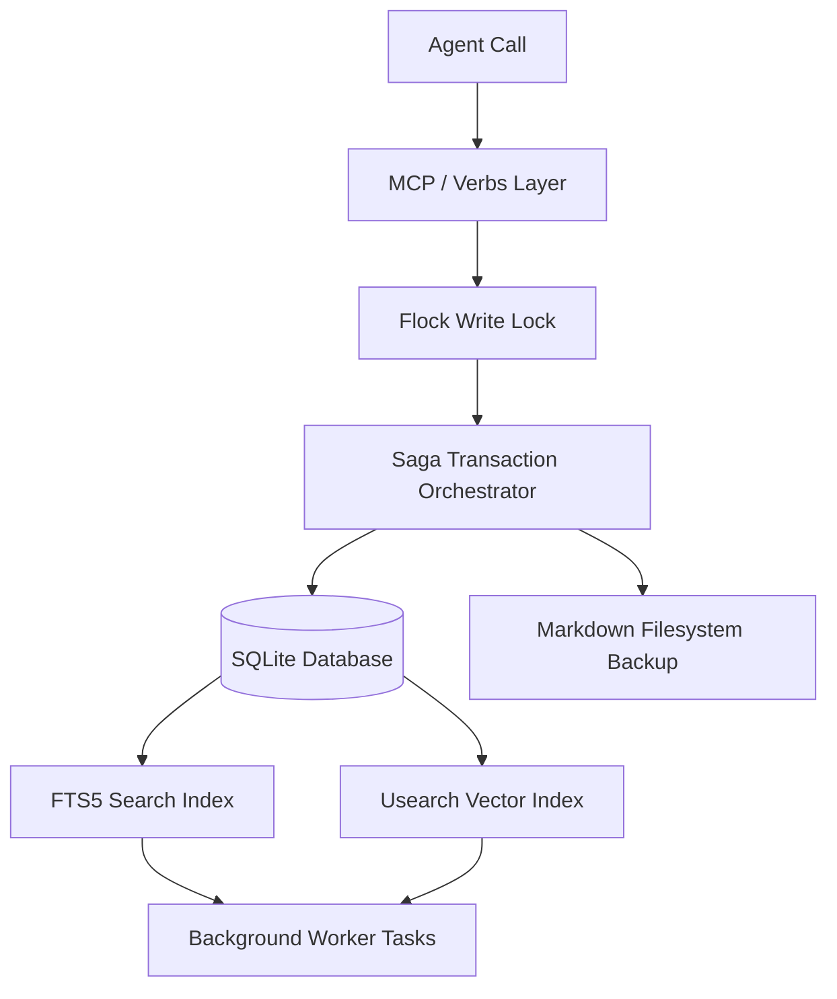

# Agentic Memory System — Quickstart Guide

This guide is designed to get you up and running with the Agentic Memory System as quickly as possible. It details the memory contract, key verbs, system architecture, durability guarantees, and steps to resolve operational anomalies.

---

## 1. The Agentic Memory Contract

Every agent interacting with this system is bound by the **Memory Contract**:
1. **Read-Before-Write**: Before committing new memories or changing the state of the workspace, search existing context using `memory_search` or `memory_session_start` to prevent duplicate note creation.
2. **Structural Integrity**: Always save memories with descriptive `title_slug` strings and correct `category` names (e.g., `lessons`, `decisions`, `status`). Do not put slashes in the slugs.
3. **Trace and Correct**: If you make or encounter a contradiction, leverage the `dedup` maintenance tool to resolve near-duplicates or investigate the timeline with `temporal_query`.

---

## 2. Core Verbs & Escape Hatches Reference

The agent-facing surface is composed of **24 core verbs**, plus **2 escape hatches** to admin operations.

### Core Verbs (Thin wrappers with sensible defaults)

**Save & Recall:**
* `memory_save(content, category, title_slug, tags=None, pinned=False, importance=3)`: Core save pipeline.
* `memory_delete(note_id, hard=False)`: Soft-delete a memory.
* `memory_restore(note_id)`: Restore a soft-deleted memory.
* `memory_supersede(old_id, new_id)`: Mark a note as outdated and superseded by another.
* `memory_learn(content, as_skill=False, skill_name="", category="lessons")`: Save a lesson or compile a skill.
* `memory_recall(query, session_id)`: Fast context matching for session continuity.
* `memory_note(note_id, action="read")`: Read/update/delete/patch/supersede a single note.
* `memory_session_start(query="")`: Retrieve the workspace briefing and startup context.

**Search & Discovery:**
* `memory_search(query, limit=5, mode="hybrid", category="")`: Unified FTS5 + semantic + KG search.
* `memory_recall_context(query, limit=15, deep_rerank=False)`: Structured briefing for agent cold-start.
* `memory_graph(query, action="explore")`: Explore the knowledge graph.
* `memory_facts_search(query, limit=10)`: Search extracted SPO facts.

**Agent Self-Editing:**
* `memory_list_skills(limit=50)`: List extracted skills.
* `memory_extract_skills(memory_id, dry_run)`: Manually trigger skill extraction.
* `memory_compile_skill(lesson_slug, skill_name, primary_triggers)`: Compile a lesson into a reusable skill.

**Multi-Agent:**
* `memory_share(note_id, action="list")`: Share memories between agents or view the shared pool.
* `memory_coordinate(action="get_project_state")`: Task management, file locking, and agent messaging.

**Audit & Health:**
* `memory_audit(hours=24, limit=20)`: Review recent activity and errors.
* `memory_health_check()`: Diagnostic summary of DB, index, worker, and schema.
* `memory_system_health()`: Green/yellow/red health check with actionable next steps.
* `memory_profile(action="stats")`: Agent scopes, cached skills, ARC stats.
* `memory_review_beliefs(min_confidence=0.5)`: Review low-confidence or stale beliefs.

**Feedback & Maintenance:**
* `memory_record_ctr_feedback(id, query_id, action="returned")`: Record click-through rate feedback on search results.
* `memory_organize(target="safe_default")`: Run a safe maintenance batch (compact + consolidate + rewrite_links).

### Escape Hatches
* `memory_maintenance(operation="...", **kwargs)`: Run any admin operation (92 admin tools).
* `memory_advanced(operation="...", **kwargs)`: Alias for `memory_maintenance`.

---

## 3. System Architecture & Durability

The system uses a local-first SQLite database combined with a Markdown flat-file backup for maximum resiliency.



### Durability Guarantees
* **Saga Transactions**: Writes coordinate both SQLite changes and file modifications. A crash mid-operation triggers an automatic rollback of the transaction, leaving no partial state.
* **Process-Safe Locking**: A file-lock (`memory.db.lock`) prevents multiple concurrent processes or threads from corrupting index updates.
* **Bi-Temporal Validity**: Database entities record both transaction time and valid time, enabling historical audit traces via `temporal_query`.

---

## 4. Disaster Recovery & Troubleshooting

### Identifying Stuck Tasks
If background tasks (e.g. index backfilling, embedding calculations) seem delayed, run:
```bash
# Check overall health and schema version
memory_health_check()
```
Or view the logs at `~/.config/agentic-memory/memory/worker.log`.

### Forcing a Stuck Worker Reset
The daemon automatically runs checks to release tasks locked in `processing` state for too long. If you need to force a reset manually:
```bash
# Triggers the cron jobs to run immediate maintenance
memory_organize(target="safe_default")
```

### Database Integrity Recovery
If you receive database connection errors or suspect corruption:
```bash
# Perform deep sqlite integrity check
memory_maintenance(operation="check_integrity", deep=true)

# Rebuild all spatial and FTS indexes from scratch
memory_maintenance(operation="backfill_all", backfill_mode="rebuild")
```
