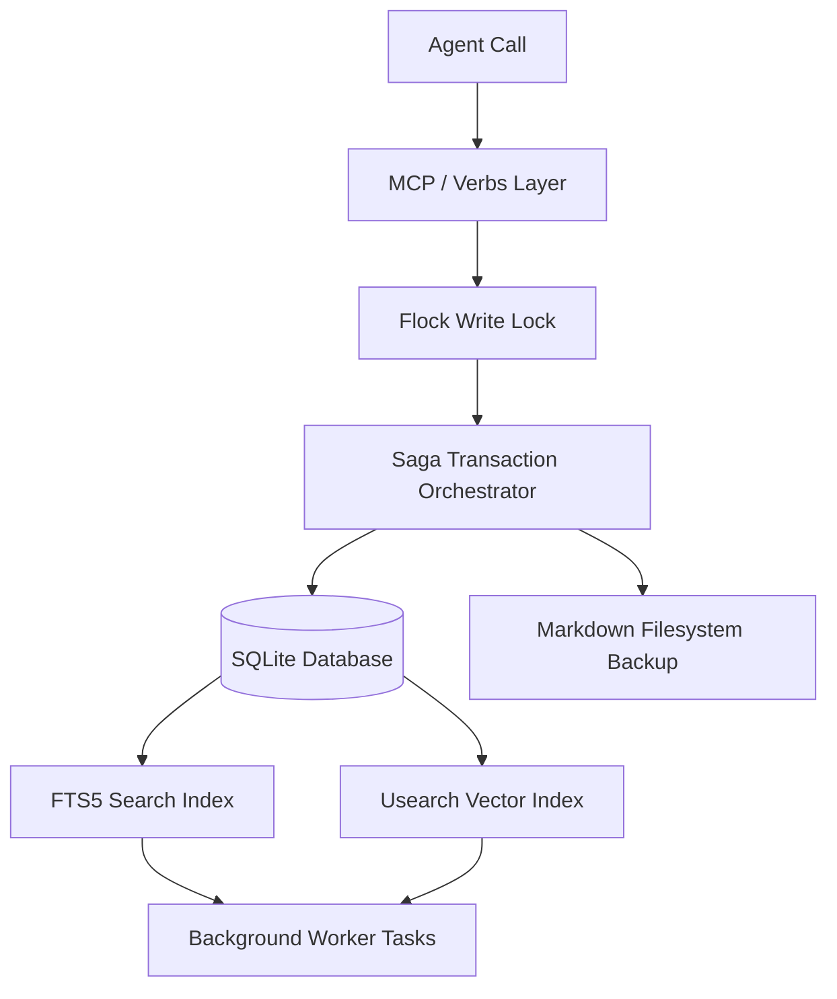

# Agentic Memory System — Quickstart Guide

This guide is designed to get you up and running with the Agentic Memory System as quickly as possible. It details the memory contract, key verbs, system architecture, durability guarantees, and steps to resolve operational anomalies.

---

## 1. The Agentic Memory Contract

Every agent interacting with this system is bound by the **Memory Contract**:
1. **Read-Before-Write**: Before committing new memories or changing the state of the workspace, search existing context using `memory_search` or `memory_session_start` to prevent duplicate note creation.
2. **Structural Integrity**: Always save memories with descriptive `title_slug` strings and correct `category` names (e.g., `lessons`, `decisions`, `status`). Do not put slashes in the slugs.
3. **Trace and Correct**: If you make or encounter a contradiction, leverage the `dedup` maintenance tool to resolve near-duplicates or investigate the timeline with `temporal_query`.

---

## 2. Core Verbs & Escape Hatch Reference

The agent-facing surface is composed of **17 core verbs** and **1 escape hatch**:

### Core Verbs (Thin wrappers with sensible defaults)
* `memory_search(query, limit=15, mode="hybrid")`: Unified keyword FTS5 + semantic vector search.
* `memory_save(content, category, title_slug, tags=None, pinned=False)`: Core save pipeline. Raises `SaveValidationError` on invalid params.
* `memory_delete(note_id)`: Marks a memory as soft-deleted.
* `memory_recall(query, limit=5)`: Fast query-based context matching.
* `memory_note(note_id)`: Fetches a single note's full text and metadata.
* `memory_learn(content, category="lessons", tags=None)`: Fast-path memory save with automated slug generation.
* `memory_audit(action="summary", limit=20)`: View recent operations log to track memory evolution.
* `memory_organize(target="safe_default")`: Executes batch maintenance tasks (compact, consolidate, link rewrite).
* `memory_share(note_id, share_with)`: Share notes between agents or tenants.
* `memory_graph(action="stats")`: Inspect the entity-relationship knowledge graph.
* `memory_profile(action="stats")`: Look up cached skills and active agent profiles.
* `memory_session_start(query="")`: Retrieve the workspace briefing and startup context.
* `memory_review_beliefs(action="due")`: View beliefs scheduled for reinforcement/decay review.
* `memory_curate_autosave(action="list")`: List, apply, or purge deferred/inbox auto-saves.
* `memory_health_check()`: Diagnostic summary of DB, index, background worker, and schema.
* `memory_system_health()`: Comprehensive green/yellow/red health check with actionable next steps.

### Escape Hatch
* `memory_advanced(operation, kwargs)`: Pass-through router to run any administrative/maintenance operation directly.

---

## 3. System Architecture & Durability

The system uses a local-first SQLite database combined with a Markdown flat-file backup for maximum resiliency.



### Durability Guarantees
* **Saga Transactions**: Writes coordinate both SQLite changes and file modifications. A crash mid-operation triggers an automatic rollback of the transaction, leaving no partial state.
* **Process-Safe Locking**: A file-lock (`memory.db.lock`) prevents multiple concurrent processes or threads from corrupting index updates.
* **Bi-Temporal Validity**: Database entities record both transaction time and valid time, enabling historical audit traces via `temporal_query`.

---

## 4. Disaster Recovery & Troubleshooting

### Identifying Stuck Tasks
If background tasks (e.g. index backfilling, embedding calculations) seem delayed, run:
```bash
# Check overall health and schema version
memory_advanced(operation="health_check")
```
Or view the logs at `~/.config/agentic-memory/memory/worker.log`.

### Forcing a Stuck Worker Reset
The daemon automatically runs checks to release tasks locked in `processing` state for too long. If you need to force a reset manually:
```bash
# Triggers the cron jobs to run immediate maintenance
memory_organize(target="safe_default")
```

### Database Integrity Recovery
If you receive database connection errors or suspect corruption:
```bash
# Perform deep sqlite integrity check
memory_advanced(operation="check_integrity", kwargs='{"deep": true}')

# Rebuild all spatial and FTS indexes from scratch
memory_advanced(operation="backfill_all", kwargs='{"backfill_mode": "rebuild"}')
```
