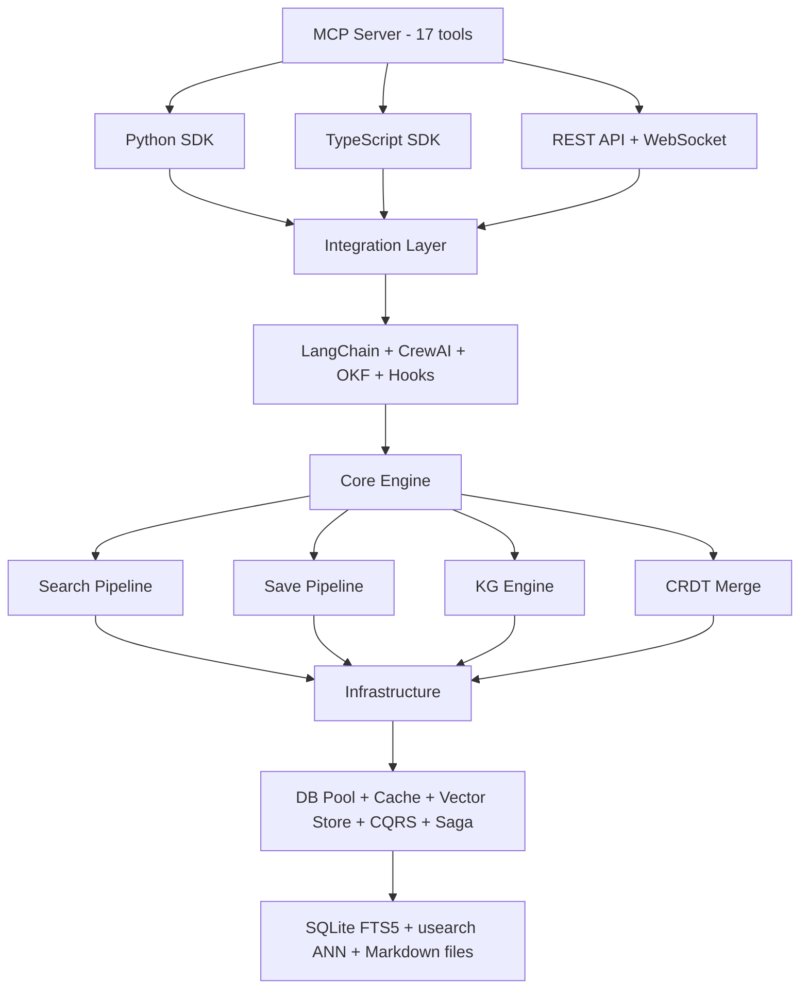
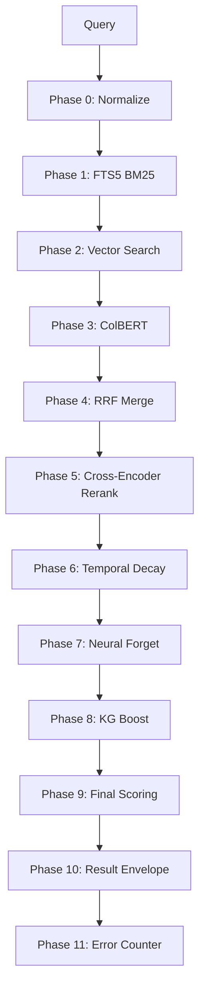
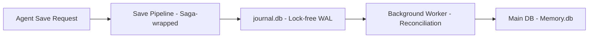
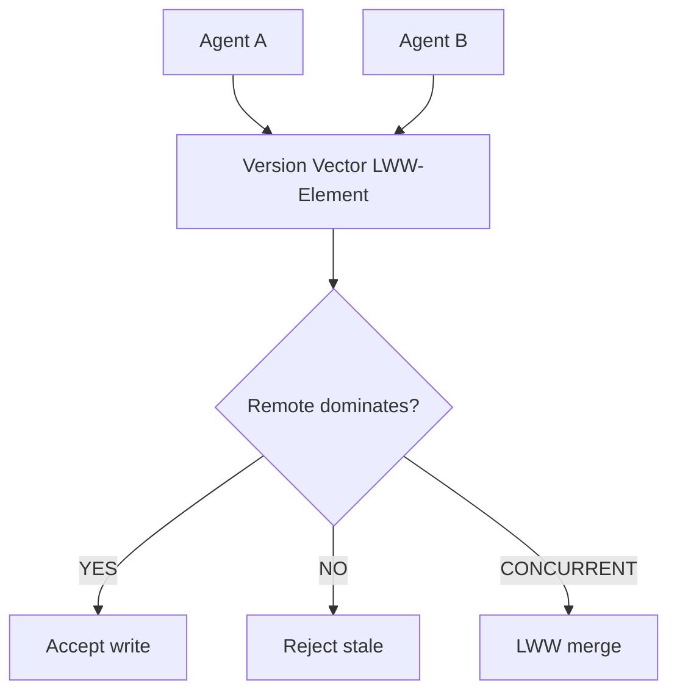
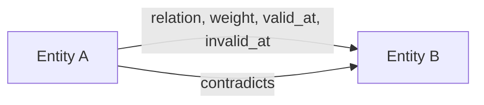

# Architecture Overview

## System Architecture

Agentic-memory is a local-first, MCP-native memory system for AI agents. It combines:

- **12-phase hybrid search pipeline** — FTS5 BM25 + vector + ColBERT + RRF + cross-encoder + temporal decay + neural forget + KG boost
- **CQRS write journal** — Lock-free multi-agent writes via separate journal database
- **CRDT field-level merge** — Conflict-free replication for multi-agent sync
- **Temporal knowledge graph** — Entity extraction, edge relationships with temporal validity, contradiction detection
- **Saga transactions** — Crash-consistent writes with undo/redo

## High-Level Architecture



## 12-Phase Search Pipeline

The search pipeline is the most sophisticated subsystem. Each phase is independently isolated — no single failure kills the search.



### Phase Details

| Phase | Technique | Purpose |
|-------|-----------|---------|
| 0 | Unicode normalization, query classification | Input normalization |
| 1 | SQLite FTS5 BM25 | Keyword-based retrieval |
| 2 | usearch ANN + model2vec embeddings | Semantic vector search |
| 3 | Character n-gram late-interaction | Token-level matching |
| 4 | Reciprocal Rank Fusion | Merge FTS5 + vector + ColBERT |
| 5 | IDF+bigram weak CE or Qwen3-Reranker deep CE | Neural reranking |
| 6 | Time-weighted scoring | Recency bias |
| 7 | Surprise-based retention formula | Forget curve |
| 8 | KG entity centrality boost | Knowledge graph boost |
| 9 | Weighted combination | Final scoring |
| 10 | JSON envelope | Output formatting |
| 11 | Per-phase error tracking | Observability |

## CQRS Write Path



**Flow:**
1. Agent writes to `journal.db` (lock-free INSERT with WAL)
2. Background worker polls journal every 15 minutes
3. Worker applies entries to main DB via saga
4. Saga ensures crash-consistent rollback
5. Dependent rows (KG, backlinks) are cleaned up on failure

## CRDT Sync Flow



**Conflict Resolution:**
- **Remote dominates**: Accept write (remote causally after local)
- **Local dominates**: Reject write (stale data)
- **Concurrent**: LWW merge via highest (clock, agent_id) tiebreaker

## Temporal Knowledge Graph



**Edge Properties:**
- `relation` — Type of relationship (related_to, depends_on, contradicts)
- `weight` — Strength (0.0 to 1.0)
- `valid_at` — When relationship started (epoch seconds)
- `invalid_at` — When relationship ended (epoch seconds)

**Temporal Queries:**
- "What did we know about X in February?" → filter by valid_at/invalid_at
- "What contradicts this fact?" → contradiction detection
- "What superseded this fact?" → supersession chain walking

## Saga Transaction Pattern

```
BEGIN IMMEDIATE
    ├── Step 1: Upsert memory row
    ├── Step 2: Update FTS5 index
    ├── Step 3: Update vector index
    ├── Step 4: Write markdown file
    └── Commit
        ↓ (on failure)
    UNDO:
        ├── Restore memory row
        ├── Remove FTS5 entry
        ├── Remove vector entry
        └── Delete markdown file
```

**Crash Consistency:** If any step fails, the saga undo restores the previous state. No partial writes survive a crash.

## Neural Forget Curve

```
retention = sigmoid(
    w_acc × access_signal +
    w_surp × surprise +
    w_imp × importance_norm +
    w_fit × fitness -
    w_rec × recency_penalty -
    bias
)
```

**Signals:**
- `access_signal` — How often the memory has been accessed
- `surprise` — How unexpected the content is (Jaccard distance)
- `importance_norm` — Memory's importance rating (1-5)
- `fitness` — Memory's quality score
- `recency_penalty` — Days since last access

**Scaled to [0,1]:** 1 = retain forever, 0 = forget immediately

## Semantic Chunking

```
Long Memory → Topic Boundary Detection → Overlapping Chunks
                 (Jaccard similarity)      (600 char target,
                                            81 char overlap,
                                            1200 char max)
```

**Chunking Strategy:**
- Extract keywords from each sentence
- Compute Jaccard similarity between consecutive sentences
- Split at topic boundaries (similarity < 0.15)
- Create overlapping chunks (600 char target, 81 char overlap)
- Index chunks in separate FTS5 table for chunk-level search

## Storage Layer

| Component | Technology | Purpose |
|-----------|-----------|---------|
| **Main DB** | SQLite + WAL mode | Memory storage, FTS5 index |
| **Journal DB** | SQLite + WAL mode | CQRS write journal |
| **Vector Index** | usearch | ANN nearest-neighbor search |
| **Markdown Files** | Filesystem | Human-readable memory backup |
| **Lock Files** | flock | Cross-process coordination |

**Key Properties:**
- **WAL mode** — Concurrent reads during writes
- **flock** — Advisory locking for cross-process safety
- **Markdown as source of truth** — Can regenerate DB from files
- **No cloud dependency** — Runs entirely offline
