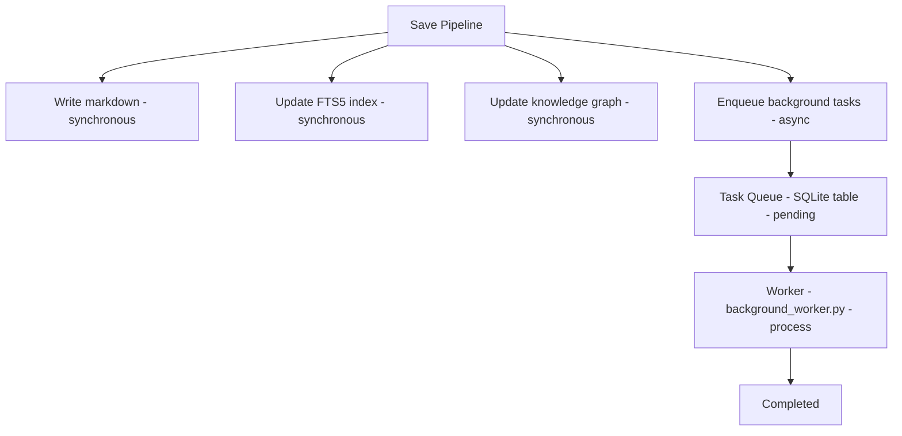

# Background Tasks

Agentic Memory uses a **SQLite-backed task queue** for expensive operations that shouldn't block the save path, plus an **inbox + daemon** pattern for latency-sensitive auto-save operations.

## What are Background Tasks?

Background tasks are deferred operations that are enqueued during the save path and processed asynchronously by a worker. They fall into two categories: the SQLite `task_queue` for batch processing (entity resolution, fact consolidation, contradiction detection, cross-session learning) and the inbox/daemon pattern for latency-critical auto-save hooks.

## Why Background Tasks?

Some operations are too slow for synchronous execution:

- **Entity resolution** — Deduplicating knowledge graph entities
- **Fact consolidation** — Merging related facts
- **Contradiction detection** — Checking for conflicting memories
- **Cross-session learning** — Extracting patterns from session logs

Running these in the foreground would add 100-500ms to every save operation. The task queue moves them to the background.

## Architecture



## Task Queue Schema

```sql
CREATE TABLE task_queue (
    id INTEGER PRIMARY KEY AUTOINCREMENT,
    task_type TEXT NOT NULL,
    payload TEXT,  -- JSON
    status TEXT DEFAULT 'pending',
    priority INTEGER DEFAULT 0,
    created_at TEXT DEFAULT CURRENT_TIMESTAMP,
    started_at TEXT,
    completed_at TEXT,
    error TEXT,
    attempts INTEGER DEFAULT 0,
    max_attempts INTEGER DEFAULT 3
);

CREATE INDEX idx_task_queue_status ON task_queue(status);
CREATE INDEX idx_task_queue_type ON task_queue(task_type);
CREATE INDEX idx_task_queue_priority ON task_queue(priority);
```

## Task Types

### `entity_resolution`

Deduplicates knowledge graph entities using exact and semantic matching.

```json
{
    "task_type": "entity_resolution",
    "payload": {"memory_id": "lessons/sqlite-wal-mode"},
    "priority": 1
}
```

**What it does:**
1. Find exact duplicates (same name + type)
2. Find semantic duplicates (model2vec similarity > 0.92)
3. Merge entities, updating mention counts and memory associations
4. Update edge weights

### `fact_consolidation`

Merges related facts from the knowledge graph.

```json
{
    "task_type": "fact_consolidation",
    "payload": {"memory_id": "lessons/sqlite-wal-mode"},
    "priority": 0
}
```

**What it does:**
1. Find facts with similar subjects
2. Check for redundancy (SHA256 + Jaccard similarity)
3. Merge facts, preserving evidence
4. Update confidence scores

### `contradiction_check`

Detects conflicting facts across memories.

```json
{
    "task_type": "contradiction_check",
    "payload": {"memory_id": "lessons/sqlite-wal-mode"},
    "priority": 2
}
```

**What it does:**
1. Extract claims from the new memory
2. Search existing memories for related claims
3. Detect negation patterns ("X is true" vs "X is false")
4. Flag contradictions for review

### `cross_session_learn`

Extracts reusable patterns from session logs.

```json
{
    "task_type": "cross_session_learn",
    "payload": {"session_date": "2026-06-11"},
    "priority": 0
}
```

**What it does:**
1. Parse session logs for tool invocations
2. Identify successful patterns (tools used, order, outcomes)
3. Extract reusable instincts
4. Save as candidate skills for future use

## Enqueueing Tasks

Tasks are enqueued in two ways:

### 1. Automatic (from save pipeline)

```python
# save_pipeline.py
def _run_post_save_hooks(memory_id, content):
    # Enqueue entity resolution
    enqueue_task("entity_resolution", {"memory_id": memory_id})
    
    # Enqueue fact consolidation
    enqueue_task("fact_consolidation", {"memory_id": memory_id})
```

These are **best-effort** — if enqueueing fails, the save still succeeds.

### 2. Manual (from CLI)

```bash
# Enqueue a specific task
agentic-memory-worker --enqueue entity_resolution --memory-id lessons/foo

# Process all pending tasks
agentic-memory-worker
```

## Worker Processing

The worker runs via cron (every 15 minutes by default, reduced
from `*/5` on 2026-06-22 to prevent runaway workers):

```bash
# crontab
*/5 * * * * agentic-memory-worker
```

The worker is the single drain point for all task types. As of
2026-06-22, the live `task_queue` had 12,026 pending tasks
(after a long backlog) and was drained to ~297 over the
2026-06-22 session — the cron has kept up.

### Processing Flow

```python
def process_one_task():
    with db.begin(readonly=True) as conn:
        # BEGIN IMMEDIATE prevents double-dequeue
        task = conn.execute(
            "SELECT * FROM task_queue WHERE status='pending' "
            "ORDER BY priority DESC, created_at LIMIT 1"
        ).fetchone()
    
    if not task:
        return False
    
    # Mark as processing
    update_task_status(task["id"], "processing")
    
    try:
        # Execute the task handler
        handlers[task["task_type"]](task["payload"])
        update_task_status(task["id"], "completed")
    except Exception as e:
        if task["attempts"] < task["max_attempts"]:
            update_task_status(task["id"], "pending", error=str(e))
        else:
            update_task_status(task["id"], "failed", error=str(e))
    
    return True
```

### Concurrency Safety

- **`BEGIN IMMEDIATE`** — Prevents two workers from dequeuing the same task
- **Max attempts** — Failed tasks retry up to 3 times
- **Graceful shutdown** — SIGTERM/SIGINT complete current task before exiting

## Monitoring

### Check queue status

```bash
python -c "
import sqlite3
conn = sqlite3.connect('memory.db')
for row in conn.execute(
    'SELECT status, COUNT(*) FROM task_queue GROUP BY status'
):
    print(f'{row[0]}: {row[1]} tasks')
"
```

### Check for failed tasks

```bash
python -c "
import sqlite3, json
conn = sqlite3.connect('memory.db')
for row in conn.execute(
    \"SELECT task_type, error, attempts FROM task_queue WHERE status='failed'\"
):
    print(f'{row[0]}: {row[1]} (attempts: {row[2]})')
"
```

## Key behaviors (Task Queue)

- **Best-effort enqueue**: If enqueueing fails, the save still succeeds. Background tasks are never a write-path failure point.
- **Priority-ordered processing**: Tasks with higher `priority` values are processed first. `contradiction_check` (priority 2) runs before `entity_resolution` (priority 1).
- **Automatic retry with backoff**: Failed tasks retry up to `max_attempts` (default 3). Each attempt increments `attempts` and stores the error message.
- **`BEGIN IMMEDIATE` concurrency**: Prevents two workers from dequeuing the same task. Only one worker should run at a time (use `flock` for cross-process safety).
- **Tier-aware task gating**: Cold and archive memories skip entity resolution and fact consolidation. Only hot and warm memories receive background processing.
- **Graceful shutdown**: SIGTERM/SIGINT complete the current task before exiting.

## Configuration

| Variable | Default | Effect |
|----------|---------|--------|
| Cron interval | `*/15 * * * *` | How often worker runs (reduced from `*/5` on 2026-06-22) |
| Max attempts | `3` | Retries before marking as failed |
| Batch size | `10` | Max tasks per worker invocation |

## Related

- [Tier System](tier-system.md) — How tiers affect task processing
- [Knowledge Graph](knowledge-graph.md) — Entity resolution details
- [Set Up Cron Jobs](../how-to/cron-setup.md) — Configure the worker schedule
- [Configuration Reference](../reference/configuration.md) — All env vars
- [Schema Reference](../reference/schema.md) — `task_queue` table definition

---

## Async Auto-Save (2026-06-22)

The auto-save hook (called on every opencode tool call) is the
hottest path in the system. To avoid the ~100-200ms Python
subprocess cost on every call, it uses a different background-task
pattern: an **inbox + daemon** architecture (not the SQLite
`task_queue` described above).

```
tool_complete hook
    │
    ├──▶ append 1 JSONL line to <memory>/.auto_save_inbox.jsonl (~2-5ms)
    │
    ▼
[Inbox - append-only JSONL, POSIX atomic appends]
    │ every 500ms or every 50 entries
    ▼
[Daemon - auto_save.py daemon, long-running - batcher]
    │
    ▼
  Single SQLite transaction per batch
```

**Why a separate inbox instead of `task_queue`?**

- `task_queue` runs on cron (every 15 min) — too slow for per-tool-call writes
- The auto-save inbox needs <500ms latency so the just-saved note
  is visible in the very next search
- A long-running daemon can amortize Python startup across many saves

**Safety properties:**

- Inbox is append-only — a daemon crash never loses data
- The daemon holds a flock so two daemons never run for the same memory dir
- PID file is checked for liveness; a stale PID triggers a clean restart
- The fast path runs allowlist/denylist/injection at enqueue time, so the
  daemon doesn't re-validate
- A failure to enqueue falls back to the inline sync path so no save is lost
- The daemon does a final flush on SIGTERM/SIGINT/idle timeout

### Key behaviors (Async Auto-Save)

- **Sub-millisecond enqueue**: Appending a JSONL line to the inbox takes ~2-5ms — two orders of magnitude faster than a Python subprocess.
- **Crash-safe inbox**: The JSONL inbox is append-only. A daemon crash never loses data; the next daemon picks up where the previous one left off.
- **flock-protected daemon**: The daemon holds a flock on the inbox directory. A second daemon for the same memory dir is prevented from starting.
- **Inline fallback**: If enqueueing to the inbox fails (e.g., disk full), the hook falls back to the synchronous inline save path — no save is ever lost.
- **Final flush on shutdown**: The daemon flushes all pending entries on SIGTERM, SIGINT, or idle timeout (default 1 hour of silence).

**Tunables:**

- `MEMORY_ASYNC_AUTOSAVE=0` — opt out, force the legacy inline path
- `AUTO_SAVE_BATCH_INTERVAL=0.5` — daemon flush interval (seconds)
- `AUTO_SAVE_BATCH_SIZE=50` — daemon flush size cap
- `AUTO_SAVE_DAEMON_IDLE_S=3600` — daemon exit after N seconds of silence

See `AGENTS.md` "Async Auto-Save" section for the full architecture
and the daemon lifecycle.
