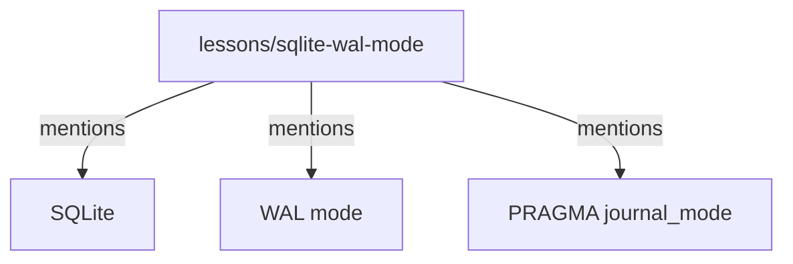

# Knowledge Graph

The knowledge graph captures **entities and relationships** extracted from memories, enabling structured queries like "show me all memories related to PostgreSQL" or "what decisions involved the auth system?"

## What is the Knowledge Graph?

The knowledge graph is a **structured entity-relationship layer** built on top of the memory store. Every time a memory is saved, the system extracts entities (technologies, concepts, files, commands) and the relationships between them, creating a graph that can be queried by entity, traversed by relationship, or used to boost search results.

## Why it matters

Unstructured text search alone cannot answer questions like "what's connected to Docker?" or "how many times has PostgreSQL been mentioned?" The knowledge graph surfaces **cross-memory relationships** that keyword search would miss, enables **entity-based discovery** (find everything related to a technology), and feeds **centrality boosting** into the search pipeline so well-connected entities rank higher.

## How it works

### 1. Entity Extraction (NER)

When a memory is saved, the system runs **regex-based named entity recognition** to extract entities:

```python
# Patterns for common entity types
ENTITY_PATTERNS = {
    "technology": r"\b(Python|SQLite|PostgreSQL|Docker|FastAPI|React)\b",
    "concept":    r"\b(authentication|caching|migration|deployment)\b",
    "file":       r"\b([a-zA-Z0-9_/.-]+\.(py|js|ts|md|yaml|json))\b",
    "command":    r"\b(git|npm|pip|docker|kubectl)\s+\S+",
    "url":        r"https?://[^\s]+",
    "email":      r"[a-zA-Z0-9._%+-]+@[a-zA-Z0-9.-]+\.[a-zA-Z]{2,}",
}
```

Each extracted entity becomes a node in the graph:



### 2. Relationship Extraction

The system also extracts **Subject-Predicate-Object (SPO) triples** from memory content:

```python
# Regex-based SPO extraction
TRIPLE_PATTERNS = [
    r"(\w[\w\s]*?)\s+(?:is|are|was|were)\s+(.+)",     # "X is Y"
    r"(\w[\w\s]*?)\s+(?:uses?|uses?)\s+(.+)",          # "X uses Y"
    r"(\w[\w\s]*?)\s+(?:requires?|requires?)\s+(.+)",  # "X requires Y"
]
```

Example extracted triples:

```
(SQLite, requires, WAL mode for concurrency)
(WAL mode, enables, concurrent reads)
(FastAPI, uses, async/await)
```

### 3. Graph Storage

Entities and relationships are stored in SQLite:

```sql
-- Entities
CREATE TABLE kg_entities (
    id INTEGER PRIMARY KEY AUTOINCREMENT,
    name TEXT NOT NULL,
    entity_type TEXT,
    mentions INTEGER DEFAULT 1,
    created_at TEXT,
    updated_at TEXT,
    UNIQUE(name, entity_type)
);

-- Relationships (edges)
CREATE TABLE kg_edges (
    id INTEGER PRIMARY KEY AUTOINCREMENT,
    source_id INTEGER REFERENCES kg_entities(id) ON DELETE SET NULL,
    target_id INTEGER REFERENCES kg_entities(id) ON DELETE SET NULL,
    relation TEXT NOT NULL DEFAULT 'related_to',
    weight REAL DEFAULT 1.0,
    created_at TEXT,
    valid_at TEXT,
    invalid_at TEXT,
    UNIQUE(source_id, target_id, relation)
);

-- Facts (SPO triples)
CREATE TABLE kg_facts (
    id TEXT PRIMARY KEY,
    subject TEXT,
    predicate TEXT,
    object TEXT,
    confidence REAL,
    source_memory_id TEXT,
    created_at TEXT
);

### 3a. CRDT Tables (v21)

Migration 021 (`migrations/021_kg_crdt.sql`) added two tables that enable conflict-free merges when multiple agents write to the same knowledge graph concurrently (e.g., laptop + desktop in a multi-peer sync setup):

```sql
-- Per-peer add/remove operations for entities (2P-Set semantics)
CREATE TABLE kg_entity_crdt (
    entity_id      INTEGER PRIMARY KEY,
    agent_id       TEXT    NOT NULL,
    op             TEXT    NOT NULL CHECK (op IN ('add', 'remove')),
    version_vector TEXT    NOT NULL,
    name           TEXT,
    entity_type    TEXT,
    description    TEXT,
    timestamp      REAL    NOT NULL
);

-- Per-peer add operations for edges (LWW, add-only)
CREATE TABLE kg_edge_crdt (
    edge_id        INTEGER PRIMARY KEY,
    source_id      INTEGER NOT NULL,
    target_id      INTEGER NOT NULL,
    relation       TEXT    NOT NULL,
    weight         REAL    NOT NULL DEFAULT 1.0,
    valid_at       TEXT,
    agent_id       TEXT    NOT NULL,
    version_vector TEXT    NOT NULL,
    timestamp      REAL    NOT NULL
);
```

**How they work:**
- `version_vector` tracks causal ordering per agent — two vectors can be compared to detect concurrency or dominance.
- `kg_entity_crdt` uses **2P-Set semantics**: an `add` wins on concurrent add/remove, so entities are never silently lost.
- `kg_edge_crdt` is **add-only** — deletion is represented by setting `invalid_at` on the canonical `kg_edges` row, not by removing the CRDT entry.
- The `edge_id` is a stable hash of `(source_id, target_id, relation)`, so all peers agree on edge identity even when they discover edges independently.

These tables are additive — the base `kg_entities` and `kg_edges` tables are untouched. The sync server populates the CRDT tables on first run via `record_entity_add` / `record_edge_add`.

**Feature flag:** Controlled by `feature_crdt` in `memory.toml` (default `true`). Set to `false` to disable CRDT recording — the base tables continue to work normally.

### 4. Deduplication

Entities are deduplicated using two strategies:

**Exact deduplication:**
```python
# Group by (name, entity_type) and merge
SELECT name, entity_type, COUNT(*) as mentions
FROM kg_entities
GROUP BY name, entity_type
HAVING COUNT(*) > 1;
```

**Semantic deduplication:**
```python
# Use model2vec embeddings for fuzzy matching
embeddings = model.encode([e["name"] for e in candidates])
# Cosine similarity threshold (default: 0.92)
for i, j in itertools.combinations(range(len(candidates)), 2):
    if cosine_similarity(embeddings[i], embeddings[j]) > threshold:
        merge_entities(candidates[i], candidates[j])
```

## Graph Queries

### Find entities by name

```python
from agentic_memory import search_graph

entities = search_graph("SQLite", limit=10)
# Returns: [{name: "SQLite", type: "technology", mentions: 5, memories: [...]}]
```

### Traverse relationships

```python
# Find entities connected to "SQLite" within 2 hops
entities = search_graph("SQLite", max_hops=2)
# Hop 1: SQLite → WAL mode, FTS5, database
# Hop 2: WAL mode → concurrent reads, FTS5 → BM25 ranking
```

### Search by entity type

```python
# Find all technology entities
from agentic_memory import search_graph

tech_entities = search_graph("*", entity_type="technology", limit=50)
```

## When KG Helps

The knowledge graph is most valuable when:

- **Cross-referencing** — "Show everything related to Docker"
- **Relationship discovery** — "What's connected to the auth system?"
- **Entity tracking** — "How many times have I mentioned PostgreSQL?"
- **Contradiction detection** — "Do I have conflicting facts about Redis?"

## When KG Doesn't Help

The knowledge graph has limitations:

- **Regex-based NER** — Misses domain-specific entities
- **No deep semantics** — Can't understand "the database" = "SQLite" without explicit mention
- **Sparse graphs** — Small memory stores may have few connections
- **O(n²) dedup** — Semantic dedup scales poorly with many entities

## Configuration

| Variable | Default | Effect |
|----------|---------|--------|
| `MEMORY_KNOWLEDGE_GRAPH` | `true` | Enable KG extraction |
| `--semantic` flag | off | Enable semantic dedup |
| `--threshold` | `0.92` | Similarity threshold for semantic dedup |

## Key behaviors

- **Regex-based NER**: Entity extraction is deterministic and requires no LLM API calls. Trade-off: domain-specific entities need explicit pattern additions.
- **Exact + semantic dedup**: Two-tier deduplication prevents entity bloat. Exact merges (same name+type) run first, then fuzzy merges (cosine similarity > 0.92) catch near-duplicates.
- **Contradiction detection**: The temporal KG layer (see [Temporal KG](temporal-kg.md)) detects when new facts conflict with existing ones and marks the superseded fact as invalid.
- **CRDT conflict-free merge**: When multiple agent workspaces sync, the `kg_entity_crdt` and `kg_edge_crdt` tables (v21) use 2P-Set and LWW semantics to merge without data loss.
- **No deep semantics**: The regex extractor cannot infer "the database" = "SQLite" without an explicit mention. Semantic understanding requires the search pipeline's vector embeddings.
- **Sparse graph**: Small memory stores may have few connections. The KG becomes more valuable as the corpus grows.

## Related

- [Search Pipeline](search-pipeline.md) — How KG integrates with search (centrality boost, graph RAG)
- [Temporal KG](temporal-kg.md) — Bi-temporal fact tracking and contradiction detection
- [Design Decisions](../explanation/design-decisions.md) — Why regex-based NER was chosen
- [Extend Entity Types](../how-to/custom-entity-types.md) — Add custom NER patterns
- [Schema Reference](../reference/schema.md) — Full table definitions for `kg_entities`, `kg_edges`, `kg_facts`
- [Architecture Overview](../architecture/overview.md) — Where the KG fits in the system
