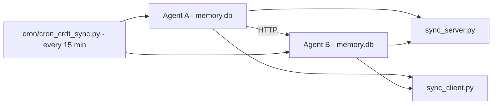

# Multi-Agent CRDT Sync

Agentic Memory supports **multi-agent memory sharing** via two complementary mechanisms:

1. **CRDT-based peer sync** — direct HTTP sync between independent agent workspaces, using conflict-free replicated data types (CRDTs) built on version vectors.
2. **Shared memory pool** — a lightweight `shared_memories` table where agents can explicitly publish and import notes.

## What is Multi-Agent Sync?

The multi-agent sync system allows **two or more independent agent workspaces** to share memories. It provides two complementary mechanisms: CRDT-based peer sync (full workspace replication with conflict resolution) and a shared memory pool (lightweight opt-in sharing).

## Why it matters

Without shared memory, each agent workspace is an island — lessons learned by one agent are invisible to others. Multi-agent sync enables teams of agents to build a **shared knowledge base** where insights propagate across sessions, machines, or agent identities. The CRDT layer ensures that concurrent edits from different agents merge without data loss, even when the agents are offline from each other.

## CRDT Peer Sync

### How it works

Every `memories` row carries two extra columns for CRDT tracking:

- `version_vector` — a JSON dict mapping agent IDs to logical clock counters (e.g., `{"agent-a": 5, "agent-b": 3}`).
- `logical_clock` — the sender's own clock value at the time of the write.

When two agents write to the same note, their version vectors are compared:

- **One dominates the other** — if agent-a's vector has `{a: 5, b: 2}` and agent-b has `{a: 3, b: 2}`, agent-a dominates (all counters >=). Agent-a's version wins deterministically.
- **Concurrent edits** — if neither dominates (agent-a has `{a: 5}`, agent-b has `{b: 3}`), last-writer-wins with agent_id as tiebreaker.

### Architecture



Each agent runs both a **sync server** (threaded HTTP daemon) and a **sync client** (scheduled via `cron/cron_crdt_sync.py` or `cron/cron_sync.py`). The cron job orchestrates the cycle:

1. Pull the peer's last-sync timestamp from the local `sync_log` table.
2. `GET /crdt/changes?since=<timestamp>` — fetch the peer's modified notes.
3. Apply each change locally via CRDT merge (`crdt_save()`).
4. `POST /crdt/push` — send local changes to the peer.
5. Record the result in `sync_log`.

### Sync Server Endpoints

| Endpoint | Method | Description |
|---|---|---|
| `/health` | GET | Liveness probe. Returns agent id and note count. |
| `/crdt/changes?since=<ts>&agent=<id>&limit=<N>` | GET | Return memories modified after `since` (ISO-8601). Default limit 200, max 1000. |
| `/crdt/push` | POST | Accept a batch of remote notes and merge via CRDT. |

### Configuration

```toml
[sync]
enable_server = false     # MEMORY_SYNC_ENABLE_SERVER — start HTTP sync server
listen_host = "127.0.0.1" # MEMORY_SYNC_LISTEN_HOST
listen_port = 9877         # MEMORY_SYNC_LISTEN_PORT

[[sync.peers]]
name = "peer-1"
url = "http://127.0.0.1:9877"
agent_id = "peer-1"

[sync.schedule]
interval_minutes = 5       # MEMORY_SYNC_INTERVAL_MINUTES
```

All sync fields are overridable via `MEMORY_SYNC_*` environment variables (except `[[sync.peers]]` which is TOML-only).

### Conflict Resolution

The CRDT engine (`crdt_merge.py`) implements three strategies:

| Strategy | Behavior | Use case |
|---|---|---|
| `supersede` (default) | The dominating version wins entirely | General-purpose |
| `replace` | Always accept the incoming version | Operator-initiated overwrites |
| `coexist` | Keep both versions as separate timeline entries | Audit/forensic scenarios |

The `conflict_policy` column on `memories` stores the per-note strategy. The default is `supersede`.

### Monitoring

Sync health is trackable via the `sync_log` table:

```sql
SELECT peer_name, success, changes_pushed, changes_pulled, duration_ms
FROM sync_log
WHERE started_at > datetime('now', '-1 day')
ORDER BY started_at DESC;
```

The `sync_check.py` CLI tool provides a quick health summary.

## Shared Memory Pool

The `shared_memories` table provides a simpler, opt-in sharing mechanism for agents that do not want full CRDT replication:

```sql
CREATE TABLE shared_memories (
    id TEXT PRIMARY KEY,
    agent_id TEXT NOT NULL,
    content TEXT NOT NULL,
    category TEXT,
    tags TEXT,
    shared_at REAL NOT NULL,
    source_note_id TEXT,
    metadata TEXT
);
```

Enable with `MEMORY_MULTI_AGENT=1` (or `features.multi_agent = true` in `memory.toml`).

| MCP Tool | Description |
|---|---|
| `memory_share` | Share a note to the shared pool |
| `memory_list_shared` | List notes in the shared pool |
| `memory_import_shared` | Import a shared note into local memory |
| `memory_shared_pool_stats` | Pool usage statistics |

## Comparison

| Feature | CRDT Peer Sync | Shared Pool |
|---|---|---|
| Protocol | HTTP (pull/push) | Same DB table |
| Conflict resolution | Version vectors + LWW | Last-write-wins |
| Latency | Near-real-time (cron) | Immediate |
| Setup | Full sync config + peers | `multi_agent=true` |
| Isolation | Full workspace copy | Single shared table |
| Use case | Multi-agent teams | Cross-session hints |

## Key behaviors

- **Version-vector conflict resolution**: Concurrent edits are resolved by comparing version vectors. If one dominates (all counters >=), it wins deterministically. If neither dominates, last-writer-wins with agent_id as tiebreaker.
- **Three merge strategies**: Per-note `conflict_policy` supports `supersede` (default, dominant version wins), `replace` (always accept incoming), and `coexist` (keep both as separate timeline entries).
- **Shared pool is opt-in**: Agents explicitly publish notes via `memory_share`. No automatic replication. Simpler than CRDT sync but requires manual action.
- **Sync server security**: Binds to `127.0.0.1` by default. Remote access requires TLS, HMAC signing, or a reverse proxy with authentication.
- **Cron-driven pull/push cycle**: The sync cron job orchestrates the cycle on a configurable interval (default 5 minutes).
- **Per-peer sync log**: The `sync_log` table tracks every push/pull cycle with change counts, duration, and error details for observability.

## Related

- `crdt_merge.py` — Core CRDT merge engine
- `sync_server.py` — HTTP sync server
- `sync_client.py` — HTTP sync client
- `cron/cron_crdt_sync.py` — Scheduled sync orchestration (in the `cron/` subdirectory since 2026-06-22)
- `cron/cron_sync.py` — Alternative sync entry point (added 2026-06-22)
- [Configuration Reference](../reference/configuration.md) — All env vars including `MEMORY_SYNC_*`
- [Schema Reference](../reference/schema.md) — Full table definitions including `shared_memories`, `sync_log`
- [Knowledge Graph](knowledge-graph.md) — CRDT tables for KG (`kg_entity_crdt`, `kg_edge_crdt`)
- [Security Model](security-model.md) — Sync server security and TLS configuration
- [Self-Hosting](../self-hosting.md) — Production deployment with remote sync
