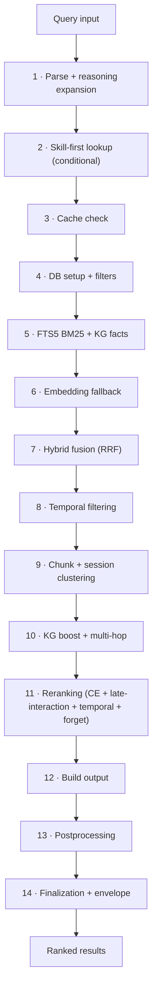

# Search Pipeline

Agentic Memory uses a **14-phase hybrid search pipeline** that combines multiple retrieval methods, reranking, temporal decay, and knowledge graph boosting.

## What is the Search Pipeline?

The search pipeline is the **read path** of Agentic Memory — it transforms a natural-language query into a ranked list of relevant memories. It combines keyword matching (FTS5 BM25), semantic understanding (vector embeddings), token-level matching (ColBERT), deep neural reranking, temporal recency, a neural forget curve, and knowledge-graph centrality boosting into a single hybrid scoring function.

## Why it matters

Without the search pipeline, agents would rely on exact-match queries that miss semantic relationships, ignore recency, and fail on large memory stores. The hybrid pipeline ensures that the most relevant memory surfaces regardless of phrasing, age, or graph connectivity — making retrieval robust across a wide range of query types and corpus sizes.

## How it works

```
Query
  ↓
Phase 1  Query parsing + reasoning expansion
  ↓
Phase 2  Skill-first lookup (conditional early return)
  ↓
Phase 3  Cache check
  ↓
Phase 4  DB setup + filter construction (namespace, category, tags)
  ↓
Phase 5  Retrieval — FTS5 BM25 + KG facts (parallel)
  ↓
Phase 6  Embedding fallback (when FTS returns nothing)
  ↓
Phase 7  Hybrid fusion (RRF merge of FTS5 + vector)
  ↓
Phase 8  Temporal filtering (valid_to / as_of time-travel)
  ↓
Phase 9  Chunk enhancement + session-aware clustering
  ↓
Phase 10 KG boost + multi-hop traversal
  ↓
Phase 11 Reranking (cross-encoder, late-interaction, temporal decay, forget curve)
  ↓
Phase 12 Build output items
  ↓
Phase 13 Postprocessing (safety demoting, quality gates, user profiling, strong match boost)
  ↓
Phase 14 Finalization (record access, shared_with_me, audit, envelope, telemetry)
  ↓
Ranked results
```



Each phase is independently isolated — no single failure kills the search.

## Phase Details

| Phase | Technique | Purpose |
|-------|-----------|---------|
| 1 | Query parsing, normalization, reasoning expansion | Input normalization + entailment OR terms |
| 2 | Skill-first lookup | Short-circuit to skill matches when requested |
| 3 | Result cache | Serve repeated queries without re-running the pipeline |
| 4 | DB column probe + filter construction | Namespace, category, memory_source, tag filters |
| 5 | SQLite FTS5 BM25 + KG fact search | Keyword retrieval + knowledge-graph facts (parallel) |
| 6 | usearch ANN + model2vec embeddings | Semantic vector fallback when FTS returns nothing |
| 7 | Reciprocal Rank Fusion (4 lists) | Merge FTS5 + dense + chunk-FTS + SPLADE results |
| 8 | `valid_to` / `as_of` time-travel filter | Drop invalidated / out-of-window memories |
| 9 | Chunk enrichment + session clustering | Surface chunk context; boost intra-session relatedness |
| 10 | KG entity centrality + multi-hop traversal | Knowledge-graph boost |
| 11 | Cross-encoder, ColBERT late-interaction, temporal decay, neural forget curve | Neural reranking + final scoring |
| 12 | JSON envelope construction | Build display result items |
| 13 | Safety demoting, quality gates, user profiling, strong-match boost | Post-filtering and personalization |
| 14 | Record access, shared-with-me, audit, telemetry | Finalization + observability |

## Stage 1: FTS5 BM25

SQLite's FTS5 extension provides **keyword-based full-text search** with BM25 ranking.

```python
# How FTS5 works internally
SELECT *, bm25(chunks) AS rank
FROM memories_fts
WHERE memories_fts MATCH ?
ORDER BY rank
```

**Strengths:** Fast, deterministic, no model required.
**Weakness:** No semantic understanding — "happy" won't match "joyful".

## Stage 2: Vector Search

model2vec embeddings stored in a usearch ANN index for approximate nearest-neighbor search.

```python
# Embedding + search
embedding = model2vec.encode(query)
results = vec_index.search(embedding, k=limit)
```

**Strengths:** Semantic understanding — "happy" matches "joyful".
**Weakness:** Slower than FTS5, requires embedding model.

## Stage 3: ColBERT Late-Interaction

Character n-gram proxy for late-interaction reranking. Pre-computed query ngrams for efficiency.

**Strengths:** Token-level matching without full cross-encoder cost.
**Weakness:** Approximation of true late-interaction.

## Stage 4: Reciprocal Rank Fusion (RRF)

Merges results from FTS5 (BM25), dense-vector search, chunk-level FTS, and SPLADE sparse vectors:

```
RRF_score(d) = Σ 1 / (k + rank_i(d))
```

Where `k=60` (configurable via `hybrid_rrf_k`) and `rank_i(d)` is the rank of document `d` in retrieval list `i`. Each list is weighted via `hybrid_*_weight` config keys. ColBERT late-interaction reranking runs after RRF, not as part of the fusion.

## Stage 5: Cross-Encoder Reranking

Two options:
- **Weak CE:** IDF-weighted token coverage + bigram phrase bonus (sub-millisecond)
- **Deep CE:** Qwen3-Reranker-0.6B or BAAI/bge-reranker-v2-m3 (neural, higher quality)

## Stage 6: Temporal Decay

Time-weighted scoring based on memory age:

```
decay_score = score × (1 / (1 + α × days_old))
```

Where `α` is the decay rate (configurable).

## Stage 7: Neural Forget Curve

Surprise-based retention formula:

```
retention = sigmoid(
    w_acc × access_signal +
    w_surp × surprise +
    w_imp × importance_norm +
    w_fit × fitness -
    w_rec × recency_penalty -
    bias
)
```

**Signals:**
- `access_signal` — How often the memory has been accessed
- `surprise` — How unexpected the content is (Jaccard distance)
- `importance_norm` — Memory's importance rating (1-5)
- `fitness` — Memory's quality score
- `recency_penalty` — Days since last access

## Stage 8: KG Concept Boost

Boosts results linked to high-centrality entities in the knowledge graph.

## Stage 9: Final Scoring

Weighted combination of all signals:

```
final_score = α × fts_score + β × vector_score + γ × rerank_score + δ × temporal_score + ε × forget_score + ζ × kg_boost
```

Weights are configurable via `memory.toml`.

## Configuration

```toml
[search]
recency_weight = 0.1
rerank_enabled = true
late_interaction = true
concept_boost_enabled = true
centrality_boost_enabled = true
```

## Key behaviors

- **Phase isolation**: Each of the 14 phases is independently isolated — no single failure kills the search. Per-phase error counters (surfaced via `phase_errors`) track which phase failed.
- **Graceful degradation**: If the vector index is missing or stale, search falls back to FTS5-only results. If the reranker fails, search returns RRF-merged results without reranking.
- **Deterministic FTS5**: BM25 ranking is deterministic and repeatable — no model dependency for keyword queries.
- **Defer-expensive mode**: By default, semantic search and deep reranking are deferred (returns <200ms). Results are cached for fast re-query.
- **Configurable weights**: Each scoring component (FTS5, vector, rerank, temporal, forget, KG) has a configurable weight in `memory.toml`.

## Troubleshooting

### No vector/semantic results returned

Check the vec-index health via `agentic-memory_memory_health_check(conn=...)`. If the usearch index is missing or stale, search falls back to FTS5-only (graceful degradation). Rebuild it with `python rebuild_vec_index.py` after a warm-up chain.

### Latency higher than expected

Semantic search and deep reranking are deferred by default (`defer_expensive=True`, returns <200ms). If latency is high, confirm `rerank_enabled` and `late_interaction` aren't forcing a synchronous deep cross-encoder. See [Configuration Reference](../reference/configuration.md).

### Recency-biased or stale results

Temporal decay (`recency_weight`) down-weights older memories. Adjust the scoring weights in `memory.toml` under `[search]`. See [Configuration Reference](../reference/configuration.md).

### A phase is failing

Per-phase error counts are tracked across all 14 phases. Inspect `memory_maintenance(operation="phase_errors")` to see which phase errored; the remaining phases still return results.

## Related

- [How to Debug Search](../how-to/debug-search.md) — Step-by-step troubleshooting guide
- [Configuration Reference](../reference/configuration.md) — All search-related env vars and TOML keys
- [Knowledge Graph](knowledge-graph.md) — How entities boost search results
- [Temporal KG](temporal-kg.md) — Time-aware decay and fact supersession
- [Architecture Overview](../architecture/overview.md) — Where the search pipeline fits in the system
