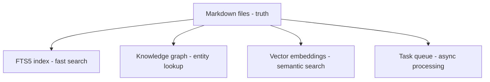

# Why Markdown?

Agentic Memory stores memories as **markdown files** — not just in a database. This is a deliberate architectural choice with significant implications.

## What is Markdown-First Storage?

Markdown-first storage means the **primary record of every memory is a `.md` file on disk**, not a row in a database. The SQLite database is a derived artifact — built from the markdown files for performance, but never the authoritative copy. This inverts the usual architecture where the database is the source of truth and files are exports.

## Why it matters

A database-first system creates vendor lock-in, opaque binary backups, and poor version control. Markdown-first means memories are **readable in any editor, diffable with git, portable across tools, and recoverable from a directory copy**. If the database corrupts, you delete it and rebuild — nothing is lost. This makes the system dramatically more resilient and future-proof than a database-only approach.

## The Core Principle

> **Markdown files are the source of truth. SQLite is derived and rebuildable.**

If the database is corrupted, you delete it and run `rebuild_index.py`. Nothing is lost. If a markdown file is corrupted, you've lost a memory.

## Why Not "Just a Database"?

Most memory systems store everything in a database. This creates several problems:

| Problem | Database-Only | Markdown-First |
|---------|---------------|----------------|
| **Vendor lock-in** | Proprietary format, migration pain | Plain text, works everywhere |
| **Version control** | Binary blobs, no meaningful diffs | Human-readable diffs |
| **Inspectability** | Need a GUI or SQL queries | Open in any editor |
| **Backup** | Dump/restore procedures | Copy the directory |
| **Portability** | Export/import scripts | Move the folder |
| **AI readability** | Agent needs API calls | Agent reads the file |

## Markdown as Memory

When an agent saves a lesson, it writes a `.md` file:

```markdown
---
id: lessons/sqlite-wal-mode
category: lessons
type: lesson
resource: db_migrations.py
created: 2026-06-11T10:30:00Z
tags: [sqlite, database, concurrency]
tier: hot
---

# SQLite WAL Mode

Always use `PRAGMA journal_mode=WAL` for concurrent applications.
WAL allows multiple readers while a single writer is active.

## Context

Discovered during multi-agent session where two agents tried to
read/write simultaneously. Default journal mode causes "database is
locked" errors under concurrency.

## Evidence

- WAL mode: 100 concurrent reads, 1 write = no conflict
- Default mode: 2 reads + 1 write = "database is locked"
```

This file is:
- **Readable** — Any human can open it and understand the memory
- **Editable** — Fix typos, add context, merge related memories
- **Diffable** — `git diff` shows exactly what changed
- **Searchable** — `grep` finds patterns across all memories
- **Versionable** — Full history in git

## The Derived Layer

SQLite exists for **performance**, not as the source of truth:



Every derived artifact can be rebuilt:

```bash
# Rebuild everything from markdown
python rebuild_index.py --memory-dir /path/to/memory

# Rebuild just the knowledge graph
python backfill_all.py --mode full

# Rebuild just the vector index
python rebuild_vec_index.py
```

## When the Database Wins

The database layer provides capabilities markdown can't:

- **BM25 ranking** — Which memories are most relevant?
- **Hybrid search** — Combine keyword + semantic + graph
- **Fast lookups** — O(log n) vs O(n) for large memory stores
- **Cross-memory queries** — "Show all memories tagged with X from last week"

The trade-off is worth it: markdown for correctness and portability, SQLite for performance and features.

## Implications for Agents

Agents benefit from markdown-first in practical ways:

1. **No API calls to read** — Agent reads the file directly
2. **No export needed** — Agent can copy/share markdown files
3. **Audit-friendly** — Human reviewer reads the same file the agent wrote
4. **Merge-friendly** — Git handles conflicts naturally
5. **Portable across tools** — Works with Claude Code, OpenCode, or any text editor

## Related

- [Architecture Overview](../architecture/overview.md) — Full data flow: markdown → derived layers
- [Design Decisions](../explanation/design-decisions.md) — Why we chose markdown-first over database-only
- [Tier System](tier-system.md) — How tiers affect the index, not the files
- [Background Tasks](background-tasks.md) — Async processing that rebuilds derived artifacts
- [Boot Sequence](../explanation/boot-sequence.md) — How rebuild_index.py recovers from a clean state
- [Durability](../durability.md) — Crash safety and recovery guarantees
- [How to Debug Write Journal](../how-to/debug-write-journal.md) — CQRS write journal and markdown consistency
