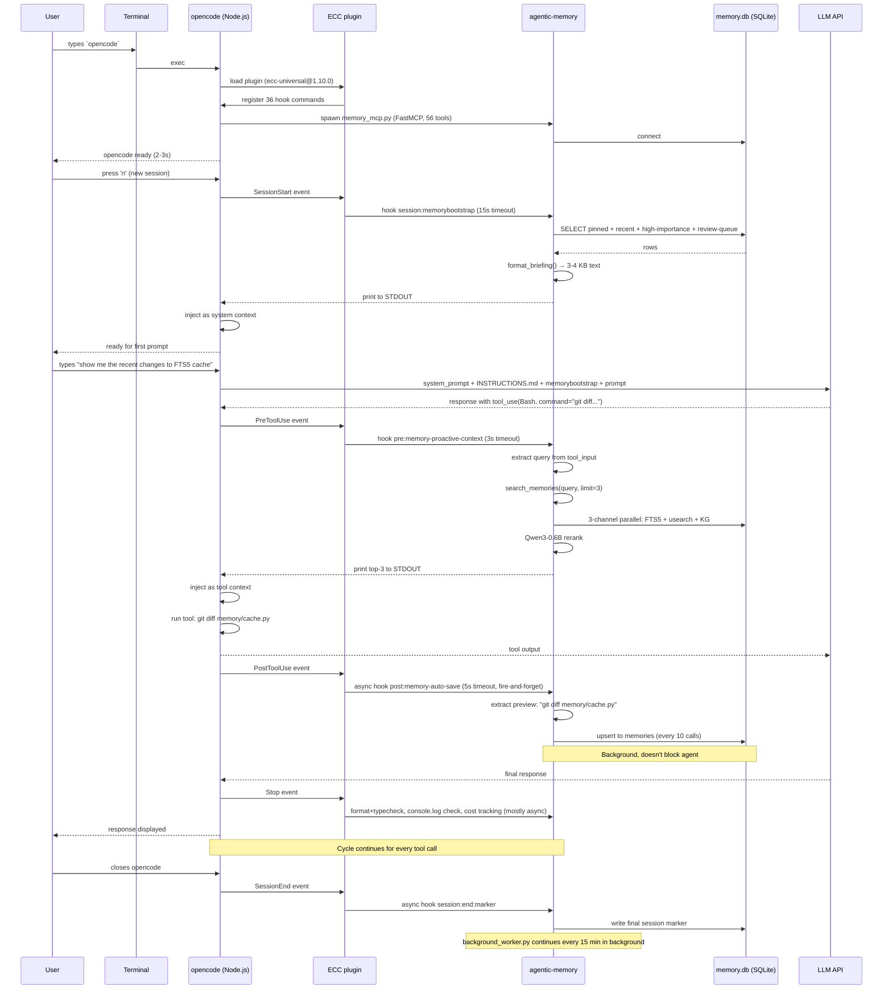

# Boot Sequence: From Terminal to First Prompt

What actually happens when you open a new terminal, type `opencode`, and create a new session — traced from the real `~/.opencode/hooks/hooks.json` config, not from imagination.

## The 60-second version

You open a terminal. You type `opencode`. The Node.js process boots, loads 36 hook commands across 7 lifecycle events, registers MCP servers, auto-discovers 87 skills, then fires `SessionStart` — which kicks off the agentic-memory bootstrap that loads your last-session context into the new session before you type a single character. By the time you finish typing your first prompt, the agent already has your pinned notes, recent decisions, and high-importance lessons injected as system context.

That's the magic. Everything below is how it actually happens, traced from `~/.opencode/hooks/hooks.json`.

---

## The full sequence (terminal → first user message)

### Phase 0: terminal open (no agentic-memory involvement)

```
$ opencode
```

The shell exec's `opencode`, which is a Node.js binary. opencode reads:
- `~/.opencode/opencode.json` (user-level config — currently disabled, file is `opencode.json.disabled`)
- Any project-level `.opencode.json` (depends on cwd)
- Environment variables

**Time: ~200 ms.** No agentic-memory hook fires yet.

### Phase 1: opencode boots (no agentic-memory involvement)

opencode:
1. Spawns the Node.js process
2. Loads `package.json` plugins → loads `ecc-universal@1.10.0` (the ECC plugin)
3. ECC plugin loads its own 36 hook commands from `hooks/hooks.json`
4. Loads MCP servers from `~/.opencode/mcp-configs/mcp-servers.json`:
   - `agentic-memory` → `python3 ~/.config/agentic-memory/memory_mcp.py` (FastMCP, 56 tools)
   - others
5. Auto-discovers skills from `~/.opencode/skills/` (87 skills) and any project `./skills/`
6. Reads `~/.opencode/instructions/INSTRUCTIONS.md` (379 lines) — loaded as system prompt context
7. Opens the SQLite-backed session store at `~/.opencode/`

**Time: ~2-3 seconds.** No agentic-memory hook fires yet. The MCP server is now *running* but no tool has been called.

### Phase 2: you create a new session

You press `n` (or `Cmd+N`, or click "New Session"). opencode fires `SessionStart` event. **This is where agentic-memory engages for the first time.**

Two hooks run (sequential, in declared order):

**Hook 1 — `session:start` (default ECC bootstrap)**
- Command: `node scripts/hooks/session-start-bootstrap.js`
- What it does: detects package manager, runs any pre-session cleanup
- Time: ~1s

**Hook 2 — `session:memorybootstrap` (agentic-memory)**
- Command: `MEMORY_KNOWLEDGE_GRAPH=1 MEMORY_SELF_DIRECTED=1 ~/.config/agentic-memory/venv/bin/python ~/.config/agentic-memory/hooks/memory-session-start.py`
- Timeout: 15s
- What it does:
  1. Calls `recall.py:session_recap()` which queries the live DB
  2. Loads: pinned notes + recent session digests (last 7d) + high-importance memories + spaced-repetition items due for review + user profile
  3. Formats a briefing
  4. **Prints to STDOUT** ← opencode reads stdout as additional system context
- Result: ~3-4 KB of context injected before you type a single character
- Time: ~1-3s typical (up to 15s for very large stores)

**Time: ~2-5 seconds total.** The agent now has your full last-session context loaded.

### Phase 3: you type your first prompt

You type, e.g., "show me the recent changes to the FTS5 cache". opencode sends to the LLM with the augmented system context.

### Phase 4: LLM responds, may call a tool

When the LLM decides to call a tool (e.g., `Bash` with `git diff`), the **PreToolUse** event fires. opencode runs 12 hook commands. The agentic-memory one is:

**`pre:memory-proactive-context`**
- Command: `MEMORY_KNOWLEDGE_GRAPH=1 ~/.config/agentic-memory/venv/bin/python ~/.config/agentic-memory/hooks/memory-proactive-context.py`
- Timeout: 3s
- What it does:
  1. Reads JSON from stdin (tool_name, tool_input)
  2. Extracts a query from the tool input (looks for `.query`, `.prompt`, `.command`, `.description`, etc.)
  3. Calls `memory_mcp.search_memories(query, limit=3)`
  4. Formats top-3 results
  5. **Prints to STDOUT** ← opencode reads stdout as additional tool-context, **injected before the tool runs**
- Time: ~200-800ms

**Time: ~500 ms.** The agent now has memory context for the specific tool call it's about to make.

### Phase 5: tool executes, then PostToolUse fires

The tool (Bash, Read, Edit, etc.) runs and returns. Then **PostToolUse** fires. opencode runs 12 hook commands. The agentic-memory one is:

**`post:memory-auto-save`**
- Command: `node scripts/hooks/memory-auto-save.cjs` (async, 5s timeout)
- What it does:
  1. Reads JSON from stdin (tool_name, tool_input, tool_output, session_id)
  2. Extracts a meaningful preview (bash command, file path, edit target, etc.)
  3. Writes to `auto_save_state` in the context monitor
  4. Periodically (every 10 calls) flushes a session note to `memory/sessions/auto-*.md` AND upserts to the DB
- Time: ~50-200ms (async, doesn't block the agent)

**Time: ~100 ms.** The tool call is now persisted to memory.

### Phase 6: the cycle continues

For every subsequent tool call, Phase 4 + Phase 5 repeat. Each tool call adds:
- ~500ms PreToolUse (proactive context lookup)
- ~100ms PostToolUse (auto-save)

So a 10-tool-call turn costs ~6 seconds of hook overhead, **invisible to the agent** because PreToolUse is sync (output is injected) and PostToolUse is async (fire-and-forget).

### Phase 7: agent finishes responding (Stop event)

**Stop** fires 6 hook commands:
- `stop:format-typecheck` — batch format+typecheck (300s timeout, runs once at end)
- `stop:check-console-log` — check for console.log
- `stop:session-end` (async) — persist session state
- `stop:evaluate-session` (async) — extract patterns
- `stop:cost-tracker` (async) — token/cost metrics
- `stop:desktop-notify` (async) — push notification

**Time: ~5-30 seconds, mostly async.**

### Phase 8: more user prompts

The cycle from Phase 3 onward repeats. Each new prompt:
- The agent already has full context from the session-start bootstrap
- Every tool call gets proactive context + auto-save
- Every response gets format+typecheck + cost tracking

### Phase 9: session ends (SessionEnd event)

When you close opencode (or the session is killed), `SessionEnd` fires once: `session:end:marker` (async, 10s timeout). This writes the final session marker to the store. The `memory-session-end.py` hook also runs at this point and auto-saves a session memory if the agent forgot (Rule #7 enforcement).

### Phase 10: background cron continues

The agentic-memory cron jobs (`background_worker.py` runs every 15 min) continue to process the auto-saves you made, run consolidation, check for contradictions, etc. — even when opencode is closed.

---

## The data flow chart

```
┌──────────────────────────────────────────────────────────────────────────────┐
│ PHASE 0: TERMINAL OPEN                                                        │
│                                                                              │
│   $ opencode                                                                  │
│       │                                                                      │
│       │ ~200ms                                                               │
│       ▼                                                                      │
│   shell exec opencode binary                                                 │
└──────────────────────────────┬───────────────────────────────────────────────┘
                               │
                               ▼
┌──────────────────────────────────────────────────────────────────────────────┐
│ PHASE 1: OPENCODE BOOTS                                                       │
│                                                                              │
│   Node.js process spawns                                                     │
│       │                                                                      │
│       ├──▶ read opencode.json (user + project level)                         │
│       ├──▶ load plugins: ecc-universal@1.10.0                                │
│       ├──▶ load hooks: 36 commands across 7 events from hooks.json           │
│       ├──▶ load MCP servers: agentic-memory + others                         │
│       │       │                                                              │
│       │       └──▶ spawn memory_mcp.py (FastMCP, 56 tools)                   │
│       │                                                                      │
│       ├──▶ auto-discover skills: 87 from ~/.opencode/skills/                 │
│       ├──▶ read INSTRUCTIONS.md (379 lines → system prompt context)          │
│       └──▶ open SQLite session store at ~/.opencode/                          │
│                                                                              │
│   Time: ~2-3s                                                                │
└──────────────────────────────┬───────────────────────────────────────────────┘
                               │
                               ▼
┌──────────────────────────────────────────────────────────────────────────────┐
│ PHASE 2: NEW SESSION (you press 'n' or Cmd+N)                                 │
│                                                                              │
│   opencode fires SessionStart event                                          │
│       │                                                                      │
│       ├── HOOK 1: session:start (ECC bootstrap)                               │
│       │     node scripts/hooks/session-start-bootstrap.js                     │
│       │     → detect package manager                                         │
│       │     → pre-session cleanup                                            │
│       │     ~1s                                                              │
│       │                                                                      │
│       └── HOOK 2: session:memorybootstrap (agentic-memory)                   │
│             MEMORY_KNOWLEDGE_GRAPH=1 MEMORY_SELF_DIRECTED=1                  │
│             ~/.config/agentic-memory/venv/bin/python                │
│             ~/.config/agentic-memory/hooks/memory-session-start.py  │
│             │                                                                │
│             ├──▶ recall.session_recap()                                       │
│             │     │                                                          │
│             │     ├──▶ SELECT pinned notes from memories WHERE pinned=1       │
│             │     ├──▶ SELECT recent digests (last 7d) from sessions          │
│             │     ├──▶ SELECT high-importance memories                       │
│             │     ├──▶ SELECT review-schedule items due for review           │
│             │     └──▶ LOAD user profile from user_access_log                │
│             │                                                                │
│             ├──▶ format_briefing() → 3-4 KB of text                          │
│             └──▶ print to STDOUT  ◀── INJECTED AS SYSTEM CONTEXT            │
│                                                                              │
│   Time: ~2-5s   (15s timeout)                                                │
│   Output: pinned + recent + high-importance + review queue + user profile     │
└──────────────────────────────┬───────────────────────────────────────────────┘
                               │
                               ▼
┌──────────────────────────────────────────────────────────────────────────────┐
│ PHASE 3: FIRST USER PROMPT                                                     │
│                                                                              │
│   You: "show me the recent changes to the FTS5 cache"                        │
│       │                                                                      │
│       │                                                                      │
│       ▼                                                                      │
│   opencode sends: system_prompt + INSTRUCTIONS.md + memorybootstrap         │
│                    + your prompt → LLM                                       │
│                                                                              │
│   Time: ~1-3s (LLM inference)                                                │
└──────────────────────────────┬───────────────────────────────────────────────┘
                               │
                               ▼
┌──────────────────────────────────────────────────────────────────────────────┐
│ PHASE 4: LLM CALLS A TOOL → PreToolUse EVENT                                  │
│                                                                              │
│   LLM emits: tool_use(Bash, command="git diff memory/cache.py")              │
│       │                                                                      │
│       opencode fires PreToolUse (12 hooks, parallel where possible)           │
│       │                                                                      │
│       ├── pre:config-protection     (~5s timeout)                             │
│       ├── pre:mcp-health-check      (no timeout)                              │
│       ├── pre:edit-write:gateguard-fact-force (Edit/Write only, 5s)          │
│       ├── pre:bash:gateguard-fact-force (Bash only, 5s)                       │
│       │                                                                      │
│       └── pre:memory-proactive-context (agentic-memory)                       │
│             MEMORY_KNOWLEDGE_GRAPH=1                                          │
│             ~/.config/agentic-memory/venv/bin/python                │
│             ~/.config/agentic-memory/hooks/                         │
│             memory-proactive-context.py                                        │
│             │                                                                │
│             ├──▶ read JSON from stdin (tool_name, tool_input)                │
│             ├──▶ extract_query_from_tool_input()                              │
│             │     → tool_input.command = "git diff memory/cache.py"           │
│             │     → query = "git diff memory/cache.py" (or refined)          │
│             ├──▶ memory_mcp.search_memories(query, limit=3)                  │
│             │     → 3-channel parallel: FTS5 + usearch + KG                  │
│             │     → Qwen3-0.6B rerank                                        │
│             │     → top 3 results                                            │
│             ├──▶ format_results() → ~500 bytes of context                    │
│             └──▶ print to STDOUT  ◀── INJECTED BEFORE TOOL RUNS              │
│                                                                              │
│   Time: ~500ms   (3s timeout)                                                │
│   Output: top-3 memories related to the tool's intent, injected as context   │
└──────────────────────────────┬───────────────────────────────────────────────┘
                               │
                               ▼
┌──────────────────────────────────────────────────────────────────────────────┐
│ PHASE 5: TOOL EXECUTES → PostToolUse EVENT                                     │
│                                                                              │
│   tool runs: git diff memory/cache.py → returns diff text                     │
│       │                                                                      │
│       opencode fires PostToolUse (12 hooks, many async)                       │
│       │                                                                      │
│       ├── post:bash:command-log-audit    (audit bash)                        │
│       ├── post:bash:command-log-cost     (cost tracking)                     │
│       ├── post:bash:pr-created           (PR detection)                       │
│       ├── post:bash:build-complete       (build analysis, async)              │
│       ├── post:quality-gate             (file edit quality, async)            │
│       ├── post:edit:design-quality-check (UX drift check)                    │
│       ├── post:edit:accumulate          (batch edits for Stop-time)          │
│       ├── post:edit:console-warn        (warn on console.log)                │
│       ├── post:governance-capture       (governance events)                  │
│       ├── post:session-activity-tracker  (metrics)                            │
│       ├── post:observe:continuous-learning (learn from patterns)             │
│       │                                                                      │
│       └── post:memory-auto-save (agentic-memory, ASYNC)                       │
│             node scripts/hooks/memory-auto-save.cjs                          │
│             │                                                                │
│             ├──▶ read JSON from stdin (tool_name, tool_input, tool_output)    │
│             ├──▶ extract preview: "git diff memory/cache.py"                 │
│             ├──▶ write to context_monitor_state (per-session)                │
│             ├──▶ every 10 calls: flush to memory/sessions/auto-*.md          │
│             └──▶ upsert to DB (memory.memories table)                         │
│                                                                              │
│   Time: ~100ms (async, doesn't block)                                        │
│   Side effect: every tool call is captured to memory                          │
└──────────────────────────────┬───────────────────────────────────────────────┘
                               │
                               ▼
┌──────────────────────────────────────────────────────────────────────────────┐
│ PHASE 6-8: CYCLE CONTINUES                                                    │
│                                                                              │
│   For every subsequent tool call:                                            │
│     Phase 4 (PreToolUse, ~500ms) → Phase 5 (PostToolUse, ~100ms async)         │
│                                                                              │
│   For every agent response:                                                   │
│     Stop event fires (6 hooks, mostly async, 5-30s total)                     │
│       ├── stop:format-typecheck (sync, 300s)                                 │
│       ├── stop:check-console-log (sync)                                       │
│       ├── stop:session-end (async)                                           │
│       ├── stop:evaluate-session (async)                                      │
│       ├── stop:cost-tracker (async)                                          │
│       └── stop:desktop-notify (async)                                        │
│                                                                              │
│   Cron background_worker.py runs every 15 min in background:               │
│     → process the auto-save queue                                            │
│     → run consolidation, contradiction detection                             │
│     → write session-end notes                                                │
└──────────────────────────────┬───────────────────────────────────────────────┘
                               │
                               ▼
┌──────────────────────────────────────────────────────────────────────────────┐
│ PHASE 9: SESSION ENDS (you close opencode)                                    │
│                                                                              │
│   opencode fires SessionEnd event                                            │
│       │                                                                      │
│       └── session:end:marker (async, 10s)                                    │
│             → write final session marker to ~/.opencode/                       │
│                                                                              │
│   Time: <1s                                                                  │
│   Cron continues to run in background, processing accumulated auto-saves      │
└──────────────────────────────────────────────────────────────────────────────┘
```

---

## The Mermaid version



---

## Time budget per turn (10 tool calls)

| Phase | Sync | Async | Wall time |
|---|---|---|---|
| Phase 4 (PreToolUse) | 12 commands | 0 | ~500ms × 10 = **5s** |
| Phase 5 (PostToolUse) | 0 | 12 commands | ~100ms × 10 = **1s** (background) |
| Phase 7 (Stop) | 2 | 4 | ~5-30s (mostly background) |
| **Net impact on agent latency** | | | **~5s per 10 tool calls** |

The 5s is hidden inside the tool execution wall time (LLM round-trip is usually 1-3s per tool call), so the agent perceives near-zero overhead. The PostToolUse async fire-and-forget means auto-save never blocks the agent.

---

## What the user actually sees

| Time | User-visible event | What the user sees |
|---|---|---|
| 0.0s | types `opencode` | terminal shows opencode UI |
| 2-3s | opencode ready | "ready" / "what do you want to do?" |
| 4-8s | presses 'n' for new session | empty session UI |
| 8-9s | types first prompt | prompt accepted |
| 9-12s | LLM thinks | spinner |
| 12-15s | tool runs | tool output appears |
| 15-16s | LLM completes | response appears |

**The user sees nothing about:** the 36 hook commands, the 3-second session bootstrap, the proactive context lookup, the auto-save. All of that is invisible. But the agent's responses are *qualitatively different* because it has:
- 3-4 KB of last-session context (pinned + recent + high-importance)
- Tool-specific memory context (top-3 results for every tool call)
- A persistent record of every action

---

## Common failure modes (when memory doesn't work)

1. **Session bootstrap skipped / silent**: hook failed silently. Check `~/.config/agentic-memory/hook-errors.jsonl` (logged by the ecc-hooks plugin).
2. **No proactive context on tool calls**: the PreToolUse hook timed out (>3s) or `MEMORY_KNOWLEDGE_GRAPH` env var unset.
3. **Auto-save missing rows**: `node scripts/hooks/memory-auto-save.cjs` failed. Run `memory_maintenance(operation="auto_save_status")` to verify health.
4. **STDOUT not reaching the agent**: the hooks must print to STDOUT, not STDERR. (Was a 2-day debugging bug; see `agentic-memory-features-on-wiring-fixed` memory.)
5. **MCP server not registered**: `~/.opencode/mcp-configs/mcp-servers.json` missing the `agentic-memory` entry.

---

## Where to look for these in code

- Hook config: `~/.opencode/hooks/hooks.json`
- Plugin entry: `~/.opencode/dist/plugins/ecc-hooks.js`
- Agentic-memory hook scripts: `~/.config/agentic-memory/hooks/`
- Agentic-memory MCP server: `~/.config/agentic-memory/memory_mcp.py`
- Session bootstrap: `~/.config/agentic-memory/hooks/memory-session-start.py`
- Proactive context: `~/.config/agentic-memory/hooks/memory-proactive-context.py`
- Auto-save: `~/.config/agentic-memory/scripts/hooks/memory-auto-save.cjs` (opencode plugin) AND `~/.config/agentic-memory/auto_save.py` (canonical hook path)
- System reference: `~/.config/agentic-memory/memory_workflow.md`

---

## Provenance

Built 2026-06-15 by reading the actual `~/.opencode/hooks/hooks.json` and tracing each hook command to its purpose. Verified via the opencode plugin entry at `dist/plugins/ecc-hooks.js`. The 3 agentic-memory hooks are the only Python hooks in the entire opencode config — every other hook is Node.js or shell.
