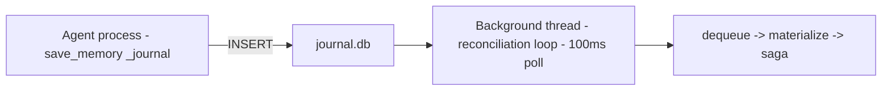

# How to Debug the CQRS Write Journal

## Goal

Diagnose and resolve issues with the write journal — stuck entries, dead letters, reconciler failures, or read-your-writes problems.

## Prerequisites

- [ ] Write journal enabled (`MEMORY_WRITE_JOURNAL_ENABLED=true` or `write_journal = true` in `memory.toml`)
- [ ] Access to `memory/journal.db`
- [ ] Python 3.10+ with `sqlite3` module

## Overview

When `MEMORY_WRITE_JOURNAL_ENABLED=true` (or `write_journal = true` in
`memory.toml`), all writes go through a lock-free `INSERT` into
`journal.db` instead of direct `save_memory`. A background reconciler
thread (`journal-reconciler`) drains the journal and materializes entries
into `memory.db` via the standard saga (DB upsert + vec key + .md file).

## Steps

### 1. Check Journal Health

Use the health check to verify the journal is operating correctly before proceeding deeper.

### 2. Inspect Dead Letters

If the health check shows `failed > 0`, examine the dead-letter queue.

### 3. Recover Stuck Reconciliation

If `pending > 0` or `reconciler_alive: false`, follow the recovery procedure.

### 4. Verify Read-Your-Writes

After recovery, confirm pending entries are visible in search results.

## Architecture



- **Multi-agent safe**: any number of agent processes can `INSERT` into
  `journal.db` concurrently (no `flock`, no contention).
- **Single writer**: the reconciler thread is the *only* writer to
  `memory.db`, so no cross-process `flock` on the main DB.
- **Crash recovery**: `reset_stuck_processing` runs at daemon start
  to unstick entries that were `processing` when the previous daemon
  crashed.

## Health Check

```bash
# Via MCP
memory_health_check(conn="default")

# Returns a "journal" section:
{
  "journal": {
    "enabled": true,
    "path": "/path/to/journal.db",
    "pending": 0,
    "processing": 0,
    "failed": 0,
    "reconciler_alive": true
  }
}
```

### Interpreting

| Metric | Normal | Alert |
|---|---|---|
| `pending` | 0–few | Growing unbounded → reconciler may be stuck |
| `processing` | 0 | >0 for >60s → daemon crashed mid-batch |
| `failed` | 0 | >0 → an entry permanently failed materialization |
| `reconciler_alive` | true | false → reconciler thread died unexpectedly |

## Dead-Letter Recovery

When an entry fails permanently (content-hash mismatch, validation
failure, max retries exhausted), it's moved from `write_journal` to
`journal_failed` with the error message and original payload.

### List dead letters

```sql
SELECT id, original_id, note_id, error, retry_count, created_at
FROM journal_failed;
```

### Replay a dead letter (manual)

```python
from infra.write_journal import get_entry_by_note_id
from save.pipeline import save_memory

entry = get_entry_by_note_id(Path("journal.db"), "lessons/my-note")
# Fix the issue, then re-save:
save_memory(content=entry["content"], category=entry["category"], ...)
```

## Reconciliation Loop Stuck

1. **Check liveness**: `status["journal"]["reconciler_alive"]` in health
   check. If false, restart the MCP server — the daemon thread dies with
   the process.

2. **Stuck processing entries**: entries with `status='processing'` for
   >60s suggest the daemon crashed mid-batch. On restart,
   `reset_stuck_processing()` unmarks them back to `pending`.

   Manual: `venv/bin/python -c "from infra.write_journal import reset_stuck_processing; reset_stuck_processing(Path('memory/journal.db'))"`

3. **Pending entries not draining**: check the reconciler log (stderr).
   A permanent error on one entry blocks the batch. Dead-letter it:
   ```python
   from infra.write_journal import mark_dead_letter
   mark_dead_letter(Path("memory/journal.db"), entry_id=42, error="manual dead-letter")
   ```

## Read-Your-Writes

When the journal is enabled, `memory_search` automatically supplements
results with pending entries from the write journal
(`_supplement_with_pending`). This ensures the agent sees its own recent
writes before the daemon materializes them.

If you see duplicate results (once from supplement, once after
materialization), the supplement entry has `"_pending": true`. The
duplicate disappears after the next poll cycle (≤100ms).

## Troubleshooting

### Journal file not found

**Cause**: The write journal was never initialized because `MEMORY_WRITE_JOURNAL_ENABLED` was false at first launch.
**Fix**: Set `MEMORY_WRITE_JOURNAL_ENABLED=true` and restart the MCP server. The journal.db file is created on first write.

### Entries stuck in "processing" state

**Cause**: The reconciler daemon crashed mid-batch.
**Fix**: Run `reset_stuck_processing()` manually: `venv/bin/python -c "from infra.write_journal import reset_stuck_processing; reset_stuck_processing(Path('memory/journal.db'))"`

### Duplicate results in search

**Cause**: An entry appears both as a pending supplement and a materialized row.
**Fix**: The duplicate disappears after the next poll cycle (≤100ms). If persistent, check that the reconciler is marking processed entries correctly.

## New Tool: memory_read_your_writes

The `memory_search` tool already does read-your-writes by supplementing
pending journal entries. No separate tool needed.

## Verification

```python
from agentic_memory import memory_health_check
status = memory_health_check(conn="default")
print(status["journal"])
```

Expected output: A journal section with `enabled: true`, `reconciler_alive: true`, and `pending: 0` under normal operation.

## Related

- `save/pipeline.py` — `materialize_journal_entry`, `save_memory_auto`
- `background/background_worker.py` — `_reconciliation_loop`, `_start_reconciler`
- `infra/write_journal.py` — `enqueue_write`, `mark_dead_letter`, `reset_stuck_processing`
- `mcp_maintenance.py` — `memory_health_check` (journal section)
- `docs/architecture/overview.md` — system architecture
