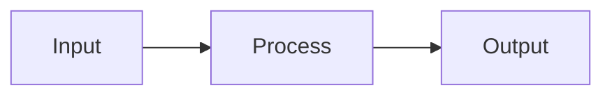

## What is <X>?

<Definition and 2-3 sentence explanation. Answer: what is it, what does it do, why does it exist?>

## Why it matters

<Why should the reader care? What problem does this solve that would exist without it?>

## How it works

<Mechanism, architecture, flow. Use diagrams where helpful (mermaid.js). Cover the key algorithm or data flow.>

## Key behaviors

<Important properties, guarantees, edge cases, and limitations. This is the section to answer "what happens when..." questions.>

- **<Behavior 1>**: <Description>
- **<Behavior 2>**: <Description>

## Configuration

<TOML keys or environment variables that control this concept, if applicable. Omit if the concept has no config surface.>

## Related

<Links to how-to guides, reference docs, and other concept docs that build on or feed into this concept.>
