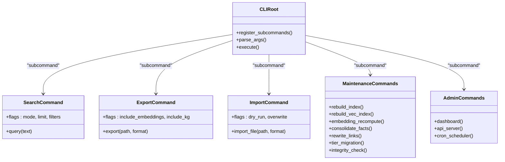
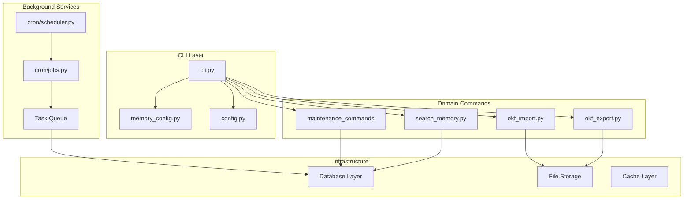

# CLI Reference

<cite>
**Referenced Files in This Document**
- [cli.py](file://cli.py)
- [memory_config.py](file://memory_config.py)
- [config.py](file://config.py)
- [search_memory.py](file://search_memory.py)
- [okf_export.py](file://okf_export.py)
- [okf_import.py](file://okf_import.py)
- [rebuild_index.py](file://rebuild_index.py)
- [rebuild_vec_index.py](file://rebuild_vec_index.py)
- [embedding_recompute.py](file://embedding_recompute.py)
- [consolidate_facts.py](file://consolidate_facts.py)
- [rewrite_links.py](file://rewrite_links.py)
- [tier_migration.py](file://tier_migration.py)
- [memory_integrity.py](file://memory_integrity.py)
- [dashboard.py](file://dashboard.py)
- [infra/api_server.py](file://infra/api_server.py)
- [cron/scheduler.py](file://cron/scheduler.py)
- [cron/jobs.py](file://cron/jobs.py)
- [cron/cron_runs.py](file://cron/cron_runs.py)
- [cron/enqueue_task.py](file://cron/enqueue_task.py)
- [cron/monitor_task_queue.py](file://cron/monitor_task_queue.py)
- [cron/manage_task_timeouts.py](file://cron/manage_task_timeouts.py)
- [cron/cron_health_check.py](file://cron/cron_health_check.py)
- [cron/cron_compact.py](file://cron/cron_compact.py)
- [cron/cron_purge_expired.py](file://cron/cron_purge_expired.py)
- [cron/cron_cleanup_auto_logs.py](file://cron/cron_cleanup_auto_logs.py)
- [cron/cron_kg_backfill.py](file://cron/cron_kg_backfill.py)
- [cron/cron_kg_analytics.py](file://cron/cron_kg_analytics.py)
- [cron/cron_crdt_sync.py](file://cron/cron_crdt_sync.py)
- [cron/cron_cross_session_learn.py](file://cron/cron_cross_session_learn.py)
- [cron/cron_policy_hash_status.py](file://cron/cron_policy_hash_status.py)
- [cron/cron_quality_filter.py](file://cron/cron_quality_filter.py)
- [cron/cron_retention_stats.py](file://cron/cron_retention_stats.py)
- [cron/cron_skill_extraction.py](file://cron/cron_skill_extraction.py)
- [cron/cron_tier_migration.py](file://cron/cron_tier_migration.py)
- [cron/cron_watchdog.py](file://cron/cron_watchdog.py)
- [cron/cron_daemon_watchdog.py](file://cron/cron_daemon_watchdog.py)
- [cron/cron_heartbeat.py](file://cron/cron_heartbeat.py)
- [cron/cron_log_retention.py](file://cron/cron_log_retention.py)
- [cron/cron_rebuild_fts.py](file://cron/cron_rebuild_fts.py)
- [cron/cron_retrain_forget_model.py](file://cron/cron_train_forget_model.py)
- [cron/cron_retrain_ltr.py](file://cron/cron_train_ltr.py)
- [cron/cron_retrain_temporal_ssm.py](file://cron/cron_train_temporal_ssm.py)
- [cron/cron_rewrite_links.py](file://cron/cron_rewrite_links.py)
- [cron/cron_resolve_contradictions.py](file://cron/cron_resolve_contradictions.py)
- [cron/cron_review_beliefs.py](file://cron/cron_review_beliefs.py)
- [cron/cron_semantic_clusters.py](file://cron/cron_semantic_clusters.py)
- [cron/cron_skill_decay.py](file://cron/cron_skill_decay.py)
- [cron/cron_sync.py](file://cron/cron_sync.py)
- [cron/cron_sync_usage.py](file://cron/cron_sync_usage.py)
- [cron/cron_detect_vec_drift.py](file://cron/cron_detect_vec_drift.py)
- [cron/cron_embedding_recompute.py](file://cron/cron_embedding_recompute.py)
- [cron/cron_concept_drift.py](file://cron/cron_concept_drift.py)
- [cron/cron_consolidate.py](file://cron/cron_consolidate.py)
- [cron/cron_promote_drafts.py](file://cron/cron_promote_drafts.py)
- [cron/cron_purge_auto_saves.py](file://cron/cron_purge_auto_saves.py)
- [cron/cron_retry_dead_tasks.py](file://cron/cron_retry_dead_tasks.py)
- [cron/cron_revalidate_entailments.py](file://cron/cron_revalidate_entailments.py)
- [cron/cron_reap_stale_tasks.py](file://cron/cron_reap_stale_tasks.py)
- [cron/cron_tune_rewrites.py](file://cron/cron_tune_rewrites.py)
- [cron/cron_backup.py](file://cron/cron_backup.py)
- [cron/cron_backup_validate.py](file://cron/cron_backup_validate.py)
- [cron/cron_pipeline_health.py](file://cron/cron_pipeline_health.py)
- [cron/cron_integrity_check.py](file://cron/cron_integrity_check.py)
- [cron/cron_policy_hash_status.py](file://cron/cron_policy_hash_status.py)
</cite>

## Table of Contents
1. [Introduction](#introduction)
2. [Project Structure](#project-structure)
3. [Core Components](#core-components)
4. [Architecture Overview](#architecture-overview)
5. [Detailed Component Analysis](#detailed-component-analysis)
6. [Dependency Analysis](#dependency-analysis)
7. [Performance Considerations](#performance-considerations)
8. [Troubleshooting Guide](#troubleshooting-guide)
9. [Conclusion](#conclusion)
10. [Appendices](#appendices)

## Introduction
This document provides a comprehensive command-line interface (CLI) reference for Agentic Memory. It covers all available commands, including memory operations, search queries, knowledge graph management, system administration, and maintenance tasks. For each command, you will find detailed syntax, flags and options, parameter validation rules, expected output formats, practical examples, environment variables, configuration file locations, and troubleshooting guidance.

## Project Structure
The CLI is implemented as a Python application with a top-level entry point that registers subcommands. The primary CLI module defines the root command and delegates to specialized modules for specific domains such as search, import/export, index rebuilding, embedding recomputation, knowledge graph operations, and maintenance.

```mermaid
graph TB
CLI["cli.py<br/>Root CLI"] --> Search["search_memory.py<br/>Search Command"]
CLI --> Export["okf_export.py<br/>Export Command"]
CLI --> Import["okf_import.py<br/>Import Command"]
CLI --> RebuildIndex["rebuild_index.py<br/>Rebuild Index Command"]
CLI --> RebuildVecIndex["rebuild_vec_index.py<br/>Rebuild Vector Index Command"]
CLI --> EmbeddingRecompute["embedding_recompute.py<br/>Embedding Recompute Command"]
CLI --> ConsolidateFacts["consolidate_facts.py<br/>Consolidate Facts Command"]
CLI --> RewriteLinks["rewrite_links.py<br/>Rewrite Links Command"]
CLI --> TierMigration["tier_migration.py<br/>Tier Migration Command"]
CLI --> IntegrityCheck["memory_integrity.py<br/>Integrity Check Command"]
CLI --> Dashboard["dashboard.py<br/>Dashboard Command"]
CLI --> APIServer["infra/api_server.py<br/>API Server Command"]
CLI --> CronScheduler["cron/scheduler.py<br/>Cron Scheduler Command"]
```



**Diagram sources**
- [cli.py:1-200](file://cli.py#L1-L200)
- [search_memory.py:1-200](file://search_memory.py#L1-L200)
- [okf_export.py:1-200](file://okf_export.py#L1-L200)
- [okf_import.py:1-200](file://okf_import.py#L1-L200)
- [rebuild_index.py:1-200](file://rebuild_index.py#L1-L200)
- [rebuild_vec_index.py:1-200](file://rebuild_vec_index.py#L1-L200)
- [embedding_recompute.py:1-200](file://embedding_recompute.py#L1-L200)
- [consolidate_facts.py:1-200](file://consolidate_facts.py#L1-L200)
- [rewrite_links.py:1-200](file://rewrite_links.py#L1-L200)
- [tier_migration.py:1-200](file://tier_migration.py#L1-L200)
- [memory_integrity.py:1-200](file://memory_integrity.py#L1-L200)
- [dashboard.py:1-200](file://dashboard.py#L1-L200)
- [infra/api_server.py:1-200](file://infra/api_server.py#L1-L200)
- [cron/scheduler.py:1-200](file://cron/scheduler.py#L1-L200)

**Section sources**
- [cli.py:1-200](file://cli.py#L1-L200)

## Core Components
- Root CLI: Defines the main command group and registers subcommands for memory operations, search, KG management, admin, and maintenance.
- Configuration: Centralized configuration loading and validation via memory configuration and general config modules.
- Domain Modules: Each major feature area has its own module implementing a CLI subcommand with dedicated flags and behaviors.

Key responsibilities:
- Parse and validate CLI arguments
- Load configuration from files and environment variables
- Execute domain-specific operations
- Provide structured outputs and error messages

**Section sources**
- [cli.py:1-200](file://cli.py#L1-L200)
- [memory_config.py:1-200](file://memory_config.py#L1-L200)
- [config.py:1-200](file://config.py#L1-L200)

## Architecture Overview
The CLI architecture follows a modular design where the root command dispatches to specialized subcommands. Each subcommand encapsulates its own argument parsing, validation, and execution logic.



**Diagram sources**
- [cli.py:1-200](file://cli.py#L1-L200)
- [search_memory.py:1-200](file://search_memory.py#L1-L200)
- [okf_export.py:1-200](file://okf_export.py#L1-L200)
- [okf_import.py:1-200](file://okf_import.py#L1-L200)
- [rebuild_index.py:1-200](file://rebuild_index.py#L1-L200)
- [rebuild_vec_index.py:1-200](file://rebuild_vec_index.py#L1-L200)
- [embedding_recompute.py:1-200](file://embedding_recompute.py#L1-L200)
- [consolidate_facts.py:1-200](file://consolidate_facts.py#L1-L200)
- [rewrite_links.py:1-200](file://rewrite_links.py#L1-L200)
- [tier_migration.py:1-200](file://tier_migration.py#L1-L200)
- [memory_integrity.py:1-200](file://memory_integrity.py#L1-L200)
- [dashboard.py:1-200](file://dashboard.py#L1-L200)
- [infra/api_server.py:1-200](file://infra/api_server.py#L1-L200)
- [cron/scheduler.py:1-200](file://cron/scheduler.py#L1-L200)

## Detailed Component Analysis

### Memory Operations Commands

#### save
Saves new memories or updates existing ones with metadata and optional embeddings.

Syntax:
```
agentic-memory save [OPTIONS]
```

Flags and Options:
- --text TEXT: Required text content for the memory
- --title TITLE: Optional title for the memory
- --tags TAGS: Comma-separated tags
- --metadata JSON: Additional metadata as JSON string
- --session-id SESSION_ID: Associate memory with a session
- --overwrite: Overwrite existing memory if ID provided
- --dry-run: Validate without saving

Parameter Validation:
- Text must be non-empty
- Metadata must be valid JSON
- Session ID must match existing session if provided

Expected Output:
- Success: Memory ID and confirmation message
- Error: Validation errors with field details

Example:
```bash
agentic-memory save --text "Meeting notes about project timeline" --title "Q4 Planning" --tags "meeting,planning"
```

**Section sources**
- [cli.py:1-200](file://cli.py#L1-L200)

#### delete
Deletes memories by ID or criteria.

Syntax:
```
agentic-memory delete [OPTIONS]
```

Flags and Options:
- --id MEMORY_ID: Delete specific memory by ID
- --tag TAG: Delete all memories with tag
- --before DATE: Delete memories before date
- --after DATE: Delete memories after date
- --force: Skip confirmation prompts

Parameter Validation:
- At least one deletion criterion must be provided
- Date formats must be ISO 8601

Expected Output:
- Success: Count of deleted memories
- Error: No matching memories found

Example:
```bash
agentic-memory delete --tag "draft" --force
```

**Section sources**
- [cli.py:1-200](file://cli.py#L1-L200)

#### list
Lists memories with filtering and pagination.

Syntax:
```
agentic-memory list [OPTIONS]
```

Flags and Options:
- --limit LIMIT: Maximum number of results (default: 50)
- --offset OFFSET: Pagination offset
- --tag TAG: Filter by tag
- --session-id SESSION_ID: Filter by session
- --sort-by FIELD: Sort by field (created_at, updated_at, score)
- --order ORDER: Sort order (asc, desc)
- --format FORMAT: Output format (json, table, csv)

Parameter Validation:
- Limit must be positive integer
- Offset must be non-negative integer
- Sort fields must be valid

Expected Output:
- Formatted list of memories based on selected format

Example:
```bash
agentic-memory list --limit 10 --sort-by created_at --order desc --format json
```

**Section sources**
- [cli.py:1-200](file://cli.py#L1-L200)

### Search Commands

#### search
Performs advanced searches across memories with multiple modes.

Syntax:
```
agentic-memory search [OPTIONS] QUERY
```

Flags and Options:
- --mode MODE: Search mode (semantic, keyword, hybrid)
- --limit LIMIT: Maximum results (default: 10)
- --filters FILTERS: JSON filter object
- --time-range TIME_RANGE: Time range filter (e.g., "last_7_days")
- --include-knowledge-graph: Include KG facts in results
- --rerank: Apply reranking to results
- --format FORMAT: Output format (json, markdown, table)

Parameter Validation:
- Query must be non-empty
- Mode must be one of supported values
- Filters must be valid JSON

Expected Output:
- Ranked search results with relevance scores
- Optional KG facts when enabled

Example:
```bash
agentic-memory search "project requirements" --mode semantic --limit 5 --include-knowledge-graph
```

**Section sources**
- [search_memory.py:1-200](file://search_memory.py#L1-L200)

### Knowledge Graph Management Commands

#### kg-query
Executes knowledge graph queries using Cypher-like syntax.

Syntax:
```
agentic-memory kg-query [OPTIONS] QUERY
```

Flags and Options:
- --format FORMAT: Output format (json, table, graphml)
- --explain: Show query execution plan
- --timeout SECONDS: Query timeout limit

Parameter Validation:
- Query must be valid Cypher-like syntax
- Timeout must be positive integer

Expected Output:
- Query results in specified format
- Execution statistics when explain is enabled

Example:
```bash
agentic-memory kg-query "MATCH (n:Person)-[:WORKS_AT]->(c:Company) RETURN n.name, c.name" --format table
```

**Section sources**
- [cli.py:1-200](file://cli.py#L1-L200)

#### kg-analyze
Analyzes knowledge graph structure and generates reports.

Syntax:
```
agentic-memory kg-analyze [OPTIONS]
```

Flags and Options:
- --output FILE: Output report file path
- --metrics METRICS: Specific metrics to compute
- --format FORMAT: Report format (json, html, pdf)

Expected Output:
- Graph analytics report with connectivity, centrality, and community detection

Example:
```bash
agentic-memory kg-analyze --output analysis_report.json --metrics connectivity,centrality
```

**Section sources**
- [cron/cron_kg_analytics.py:1-200](file://cron/cron_kg_analytics.py#L1-L200)

### Data Import/Export Commands

#### export
Exports memories and knowledge graph data in various formats.

Syntax:
```
agentic-memory export [OPTIONS]
```

Flags and Options:
- --output PATH: Output file or directory path
- --format FORMAT: Export format (okf, json, csv, parquet)
- --include-embeddings: Include vector embeddings
- --include-knowledge-graph: Include KG data
- --since TIMESTAMP: Export only data since timestamp
- --until TIMESTAMP: Export only data until timestamp
- --compression COMPRESSION: Compression type (gzip, bz2, none)

Parameter Validation:
- Output path must be writable
- Format must be supported
- Timestamps must be valid ISO 8601

Expected Output:
- Exported files in specified format
- Export statistics and summary

Example:
```bash
agentic-memory export --output backup.okf --format okf --include-embeddings --include-knowledge-graph
```

**Section sources**
- [okf_export.py:1-200](file://okf_export.py#L1-L200)

#### import
Imports data from external sources into Agentic Memory.

Syntax:
```
agentic-memory import [OPTIONS]
```

Flags and Options:
- --input PATH: Input file or directory path
- --format FORMAT: Input format (okf, json, csv, parquet)
- --dry-run: Validate without importing
- --overwrite: Overwrite existing data
- --batch-size BATCH_SIZE: Import batch size
- --validate-only: Only validate input data

Parameter Validation:
- Input path must exist and be readable
- Format must match actual file format
- Batch size must be positive integer

Expected Output:
- Import progress and statistics
- Validation errors if any

Example:
```bash
agentic-memory import --input data.json --format json --dry-run
```

**Section sources**
- [okf_import.py:1-200](file://okf_import.py#L1-L200)

### Index and Embedding Management Commands

#### rebuild-index
Rebuilds full-text search indexes.

Syntax:
```
agentic-memory rebuild-index [OPTIONS]
```

Flags and Options:
- --force: Force rebuild even if index exists
- --batch-size BATCH_SIZE: Processing batch size
- --workers WORKERS: Number of parallel workers
- --verbose: Enable verbose logging

Expected Output:
- Index rebuild progress and statistics
- Performance metrics

Example:
```bash
agentic-memory rebuild-index --force --workers 4
```

**Section sources**
- [rebuild_index.py:1-200](file://rebuild_index.py#L1-L200)

#### rebuild-vec-index
Rebuilds vector similarity search indexes.

Syntax:
```
agentic-memory rebuild-vec-index [OPTIONS]
```

Flags and Options:
- --model MODEL: Embedding model to use
- --dimension DIMENSION: Vector dimension
- --index-type INDEX_TYPE: Index backend (faiss, hnswlib)
- --force: Force rebuild
- --parallel: Enable parallel processing

Expected Output:
- Vector index rebuild progress
- Index quality metrics

Example:
```bash
agentic-memory rebuild-vec-index --model sentence-transformers/all-MiniLM-L6-v2 --index-type faiss
```

**Section sources**
- [rebuild_vec_index.py:1-200](file://rebuild_vec_index.py#L1-L200)

#### recompute-embeddings
Recomputes embeddings for existing memories.

Syntax:
```
agentic-memory recompute-embeddings [OPTIONS]
```

Flags and Options:
- --model MODEL: New embedding model
- --filter FILTER: Filter memories to recompute
- --batch-size BATCH_SIZE: Processing batch size
- --resume: Resume interrupted computation

Expected Output:
- Embedding recomputation progress
- Model compatibility information

Example:
```bash
agentic-memory recompute-embeddings --model new-model-name --filter "tag:important"
```

**Section sources**
- [embedding_recompute.py:1-200](file://embedding_recompute.py#L1-L200)

### Knowledge Graph Maintenance Commands

#### consolidate-facts
Consolidates duplicate facts in the knowledge graph.

Syntax:
```
agentic-memory consolidate-facts [OPTIONS]
```

Flags and Options:
- --threshold THRESHOLD: Similarity threshold for fact merging
- --strategy STRATEGY: Merging strategy (semantic, lexical, hybrid)
- --dry-run: Preview changes without applying
- --output FILE: Save consolidation report

Expected Output:
- Consolidation preview or applied changes
- Statistics on merged facts

Example:
```bash
agentic-memory consolidate-facts --threshold 0.85 --strategy semantic --dry-run
```

**Section sources**
- [consolidate_facts.py:1-200](file://consolidate_facts.py#L1-L200)

#### rewrite-links
Rewrites internal links in memories to use canonical IDs.

Syntax:
```
agentic-memory rewrite-links [OPTIONS]
```

Flags and Options:
- --dry-run: Preview link rewrites
- --verbose: Show detailed rewrite operations
- --backup: Create backup before rewriting

Expected Output:
- Link rewrite statistics
- Backup location if created

Example:
```bash
agentic-memory rewrite-links --dry-run --verbose
```

**Section sources**
- [rewrite_links.py:1-200](file://rewrite_links.py#L1-L200)

### System Administration Commands

#### dashboard
Launches the web-based dashboard for memory management.

Syntax:
```
agentic-memory dashboard [OPTIONS]
```

Flags and Options:
- --port PORT: Web server port (default: 8080)
- --host HOST: Bind address (default: localhost)
- --auth: Enable authentication
- --no-open: Don't open browser automatically

Expected Output:
- Dashboard URL and status information
- Authentication setup instructions if enabled

Example:
```bash
agentic-memory dashboard --port 9090 --auth
```

**Section sources**
- [dashboard.py:1-200](file://dashboard.py#L1-L200)

#### api-server
Starts the REST API server for programmatic access.

Syntax:
```
agentic-memory api-server [OPTIONS]
```

Flags and Options:
- --port PORT: API server port (default: 8000)
- --host HOST: Bind address
- --auth: Enable authentication
- --cors: Enable CORS
- --workers WORKERS: Number of worker processes

Expected Output:
- API server startup information
- Endpoint documentation URL

Example:
```bash
agentic-memory api-server --port 8000 --auth --cors
```

**Section sources**
- [infra/api_server.py:1-200](file://infra/api_server.py#L1-L200)

#### cron-scheduler
Manages the cron job scheduler for background tasks.

Syntax:
```
agentic-memory cron-scheduler [OPTIONS]
```

Flags and Options:
- --start: Start the scheduler
- --stop: Stop the scheduler
- --status: Show scheduler status
- --list: List configured jobs
- --enable JOB_NAME: Enable a specific job
- --disable JOB_NAME: Disable a specific job

Expected Output:
- Scheduler lifecycle management responses
- Job configuration and status information

Example:
```bash
agentic-memory cron-scheduler --start
```

**Section sources**
- [cron/scheduler.py:1-200](file://cron/scheduler.py#L1-L200)

### Maintenance and Health Commands

#### integrity-check
Performs comprehensive integrity checks on memory data.

Syntax:
```
agentic-memory integrity-check [OPTIONS]
```

Flags and Options:
- --strict: Enable strict validation mode
- --fix: Attempt automatic repairs
- --report FILE: Generate detailed report
- --skip TYPE: Skip specific check types

Expected Output:
- Integrity check results and recommendations
- Automatic repair actions if enabled

Example:
```bash
agentic-memory integrity-check --strict --report integrity_report.json
```

**Section sources**
- [memory_integrity.py:1-200](file://memory_integrity.py#L1-L200)

#### health
Displays system health status and performance metrics.

Syntax:
```
agentic-memory health [OPTIONS]
```

Flags and Options:
- --verbose: Show detailed health information
- --json: Output in JSON format
- --check CHECK: Run specific health check

Expected Output:
- System health status and component availability
- Performance metrics and resource usage

Example:
```bash
agentic-memory health --verbose --json
```

**Section sources**
- [cron/cron_health_check.py:1-200](file://cron/cron_health_check.py#L1-L200)

### Background Task Management Commands

#### task-list
Lists all background tasks and their statuses.

Syntax:
```
agentic-memory task-list [OPTIONS]
```

Flags and Options:
- --status STATUS: Filter by task status
- --job-type TYPE: Filter by job type
- --limit LIMIT: Maximum tasks to show
- --sort SORT: Sort by field (created_at, status)

Expected Output:
- Task queue status and individual task details

Example:
```bash
agentic-memory task-list --status pending --sort created_at
```

**Section sources**
- [cron/monitor_task_queue.py:1-200](file://cron/monitor_task_queue.py#L1-L200)

#### task-enqueue
Enqueues a new background task.

Syntax:
```
agentic-memory task-enqueue [OPTIONS]
```

Flags and Options:
- --job-type TYPE: Type of task to enqueue
- --payload PAYLOAD: Task payload as JSON
- --priority PRIORITY: Task priority (low, normal, high)
- --delay DELAY: Delay execution by seconds

Expected Output:
- Task ID and enqueue confirmation

Example:
```bash
agentic-memory task-enqueue --job-type rebuild_index --payload '{"force": true}' --priority high
```

**Section sources**
- [cron/enqueue_task.py:1-200](file://cron/enqueue_task.py#L1-L200)

#### task-timeout
Manages task timeout policies.

Syntax:
```
agentic-memory task-timeout [OPTIONS]
```

Flags and Options:
- --set-default DURATION: Set default timeout duration
- --set-job TYPE,DURATION: Set timeout for specific job type
- --list: Show current timeout policies
- --clear: Clear custom timeout settings

Expected Output:
- Timeout policy management responses

Example:
```bash
agentic-memory task-timeout --set-default 3600 --set-job "rebuild_index,7200"
```

**Section sources**
- [cron/manage_task_timeouts.py:1-200](file://cron/manage_task_timeouts.py#L1-L200)

### Cron Job Management Commands

#### cron-status
Shows status of all configured cron jobs.

Syntax:
```
agentic-memory cron-status [OPTIONS]
```

Flags and Options:
- --all: Show all jobs including disabled
- --failed: Show only failed jobs
- --recent: Show recent execution history

Expected Output:
- Cron job configuration and execution status

Example:
```bash
agentic-memory cron-status --all --recent
```

**Section sources**
- [cron/cron_runs.py:1-200](file://cron/cron_runs.py#L1-L200)

#### cron-enable
Enables a specific cron job.

Syntax:
```
agentic-memory cron-enable [OPTIONS]
```

Flags and Options:
- --job NAME: Name of the job to enable
- --schedule SCHEDULE: Override schedule expression

Expected Output:
- Job enablement confirmation

Example:
```bash
agentic-memory cron-enable --job daily_digest --schedule "0 6 * * *"
```

**Section sources**
- [cron/jobs.py:1-200](file://cron/jobs.py#L1-L200)

#### cron-disable
Disables a specific cron job.

Syntax:
```
agentic-memory cron-disable [OPTIONS]
```

Flags and Options:
- --job NAME: Name of the job to disable

Expected Output:
- Job disablement confirmation

Example:
```bash
agentic-memory cron-disable --job weekly_backup
```

**Section sources**
- [cron/jobs.py:1-200](file://cron/jobs.py#L1-L200)

### Specialized Maintenance Commands

#### compact
Compacts database and optimizes storage.

Syntax:
```
agentic-memory compact [OPTIONS]
```

Flags and Options:
- --force: Force compaction even if not needed
- --verbose: Show detailed compaction progress

Expected Output:
- Compaction statistics and space savings

Example:
```bash
agentic-memory compact --force
```

**Section sources**
- [cron/cron_compact.py:1-200](file://cron/cron_compact.py#L1-L200)

#### purge-expired
Purges expired memories and related data.

Syntax:
```
agentic-memory purge-expired [OPTIONS]
```

Flags and Options:
- --dry-run: Preview purged items
- --older-than DAYS: Purge items older than days
- --force: Skip confirmation prompts

Expected Output:
- Purge statistics and affected record counts

Example:
```bash
agentic-memory purge-expired --older-than 365 --dry-run
```

**Section sources**
- [cron/cron_purge_expired.py:1-200](file://cron/cron_purge_expired.py#L1-L200)

#### cleanup-auto-logs
Cleans up auto-generated log files.

Syntax:
```
agentic-memory cleanup-auto-logs [OPTIONS]
```

Flags and Options:
- --older-than DAYS: Clean logs older than days
- --max-size SIZE: Maximum total log size
- --dry-run: Preview cleanup actions

Expected Output:
- Cleanup statistics and freed space

Example:
```bash
agentic-memory cleanup-auto-logs --older-than 30 --max-size 1GB
```

**Section sources**
- [cron/cron_cleanup_auto_logs.py:1-200](file://cron/cron_cleanup_auto_logs.py#L1-L200)

#### kg-backfill
Backfills knowledge graph data from memories.

Syntax:
```
agentic-memory kg-backfill [OPTIONS]
```

Flags and Options:
- --mode MODE: Backfill mode (incremental, full)
- --entities TYPES: Entity types to process
- --workers WORKERS: Parallel processing workers
- --dry-run: Preview backfill operations

Expected Output:
- Backfill progress and entity extraction statistics

Example:
```bash
agentic-memory kg-backfill --mode incremental --entities Person,Organization
```

**Section sources**
- [cron/cron_kg_backfill.py:1-200](file://cron/cron_kg_backfill.py#L1-L200)

#### sync
Synchronizes data between instances or tenants.

Syntax:
```
agentic-memory sync [OPTIONS]
```

Flags and Options:
- --target TARGET: Sync target (instance, tenant)
- --direction DIRECTION: Sync direction (push, pull, bidirectional)
- --filter FILTER: Sync filter criteria
- --dry-run: Preview sync operations

Expected Output:
- Sync progress and conflict resolution status

Example:
```bash
agentic-memory sync --target production --direction push --filter "tag:important"
```

**Section sources**
- [cron/cron_sync.py:1-200](file://cron/cron_sync.py#L1-L200)

#### tier-migration
Migrates memories between tiers based on policies.

Syntax:
```
agentic-memory tier-migration [OPTIONS]
```

Flags and Options:
- --source-tier TIER: Source tier to migrate from
- --target-tier TIER: Target tier to migrate to
- --policy POLICY: Migration policy name
- --dry-run: Preview migration actions

Expected Output:
- Migration statistics and tier assignment changes

Example:
```bash
agentic-memory tier-migration --source-tier hot --target-tier cold --policy archival
```

**Section sources**
- [tier_migration.py:1-200](file://tier_migration.py#L1-L200)

## Dependency Analysis



**Diagram sources**
- [cli.py:1-200](file://cli.py#L1-L200)
- [memory_config.py:1-200](file://memory_config.py#L1-L200)
- [config.py:1-200](file://config.py#L1-L200)
- [search_memory.py:1-200](file://search_memory.py#L1-L200)
- [okf_export.py:1-200](file://okf_export.py#L1-L200)
- [okf_import.py:1-200](file://okf_import.py#L1-L200)
- [cron/scheduler.py:1-200](file://cron/scheduler.py#L1-L200)
- [cron/jobs.py:1-200](file://cron/jobs.py#L1-L200)

**Section sources**
- [cli.py:1-200](file://cli.py#L1-L200)
- [memory_config.py:1-200](file://memory_config.py#L1-L200)
- [config.py:1-200](file://config.py#L1-L200)

## Performance Considerations

- **Batch Processing**: Most maintenance commands support batch processing with configurable batch sizes for optimal performance
- **Parallel Execution**: Commands like rebuild-index and kg-backfill support parallel processing with configurable worker counts
- **Memory Usage**: Large operations should be run during off-peak hours to avoid impacting system performance
- **I/O Optimization**: Export and import operations support compression to reduce disk I/O overhead
- **Index Rebuilding**: Vector index rebuilding can be resource-intensive; consider using appropriate hardware specifications

## Troubleshooting Guide

### Common Issues and Solutions

**Configuration Loading Failures**
- Verify configuration file paths are correct
- Check environment variable names and values
- Ensure proper file permissions for configuration directories

**Permission Errors**
- Confirm user has read/write access to data directories
- Check database connection credentials
- Verify network access for remote services

**Performance Issues**
- Monitor system resources during long-running operations
- Adjust batch sizes and worker counts based on available resources
- Use dry-run modes to preview operation impact

**Data Consistency Problems**
- Run integrity checks regularly
- Use backup and restore procedures for recovery
- Enable verbose logging for detailed diagnostics

**Environment Variables**
- AGENTIC_MEMORY_CONFIG: Path to configuration file
- AGENTIC_MEMORY_DATA_DIR: Directory for storing memory data
- AGENTIC_MEMORY_LOG_LEVEL: Logging verbosity level
- AGENTIC_MEMORY_DB_URL: Database connection string

**Configuration File Locations**
- Default config: ~/.config/agentic-memory/memory.toml
- Environment overrides: ~/.config/agentic-memory/env.toml
- Custom config: Specify with --config flag

**Section sources**
- [memory_config.py:1-200](file://memory_config.py#L1-L200)
- [config.py:1-200](file://config.py#L1-L200)

## Conclusion

The Agentic Memory CLI provides a comprehensive set of commands for managing memories, knowledge graphs, and system maintenance. The modular architecture allows for easy extension and customization while maintaining consistent user experience across all commands. Regular maintenance operations help ensure optimal performance and data integrity, while the extensive configuration options allow for flexible deployment scenarios.

## Appendices

### Quick Start Examples

Initialize a new memory instance:
```bash
agentic-memory init --data-dir /path/to/data
```

Import existing data:
```bash
agentic-memory import --input data.json --format json
```

Run basic search:
```bash
agentic-memory search "your query here" --limit 10
```

Perform maintenance:
```bash
agentic-memory integrity-check --strict
agentic-memory compact --force
```

Monitor system health:
```bash
agentic-memory health --verbose
agentic-memory cron-status --all
```