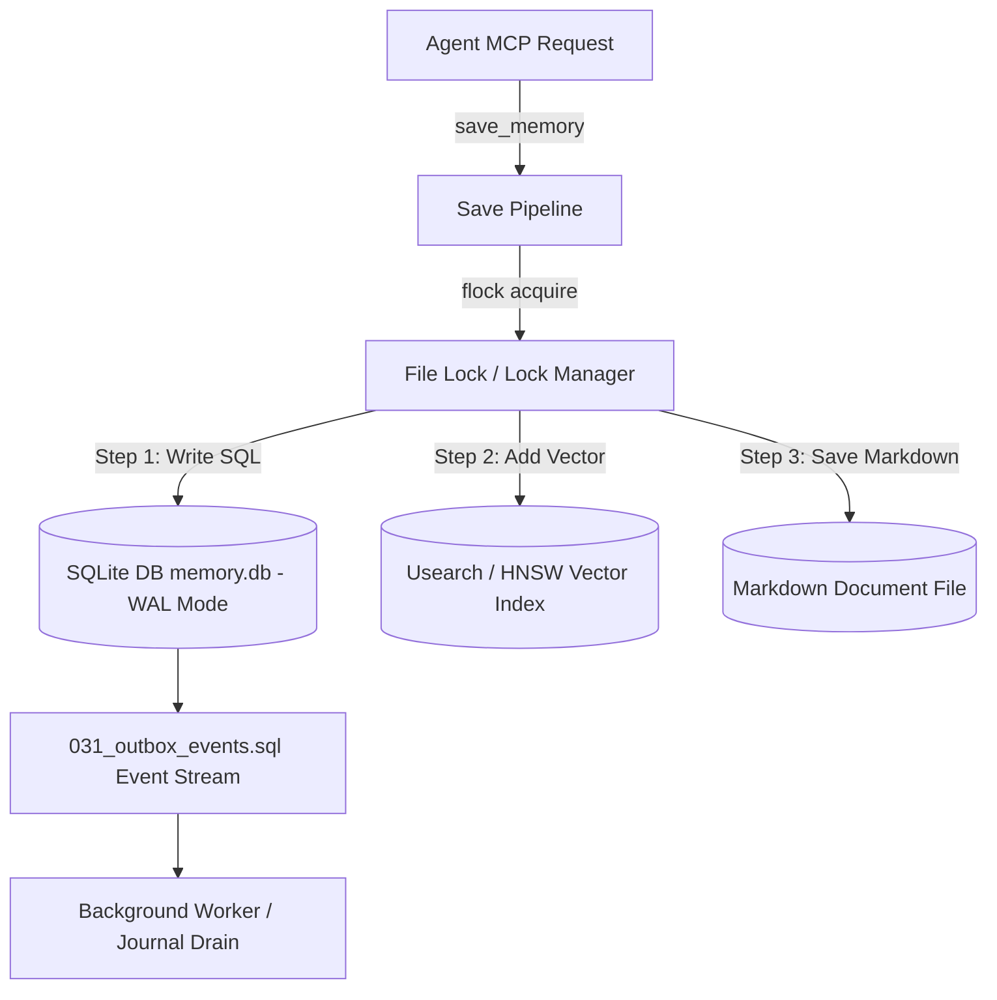

# Memory Architecture

The **Memory Architecture** of Agentic Memory is a local-first, low-latency, hybrid persistence and retrieval engine designed for autonomous AI agents.

## Core System Architecture & 3-Store Write Saga

Every memory insertion, update, or deletion follows a strict 3-store saga write pattern ([save/pipeline.py](file://save/pipeline.py) and [infra/saga.py](file://infra/saga.py)):

### 1. The 3 Storage Layers
- **SQLite Database (`memory.db`)**: Acts as the canonical transactional store. Operates in WAL mode with strict foreign keys and schema migrations managed by `infra/migration_runner.py` (`SCHEMA_VERSION`).
- **Vector Index (`memory.usearch` / HNSW)**: Provides high-speed dense vector similarity retrieval using static models (e.g. Model2Vec / potion-base-8M) or customized embeddings. Indexed by `vec_key`.
- **Markdown Document Files (`.md`)**: Human-readable, version-controllable persistent storage backing individual memory entities.

## Hard Code Invariants

- **3-Store Saga Write**: `save_memory()` writes atomically across SQLite, Usearch, and `.md` files. Failures trigger an automatic rollback compensating saga.
- **`include_global=True`**: Multi-tenant queries filter by `agent_id` or `tenant_id` by default. Passing `include_global=True` merges shared global knowledge nodes into candidate search results.
- **Maintenance Router & 24 CORE Tools**: Exposes 24 core operations via fast MCP endpoints while routing heavy background jobs (FTS rebuilds, embedding recomputations, graph dedup) through the `memory_maintenance` router.
- **Asynchronous Execution (`defer_expensive=True`)**: Deferrable indexing tasks (graph extraction, ColBERT tokenization) are queued to `journal.db` to keep initial save latency under 15ms.

## Layer Decomposition

| Layer | Key Modules | Primary Responsibilities |
| :--- | :--- | :--- |
| **Save Subsystem** | `save/pipeline.py`, `save/indexers.py` | 3-store write saga, chunking, deduplication |
| **Recall & Search** | `recall/search_memory.py`, `search/orchestrator.py` | 14-phase hybrid search, RRF fusion, LTR reranking |
| **Knowledge Graph** | `kg/kg_db.py`, `kg/graph_analytics.py` | Entity extraction, property graphs, contradiction resolution |
| **Background & Cron** | `background/background_worker.py`, `cron/` | Journal drain, decay models, vector drift detection |
