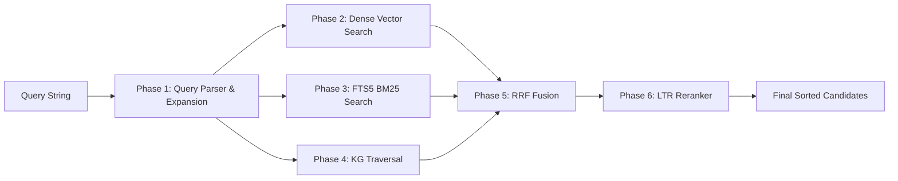

# Memory Search and Retrieval Tools

The **Memory Search and Retrieval Tools** provide high-performance hybrid semantic and full-text search operations via the Model Context Protocol (MCP).

## Overview & Tool Surface

The search surface exposes fine-grained retrieval primitives designed for fast context insertion in agent loops:

- **`memory_search`**: The primary hybrid search tool combining dense vector similarity, BM25 keyword matching, Reciprocal Rank Fusion (RRF), and optional LightGBM reranking.
- **`memory_find`**: Fast exact/fuzzy attribute lookup tool for memories by ID, tag, or metadata properties.
- **`search_by_tag`**: Categorical memory filtering tool supporting tag sets and temporal window constraints.

## 14-Phase Retrieval Pipeline



## Key Query Parameters & Code Invariants

```json
{
  "query": "vector indexing and saga write pattern",
  "limit": 10,
  "include_global": true,
  "tags": ["architecture", "database"],
  "min_score": 0.35
}
```

- **`include_global=True`**: Extends search scope beyond the active `agent_id` to include shared system-wide knowledge.
- **Hybrid RRF Ranking**: Combines vector cosine similarity and FTS5 BM25 scores without requiring manual weight tuning.
- **Rate-Limiting Protection**: Search endpoints enforce token-bucket rate limits (`get_default_limiter()`) to prevent resource exhaustion during agent loops.
