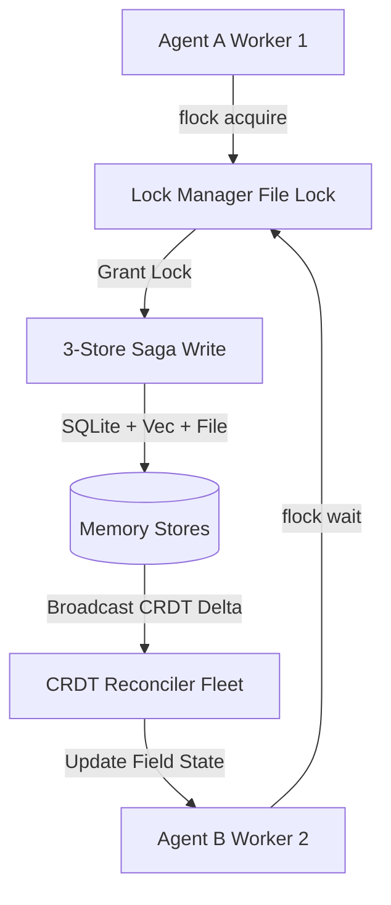

# Multi-Agent Coordination

The **Multi-Agent Coordination** module enables multi-agent fleet operations, distributed locking, CRDT-based field synchronization, and shared memory space isolation.

## Architecture & System Invariants

Agentic Memory supports multi-agent fleets operating against single local databases or replicated cluster instances through three core mechanics:

1. **Distributed Lock Primitive (`file_lock.py` / `dist_lock.py`)**: Uses file-based `flock` and atomic lock acquires to prevent concurrent saga write conflicts.
2. **CRDT Field-Level Synchronization (`cron_crdt_sync.py` / `mcp_sharing.py`)**: Implements Conflict-Free Replicated Data Types for state reconciliation across autonomous agents.
3. **Tenant & Agent Scope Isolation (`tenant_memories`)**: Enforces namespace separation while permitting cross-agent memory reads when `include_global=True`.

## Core Features & Workflow

## Key Configuration Invariants

- **`include_global=True`**: When querying memories, setting `include_global=True` allows agents to retrieve shared system-wide knowledge alongside agent-scoped entries.
- **Multiwriter Reconciler Fleet**: Outbox events in `031_outbox_events.sql` drain state mutations cleanly across agents without lock contention.
- **Tenant Isolation**: Each agent writes with `agent_id` or `tenant_id` context, preserving strict access boundaries while supporting shared collaboration pools.
